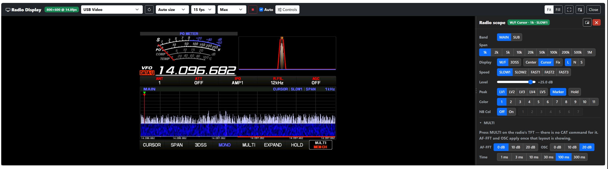
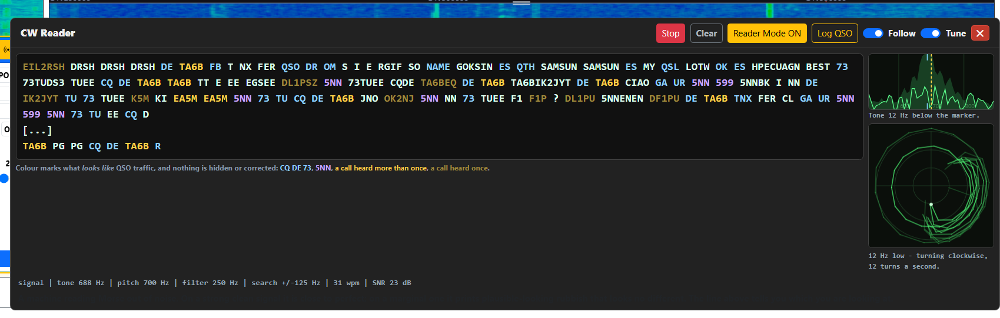
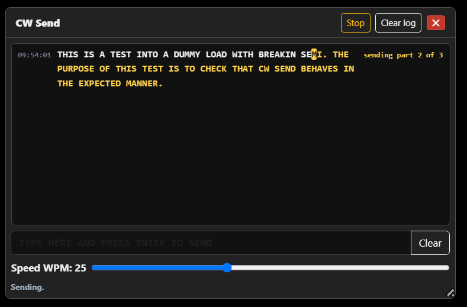
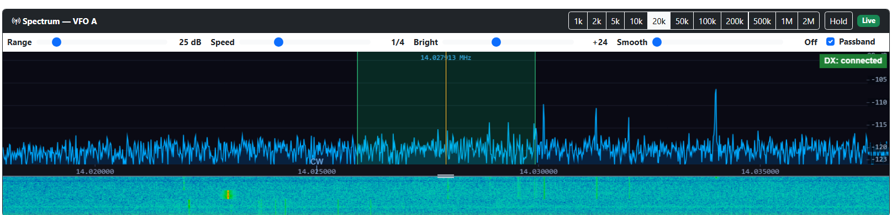


# Yaesu Web Control


> **Feedback wanted — especially if your setup isn't mine.** I operate FT8 on an FTdx101MP with an SDRplay RSP1B/RSP1 for the spectrum display, so that's the combination that actually gets tested. YWC now does everything I personally need, which means I've run out of my own ideas for what to add next — new features from here on depend on what other operators ask for. If you use another mode (SSB, CW, RTTY, other digital modes), another supported radio (FTdx101D, FTdx10, FT-710, FTDX3000), or a different SDR, even a one-line "works fine" or "this is annoying because…" on the [Discussions tab](https://github.com/mm5agm/Yaesu_Web_Control/discussions) tells me something I can't find out on my own. Bug reports, layout issues, and feature requests are all equally welcome.

Yaesu Web Control (**YWC**) is a continuation of my FTdx101_WebApp with more Yaesu transceivers added and more controls.

## ✨ Added since the last release

> **v2.5.0 users: install v2.5.1.** The v2.5.0 installer went out without `Yaesu_Sdr_Worker.exe`, the separate process that runs each SDR, so the spectrum display could not start an SDR on an installed copy. A user spotted the missing file the same day — thank you. v2.5.1 puts it back and changes nothing else; install it over v2.5.0 and your settings are kept. The release build now refuses to package an installer without the worker. Details in the [v2.5.1 notes](#2026-09-15---v251).

### Since v2.5.1 — in the code, not yet in a full release

- **A tuning step you can set.** The mouse wheel over the spectrum used to move the dial a fixed 1 kHz, which is useless for RTTY and for zero-beating CW. Each VFO now has its own step, anywhere from **1 Hz to 10 MHz** — one for every digit of the frequency display — and there are four ways to set it: the **Step** box on the spectrum panel, a **right-click on the spectrum**, **clicking the digit you want to move** on the frequency display, or the voice command *"set step size one hertz"*. They are all the same number, so setting it one way changes it everywhere. The FTdx101MP was measured accepting single-hertz CAT steps exactly, on both receivers, even though its own dial will not go below 10 Hz — thanks to Bruce VK2RT for [raising it](https://github.com/mm5agm/Yaesu_Web_Control/discussions/168). Full detail: [§5.4](USER_MANUAL.md#54-spectrum-display) and [§5.6](USER_MANUAL.md#56-frequency-display-and-tuning).
- **Testers get told about new test builds.** The update banner used to announce full releases only, to everybody, which left anyone running a pre-release hearing nothing at all until the finished version shipped — however many pre-releases fixed things in between. That is how somebody ends up reporting a fault that was fixed three builds ago. It now decides from the build you are running, and from nothing else: **on a full release nothing changes**, and there is no setting that could change it, so you will never be nudged towards a test build while you are operating. **On a pre-release** you are offered newer pre-releases, clearly labelled as such, with what is in them. Nightly `unstable-` builds are never offered either way. Shared code, so Icom Web Control gets the same. [§5.1](USER_MANUAL.md#51-top-bar).
- **Put your memories in the order you want.** The Memories page can now sort the list by **Label**, **Frequency** or **Mode** (click the column heading; click again to reverse), and each row has buttons to move that memory to the top, up one or down one. The order is the order of the Mem panel tiles and the order memories go to the radio - which matters once you have more than the radio's 99 channels, because **Export to Radio** writes the first 99 and stops, so the order is how you choose which 99. Press Save to keep it. [§8.1](USER_MANUAL.md#81-memories-editor).

**v2.5.0 was the biggest release since the SDR spectrum display arrived.** Five things are in it that were not in v2.4.2 at all: the radio's own screen in the browser — and you can click it — a Morse reader, a Morse sender, remote audio both ways, and YWC running on macOS, Linux and a Raspberry Pi. Two of those are Fabio Valente's (CR7CDC) work, and this release is as much his as mine.

### The radio's own screen in the browser — and you can click it



The FTdx101, FTdx10 and FT-710 repeat their front-panel TFT on a rear DVI-D socket. Plug that into a cheap HDMI-to-USB capture stick and YWC shows the radio's screen — scope, 3DSS, meters, menus, all of it — in the browser, popped out into its own window, or on a tablet in another room. That part is Fabio's, start to finish.

**It is not a static picture of the radio.** HDMI capture is one-way, so a click can never reach the touchscreen — instead YWC works out what is under the mouse and sends the CAT command for it. On the FTdx101MP/D and the FTdx10 in MONO W/F:

- **Hover over the scope or the waterfall** to read the frequency under the cursor, and **click to tune there**. The frequency is measured from the radio's own VFO marker line, so it is right whatever the span is set to.
- **Click the ANT / ATT / IPO / R.FIL / AGC readouts** to cycle them, exactly as you would on the radio itself.
- **Click the CURSOR / SPAN / 3DSS / HOLD soft-buttons** along the bottom of the screen.
- Where a soft-button has no CAT command behind it (MONO, MULTI, EXPAND, MEM CH) the label says so rather than doing nothing silently. The overlay assumes EXPAND is off: with it on the scope grows up over the readout row, and the radio does not report that over CAT.

Docked to the right of the picture is a **Controls** column that drives the radio's own scope over CAT — centre/cursor/fix, 3DSS or waterfall, span, speed, level, peak, marker, hold, colour, and the AF-FFT and oscilloscope settings. Turn a knob on the front panel and the button in the browser follows. On the FTdx101 both the MAIN and SUB scopes are driven, and with no capture stick at all the same controls are still there as a **Radio Scope** card.

Two videos: [what the radio's DVI-D output actually is, and what can go wrong connecting it to HDMI](https://www.youtube.com/watch?v=dtlziYEsXxE) — worth watching before you plug anything in — and [the feature in action](https://www.youtube.com/watch?v=1EY7m5e91TI). **Set the radio's EXT MONITOR PIXEL menu to 800×600 first**, or the capture stick silently stretches the picture. The FT-710 has no clickable overlay yet. Full detail: [§19](USER_MANUAL.md#19-radio-display) and [§19.4](USER_MANUAL.md#194-cat-scope-controls).

### CW Reader — the Morse on the air, as text



A **CW Read** button on the main page opens a reader that decodes the Morse in the radio's receive audio and prints it as text. No extra hardware, nothing transmitted. Neither Yaesu nor Icom hand their own decoder's output over CAT, so I wrote a decoder; it lives in the shared [Radio_Web_Control_Core](https://github.com/mm5agm/Radio_Web_Control_Core) and the identical code reads Morse in Icom Web Control.

The status line says what it is actually hearing — signal or not, the tone against your pitch, the filter width, the SNR, how far off pitch the station is — and when two stations are inside the filter, or the tone is breaking up, it says so and prints nothing rather than guessing. **Reader Mode** sets the radio up for copy (CW, a narrow filter, APF on) and puts your own settings back when you stop; **ZIN** drops the station onto your pitch; **Tune** shows the passband with a pitch marker and a zero-beat figure. Every session writes a timestamped transcript, and the log form *offers* the callsign and report the reader thinks it saw as one-click suggestions rather than filling them in — a callsign quietly filled in from junk is worse than an empty box. Confirmed contacts append to a plain ADIF file. Windows, macOS, Linux and Docker. Full detail: [§20](USER_MANUAL.md#20-cw-reader).

### CW Send — type a line, press Enter, the radio keys it



The reader's other half. A **CW Send** button opens a box: type a line, press **Enter**, and the radio keys it. Nothing goes out until Enter, so you can type ahead or paste, and the character being keyed is highlighted as it goes out. Only the CAT cable is needed, so it runs everywhere the reader does.

It is built on the radio's own keyer memories: the line is cut into pieces of up to 50 characters at word boundaries, each written to keyer memory 5 and played, and your own M5 is put back at the end. With break-in **Off** the line goes to the monitor with a banner and nothing is transmitted, which is how I test it. **Stop** — or **Escape** — drops everything not yet started; the piece already on the air finishes, because the radio cannot be told to abandon a playback, which is the reason it is sent in pieces at all. Lines typed while one is sending are queued. Full detail: [§21](USER_MANUAL.md#21-cw-send).

### And the rest of v2.5.0

- **Remote Audio** (Fabio) — the radio's receive audio in the browser's speakers and the browser's microphone into the radio's USB audio for transmit, with a pop-out player and device pickers that find the radio's USB CODEC for you. For your own LAN or a VPN: YWC has no login, so don't port-forward it.
- **macOS, Linux and Docker** (Fabio) — an unsigned macOS app for Apple Silicon and Intel, and a multi-architecture Docker image that runs on a Raspberry Pi 3B.
- **Signals are drawn where they really are on the FTdx101 spectrum.** The IF OUT sockets are not at the SDR's centre and the radio slides its IF with the filter settings; YWC ignored both, so everything was drawn 5–7 kHz out. Measured and corrected on both receivers.
- **The span buttons are now the radio's own list** — 1k to 1M, plus 2M. Everything from 100 kHz down is a software zoom of a fixed stream, so stepping between 1k and 100k is instant: no retune, no blank trace.
- **The receiver's passband is shaded on the trace**, moving with IF width, shift and CW pitch, so you can see which of the signals on screen you are actually hearing.
- **Smooth is a slider now, and the default no longer buries CW** — the old fixed average took about 11 dB off a one-bin CW carrier.
- **The keyer's M1–M5 buttons finally send.** They had done nothing since v1.6.0: they used the command that *plays* a memory to try to *load* one. **Monitor level** had never worked either. Both fixed.
- **Meters** — the SWR needle no longer freezes or dips ([#124](https://github.com/mm5agm/Yaesu_Web_Control/issues/124)), the FTdx101's front-panel meter pair is yours again outside transmit, and RF power is scaled to each radio's own rating instead of the FTdx101MP's 200 W.
- **A keyboard-reachable ATU Tune button** and tuner voice commands, **CTCSS that works** (six separate faults), and **one screen-reader announcement per action** instead of an unpredictable number.
- **The log is a tenth of the size**, with **Start fresh test log** / **Download test log** on the Diagnostics page, so a bug report can carry just the part that matters.

Every one of these is written up in full in the [release notes](#2026-09-14---v250) at the foot of this page.

## 🔧 Fixed since the last release

One line per fix, newest first, with the build that has it. A pre-release installs exactly like a release and carries everything before it; each one is written up under [Release Notes](#release-notes). *Not yet in a build* means the fix is in the code and will be in the next pre-release or release.

| Fixed | Issue | In build |
|---|---|---|
| Clicking a RTTY signal on the spectrum tuned to the wrong place in both RTTY modes people use. In the radio's own **RTTY-L** YWC put the dial 2.2 kHz above the signal, as if the dial were the suppressed carrier, but on the FTdx101 it sits on the signal's mark tone (measured), so every click landed outside the 500 Hz RTTY filter and you heard nothing. In **DATA-L**, the usual mode for AFSK RTTY, it did the opposite and tuned straight onto the signal, leaving the tones near 0 Hz audio where no software can decode them. Both now land where the mode needs them; DATA-U (FT8 and the like) still tunes straight onto the click ([§5.4](USER_MANUAL.md#54-spectrum-display)). | [#169](https://github.com/mm5agm/Yaesu_Web_Control/discussions/169) | Not yet in a build |
| Refreshing the main page several times in quick succession could make the whole application vanish — no error, no window, nothing in the log — on any PC with an HDMI capture stick plugged in for **Radio Display**. Every page load was asking each USB capture device what it could do, which means opening it, and opening a capture stick that something else already has open takes the process down below the level anything can catch and report. Page load now reads device names only; the **Refresh** button on the Radio Display page is the one place that interrogates a device, and it will not do it while the stream is running. | — | v2.5.2-pre7 |
| Anyone running a pre-release was never told when the finished version of the same number shipped, because the update banner compared **2.5.2-pre3** against **2.5.2** and read them as the same. Testers were the one group of users left sitting on an old build indefinitely. They are now offered newer pre-releases as well, clearly labelled, with what is in them — and every release page carries its own notes instead of a line pointing back here ([§5.1](USER_MANUAL.md#51-top-bar)). | — | v2.5.2-pre7 |
| Clicking the spectrum, or a DX spot, always set the mode the band plan gives for that frequency, and there was no way to stop it. Operators do not follow the band plan - RTTY contests run well above 14.100, which the plan calls USB, and 40m SSB is used around 7.050, which it calls DATA-U - so picking the mode you wanted only lasted until your next click. It matters more than a wrong label: the radio takes transmit audio from the microphone in SSB but from the rear/USB port in DATA, so an unwanted change can cut your data software out of the transmit path while receive carries on normally. A new **Settings -> Band Plan** switch turns it off ([§5.4](USER_MANUAL.md#54-spectrum-display)); named segments picked from a VFO band dropdown still set their own mode. | [#169](https://github.com/mm5agm/Yaesu_Web_Control/discussions/169) | v2.5.2-pre7 |
| Loading a memory bank dropped the advanced fields - antenna, IF width and shift, roofing, NB, NR, AGC, power and notes - from every memory in it, silently, so anything captured with **Save to Mem** came back as bare frequency-and-mode after a bank load. The fields were in the bank file all along; only the loader lost them, so old banks recover on the next load ([§8.5](USER_MANUAL.md#85-memory-banks)). | — | v2.5.2-pre6 |
| Pressing **Save** on the Memories page renumbered every memory from 1, so after deleting or reordering a row the Mem panel on the main page - which recalls and deletes by number - pointed each tile below it at a different memory until the panel happened to reload. Numbers now stay with their memory. | — | v2.5.2-pre6 |
| Saving the Memories page failed with a bare **HTTP ERROR 400** and no message for anyone holding more than about fifty memories - which is anyone who has imported a full radio. The page posts every memory in one form and ASP.NET Core accepts 1024 form fields by default, which worked out at 52 memories; it now takes a thousand of them ([§15.12](USER_MANUAL.md#1512-the-memories-page-shows-a-blank-http-error-400-when-i-press-save) tells the two causes of that blank page apart). | [#167](https://github.com/mm5agm/Yaesu_Web_Control/discussions/167) | v2.5.2-pre6 |
| The frequency display stopped following the radio once you clicked one of its digits. Tuning with the spectrum mouse wheel, the radio's own knob or another CAT program moved the rig while YWC's digits sat still, until you happened to click somewhere else on the page. | [#168](https://github.com/mm5agm/Yaesu_Web_Control/discussions/168) | v2.5.2-pre6 |
| The IF Width dropdown and the IF Shift slider stayed live in AM and FM, where the radio takes no notice of either: the width is fixed and, on the FTdx101, IF SHIFT does not move the AM filter at all (measured). Both are now greyed out in those modes, the dropdown reading *Fixed*, with a tooltip saying why, and the keyboard shortcuts say so rather than doing nothing quietly. | [#166](https://github.com/mm5agm/Yaesu_Web_Control/issues/166) | v2.5.2-pre6 |
| In AM the filter display drew whatever width the last mode had left behind (a 400 Hz sliver after CW). It now does what the radio's own does in AM and FM: fills the box with the receiver's audio and draws no outline, since the filter there is fixed and wider than the box — and IF SHIFT, it turns out, does not move it at all on the FTdx101 (measured), so nothing pretends it does. The spectrum's passband overlay in AM is now the fixed 9 kHz window about the dial, and FM is no longer drawn as if it were SSB. | [#166](https://github.com/mm5agm/Yaesu_Web_Control/issues/166) | v2.5.2-pre6 |
| The filter display shows the receiver's audio spectrum — the same picture as the radio's own filter display — from the radio's USB audio, with no Remote Audio session needed. It used to fill with a random pattern that looked like signal. | [#161](https://github.com/mm5agm/Yaesu_Web_Control/issues/161) | v2.5.2-pre5 |
| The filter display drew the passband in the wrong place at every SSB width but 3 kHz (it started every width at 300 Hz), and sent wide CW widths off the left of the display (it centred every width on the pitch). Both positions are now the measured ones from an FTdx101MP. | [#161](https://github.com/mm5agm/Yaesu_Web_Control/issues/161) | v2.5.2-pre5 |
| The filter display now uses a fixed 0–4 kHz span like the radio's own, is half as big again, and no longer clamps the passband to the roofing filter — a narrow roofing filter shows as a hump in the bars, as on the radio. | — | v2.5.2-pre5 |
| The filter display ignored IF SHIFT in AM. | [#166](https://github.com/mm5agm/Yaesu_Web_Control/issues/166) | v2.5.2-pre5 |
| An idle tab lost its connection after ~25 minutes and took the host down with it ("localhost refused to connect" on the next click); pages now reconnect for ever, and the host counts every open page, including Remote Audio and Radio Display. | — | v2.5.2-pre5 |
| Full-screen mode could not scroll. | [#163](https://github.com/mm5agm/Yaesu_Web_Control/issues/163) | v2.5.2-pre4 |
| 300 Hz roofing filter tick did not save on the FTdx101D (and never saved on the FTdx10). | [#156](https://github.com/mm5agm/Yaesu_Web_Control/issues/156) | v2.5.2-pre4 |
| Main-page PA temperature stuck on the first reading after load. | [#151](https://github.com/mm5agm/Yaesu_Web_Control/issues/151) | v2.5.2-pre4 |
| VFO controls spilled out of their panel at 150–175 % browser zoom. | [#157](https://github.com/mm5agm/Yaesu_Web_Control/issues/157) | v2.5.2-pre4 |
| Ten user-manual table-of-contents links did nothing in the app. | [#158](https://github.com/mm5agm/Yaesu_Web_Control/issues/158) | v2.5.2-pre4 |
| SoapySDR drivers (RTL-SDR, Airspy, HackRF) now load from the copy YWC ships, not whatever is on the PATH. | [#164](https://github.com/mm5agm/Yaesu_Web_Control/issues/164) | v2.5.2-pre4 |
| The SDR device scan can no longer crash the whole app when a driver faults — it runs in a throwaway process. | [#143](https://github.com/mm5agm/Yaesu_Web_Control/issues/143) | v2.5.2-pre3 |
| RSPduo: pick Tuner 1 or Tuner 2 — it streamed only a flat noise floor before. | [#161](https://github.com/mm5agm/Yaesu_Web_Control/issues/161) | v2.5.2-pre2 |
| The NR dropdown offered NR1 / NR2; no supported radio has two, and picking NR2 sent a command the radio could not act on. It is now ON / OFF with the DNR level beside it. | [#144](https://github.com/mm5agm/Yaesu_Web_Control/issues/144) | v2.5.2-pre2 |
| Hard crashes are written to the log before the process dies, and the idle-shutdown countdown logs when it is cancelled. | [#143](https://github.com/mm5agm/Yaesu_Web_Control/issues/143) | v2.5.2-pre1 |

**Supported transceivers:**

| Transceiver | Power | Receivers | Notes |
|-------------|-------|-----------|-------|
| FTdx101MP | 200 W | Dual | All features supported |
| FTdx101D | 100 W | Dual | All features supported |
| FTdx10 | 100 W | Single | Two VFOs; no rear-panel IF output for spectrum |
| FT-710 | 100 W | Single | Two VFOs; no rear-panel IF output for spectrum |
| FTDX3000 | 100 W | Single | Two VFOs; no memory tag (MT) command |
| FTDX5000MP | 200 W | Dual | New — available to test; power meter calibration still being refined |
| FTDX5000D | 200 W | Dual | New — available to test; power meter calibration still being refined |

## Getting your Yaesu radio added — it's easier than you think

I own and test on the **FTdx101MP**; the other supported models are built from Yaesu's published CAT documentation and confirmed by the users who own them. If your Yaesu isn't listed yet — **FT-991A, FTX-1** and others are all realistic — I'll gladly add it, and **all it takes from you is ordinary operating, not programming.**

"Testing" just means *using your radio normally* with YWC and telling me what happens: change bands, tune around, switch modes, key up, and drop a note on the [Discussions tab](https://github.com/mm5agm/Yaesu_Web_Control/discussions) like *"frequency and mode track fine, but the S-meter reads a bit low."* **No code, no build tools, no command line.** If you can run the installer and operate your rig, you can test — I do the programming, you just tell me what your radio does. Even a one-liner on a model that already works ("works fine on my FT-710") is useful: it tells me which radios have real users behind them.

**What it might involve.** Now and then I'll ask you to try a **pre-release** — a test build with a fix in it, installed exactly like a normal release — and, if something's misbehaving, to send me a **log file** so I can see what your radio and YWC actually did. YWC makes that easy: open the **Diagnostics page** (in the menu across the top of YWC), click **Start fresh test log**, do the test, then **Download test log** — you get a small log of just that test to **drag straight into the GitHub discussion or issue**. (The full logs also live on disk at `%APPDATA%\MM5AGM\Yaesu Web Control\logs\ywc-<date>.log` if you ever need them directly.) That's genuinely the whole job: install, operate, and occasionally send a file across.

**FTX-1:** a user has reported it working on HF (run with the model set to *FTdx10*) — frequency and mode track cleanly and quickly. Its 6m/2m/70cm memory handling still needs a little work, so a dedicated FTX-1 profile is on the way once someone can help confirm the VHF/UHF side. If you own an FTX-1, I'd love to hear from you.

### Platforms (Windows vs macOS / Linux)

| | **Windows** (shipped installer) | **macOS** (CAT-only DMG) | **Linux** (CAT-only host) |
|---|---|---|---|
| How to run | Download installer from [Releases](https://github.com/mm5agm/Yaesu_Web_Control/releases) | Download DMG from [Releases](https://github.com/mm5agm/Yaesu_Web_Control/releases) (unsigned; arm64 or x64), or `dotnet run --framework net10.0` | `dotnet run --framework net10.0`, or **Docker** (`ghcr.io/mm5agm/yaesu_web_control`, amd64 + arm64 / Pi) |
| Host UI | System tray | Menu-bar status item | Console only (Docker / from source) |
| CAT + browser UI | Yes | Yes | Yes |
| SDR spectrum | Yes | No | No |
| Voice Control (SAPI) | Yes | No | No |
| Voice announcements (browser TTS) | Yes | Yes | Yes |
| CW Reader | Yes | Yes | Yes |
| CW Send (keyboard keying via the radio's keyer) | Yes | Yes | Yes |
| Remote Audio (RX to browser, mic to radio) | Yes | Yes | Yes (native host; not Docker) |
| Radio Display (HDMI capture of the radio's screen) | Yes | Yes | Yes (map `/dev/video*` in Docker) |
| Serial port | `COM3`, … | `/dev/cu.*` | `/dev/ttyUSB*` / `/dev/ttyACM*` |
| USB serial driver | [Silicon Labs CP210x VCP](https://www.silabs.com/software-and-tools/usb-to-uart-bridge-vcp-drivers?tab=downloads) on **Windows, macOS, and Linux** — **reboot after install** |
| User data | `%APPDATA%\MM5AGM\Yaesu Web Control\` | `~/.config/MM5AGM/Yaesu Web Control/` | Same `~/.config/…` path; Docker uses `./data/ywc` volume |
| Auto-exit when no browser | Default on | Default on — turn **off** for headless | Default on from source; Docker forces off |

The macOS DMG is **not notarized** (no Apple Developer Program membership). Gatekeeper will warn on first open — right-click → **Open**, or use **Privacy & Security → Open Anyway**. Same class of warning as the unsigned Windows installer.

Full operational detail: [USER_MANUAL.md §1](USER_MANUAL.md#1-introduction), [§2.2 macOS DMG](USER_MANUAL.md#22-macos-dmg), [§2.4 USB serial driver](USER_MANUAL.md#24-usb-serial-driver-windows--macos--linux), and [§15.10](USER_MANUAL.md#1510-whats-different-on-macos--linux-vs-windows).

Before first CAT use on any OS: install the Silicon Labs driver from the link above and reboot the host.

### Building from source (developers)

```bash
# Windows product (tray + voice + SDR)
dotnet run --project Yaesu_Web_Control.csproj --framework net10.0-windows

# CAT-only host (macOS / Linux / Windows without WinForms features)
dotnet run --project Yaesu_Web_Control.csproj --framework net10.0
# then open http://localhost:8080

# macOS unsigned DMG (requires a Mac; self-contained .app)
# make dmg            # this Mac's arch
# make dmg-all        # arm64 + x64

# Linux Docker (x64 or arm64 / Raspberry Pi) — published multi-arch image
export YWC_SERIAL_DEVICE=/dev/ttyUSB0
# Optional Remote Audio: compose maps /dev/snd; override YWC_AUDIO_GID if needed
# Optional Radio Display: map YWC_VIDEO_DEVICE (/dev/video*) + YWC_VIDEO_GID (video group)
docker compose pull && docker compose up -d
# Local rebuild: docker compose up -d --build
```

On macOS/Linux set **Serial Port** in Settings to the matching `/dev/…` path. SDR and Voice Control UI are hidden on the CAT-only host. Install the [Silicon Labs CP210x VCP driver](https://www.silabs.com/software-and-tools/usb-to-uart-bridge-vcp-drivers?tab=downloads) and reboot before connecting the radio. In Docker, Remote Audio needs the host ALSA devices (`/dev/snd` + `audio` group); pick the radio USB codec in Settings after `compose up`. Radio Display (optional USB webcam / HDMI capture → MJPEG) needs `/dev/video*` + the `video` group — see USER_MANUAL §19.

## Main Page
Everything on one page: the meters across the top, the radio's own screen captured over HDMI with the CAT scope controls docked to its right, both SDR spectrum panels underneath, and a VFO card for each receiver:


## Spectrum Display
One SDR panel at the 20 kHz span: the shaded band is the receiver's IF passband, the amber line is the dial, and a click on a CW signal lands on it:



## VOX, CW and FM Repeater Panels


## ⚠️ Warning

This software interacts with radio hardware. I have used only the official Yaesu CAT commands as per the manual, however, you use entirely at your own risk. Please read the licence. Always verify transmit frequencies, power levels, and settings before use.

---

## 📖 Why This Application Exists
I wrote this application because I can't see the FTdx101MP controls without using a magnifying glass. I've added support for partially sighted users by utilising NVDA and windows narrator. As a ham who uses WSJT-X, JTAlert, and Log4OM, I thought it would be nice to add buttons to start them from the app as it saves openning up the individual programs. I've added memory channel banks and functions to read and save etc. You don't need to save to the transceiver unless you specifically want them on it, taking your transceiver to another location for example. Please read the settings carefully as you can overwrite the transceivers memories.  

Tablet testing has been limited — feedback from tablet users is particularly welcome.

---

---

## 🌱 Why Sponsorship Matters
I’m retired and maintain this project on a limited income, funding all development tools personally. AI‑assisted coding has been invaluable for building features quickly, but it isn’t free. 

If this project has helped you, please consider sponsoring it. Even small contributions make a real difference and help keep the development tools running.


---

## Important - .NET 10 is now built into this app so there is no need to download and install it.

---

## ⚠️ Windows Security Warnings on First Install

The installer is not code-signed (a signing certificate is a recurring cost I haven't taken on for a free program), so Windows and antivirus tools treat it as an unknown, newly downloaded executable and may warn about it or block it. This is expected — the installer is built by GitHub Actions directly from the source in this repository, and GitHub shows a SHA-256 digest beside each file on the release page — run `Get-FileHash Yaesu_Web_Control_Setup.exe` in PowerShell and the two should match. Follow whichever of these matches what you see:

**Microsoft Defender quarantines the download, or the installed program on first launch, and says "This program is dangerous and executes commands from an attacker"**
This is Defender's cloud/machine-learning classifier (the detection name ends in `!ml` — with v2.5.1 it was `Trojan:Win32/Wacatac.C!ml` on the installed `Yaesu_Web_Control.dll`, and it arrived with a definition update the day after release). It is a false positive that hits many unsigned .NET applications, it can appear on a build that scanned clean the day before, and the installer itself usually scans clean because the file it objects to is inside. To recover: open **Windows Security → Virus & threat protection → Protection history**, click the entry, choose **Actions → Allow on device**, then either download the installer again or simply start YWC again if it was the installed program that was taken. Choose *Allow*, not just *Restore* — Restore puts the file back but Defender may take it again at the next scan. Don't switch Defender off — allowing this one file is enough. If this happens to you, please post the detection name shown in Protection history in a Discussion; I report each one to Microsoft as a false positive, and that is what makes it stop happening for the next person.

**Norton (or other antivirus) flags the file as malware**
This is the same false positive, caused by the executable being unsigned and newly downloaded. In Norton, go to **Security → History**, find the quarantined file, and choose **Restore & Exclude** (or the equivalent Allow option in your antivirus).

**"Windows protected your PC" (SmartScreen) or an Unknown Publisher prompt when you run the installer**
Click **More info → Run anyway**.

**Right-click → Properties → Unblock**
Windows marks files downloaded from the internet as untrusted. Before running the installer, right-click the file, choose **Properties**, and if you see an **Unblock** checkbox at the bottom of the General tab, tick it and click OK.

**"This app can't run on your PC" — Smart App Control**
If Smart App Control is enabled it will block unsigned apps entirely. Go to **Settings → Privacy & Security → Windows Security → App & Browser Control → Smart App Control** and switch it to **Off**, then restart your PC and try again.

The screenshot below shows the Smart App Control setting:


These are one-time steps — once the app is installed you won't see them again.

---

## 📡 Spectrum Display

The application includes a real-time spectrum display and waterfall, intended for use with a Software Defined Radio (SDR) connected to the transceiver's 9 MHz IF output on the rear panel if it has one. From **v2.3.0** YWC supports **two SDRs** — one per VFO — on dual-receiver radios (FTdx101MP / FTdx101D). See the "Why two SDRs?" notes below for the hardware rationale.

> ## ⚠️ SDR safety — read before connecting
>
> An SDR receiver's front end is **extremely sensitive** and can be **destroyed by even a small amount of TX RF**.
>
> - **FTdx101MP / FTdx101D / FTDX3000** (have IF output): connect the SDR to the rear-panel **IF OUT** RCA socket only. This is an internal low-level signal — safe during TX. Do **not** connect to an antenna port.
> - **FTdx10 / FT-710** (no IF output): if you connect an SDR to an antenna port you **must** disconnect it during TX, or use a dedicated receive-only antenna well away from your TX antenna, or fit a T/R relay or PIN-diode T/R switch in front of the SDR. Transmitting with the SDR coax wired directly to your TX antenna will damage the SDR.
> - In all cases, an antenna physically close to your TX antenna can still couple enough RF into the SDR to damage it. When in doubt, disconnect.
>
> YWC also shows this warning on the Settings page when an SDR is configured, and a more prominent danger banner appears if your selected radio is an FTdx10 or FT-710.

**Supported SDR devices:**

- **SDRplay RSP1 / RSP1A / RSP1B / RSP2 / RSPdx / RSPduo** — supported via the SDRplay API v3. The SDRplay API must be installed separately from [sdrplay.com](https://www.sdrplay.com/downloads/). I run YWC with an RSP1B (main IF) and an RSP1 (sub IF) on an FTdx101MP and that is the configuration most thoroughly tested.
- **RTL-SDR, Airspy, and HackRF** — supported via the bundled SoapySDR driver interface. No separate SoapySDR installation is required — the necessary drivers are included in the installer. *These devices have not been tested by me — feedback from users is very welcome.*

**Features:**
- Variable span: 1k, 2k, 5k, 10k, 20k, 50k, 100k, 200k, 500k, 1M or 2M — the radio's own scope spans plus 2 MHz. From 100k down the change is instant (a software zoom of a fixed 125 kHz stream, 7.6 Hz per bin); 20k is the CW sweet spot, a whole sub-band with each station a few pixels wide
- The receiver's **IF passband** drawn as a shaded band on the trace, moving with the IF width, IF shift and CW pitch, so you can see which of the signals on screen you are actually hearing; a **Passband** tick box on each panel turns it off
- Signals drawn at their **true RF frequency** on the FTdx101, and a click on a CW signal tunes straight onto it (the IF OUT socket is not at the SDR's centre, and the radio slides its IF with the filter settings — YWC now corrects for both)
- Dual-SDR mode: one SDR per VFO on the FTdx101MP / FTdx101D, with a Mono A / Mono B / Both layout toggle, Stacked / Side-by-side option, and independent span per panel
- Click anywhere on a spectrum panel to tune the corresponding VFO to that frequency (panel A tunes VFO A, panel B tunes VFO B)
- Mouse wheel over a spectrum panel tunes that VFO up/down by the **tuning step** — 1 Hz to 10 MHz, set per VFO from the **Step** box on the panel, by right-clicking the spectrum, by clicking the digit you want to move on the frequency display, or by voice. It was a fixed 1 kHz until this change, which is no use for RTTY or for zero-beating a CW signal. The radio itself accepts 1 Hz over CAT even where its own dial will not go finer than 10 Hz
- Frequency axis labels automatically track each VFO
- Waterfall Speed slider (next to Low/High/Gain) slows the waterfall scroll rate down to 1/128 of full speed, independently per VFO — the spectrum trace above it is unaffected and always updates live

### Why two SDRs? (and why two RSP1Bs rather than one RSPduo)

The FTdx101MP and FTdx101D have **two independent receivers**, with separate rear-panel IF output sockets (`IF OUT MAIN` for VFO A, `IF OUT SUB` for VFO B). Watching both bands at once requires **two SDRs** — one wired to each socket.

At first glance an **SDRplay RSPduo** looks like the obvious choice — it has two independent tuners in one box. Why do I run two separate **RSP1Bs** instead?

- **Bandwidth.** An RSPduo in dual-tuner mode is capped to **roughly 2 MHz total** shared between the two tuners — so each receiver gets ~1 MHz at best. Two separate RSP1Bs each give you the full **10 MHz** the chip can deliver (YWC currently uses 2 MHz spans per side but the headroom is there).
- **Price.** Two RSP1Bs at retail are only marginally more expensive than one RSPduo — and you also get two completely independent radios you can move around your shack rather than one device locked to dual-tuner mode.
- **Failure isolation.** If one RSP locks up, YWC's worker for that VFO restarts independently; the other receiver keeps streaming.

If you already own an RSPduo, it works fine — set it up as your VFO A SDR and the second tuner is available for other software. YWC just won't be able to drive both tuners from one RSPduo (the SDRplay API's dual-tuner mode requires special handling we haven't yet implemented).

### Why an SDRplay RSP, not a £25 RTL-SDR dongle?

RTL-SDR dongles are supported and work — but for a serious HF-watching setup they leave a lot on the table compared to an RSP1B:

- **Bit depth.** RTL-SDR is **8-bit**; RSPplay RSPs are **14-bit**. That's a 36 dB dynamic-range advantage to the RSP, which on a typical 40m evening means weak signals stay visible right next to a S9+30 ragchew instead of disappearing under intermodulation hash.
- **HF coverage.** Most RTL-SDR dongles need a separate **upconverter** to receive HF (they were designed for VHF/UHF TV reception, not HF). RSPs cover **1 kHz to 2 GHz** natively, no upconverter, no extra cable, no insertion loss.
- **Front-end filtering.** RSPs include selectable bandpass filters; RTL-SDR dongles have essentially none. With a kilowatt-class transmitter on the next band a dongle will overload long before an RSP does.
- **Reference clock stability.** RSPs use a TCXO; the cheap dongles drift visibly during a warm-up. For spectrum display centred on the radio's IF, that drift shows up as the whole spectrum sliding sideways over the first ten minutes.

For my FTdx101MP-with-9MHz-IF setup, the SDRplay-API path is what was developed against; RTL-SDR users are welcome to try the SoapySDR path but it has not been bench-tested.

### What's that brief pause when I change the span?

When you click a different span button (250k → 2M for example), the spectrum freezes for **about three seconds** before it resumes at the new bandwidth. The header badge shows "Connecting…" during that window.

That delay is **hardware**, not software. Changing the sample rate means YWC asks the SDR's worker process to close the device, reopen it at the new rate, and restart streaming. The SDRplay API takes roughly a second to release a device cleanly and another second or so to reinitialise it. With two SDRs running in dual-SDR mode both go through the cycle at once. The spectrum data you see during the pause is the last frame from before the change — it's intentionally frozen rather than blanked so the screen doesn't go black for three seconds.

This is normal and expected. The first time you see it you'll probably blink; from the second time on it's just how RSPs reconfigure.

---

## 📝 CW Reader

The **CW Read** button on the main panel opens a reader that listens to the radio's receive audio and prints the Morse it hears as text. It needs no extra hardware — it decodes the same USB audio the radio already sends the PC — and it never transmits. It is one of the few big features that is **not** Windows-only: it works the same on the macOS and Linux hosts, and in Docker.

I wrote my own decoder rather than reading the radio's. Neither the FTdx101 nor the IC-7300 will hand its decoded characters back over CAT: both expose the decoder's *settings* and neither exposes its *output*, so a passthrough was never available on either brand.

**I want to be honest about what a Morse decoder is.** On a strong, clean, machine-sent signal it is close to perfect. On a marginal one it prints plausible-looking rubbish that looks exactly like good copy, and it has no idea which it is doing — in my own testing it reported full confidence on nearly six hundred characters of complete junk. Every design decision in this feature follows from that:

- **The status line says what it is actually seeing** — signal or no signal, the tone it is tracking against the pitch you are tuned to, the filter width, the search window, the SNR, and how far off pitch the station is. When more than one station is inside the filter, or the tone is breaking up rather than keying, it says so in words and prints nothing rather than guessing.
- **Nothing is corrected or hidden.** Colour marks what *looks like* QSO traffic — `CQ`, `DE`, `73`, signal reports, and callsigns — laid over exactly what was decoded.
- **The log form offers, it does not assert.** A field the radio or the clock knows (frequency, band, mode, time) is filled in. A field the *decoder* thinks it knows (callsign, report, name, QTH) starts empty, with suggestions beside it as buttons, each carrying the reason it was suggested — *follows DE*, *sent 3 times*. One click fills the box. That costs one click on a good decode and saves a wrong log entry on a bad one, because a callsign silently pre-filled from junk is worse than an empty box.

**Reader Mode** is one button that sets the radio up the way the decoder wants it — CW mode, a narrow IF filter (250 Hz by default), APF on — and puts your mode, width and APF back exactly as they were when you press Stop. This matters more than it sounds: on my own bench the FTdx101MP's built-in decoder could not read a signal I could copy by ear with the filters wide open, and was still poor at 600 Hz. What a decoder is fed matters more than how it decodes. YWC picks the nearest filter your model actually has, prefers the wider one on a tie so the CW note cannot fall outside the passband, and leaves the filter alone entirely if it has no table for your radio. The saved settings live on the host rather than in the browser tab, so the restore still works after a page reload or from a second browser.

**ZIN** puts the station on your pitch for you. One click sends the Yaesu `ZI` command and the radio nudges its own VFO until the received note sits exactly on your CW pitch, which is where the decoder is listening. It is on the CW Keyer panel and on each VFO header, so you can use it while searching and pouncing without opening anything. If you would rather do it by eye, the reader's **Tune** button shows the passband with a marker at your pitch, and an X-Y figure that stops turning when you are exactly zero-beat.

You do not have to choose between the reader and **Remote Audio** — they share one capture of the radio, so you can listen from another room and read the Morse at the same time. Starting or stopping either leaves the other running.

Every session also writes a **timestamped transcript** to `CW Transcripts\` in the app data folder, written as the text arrives rather than held until you close the panel — the thing a transcript most needs to survive is a crash, and a crash happens while something is arriving. A session that decodes nothing leaves no file. Confirmed contacts append to a plain **ADIF** file, which Log4OM and GridTracker both pick up with nothing else to configure.

The decoder itself lives in [Radio_Web_Control_Core](https://github.com/mm5agm/Radio_Web_Control_Core), the shared library behind YWC and Icom Web Control, because a Morse decoder does not know what a radio is. That turned out to be the right call: the same reader now runs in Icom Web Control, and **not one line of the decoder had to change** to read Morse off a different brand of radio. The two apps copy identically and differ only in how each rig is asked for a narrow filter.

Full details, including the status-line reference and troubleshooting, are in [USER_MANUAL.md §20 CW Reader](USER_MANUAL.md#20-cw-reader).

## ⌨️ CW Send

The reader's other half. **CW Send** opens a box you type into; press **Enter** and the radio keys the line. Nothing goes out until you press Enter, so you can type ahead, correct yourself, or paste. Read in one panel, answer in the other, with no key, keyer interface or extra audio — only the CAT cable, so it works on Windows, macOS, Linux and Docker alike.

No Yaesu has a "send this text" command. What the radio has is five 50-character keyer memories and a command that plays one whole, so CW Send cuts the line into pieces of up to 50 characters at word boundaries, writes each into **keyer memory 5**, plays it, waits for it to end, and writes the next — then puts your own M5 text back. The wait is the textbook Morse timing worked out from the text and the keyer speed, because I measured the radio's "playback finished" flag through a whole message on the air and it never once asserted. The seam between pieces is a fraction of a second; a highlight walks along the text as it is keyed, driven by the same clock, and on my FTdx101MP it stays with the sidetone across a full line.

Break-in decides whether it transmits, as it does for the M buttons: **Off** plays to the monitor with a banner saying so and nothing on the air — a free practice mode. **Stop** or **Escape** drops everything not yet started; the piece already playing has to finish, because the radio has no command to stop a memory playback — which is exactly why the line goes out in pieces rather than as one long memory: the most you can be committed to is 50 characters.

Full details in [USER_MANUAL.md §21 CW Send](USER_MANUAL.md#21-cw-send).

## 📺 Radio Display — the radio's own screen in the browser

**This feature is Fabio Valente's (CR7CDC) work, not mine.** He designed it, wrote it, and carried it through three pull requests ([#97](https://github.com/mm5agm/Yaesu_Web_Control/pull/97), [#117](https://github.com/mm5agm/Yaesu_Web_Control/pull/117), [#120](https://github.com/mm5agm/Yaesu_Web_Control/pull/120)); all I did was test it on my FTdx101MP and make a couple of suggestions. It is the reason this release is a major one.

The FTdx101, FTdx10 and FT-710 all have a DVI-D video output on the back that repeats the front-panel TFT — the scope, the 3DSS waterfall, the meters, every menu. Radio Display captures that output with an ordinary HDMI-to-USB capture stick and shows it in the browser next to everything else, so whatever the radio is drawing on its own screen is visible wherever the browser is: the other side of the shack, another room, or over a VPN. Nothing is transmitted and nothing on the radio is changed by the capture — it is a one-way picture.

Because the picture is one-way, clicking on it does nothing. Instead a **Controls** column docks beside the video with the radio's own scope controls, sent over CAT: centre / cursor / fix, 3DSS or waterfall, span, speed, level, peak, marker, hold, colour, and the AF-FFT and oscilloscope attenuators. Change the span on the radio's front panel and the highlighted button in the browser follows. On the FTdx101 both MAIN and SUB scopes are driven independently. The column can be undocked into a floating panel or hidden altogether; the video can be popped out into its own window.

**What I use.** Two things, both cheap:

- **Cable:** a DVI-D to HDMI cable — this is [the one I bought](https://www.amazon.co.uk/dp/B0002GRUIC?th=1).
- **Capture:** an HDMI-to-USB capture card — [this one](https://www.amazon.co.uk/dp/B0C4STMPS2?th=1). It appears to the PC as a webcam, which is exactly what YWC wants.

**Two videos**, made by other radio amateurs, that explain the problem with the Yaesu DVI-D to monitor connection and how to get round it:

- [**Yaesu DVI-D to HDMI — investigation**](https://www.youtube.com/watch?v=dtlziYEsXxE) — what the radio's video output actually is, and the problems you can run into connecting it to HDMI equipment. Please watch this one before you plug anything in.
- [**Capturing the Yaesu video**](https://www.youtube.com/watch?v=1EY7m5e91TI) — the feature in action: the radio's screen in the browser, and the scope controls driving it.

> **Electrical safety.** The DVI-D socket on these radios is not a standard-conforming HDMI source, and not every passive DVI-D-to-HDMI adapter is safe on every Yaesu — there are community investigations of damaged radios. YWC does not supply, protect or vouch for any cable or capture device; the chain from the radio's socket to the PC is your responsibility. The investigation video above is my own look at the question; the cable and card above are what I run on my own FTdx101MP and are not a guarantee for yours.

**Set the radio's output to 800×600 first.** All three radios default to 800×480, and almost no capture stick offers a 480-line mode, so the stick stretches the picture to fill 600 lines and nothing tells you it has. The menu is DISPLAY SETTING → EXT MONITOR → PIXEL (FTdx101, FTdx10) or menu 04-02 (FT-710). And leave YWC's capture size on **Auto**: the radio only ever sends 800 pixels across, so a bigger capture mode is the stick's own scaler inventing pixels — softer *and* more expensive, which I measured rather than assumed.

Radio Display works on Windows, macOS and Linux, including Docker on a Raspberry Pi with `/dev/video*` mapped in. It needs no OBS, no streaming software and no extra ports. Full setup, the Docker mapping and troubleshooting are in [USER_MANUAL.md §19 Radio Display](USER_MANUAL.md#19-radio-display).

## Project direction

The summer of 2026 went into three big pieces: the **CW Reader**, and two that are Fabio Valente's (CR7CDC) work — **Radio Display** and **Remote Audio**, and the whole of running YWC **outside Windows** (macOS, Linux, Docker on a Raspberry Pi); my part in those was testing on my FTdx101MP and a Raspberry Pi 3B. Together they mean the radio can now be operated, heard and *seen* from a browser anywhere on the network. What comes next depends on what people ask for — see the note at the top of this page. **Voice control** remains a first-class accessibility feature for partially sighted and blind operators — hands-free band changes, frequency entry, mode switching, and rig status without needing to see the screen.

**Voice control v1 shipped in v2.4.0-pre1 (2026-06-24)** and has been extended through the v2.4.0 pre-release series, most recently with independent per-VFO control (separate mic buttons for VFO A and VFO B) and a full Voice Language Pack Manager for editing phrases and macros. It uses **Windows' built-in speech recognition (SAPI 5 / `System.Speech`)** running locally on the user's PC, driven by an editable phrase pack tuned to ham-radio vocabulary, with a press-and-hold microphone button beside each VFO panel — the command targets whichever VFO's button you're holding (single-receiver radios show only one button). Recognised audio never leaves the PC; no cloud account, no public endpoint, no DNS or tunnel setup. A microphone connected to the PC is the only hardware requirement. See [USER_MANUAL.md §17 Voice Control](USER_MANUAL.md#17-voice-control) for what voice does, the full command list, and how to enable it. Feedback from real users is what's wanted right now — please try it and report back.

**On the abandoned Amazon Alexa route:** an earlier proof of concept routed voice through an Echo device over a Cloudflare tunnel into YWC. It worked end-to-end including signature verification, but setting it up required the user to own a domain, run a Cloudflare account, configure a custom Alexa Skill in the Amazon Developer Console, and install `cloudflared` — well over an hour of fiddly setup for the average ham. The local-SAPI approach above is dramatically simpler (one Windows speech-pack install, one Settings toggle) and runs entirely offline. The Alexa branch is therefore retired; the local mic approach is the supported path going forward.

## Staying informed about updates

Recent versions of YWC include an in-app update check that pops up a banner the first time you run it after a new release lands, listing what has changed. If you're already running v2.2.x or later you'll get those notifications automatically — no action needed.

**What it offers you depends on which build you are running.** On a **full release** the banner only ever tells you about another full release: pre-releases are deliberately left out, so if you don't go looking for one you will never be told it exists, and there is no setting that changes that. On a **pre-release** — anything with a `-pre` in its name — it also tells you when a newer pre-release arrives, marked **Pre-release** so you can see what you're being offered, because being kept up to date is the whole point of testing one. Neither ever offers you a nightly `unstable-` build. Full detail: [§5.1](USER_MANUAL.md#51-top-bar).

If you're on an older version that pre-dates the update check, or you want to know about a new release before you've launched the app, **any one of these will keep you in the loop**:

- **GitHub release notifications** (most reliable, free, no spam):
  1. Make sure you're signed in to GitHub
  2. Visit https://github.com/mm5agm/Yaesu_Web_Control
  3. Click the **Watch** dropdown at the top-right of the page
  4. Choose **Custom** and tick only **Releases**
  5. Save — you'll get one email per release, and nothing in between

- **RSS / Atom feed** — if you use a feed reader (Feedly, NewsBlur, Inoreader, Thunderbird, etc.), subscribe to https://github.com/mm5agm/Yaesu_Web_Control/releases.atom — new releases appear in your reader without any account or email signup.

If you're talking to another Yaesu operator running an older YWC, **a heads-up that a new version exists is the most reliable way it reaches them**. Word of mouth still works — there's no email list of all downloaders and no way to reach the very early users who don't fall into any of the channels above.

---

## Contributors

YWC is mostly my own work, but I'm grateful for the community contributions that have improved it:

- **Fabio Valente (CR7CDC)** — by now a good deal more than a contributor. The whole of **Radio Display** — HDMI capture of the radio's screen, the docked CAT scope controls, the Linux and Docker capture path — is his ([#97](https://github.com/mm5agm/Yaesu_Web_Control/pull/97), [#117](https://github.com/mm5agm/Yaesu_Web_Control/pull/117), [#120](https://github.com/mm5agm/Yaesu_Web_Control/pull/120)). So is **Remote Audio** ([#92](https://github.com/mm5agm/Yaesu_Web_Control/pull/92), [#112](https://github.com/mm5agm/Yaesu_Web_Control/pull/112)), and so is the entire **macOS / Linux / Docker** side — the CAT-only host, the macOS app and menu-bar item, the Dockerfile and multi-architecture image, and the release pipeline that builds them all. I did none of that; I tested it on a Raspberry Pi 3B ([#90](https://github.com/mm5agm/Yaesu_Web_Control/pull/90), [#133](https://github.com/mm5agm/Yaesu_Web_Control/pull/133), [#134](https://github.com/mm5agm/Yaesu_Web_Control/pull/134)). He also cut the CAT polling and persistence overhead and scaled the power meter to each radio's own rating ([#122](https://github.com/mm5agm/Yaesu_Web_Control/pull/122)), kept both VFO panels live on single-receiver radios ([#119](https://github.com/mm5agm/Yaesu_Web_Control/pull/119)), set up the daily `unstable` snapshot builds ([#115](https://github.com/mm5agm/Yaesu_Web_Control/pull/115)), and earlier contributed the keyboard transmit shortcut and split-mode fixes ([#79](https://github.com/mm5agm/Yaesu_Web_Control/pull/79)), FTdx10 roofing-filter support ([#80](https://github.com/mm5agm/Yaesu_Web_Control/pull/80)) and the single-receiver VFO routing fixes ([#81](https://github.com/mm5agm/Yaesu_Web_Control/pull/81)).

---

## Release Notes

## 2026-09-22 - v2.5.2-pre7 (pre-release)

*Bruce VK2RT's band-plan switch, in time for a RTTY contest, and a crash that only showed up on machines with an HDMI capture stick fitted. It carries everything in pre1 to pre6.*

- **You can stop YWC changing the mode when you tune** ([#169](https://github.com/mm5agm/Yaesu_Web_Control/discussions/169)). Clicking the spectrum, or a DX spot, always set the mode the band plan gives for that frequency, and there was no way off. Operators do not follow the band plan — a RTTY contest runs well above 14.100, which the plan calls USB, and 40m SSB is used around 7.050, which it calls DATA-U — so the mode you chose by hand only lasted until your next click, and clicking signals on the spectrum is exactly how you work a contest. **Settings → Band Plan → "Change mode automatically when tuning from the band plan"**, on by default so nothing changes for anyone who liked it as it was. It is worth more than a tidy label: the FTdx101 and FTdx10 take transmit audio from the microphone in SSB (`SSB MOD SOURCE` = MIC) but from the rear or USB port in DATA (`DATA MOD SOURCE` = REAR), so a mode change you did not ask for can quietly cut your data software out of the transmit path — while receive carries on decoding perfectly, which is why you would not find out until you sent something. Turning it off also keeps the tuning offset the mode you are *actually* in implies, so a click on a RTTY signal above 14.100 no longer zero-beats onto it. Picking a named segment from a VFO's band dropdown still sets that segment's mode: that is a choice you made by name, not one guessed from a frequency. [§5.4](USER_MANUAL.md#54-spectrum-display), [§6.1](USER_MANUAL.md#61-radio-connection).
- **Refreshing the main page repeatedly could make the application vanish** — no error dialog, no window, nothing written to the log — on any PC with an HDMI capture stick plugged in for Radio Display. Every page load asked each USB capture device what resolutions and frame rates it supported, and the only way to ask is to open it; opening a capture stick that is already open takes the process down at a level no managed error handler can see, let alone report. Page load now reads device names only. The **Refresh** button on the Radio Display page is the one thing that interrogates a device, and it will not do it while the stream is running. The filter display's receive audio also now waits two seconds after the last tab closes before letting the radio's USB codec go, so a burst of refreshes no longer churns it.
- **Pre-release testers are told about new test builds.** The update banner announced full releases only, to everybody, so anyone running a pre-release heard nothing until the finished version shipped — however many pre-releases fixed things in between. That is how somebody reports a fault that was fixed three builds ago. It now decides from the build you are running and nothing else: **on a full release nothing changes**, and no setting can change it, so you will never be nudged towards a test build while you are operating. On a pre-release you are offered newer pre-releases, labelled as such, with what is in them. Nightly `unstable-` builds are never offered either way. It also had a plain arithmetic fault — "2.5.2-pre3" and "2.5.2" compared equal — which left testers unaware the full release of their own version had shipped. Shared code now, so Icom Web Control gets the same. [§5.1](USER_MANUAL.md#51-top-bar).
- **Every release page now carries its own notes** rather than a single line pointing back at this README, pre-releases included.

## 2026-09-20 - v2.5.2-pre6 (pre-release)

*Bruce VK2RT's two reports from an imported FTdx101D memory list, and the tuning step he asked for. If you have more than about fifty memories, or use the spectrum wheel for CW or RTTY, this is the build. It carries everything in pre1 to pre5.*

- **Saving the Memories page failed with a blank "HTTP ERROR 400"** for anyone with more than 52 memories ([#167](https://github.com/mm5agm/Yaesu_Web_Control/discussions/167)) - which is anyone who has imported a reasonably full radio. The page sends every memory in one form and the web framework refused any form with more than 1,024 fields. It now accepts a thousand memories; I tested Save at exactly that. The same blank page can still appear for a different reason - a page left open a very long time - and [§15.12](USER_MANUAL.md#1512-the-memories-page-shows-a-blank-http-error-400-when-i-press-save) tells the two apart.
- **A tuning step you can set** ([#168](https://github.com/mm5agm/Yaesu_Web_Control/discussions/168)). The mouse wheel over the spectrum moved the dial a fixed 1 kHz. Each VFO now has its own step, 1 Hz to 10 MHz, set from the Step box on the spectrum panel, a right-click on the spectrum, clicking the digit you want to move on the frequency display, or the voice command *"set step size one hertz"*. The FTdx101MP was measured accepting single-hertz steps over CAT on both receivers even though its own dial stops at 10 Hz. [§5.4](USER_MANUAL.md#54-spectrum-display), [§5.6](USER_MANUAL.md#56-frequency-display-and-tuning).
- **The frequency display stopped following the radio once you clicked a digit.** Found while building the above: after a click on the display, tuning from the wheel, the radio's own knob or another CAT program moved the rig while the digits sat still.
- **Put your memories in the order you want.** Click **Label**, **Frequency** or **Mode** on the Memories page to sort, again to reverse; each row has move-to-top, up and down buttons. The order is the order of the Mem panel tiles and the order memories go to the radio - the radio has 99 channels and YWC holds a thousand, and **Export to Radio** writes the first 99, so the order is how you choose which 99. [§8.1](USER_MANUAL.md#81-memories-editor).
- **Loading a memory bank dropped every advanced field** - antenna, IF width and shift, roofing, NB, NR, AGC, power, notes - so anything captured with **Save to Mem** came back as bare frequency and mode. The fields were in the bank file all along; only the loader lost them, so a bank saved with an older version recovers on its next load.
- **Save on the Memories page renumbered every memory**, so after deleting or reordering a row the Mem panel tiles below it pointed at a different memory until the panel happened to reload.
- **IF Width and IF Shift are greyed out in AM and FM** ([#166](https://github.com/mm5agm/Yaesu_Web_Control/issues/166)), where the radio ignores both - and on the FTdx101, IF SHIFT does not move the AM filter at all (measured). The filter display draws AM and FM as the radio's own does, and the spectrum's passband overlay in AM is the fixed 9 kHz window about the dial.
- **Manual:** the radio's 99 channels and YWC's memory list are two separate things, and §8 now says so; new §15.12 on the blank 400.

## 2026-09-19 - v2.5.2-pre5 (pre-release)

*Two things: the app no longer quits underneath an idle tab, and the Filter Function Display is now a real picture of the filter. If you have seen "localhost refused to connect" after leaving a page open a while, this is the build. It carries everything in pre1 to pre4.*

- **An idle tab could lose its connection and take the host down with it.** Leave the About page open and untouched for about 25 minutes, click Home, "localhost refused to connect". Browsers throttle the timers in a tab they think is in the background, the server gave up on a browser that had been silent for 30 seconds, and the page's own reconnect gave up for good after four tries. The server now waits two minutes, pages retry for ever, and a tab retries the moment it becomes visible again. Closing a tab still shuts the host down promptly. Separately, the Remote Audio page never counted as a browser at all - it is not built on the main layout - so listening on it with no other tab open had the app exit mid-QSO. Every open page counts now.
- **The Filter Function Display shows the receiver's real audio** ([#161](https://github.com/mm5agm/Yaesu_Web_Control/issues/161)). The green bars were random numbers unless Remote Audio was running - Bruce VK2RT's earthed-antenna pictures made that plain. They are now the spectrum of the radio's RX audio, taken from the radio's USB audio by the app itself, no Remote Audio session needed; only the **Radio RX device** in Settings > Remote Audio has to be set. With nothing coming in the box shows a low floor, as the radio's does.
- **... and draws the passband where it really is.** Measured on my FTdx101MP at every IF Width in SSB and CW: the old drawing was right only at the 3 kHz SSB default, and sent wide CW filters off the left of the display. The display now uses the same fixed 0-4 kHz span as the radio's own, is half as big again, and no longer clamps the shape to the roofing filter - a narrow roofing filter shows as a hump in the bars instead, as on the radio.
- **AM ignored IF SHIFT in the filter display** ([#166](https://github.com/mm5agm/Yaesu_Web_Control/issues/166)).
- **The CW sections of the manual are rewritten for a beginner.**

## 2026-09-18 - v2.5.2-pre4 (pre-release)

*A batch of fixes, most of them from Kees ON9KVE's reports on the FTdx101D, plus the follow-up to pre3's SDR scan work. Nothing here is a reason to upgrade if v2.5.1 is behaving for you; it carries everything in pre1 to pre3.*

- **Full-screen mode could not scroll** ([#163](https://github.com/mm5agm/Yaesu_Web_Control/issues/163)). Press **f** and everything below the meters was unreachable. One `overflow: hidden` on the page body, now gone.
- **300 Hz roofing filter tick did not save on the FTdx101D** ([#156](https://github.com/mm5agm/Yaesu_Web_Control/issues/156)). The Settings page has a set of filter boxes for every model and only shows the one for yours - but a hidden box that was ticked still got submitted, and the FTdx10's 300 Hz box carries the same filter code as the FTdx101D's, so unticking yours changed nothing. Hidden models' boxes are now disabled. The same look found that on an FTdx10 the 300 Hz tick was never saved at all - the save code was checking for the FTDX3000's filter codes - so that is fixed too. Reported by Kees ON9KVE.
- **PA temperature on the main page did not match the Calibration page** ([#151](https://github.com/mm5agm/Yaesu_Web_Control/issues/151)). The main page's glitch filter, written before the temperature was calibrated, treated anything more than about 4 degrees from the first reading after page load as a glitch - forever - so the gauge showed whatever it happened to see first. A change is now accepted once two readings in a row agree. Reported by Kees ON9KVE.
- **VFO controls spilled out of their panel at 150-175 % browser zoom** ([#157](https://github.com/mm5agm/Yaesu_Web_Control/issues/157)). The AGC / IPO / NR / NB column now drops beneath the band buttons when the panel gets too narrow for it, instead of running under VFO B. Reported by Kees ON9KVE.
- **User manual: ten table-of-contents links did nothing in the app** ([#158](https://github.com/mm5agm/Yaesu_Web_Control/issues/158)) - every heading with a dash, slash or ampersand in it, including 5.20 Radio Scope. The in-app manual built its heading anchors slightly differently from GitHub, which is what the links are written for. Sections 15.7 and 15.8 were also in the wrong order. Reported by Kees ON9KVE.
- **SoapySDR drivers now load from the copy YWC ships** ([#164](https://github.com/mm5agm/Yaesu_Web_Control/issues/164)). Windows was resolving the RTL-SDR / Airspy / HackRF drivers' USB libraries by name from `System32` or the PATH before ever looking in YWC's own `SoapySDR` folder, so a stray copy anywhere on the PC won the toss - which is the likeliest reason Dave G0CER's scan still faulted in pre3, and quite possibly why an RTL-SDR has never worked for some people from the installer. The scan worker now loads the shipped libraries by full path first. The scan also no longer repeats on every Settings visit once it has crashed in a session (the **Scan** button still runs it), and the log lists the SoapySDR folders and modules it found before the scan starts, so there is something to read even when the scan does not survive. Bench-checked only on my own PC - if you have an RTL-SDR, Airspy or HackRF, please say on #164 whether it now appears in the scan.

## 2026-09-17 - v2.5.2-pre3 (pre-release)

*Fix for [#143](https://github.com/mm5agm/Yaesu_Web_Control/issues/143) - "localhost refused to connect" the moment the Settings page is left. If that is happening to you, this is the build. Everyone else can stay on v2.5.1; it also carries everything in pre1 and pre2.*

- **The SDR device scan can no longer take the whole app down** ([#143](https://github.com/mm5agm/Yaesu_Web_Control/issues/143)). Dave G0CER's Event Viewer entry from pre1 named it: an access violation inside SoapySDR's device enumeration, which the Settings page runs when it opens. SoapySDR probes every SDR driver it can find, and each of those loads its own USB libraries - a clashing copy of one of them somewhere on the PC faults in native code, and a native fault ends a .NET process outright, with nothing any error handler can do about it. You do not need to own an SDR for this to bite; Dave has none. The scan now runs in a separate, throwaway process (the same `Yaesu_Sdr_Worker.exe` that streams an SDR, in a new one-shot mode). If it dies, YWC carries on and the Settings page says so - *"The SoapySDR device scan crashed inside a native driver ... Yaesu Web Control itself is unaffected"* - and the log records which `SoapySDR.dll` was loaded so the clash can be found. Reported by Dave G0CER.
- The SDR worker now finds the bundled `SoapySDR.dll` by itself. Until now it relied on `SoapySDR.dll` being on the PATH, so a SoapySDR device (RTL-SDR, Airspy, HackRF) opened in the worker only on a PC that happened to have it there. SDRplay devices were never affected.

## 2026-09-17 - v2.5.2-pre2 (pre-release)

*Pre-release for [#161](https://github.com/mm5agm/Yaesu_Web_Control/issues/161) - the SDRplay RSPduo. If you use an RSPduo for the spectrum display, this is the build to try. Everyone else can stay on v2.5.1; it also carries everything in pre1 and the new keyboard shortcuts below.*

- **RSPduo: pick Tuner 1 or Tuner 2** ([#161](https://github.com/mm5agm/Yaesu_Web_Control/issues/161)). An RSPduo streamed happily but showed only a flat noise floor, because I never told the SDRplay service which of its two tuners to use - every other RSP has one, and on the RSPduo the service is left to choose. The RSPduo now appears twice in the SDR device list, **Tuner 1** and **Tuner 2**; pick the entry matching the socket the IF cable is in (Tuner 1 is the 50 ohm SMA socket). An RSPduo already selected in Settings is treated as Tuner 1. I do not own an RSPduo, so this is unverified until an RSPduo owner reports back - please do, on #161, either way. Reported by Bruce VK2RT.
- **Keyboard shortcuts** ([#150](https://github.com/mm5agm/Yaesu_Web_Control/pull/150) - Fabio Valente, CR7CDC). The main page can now be driven from the keyboard: **?** or **h** opens a dialog listing every shortcut, and there is a keyboard-icon button in the top bar for it. Tuning by 1 Hz / 50 Hz / 100 Hz / 1 kHz / 10 kHz steps, band up/down, VFO swap and copy, mode, IF width and shift, mute, memories, DX cluster, the S-meter history and VFO B panels, and the radio's own scope (span, mode, hold, marker) when **t** points the keys at it. Shortcuts stay quiet while you are typing in a text box. See [USER_MANUAL.md section 13](USER_MANUAL.md#13-keyboard-shortcuts) for the table.

## 2026-09-15 - v2.5.2-pre1 (pre-release)

*Diagnostic pre-release for [#143](https://github.com/mm5agm/Yaesu_Web_Control/issues/143). Logging only - nothing about how the app behaves has changed. Install it if you are seeing "localhost refused to connect" after the first page; otherwise stay on v2.5.1.*

- **A hard crash is now written to the log before the process dies.** Until now an exception on a background thread (a timer, the serial port's receive handler, a Windows message handler) took the whole process down with nothing in `ywc-<date>.log` - the log just stopped. Dave G0CER's report in #143 was exactly that shape, and the log could not say whether YWC had crashed or been killed by something else. The exception type and stack now go into the log first.
- **The idle-shutdown countdown logs when it is cancelled**, not only when it starts, so "a page change cancelled it within a second" and "it ran out and the app quit" no longer look the same. The start line is also reworded: it used to say *All browser tabs closed. Shutting down in 30s* on every page change, which reads like the app deciding to quit when it is routine.
- The log's first lines now record the exe path, process ID, OS and .NET runtime, so a Task Manager check or an Event Viewer entry can be matched to a log.

## 2026-09-15 - v2.5.1

*Hotfix. v2.5.0 was installed without the SDR worker, so the spectrum display could not open any SDR. Nothing else has changed.*

- **`Yaesu_Sdr_Worker.exe` is back in the installer** ([#142](https://github.com/mm5agm/Yaesu_Web_Control/pull/142)). YWC opens each SDR in a separate worker process, and the v2.5.0 (and v2.4.3-pre6) installers went out without that worker, so on an installed copy the spectrum panel could not start its SDR. A build-script condition was answered before the worker had been compiled, which on a clean build machine meant "not there"; on my own PC the previous build's copy was always present, so I never saw it. Thanks to the user who noticed the file was missing. The release build now stops if the worker is not in the package, so this cannot slip out again. If you installed v2.5.0 and use an SDR, install this one over it.

## 2026-09-14 - v2.5.0

*The biggest release since the SDR spectrum. Five things that were not there in v2.4.2: the radio's own screen in the browser — and now clickable — a Morse reader and a Morse sender to go with it, the radio's audio in the browser and your microphone back to it, and YWC running outside Windows. Two of the five are Fabio Valente's (CR7CDC) work, and the release is as much his as mine.*

### Radio Display — the radio's screen in the browser ([#97](https://github.com/mm5agm/Yaesu_Web_Control/pull/97), [#117](https://github.com/mm5agm/Yaesu_Web_Control/pull/117), [#120](https://github.com/mm5agm/Yaesu_Web_Control/pull/120) — Fabio Valente, CR7CDC)

**This is Fabio's feature from start to finish; I tested it and made a couple of suggestions.** The FTdx101, FTdx10 and FT-710 repeat their front-panel TFT on a rear DVI-D socket. Plug that into a cheap HDMI-to-USB capture stick and YWC shows the radio's screen — scope, 3DSS, meters, menus, all of it — in the browser beside the SDR panels, popped out into its own window, or on a tablet in another room. The picture is one-way, so beside it sits a docked **Controls** column that drives the radio's own scope over CAT: centre / cursor / fix, 3DSS or waterfall, span, speed, level, peak, marker, hold, colour, and the AF-FFT and oscilloscope settings; change something on the front panel and the button in the browser follows. On the FTdx101 both MAIN and SUB scopes are driven. Works on Windows, macOS and Linux, including Docker on a Raspberry Pi.

Two videos: [what the radio's DVI-D output actually is, and what can go wrong connecting it to HDMI](https://www.youtube.com/watch?v=dtlziYEsXxE) — watch this before plugging anything in — and [the feature in action](https://www.youtube.com/watch?v=1EY7m5e91TI). The [cable](https://www.amazon.co.uk/dp/B0002GRUIC?th=1) and [capture card](https://www.amazon.co.uk/dp/B0C4STMPS2?th=1) I use are linked in the Radio Display section above and in the manual. **Set the radio's EXT MONITOR PIXEL menu to 800×600 first** — at the 800×480 default the capture stick silently stretches the picture. Manual [§19](USER_MANUAL.md#19-radio-display).

**The picture is now clickable** ([#138](https://github.com/mm5agm/Yaesu_Web_Control/pull/138)) — this part was my idea, built on Fabio's Radio Display and his CAT scope controls, and I wanted it so the radio's own screen could stand in for an SDR panadapter. HDMI capture is one-way, so a click can never reach the touchscreen — instead YWC works out what is under the mouse and sends the CAT for it. On the FTdx101MP/D and FTdx10 in MONO W/F: hover over the scope or waterfall for the frequency under the cursor and click to tune there (the frequency is measured from the radio's own VFO marker line, so it is right whatever the span); click the ANT / ATT / IPO / R.FIL / AGC readouts to cycle them; click the CURSOR / SPAN / 3DSS / HOLD soft-buttons for the same commands as **Controls**. Where a soft-button has no CAT command (MONO, MULTI, EXPAND, MEM CH) a click says so on the label rather than doing nothing silently. EXPAND is the one limitation: it grows the scope up over the readout row on both radios, the radio does not report it over CAT, so the overlay assumes it is off. The FTdx10 table (no ANT on a one-jack radio; SPEED in place of HOLD), the six screenshots that settled what EXPAND and L/N/S actually do on that radio, and the drag-to-measure tool for mapping a new screen are Fabio's contribution to it. The FT-710 has no overlay yet. Manual [§19.4](USER_MANUAL.md#194-cat-scope-controls).

### CW Reader ([§20](USER_MANUAL.md#20-cw-reader))

A **CW Read** button on the main panel opens a reader that decodes the Morse in the radio's receive audio and prints it as text, with no extra hardware and nothing transmitted. Neither Yaesu nor Icom hand their decoder's output over CAT, so I wrote one; it lives in the shared [Radio_Web_Control_Core](https://github.com/mm5agm/Radio_Web_Control_Core) and the identical code reads Morse in Icom Web Control. Its status line says what it is actually hearing — signal or not, the tone against your pitch, the filter width, SNR, how far off pitch the station is — and when two stations are in the filter or the tone is breaking up it says so and prints nothing rather than guessing. **Reader Mode** sets the radio up (CW, a narrow filter, APF on) and restores your settings on Stop; **ZIN** puts the station on your pitch; **Tune** shows the passband with a pitch marker and a zero-beat figure. Every session writes a timestamped transcript, and a log form offers the callsign and report the reader *thinks* it saw as one-click suggestions rather than pre-filling them — a callsign silently filled in from junk is worse than an empty box. Confirmed contacts append to a plain ADIF file. Runs on Windows, macOS, Linux and Docker.

### CW Send ([§21](USER_MANUAL.md#21-cw-send))

The reader's other half: a **CW Send** button opens a box, you type a line, press **Enter**, and the radio keys it — nothing goes out until Enter, so you can type ahead or paste. Only the CAT cable is needed, so it runs everywhere the reader does. Built on the same keyer memories as M1–M5: the line is cut into pieces of up to 50 characters at word boundaries, each written to keyer memory 5 and played, your own M5 put back at the end. The wait between pieces is standard Morse timing from the text and the keyer speed, because the radio's own "playback finished" flag turned out never to assert through a whole message on the air; the gap between pieces is a fraction of a second. The character being keyed is highlighted as it goes — the same clock, and it stays with the sidetone across a full line on my '101MP. Break-in **Off** plays to the monitor with a banner and nothing transmitted; **Stop** / **Escape** drops everything not yet started, the piece on the air finishing because the radio cannot stop a playback — which is the reason it is sent in pieces at all. Lines typed while one is sending are queued; the sent-lines log wraps and the panel (and the CW Reader's) can now be resized by its corner instead of stretching across the screen to fit a long line.

### Remote Audio ([#92](https://github.com/mm5agm/Yaesu_Web_Control/pull/92), [#112](https://github.com/mm5agm/Yaesu_Web_Control/pull/112) — Fabio Valente, CR7CDC; [§18](USER_MANUAL.md#18-remote-audio))

The radio's receive audio in the browser's speakers, and the browser's microphone into the radio's USB audio for transmit, over a WebSocket on the YWC host — Opus or PCM16, with an optional local HTTPS certificate because browsers will only open a microphone on a secure page. PTT is still the normal TX button. A pop-out player, per-direction gain, and device pickers that find the radio's USB CODEC for you. Intended for the LAN or a VPN (YWC has no login — do not port-forward it). The CW Reader and Remote Audio share one capture of the radio, so you can listen and read at the same time. Native hosts only; not in Docker.

### macOS, Linux and Docker ([#90](https://github.com/mm5agm/Yaesu_Web_Control/pull/90), [#133](https://github.com/mm5agm/Yaesu_Web_Control/pull/133), [#134](https://github.com/mm5agm/Yaesu_Web_Control/pull/134) — Fabio Valente, CR7CDC)

**All of this is Fabio's work — the port, the macOS app, the Docker image and the build pipeline. My only contribution was testing it on a Raspberry Pi 3B.** First seen in pre6 and now in a full release: an unsigned macOS app (Apple Silicon and Intel) and a multi-architecture Docker image that runs on a Raspberry Pi 3B. CAT, the web panel, Radio Display, Remote Audio (native hosts) and the CW Reader all work there; the SDR spectrum and SAPI voice control stay Windows-only. Manual [§2.2](USER_MANUAL.md#22-macos-dmg), [§2.3](USER_MANUAL.md#23-linux-docker-including-raspberry-pi) and [§15.10](USER_MANUAL.md#1510-whats-different-on-macos--linux-vs-windows).

### SDR spectrum display

- **Signals are now drawn where they really are on the FTdx101.** The IF OUT sockets are at 9.005 MHz (MAIN) and 8.900 MHz (SUB), not at the SDR's centre, and the radio slides its IF with the IF width, IF shift and CW pitch. YWC ignored both, so everything was drawn 5–7 kHz from its true frequency and a click on a peak tuned *near* it. Each SDR is now tuned to its own centre (9.000 / 8.895 MHz) and the panel corrects the axis from the filter settings it already knows, so a signal sits at its true frequency, the amber dial marker is drawn where the dial really is (a few kHz left of centre — that is correct), and a click on a CW signal lands on it, on your pitch, ready for the reader. Measured on both receivers against a broadcast carrier and by stepping the dial a known amount. The FTdx10 and FT-710 are unmeasured and keep the old dial-at-centre drawing.
- **The span buttons are now the radio's own list — 1k, 2k, 5k, 10k, 20k, 50k, 100k, 200k, 500k, 1M — plus 2M.** Everything from 100 kHz down is a software zoom: the SDR stays at a fixed 125 kHz, the worker runs a 16k-point FFT (7.6 Hz per bin) and sends only the slice under the window, so stepping between 1k and 100k is instant — no retune, no blank trace. The window is cut around where the dial really is (the IF OUT plus the radio's own LO slide) and follows a filter, shift or pitch change live. Above 100 kHz a span change still restarts the SDR, and now only the one you changed. The 15.6k / 31.3k / 62.5k / 125k buttons of the pre-releases are gone. Manual [§5.4](USER_MANUAL.md#54-spectrum-display) and [§6.3](USER_MANUAL.md#63-sdr-spectrum-display).
- **Per-SDR frequency trim.** At a 1 kHz span an SDR whose crystal is 5 ppm out draws a carrier 44 Hz — a fifth of the screen — beside the dial line. My original RSP1 on VFO B did exactly that; the RSP1B on VFO A, which has a TCXO, did not. **SDR frequency trim** in Settings corrects it per SDR (mine is −44 Hz), and the manual says how to set it.
- **The default sample rate is 2,000,000 Hz** (was 2,048,000); a saved 2,048,000 is migrated. Two SDRs at 1 MHz or 2 MHz plus the radio's USB audio all on one USB hub starve the audio — measured, and cured by plugging them into separate PC ports; see the manual.
- **Every span was a quarter of its label, and the IF was inverted.** SDRplay's low-IF mode decimates by four before the decimation YWC asks for, so a "250k" panel was 62.5 kHz wide; and the radio's IF tap is spectrally inverted, so bin 0 was the highest frequency. Both measured and fixed; this is why click-to-tune used to land in odd places.
- **The permanent spike at the centre is gone.** The RSP's DC offset drew a +47 dB "signal" exactly on the tuned frequency. Low-IF plus a long-running IQ average puts it below the noise floor at every span.
- **IF passband overlay.** The receiver's passband is shaded on the trace, moving with IF width, shift and CW pitch, so you can see which of the signals on screen you are hearing. A **Passband** tick box per panel turns it off.
- **Smooth control, and the default no longer buries CW.** The old fixed 13-bin average took ~11 dB off a one-bin CW carrier — a station plainly visible in the waterfall had no peak in the trace. Smooth is now a slider (Off to 8, default 2); set it to Off for CW.
- **Mode changes re-read the IF width and shift from the radio**, so a filter changed at the front panel or by another CAT program is picked up. (Measured while doing it: the FTdx101 does not keep a separate width code per mode — a code set in USB is what CW-U reads back.)

### Radio Scope card — driving the radio's own display over CAT ([#109](https://github.com/mm5agm/Yaesu_Web_Control/pull/109))

Even without a capture stick, the FTdx101 and FTdx10 now have a **Radio Scope** card that sets the radio's own scope — span, centre/cursor/fix, waterfall or 3DSS, level, speed, hold, marker, colour — with every write followed by a read-back so the radio stays the source of truth, and the buttons following the front panel when you turn the knobs there. Enabling Radio Display folds these same controls into the video panel. Bench-verified on the FTdx101 only; the FTdx10 and FT-710 tables exist but stay off until someone probes them on a real radio.

### CW keyer — M1 to M5 finally send

Pressing an M button had done nothing since v1.6.0: it sent `KY <text>;`, and `KY` plays a memory the radio already holds — the text-carrying command is `KM`, which was never used. The buttons now load the slot (only if it differs from what the radio has) and play it. Measured on the FTdx101MP along the way: with break-in off the message plays to the sidetone monitor rather than being refused; the buttons stay held for the message's duration (PARIS timing against the keyer speed) and the panel says how long it will take; a press while one is playing is ignored. There is no stop — `KY1;` clears the radio's playback flag and transmits on regardless, so the "stop" I briefly shipped in a pre-release has been withdrawn. **Monitor level** had also never worked: `ML`'s first parameter selects on/off versus level, not the receiver, so the slider toggled the monitor at the bottom of its travel and did nothing elsewhere. Fixed.

### Meters

- **SWR meter freezing and dipping** ([#124](https://github.com/mm5agm/Yaesu_Web_Control/issues/124)) — four stacked faults, the worst being that a fabricated zero was indistinguishable from a real reading. The needle also now says when it has run off the end of the scale.
- **The FTdx101's front-panel meters are yours again outside transmit** ([#107](https://github.com/mm5agm/Yaesu_Web_Control/pull/107)). YWC sent `MS13` twice a second to harvest Comp and SWR, so the meter pair you chose on the touchscreen was stomped continuously. It now borrows the pair when TX starts and hands your choice back ten seconds after TX ends.
- **Meter updates pushed over SignalR with less CAT and disk overhead, and RF power scaled to each radio's own rating** ([#122](https://github.com/mm5agm/Yaesu_Web_Control/pull/122), Fabio) — a 100 W radio's gauge no longer tops out at the FTdx101MP's 200 W.
- Frozen S-meter readings are no longer drawn during transmit (the FTdx101 stops updating `SM` while keyed).

### Other fixes and additions

- **ATU Tune button and voice commands** ([#105](https://github.com/mm5agm/Yaesu_Web_Control/pull/105)) — the auto-tune was only reachable by a long press, which a screen reader cannot announce and voice cannot perform. A keyboard-reachable **Tune** button that becomes **Stop** while a cycle runs, plus tuner voice intents. Existing phrase packs keep your edits.
- **CTCSS never worked** — six separate faults in the write, the tone table, the parser and the init read; and the Clarifier read never reached the app. All fixed while removing a dead block of start-up code.
- **One screen-reader announcement per action** ([#123](https://github.com/mm5agm/Yaesu_Web_Control/issues/123), Thomas OZ1JTE) — a band change or QMB recall used to be read an unpredictable number of times.
- **Both VFO panels stay live on single-receiver radios**, and an inactive-VFO mode change no longer rewrites the active VFO ([#119](https://github.com/mm5agm/Yaesu_Web_Control/pull/119), Fabio).
- **Frequency requests the radio refuses as out of range are now reported** instead of silently ignored.
- **Upgrading no longer leaves the old JavaScript behind** ([#110](https://github.com/mm5agm/Yaesu_Web_Control/pull/110)) — the browser was keeping cached modules across installs, so fixes living in JavaScript never arrived for some users.
- **Draggable dialogs no longer jump to the top of a scrolled page.**
- **The log is a tenth of the size** — 94,000 lines a day of routine polling moved to Debug — with an opt-in **Detailed logging (for bug reports)** checkbox in Settings that takes effect at once, no restart. Diagnostics has **Start fresh test log / Download test log** for sending me just the bit that matters.
- **QMB Store / Recall / V-M buttons** (pre5; confirmed on Thomas OZ1JTE's FTdx10) and **no internet connection needed** (pre4) — carried forward from the pre-release series.
- Unit tests now run in CI; a release build fails if an asset is missing; the Apps & features entry no longer repeats the version; daily `unstable` snapshot builds from `develop` for anyone who wants to try a fix before it is released ([#115](https://github.com/mm5agm/Yaesu_Web_Control/pull/115), Fabio).

*Not in this release: the FTdx10 and FT-710 spectrum axis are unmeasured (dial-at-centre as before); FT-710 CAT scope control stays off until probed; RSPduo dual-tuner mode is still not driven.*

## 2026-08-10 - v2.4.3-pre6 (pre-release)

*A tester build that lets YWC run on macOS and Linux for the first time — including a Raspberry Pi over Docker — as a lightweight CAT-and-browser host beside the radio. Windows is completely unchanged. My thanks to Fabio Valente (CR7CDC), whose [#90](https://github.com/mm5agm/Yaesu_Web_Control/pull/90) is the whole of this.*

**YWC now runs outside Windows.** Until now YWC was a Windows-only program. This build adds two more ways to run it: an unsigned macOS app (both Apple-Silicon and Intel Macs), and a Linux container image that runs anywhere Docker does — a Raspberry Pi 3B is enough. The idea is a small always-on box sitting next to the radio, serving the same web control panel you already use and reachable from any browser in the house.

**What the Mac and Linux builds do and don't do.** They give you the full CAT side — frequency, mode, band, PTT and everything else the browser panel drives — but not the SDR spectrum display or the voice control, which stay Windows-only. The macOS app is not yet signed by Apple, so the first time you open it macOS will warn you and you'll need to right-click it and choose Open (or allow it under Privacy & Security). Remote Audio — hearing the radio and talking back through the browser — is not in this build; it is coming separately.

**Windows users see no change.** The Windows installer, the SDR, voice control and everything else are exactly as they were in pre5. There is nothing here you need to install.

*This is mainly a build-pipeline test: it is the first release to publish a macOS `.dmg` and a multi-architecture Docker image alongside the Windows installer, and I want to confirm all three land correctly before building further on top of them.*

## 2026-08-07 - v2.4.3-pre5 (pre-release)

*A small tester build adding Quick Memory Bank buttons to the main screen, aimed especially at operators working entirely from the browser. Highlights:*

**Store and recall the radio's Quick Memory Bank from the screen.** Next to the band buttons there are now three small buttons — **Store**, **Recall** and **V/M**. Store drops the current frequency and mode into the radio's Quick Memory Bank — the same scratch stack you reach by holding the front-panel QMB key. Recall steps into it and moves through the stored slots, and V/M brings you back to normal VFO tuning. It's the quick "park this frequency somewhere I can jump straight back to" memory, separate from the named channels in the Mem panel. For screen-reader users the buttons speak each action, and re-announce on every Recall press so you can hear yourself stepping through the slots. Confirmed on the FTdx101MP — if you have another Yaesu, I'd like to know whether Store and Recall behave the same on yours.

### Update post-release

- **Quick Memory Bank confirmed on the FTdx10** (Thomas OZ1JTE). Thomas has now tested the QMB buttons on his FTdx10 and reports that Store, Recall and V/M all behave exactly as they do on my FTdx101MP, so the feature is confirmed on two radios rather than one. He also found V/M sitting beside the other two buttons a help rather than clutter.

- **How Recall cycles, which isn't in Yaesu's manual.** Pressing Recall repeatedly steps through the stored slots and then drops back to VFO, with the next press starting the cycle again. That is the radio doing it, not YWC — all YWC sends is a single "step to the next slot" command per press, and it doesn't track which slot you're on. How many slots you get is a radio menu setting: **OPERATION SETTING → GENERAL → QMB CH**, which is five by default and can be set to ten. The FTdx10 manual describes the stepping and the V/M exit but never mentions the return to VFO at the end, so this is worth knowing before it surprises you.

- **Known: screen readers announce the status line twice per Recall** ([#123](https://github.com/mm5agm/Yaesu_Web_Control/issues/123)). Thomas also noticed that his screen reader reads out band, mode, frequency and power twice for each memory he steps to. That one is mine rather than the radio's, and it isn't really a QMB fault — it affects anything that changes several values at once, such as a band change or a VFO swap. It is filed, and it does not affect the QMB buttons themselves.

## 2026-08-05 - v2.4.3-pre4 (pre-release)

*YWC no longer needs an internet connection. If your shack PC is online, nothing you can see changes and you can safely ignore this one. If it is not, this is the release that makes YWC work at all.*

**The control panel could open with no meters, no icons and no value that ever changed.** Up to pre3 the page fetched three files — the meter-gauge library, the icon font, and the library that carries live updates from the radio to the browser — from public servers on the internet rather than from your own PC. Without the last of those, the page's script stopped before it started: you got the layout and the buttons, but dead gauges, a frequency that never moved, and empty boxes where the icons should be.

This went unnoticed for a long time because it is invisible on any PC that has ever been online. Browsers keep their own copy of those files for a year, so once they had arrived they kept working — including with the network unplugged. Only a PC that had **never** been online saw the failure, which is a perfectly ordinary way to run a shack computer and one I had not thought about. It was found in YWC's sister app, Icom Web Control, when an operator sent a screenshot of the page stuck on "Transferring data from cdn.jsdelivr.net…"; YWC had the same three files and the same problem.

All three now ship inside YWC and are served from your own PC. **Nothing on the page is fetched from the internet any more.**

**What still uses the internet, and what happens without it.** Exactly two things, both optional and both already well-behaved offline: the **DX cluster** spot feed, which is off until you switch it on and simply shows *Disconnected* if it cannot reach the server, and the **update check**, which stays silent rather than complaining. Everything else — the radio link, the SDR, meters, spectrum, the rigctld bridge for WSJT-X — is local and always was.

**Documentation:** the User Manual now says plainly what needs an internet connection and what does not (Section 1), and the symptom above is in Troubleshooting (Section 14.2) for anyone still on an older build.

## 2026-08-05 - v2.4.3-pre3 (pre-release)

*Follows pre2 with a spectrum-return fix, a friendlier "already running" box, and better SDR diagnostics.*

**The spectrum comes straight back when you return to the main screen.** After a trip to another page — Meter Calibration, say — coming back to the home page could leave the spectrum blank for several seconds before it filled in, and sometimes needed a hard refresh. The cause was on the server: while YWC was still holding the connection from the page you'd just left, the spectrum feed to every open page could stall for a few seconds until that old connection was cleaned up. The feed no longer waits on any one page like that, so the spectrum starts drawing again the moment the panel appears.

**A more useful "already running" box.** If you start YWC while a copy is already running, the message is no longer a dead-end **OK** — it now offers **Yes** (open the running copy in your browser), **No** (close the running copy and start fresh) and **Cancel** (do nothing). This matters most when the running copy has got stuck with no visible window: before, the only way out was Task Manager.

**Sharper diagnostics when an RTL-SDR isn't found.** For the case where a dongle works in other SDR programs but YWC's device scan comes up empty, the log now records exactly how many devices the scan returned and — decisively — the full path each SDR support DLL was actually loaded from. That makes it easy to spot when another SDR app's copy of a library, sitting on the Windows PATH, has quietly shadowed the one YWC ships. No day-to-day change; it only helps when chasing a "no device detected" report.

## 2026-08-05 - v2.4.3-pre2 (pre-release)

*Follows pre1 with a rework of the spectrum waterfall controls.*

**A dedicated waterfall Brightness control.** The three sliders under each spectrum are now **Range**, **Speed** and **Bright**. The old **Gain** slider is gone — with the trace now scaling itself automatically, that control only ever changed the waterfall's brightness anyway, so it's been replaced by a proper **Bright** slider that lifts weak signals up the waterfall's colour scale without touching the trace above it. At **Off** the waterfall now sits at a genuinely dark baseline: the colours are keyed to the automatically-tracked noise floor, so noise stays dark and only real signals show colour, then Bright brings the weak ones up as far as you want.

## 2026-08-05 - v2.4.3-pre1 (pre-release)

*A tester build with the region-aware band handling and a rework of how the meter calibration defaults are built. Highlights:*

**Band and segment display now agree with your region.** The server and the on-screen band plan used to work out band edges separately, so they could disagree about where a band starts and ends. They now read the same region-aware table (IARU Region 1/2/3), so the band name, the band buttons and the waterfall always tell the same story.

**A clear "out of band" marker.** When you tune outside every allocation in your region, the nearest band button is now marked in red instead of simply going blank — before, nothing was selected and it looked as though the display had frozen. The segment dropdown shows **out of band** in the same situation (which is different from "--", meaning no activity plan for that segment). This also fixed two long-standing segment-matching bugs where the top segment claimed everything above it and a below-the-band frequency was quietly snapped to the lowest segment.

**Better meter-calibration defaults under the hood.** The calibration figures that ship with the app are no longer hand-edited. Every operator's contributed calibration is kept, and each shipped value is the median across all contributions for that radio — so a second person sending numbers no longer overwrites the first, a single odd reading is outvoted, and a bad one can be removed cleanly. This is invisible in day-to-day use; it just means the meters a new owner of each model starts with should get more accurate over time as real numbers come in.

## 2026-08-01 - v2.4.2

*The first stable release since v2.4.1, consolidating the whole v2.4.2-pre1 … pre24 run. Highlights:*

**New radios to try — FTDX5000MP and FTDX5000D.** I've added both FTDX5000 variants as dual-receiver models. They're brand new and still being proven on real hardware with an owner's help, so I'd call them *available to test* rather than fully signed off — if you have an FTDX5000, please give it a go and let me know how you get on (#85).

**FTDX3000 now works both ways.** Frequency syncs radio-to-web and web-to-radio, band changes and direct entry work, and split — including reverse split and the "+5k" quick-split — is confirmed on real hardware. One thing still outstanding: the **power meter reads high** because it's using a placeholder calibration. If you own an FTDX3000 and can send me your real power readings from the Meter Calibration page, I'll ship an accurate power curve for it.

**Clearer spectrum display.** The spectrum now finds and flattens the noise floor automatically and pins it near the bottom of the display, with two-stage smoothing for a cleaner trace and better-defined signal peaks. The old Low/High level sliders are replaced by a single **Range** control; the SDR **Gain** slider stays as before.

**Voice control improvements.** "Transmit on" now actually keys the radio (it previously asserted receive by mistake); the British-English (en-GB) voice pack loads reliably; you can tune to any exact frequency by voice; band commands are easier to say (the lead-in word is optional, plus digit forms like "two zero metres"); right-click a mic button to see the full command list for your own phrase set; the mic button shows three clear states; and you can choose the microphone and announcement speaker, each with a Test button.

**Optional WSJT-X integration.** YWC listens for WSJT-X on its UDP port (2237) so it can show WSJT-X status — but it did so at every startup, even when you weren't using WSJT-X, which held the port and stopped other WSJT-X tools from using it. There's now an **Enable WSJT-X integration** toggle on the **Application Setup** page (on by default, so nothing changes unless you touch it). Turn it off and YWC no longer binds the port, leaving it free for another WSJT-X program. Restart YWC after changing it.

**Easier log sharing for testing.** The **Diagnostics page** (now linked in the top menu) has **Start fresh test log** and **Download test log** buttons — start a capture, do the test, and download just that test's log to drag into a discussion.

**Email your calibration to help improve the defaults.** The Meter Calibration page has an **Email calibration to developer** button that opens a pre-addressed email with your radio's calibration data filled in — a one-click way to send real per-radio numbers so future users of your model start with accurate meters.

## 2026-07-31 - v2.4.2-pre24 (pre-release)

More voice control fixes.

- **"Transmit on" now actually keys the radio.** A bug meant the voice transmit command asserted *receive* instead of keying, so "transmit on" did nothing. Now "transmit on" keys the radio via CAT and "transmit off" returns to receive, on the FTdx101MP, FTdx10 and FT-710.
- **The en-GB (British English) voice pack loads reliably** — fixed a grammar-compile error that could stop the British-English command set from building on some systems.
- **Tune to any frequency by voice** — voice tuning now accepts full-Hz precision, so you can ask for exact frequencies rather than being limited to kHz steps.
- **More natural command wording** — added spoken synonyms for asking the radio's status ("frequency", "mode", "band") and for transmit, so the commands work the way they come naturally.

If you use voice control with the en-US pack, download the refreshed **YWC-VoicePack-en-US-v2.zip** from the voice section of the User Manual to pick up the new synonyms.

## 2026-07-30 - v2.4.2-pre23 (pre-release)

Voice control improvements and a quicker Settings page.

- **Right-click a mic button** to see the full list of voice commands, generated live from your own phrase set (so it always matches what your installation actually responds to).
- **Clearer mic button** — three distinct states (armed / listening / recognised) so it's obvious what the button is doing, with a pressed-in shape change as well as colour.
- **Band commands are easier to say** — the lead-in word is now optional ("forty metres" works as well as "go to forty metres"), and each band also accepts an unambiguous digit form ("two zero metres", "eight zero metres") for microphones or accents where "twenty" and "eighty" get confused. "top band" works for 160 m.
- **Better recognition on quiet microphones** — YWC now amplifies a weak mic automatically and is a little more forgiving, so fewer correct commands get dropped.
- **Choose the microphone and announcement speaker** used by voice control, each with a Test button.
- **Inline "Save Settings" buttons** in every long section of the Settings page, so you can save without scrolling to the bottom.
- Dialog close (✕) buttons are now solid red for visibility.

## 2026-07-28 - v2.4.2-pre22 (pre-release)

Adds the **FTDX5000MP** and **FTDX5000D** as dual-receiver models (#85).

## 2026-07-22 - v2.4.2-pre21 (pre-release)

Meter calibration: an **Email calibration to developer** button, plus the developer-side tooling to fold emailed calibration data back into the shipped defaults so future users of a model start with more accurate meters.

## 2026-07-20 - v2.4.2-pre20 (pre-release)

FTDX3000 frequency-write fix, take two — now on the right code path. The 8-digit frequency fix from pre18 was applied to the wrong internal send path, so it never actually took effect. This build applies it where the frequency writes really go out, so an FTDX3000 should finally accept frequency changes (and +5k) from the browser. Still under investigation on Discussion #78; other radios are unaffected.

## 2026-07-20 - v2.4.2-pre19 (pre-release)

Diagnostic build. Adds extra logging to pin down why frequency changes from the browser aren't reaching an FTDX3000 (investigation on GitHub Discussion #78). No functional change from pre18 — of interest only to that investigation.

## 2026-07-20 - v2.4.2-pre18 (pre-release)

Two frequency fixes.

**The radio now tunes live while you hold the ▲/▼ buttons (or spin the mouse wheel).** Previously the on-screen frequency moved as you held, but the radio itself only jumped to the final value when you let go. It now sends the intermediate steps as you go, so the radio tracks your input in real time. Applies to all radios.

**FTDX3000: changing frequency from the browser now works.** The FTDX3000 uses an 8-digit frequency format where every other supported radio uses 9, and YWC was sending 9 digits to all of them — so frequency changes (and the +5k Quick Split) from the web UI were silently ignored by the FTDX3000, even though the display and the radio's own knob worked. YWC now detects each radio's frequency format automatically and matches it. Other radios are unaffected. Thanks to Giovanni (iu1teu) for the testing and logs that pinned this down.

## 2026-07-20 - v2.4.2-pre17 (pre-release)

Frequency-sync fallback for single-receiver radios.

**Live frequency now works even when the radio doesn't broadcast it.** YWC learned about frequency changes only from the radio's auto-information (`AI1;`) pushes, and never polled for frequency itself. On single-receiver radios — particularly the FTDX3000 over a shared-CAT / VSPE connection — those pushes don't reliably arrive, so the on-screen frequency could stop tracking the radio in either direction. YWC now polls the frequency about once a second on single-receiver radios (FTdx10, FT-710, FTDX3000, FT-991A) as a fallback, so the display stays in sync regardless of the radio's auto-info behaviour. It backs off briefly while you're tuning from the browser so it never fights your input. The dual-receiver FtdX101MP/D, where auto-info works reliably, is unchanged. Diagnosed from a log supplied by Giovanni (iu1teu) on his FTDX3000 — thank you.

## 2026-07-20 - v2.4.2-pre16 (pre-release)

Small fix on top of pre15.

**SUB VC Tune control hidden on hardware that can't use it.** On FtdX101MP hardware revisions that don't support VC Tune over CAT (e.g. ID0682), the MAIN VC Tune control was correctly hidden but the SUB one was not — it appeared on VFO B even though it could never work. Both are now hidden together on those revisions. This only affects the specific blocked hardware revision; other FtdX101MP radios are unchanged.

## 2026-07-20 - v2.4.2-pre15 (pre-release)

Split-related work, mostly for the single-receiver radios.

**The +5k (Quick Split) button works now.** It was formatting the VFO B frequency with too many digits, so the radio rejected the command and nothing happened — on every model, it had just never been noticed. It now correctly sets VFO B to VFO A + 5 kHz and enables split, and gives a brief flash when pressed so you can see the press register. Thanks to Giovanni (iu1teu) for reporting it on his FTDX3000; I confirmed it was broken on my own FtdX101MP too.

**New: independent RX / TX VFO selectors (single-receiver radios).** On the FTdx10, FT-710 and FTDX3000, split was previously locked to "VFO A receives, VFO B transmits." There are now separate **RX** and **TX** VFO selectors, so you can choose either VFO for receive and either for transmit — reverse split (B receives, A transmits) and both-on-one-VFO included. Split is simply on whenever RX and TX are different VFOs. This is single-receiver only; the dual-receiver FtdX101 is unchanged. Built on Giovanni's (iu1teu) suggestion and his confirmed FTDX3000 command details — I can't exercise split on my own '101, so I'd particularly welcome his (and other single-receiver owners') confirmation that it behaves correctly.

## 2026-07-18 - v2.4.2-pre14 (pre-release)

Two radio-specific fixes.

**FTdx101: the active VFO is shown again.** On the dual-receiver FTdx101, the panel that the main tuning knob currently controls (MAIN or SUB) now has a subtle highlight, and it follows along live when you select MAIN/SUB on the radio. You can also click a VFO panel's header to make that band active from the browser. This indicator had been lost in an earlier VFO-panel rework — thanks to Pierre VK6IS for spotting it. Tested on my own FTdx101MP.

**FTDX3000: the Split button works now.** The Split button was sending a command the FTDX3000 doesn't have, so it silently did nothing on that radio. It's now driven through the correct command (the one that selects which VFO transmits). Thanks to Giovanni (iu1teu) for confirming the fault on his FTDX3000 — this fix is on his radio's word rather than mine, so I'd welcome his confirmation that it now behaves.

## 2026-07-17 - v2.4.2-pre13 (pre-release)

Point fix on top of pre12. The keyboard TX-toggle shortcut added in pre11 introduced a regression where the **Settings page would silently fail to save** whenever the TX toggle key was left blank (which it is by default, and always on a fresh install) — the same class of problem as the earlier Settings-save bug: an empty optional field was being treated as required and the browser quietly blocked the whole form before it could be submitted. That's fixed, and the Save button now only shows "Saving…" when the form is genuinely being submitted (and jumps to the offending field if something really is invalid). Thanks to Fabio Valente (CR7CDC) for catching and fixing his own earlier change. If you were on pre11 or pre12, this is the one to move to.

## 2026-07-17 - v2.4.2-pre12 (pre-release)

Two contributions from Fabio Valente (CR7CDC), both focused on the single-receiver radios (FTdx10 / FT-710 / FTDX3000).

**Roofing filter fixes.** The FTdx10's roofing filter is now selectable from the VFO panels — it was previously assumed to be automatic and offered no control. On the FTDX3000, the roofing read-back is corrected: the radio reports its filter in a different code space than the one used to set it, which had mislabelled 600 Hz / 300 Hz and desynced the dropdown while in AUTO. Both were verified against the CAT manuals and Hamlib's roofing-filter tables.

**Single-receiver VFO handling.** A set of fixes for how YWC tracks which VFO is active on single-receiver radios: settings changed on VFO B no longer carry over to VFO A when you switch, memory recall now tunes the *active* VFO rather than always VFO A, and the display re-reads the radio after a front-panel A/B press so it stays in step. Also fixed — a browser tab or device that connects *after* startup (a second tab, a phone, a remote session) now receives the full current state on connect, instead of showing defaults for things like Split and the active-VFO indicator.

I've tested these on my own FTdx101 (dual-receiver) to confirm nothing regressed there, and Fabio has tested on his FTdx10 — but the single-receiver behaviour would really benefit from confirmation on an FTdx10, FT-710 or FTDX3000. If you run one of those, this is a good release to try and report back on.

## 2026-07-16 - v2.4.2-pre11 (pre-release)

Two things in this build.

**A transmit safety net for the WSJT-X / rigctld bridge (follow-up to pre10's PTT fix).** After pre10 got the radio keying correctly again, wa6auf found that using WSJT-X's Tune could leave the radio stuck transmitting — WSJT-X keyed it, but its "stop" never reached YWC, so the carrier stayed on until he dropped it by hand with YWC's own Transmit button. Whatever the reason a release goes missing, YWC shouldn't ever let itself be left transmitting, so I've added a safety net: if the radio is keyed through the rigctld bridge and no release arrives, YWC now forces it back to receive automatically — both if the connection drops while keyed, and after a timeout. I haven't been able to reproduce wa6auf's exact setup, so I'm treating this as a safeguard rather than a confirmed fix pending his retest.

**A keyboard transmit shortcut and split-mode fixes (contributed by Fabio Valente).** Fabio added an optional keyboard shortcut to toggle transmit — off by default; set a key under Settings → Accessibility — fixed the inactive-VFO greying in split mode so the TX button and split badge stay full-colour and clickable, and hardened the transmit-state detection so the on-screen TX indicator clears the instant you unkey. Thank you Fabio. The greying fix applies to the single-receiver radios (FTdx10 / FT-710 / FTDX3000); it's been tested on Fabio's FT-DX-10 and the transmit changes on my FTdx101.

## 2026-07-16 - v2.4.2-pre10 (pre-release)

Follow-up to pre9's diagnostic logging on the WSJT-X PTT issue wa6auf reported. The new log line pointed at something concrete: WSJT-X sent `set_ptt 3`, not `1` — Hamlib's PTT code for "on, via the data port," which it uses when its PTT method is running in Data/Pkt mode. YWC's rigctld handler only recognised an exact `1` as "key the radio," so that `3` was silently treated as "off" instead, which lines up with "nothing happens" when Test PTT is pressed. This release treats any non-zero PTT value as "on." I haven't been able to reproduce wa6auf's exact setup myself, so I'm treating this as a likely cause rather than a confirmed fix pending his retest.

## 2026-07-15 - v2.4.2-pre9 (pre-release)

Diagnostic follow-up to pre8. wa6auf reported that WSJT-X's "Test PTT" button does nothing against his FTDX101D over rigctld, even though Test CAT works and his WSJT-X radio settings are all correct. The log he sent didn't have enough detail to tell whether WSJT-X ever actually sends a PTT command to YWC, or whether YWC receives it and fails to act — the `set_ptt` rigctld command wasn't logged at all, unlike `set_freq` and `set_func`. This release adds that missing log line so the next capture will show definitively which side the problem is on. No behaviour change.

## 2026-07-15 - v2.4.2-pre8 (pre-release)

Eighth pre-release in the 2.4.2 line, adding a feature request and carrying forward a follow-up fix from pre7.

iu1teu asked ([discussion #76](https://github.com/mm5agm/Yaesu_Web_Control/discussions/76)) for the antenna tuner to be controllable over rigctld, the same way WSJT-X and other Hamlib clients already drive frequency and mode through YWC. Added `get_func`/`set_func TUNER` (short forms `u`/`U`), wired to the same `AC` CAT command the on-screen ATU button already uses, so a rigctld client can query and toggle the tuner and see it reflected in the web UI's ATU indicator, and vice versa. Since Hamlib's `get_func` model is boolean but the radio also reports a "tuning in progress" third state, `get_func TUNER` reports "on" throughout an active tune cycle rather than inventing a three-state response — iu1teu's own suggested approach. Hardware-tested against my own FTdx101MP: driving the tuner on and off over rigctld correctly moved both the radio's physical TUNE LED and YWC's own ATU indicator.

Also, I've narrowed the Settings-save radio reconnect further. Pre7 made the reconnect run in the background instead of blocking the Save button, but it still fired on every single save regardless of which field changed — so ticking an unrelated toggle like an Accessibility or Voice Control option would still visibly reconnect the radio and reload the home page. The reconnect now only fires when something that actually affects the CAT link changes: Radio Model, Serial Port, or Baud Rate. Everything else saves and returns straight away.

## 2026-07-15 - v2.4.2-pre7 (pre-release)

Seventh pre-release in the 2.4.2 line. After pre6, wa6auf reported that the very first Settings save after upgrading "just hung" (it self-resolved on a restart, and every save since worked fine). Looking at the Settings save handler, I found it was waiting on the full radio reconnect sequence — CAT command burst, up to a 5-second wait for a response, state restore, a settle delay — before the page would respond at all, so the Save button could legitimately sit there doing nothing visible for several seconds even when nothing was wrong. I've made that reconnect run in the background instead, so Save returns immediately and the existing initializing overlay on the main page shows progress the same way it does on startup. I haven't been able to reproduce wa6auf's exact one-off hang myself, so I can't say for certain this was the whole story — I've asked him for his log from that session to check for a related thread-pool contention issue I found already-instrumented in the code from an earlier fix. Either way, Settings save should no longer be able to visibly stall like this.

## 2026-07-14 - v2.4.2-pre6 (pre-release)

Sixth pre-release in the 2.4.2 line, addressing two more issues wa6auf isolated while retesting pre5 on his FTdx101D. First, unchecking every optional roofing filter checkbox on the Settings page and saving would silently bring them back checked — the checkboxes post nothing at all to the server when none are ticked, and ASP.NET Core's model binder was leaving that field completely untouched in that case rather than clearing it, so the previously-saved filters just stuck around. Added a small hidden field that guarantees the form always submits something for that setting, so an all-unchecked save is now handled correctly. Second, the intermittent "stuck at Initializing" he saw specifically when starting YWC with the radio already powered on turned out not to be a connection problem at all — his own screenshots showed live meter readings changing while the "Initializing" overlay sat frozen on screen, which only makes sense if the radio link was actually fine and just the on-screen status got stuck. Traced it to the page accidentally starting two copies of the same status-check loop, which could race each other right at the moment startup finished and leave the overlay believing it was still waiting. Removed the duplicate. Neither fix has been hardware-confirmed yet — wa6auf, if you get a chance to put pre6 through the same paces (both the filter checkboxes and a few restarts with the radio already on), that would be very helpful.

## 2026-07-14 - v2.4.2-pre5 (pre-release)

Fifth pre-release in the 2.4.2 line. Looking into wa6auf's report that a Settings-page save "seemed to crash the server" (after pre4 had already fixed his original #73 startup hang), I found no crash at all in his log — instead, YWC's own designed 30-second idle-shutdown had fired: when every browser tab's live connection drops, the backend waits 30 seconds for one to reconnect and then quits the whole process if none does, which looks exactly like a crash if you're not expecting it. Digging into why a reconnect wouldn't land in time, I found a real gap: the browser-side connection was built without SignalR's automatic-reconnect option, so any transient drop — a network blip, a brief server stall — had no way to recover short of manually reloading the page. I can't reproduce wa6auf's exact trigger myself (repeating his steps on my own FTdx101MP didn't cause a drop), so I can't say for certain this is what he hit, but the missing reconnect logic was a genuine gap regardless, and I've confirmed a forced disconnect now recovers on its own without a reload. wa6auf, if you get a chance to retest and see whether this holds up under whatever you were doing before, that's the most useful next step.

## 2026-07-13 - v2.4.2-pre4 (pre-release)

Fourth pre-release in the 2.4.2 line. wa6auf retested pre3 and #73 was still happening — the CAT-buffer lock in pre3 was a real fix for a real bug, but it wasn't the one causing his startup hang. Going back through his new log line by line: during startup, dozens of CAT responses and meter polls generate a burst of log lines, and YWC's file logger was writing every one of them synchronously (and, on top of that, taking a cross-process file lock per line). Under enough concurrent load that can block enough thread-pool threads at once that the whole app slows to roughly one operation per second — including the startup command burst, which then never finishes within the time wa6auf was willing to wait. It's a threshold effect: whether it hits depends on antivirus scanning, core count and disk speed, which is my best guess as to why this shows up for him and not (yet) for anyone else. Fixed: logging now goes through an async sink instead of blocking the calling thread, the noisiest per-poll log lines are dropped to Debug level, and the thread pool's minimum thread count is raised so a startup burst has headroom. I've also added thread-pool diagnostic log lines during startup so the next log will show directly whether this was actually the problem. As with pre2 and pre3, I can't reproduce this myself and haven't been able to confirm it against real hardware — wa6auf, if you get a chance to retest, that's the most useful thing that could happen next.

## 2026-07-13 - v2.4.2-pre3 (pre-release)

Third pre-release in the 2.4.2 line. My pre2 fix for #74 (draining pending serial bytes instead of discarding them) introduced a new bug: it made two different threads write to the same CAT message buffer at once, and that buffer wasn't thread-safe. The corruption this caused explains why pre2 testers were still seeing #74's frozen frequency display, and also explains wa6auf's #73 report of the startup overlay taking well over a minute to clear (a slow-motion CAT session, with every response and even unrelated file reads dragging to seconds each) even after the pre2 overlay-retry fix landed. Fixed: the buffer's reads and writes are now protected by a lock, so the two writer threads can no longer step on each other. Not yet confirmed against real hardware — if you're iu1teu or wa6auf, this is the one to retest.

## 2026-07-13 - v2.4.2-pre2 (pre-release)

Second pre-release in the 2.4.2 line, fixing two more reporter-found bugs. Not a general recommendation to upgrade — if v2.4.1 is working fine for you, there's no need to touch this; if you're hitting either symptom below, please do try it.

### "Initialising…" spinner never clears even though the app is live ([#73](https://github.com/mm5agm/Yaesu_Web_Control/issues/73))

Reported by wa6auf (FTdx101D) — the app would connect, the SignalR feed would be live (meters updating, frequency tracking the radio), but the startup overlay just never went away. Cause: the front-end poll that's responsible for hiding the overlay gave up permanently after a single failed HTTP request instead of retrying, so a one-off network hiccup during startup could strand the overlay forever with a fully working app underneath it. Fixed: the poll now retries on failure the same way it already did on a thrown error.

### FTDX3000 frequency display freezes over a VSPE virtual COM port ([#74](https://github.com/mm5agm/Yaesu_Web_Control/issues/74))

Reported by iu1teu, who runs YWC through VSPE (Virtual Serial Ports Emulator) to share one physical COM port with other CAT applications. Meters kept updating live, but the frequency display would freeze — a strong clue, since frequency is the one value YWC only ever learns about via the radio's unsolicited auto-info push, not by polling. Cause: before sending each queued CAT command, YWC discarded any bytes already sitting in the serial receive buffer to clear stale data — but on a slower virtual port, a genuine unsolicited frequency push could land in that buffer in the split second before the next command was sent, and got silently thrown away with it. Real hardware is fast enough that this race rarely loses; a virtual port emulator is not. Fixed: pending bytes are now drained through the normal message pipeline instead of being discarded, so an auto-info push arriving at the wrong moment is processed instead of dropped. See also [§15.6](USER_MANUAL.md#156-can-i-use-vspe-omnirig-com0com-or-a-similar-virtual-com-port-sharer) for background on virtual COM port sharers and YWC.

## 2026-07-11 - v2.4.2-pre1 (pre-release)

First pre-release in the 2.4.2 line. Fixed a startup redirect loop that made the FTDX3000 completely unusable: YWC sent a command during startup that other radios in the range respond to, but the FTDX3000 doesn't, and YWC was treating the missing response as fatal instead of just moving on. Reported and confirmed by iu1teu on [#65](https://github.com/mm5agm/Yaesu_Web_Control/issues/65).

## 2026-07-10 - v2.4.1

Bug-fix release, out of the normal cadence, because the bug it fixes turned out to block basic connectivity for real users on day one of v2.4.0.

### Settings page silently failing to save ([#65](https://github.com/mm5agm/Yaesu_Web_Control/issues/65))

Reported by yozhin (FTdx10) and independently by Steve K3FZT (FTdx101MP, via the Groups.io list) within hours of the v2.4.0 release. The **SDRplay install path** field in Settings → SDR Spectrum Display was a non-nullable string, which under this project's `<Nullable>enable</Nullable>` triggers an implicit "required" validation rule — invisible in the UI, but enough for the browser's client-side validation to silently block the *entire* Settings form from submitting whenever that field was blank (the default for almost everyone). No error appeared anywhere; clicking Save just did nothing.

For Steve this wasn't just an annoyance — it meant he couldn't change the serial port away from the shipped default (`COM3`) to match his own PC, so YWC couldn't reach his FTdx101MP at all even though nothing else was using the port. Fixed: the field is now nullable, matching the pattern already used by the other optional Settings fields, and a second latent bug (the field's value was never actually copied into the saved settings object, even before this) is fixed alongside it.

### English (US) voice control language pack

Added a US-English variant of the built-in Voice Control phrase pack (same commands, "meters" instead of "metres", the one UK-only trigger phrase dropped) — install it via **Settings → Voice Control → Preview import** using the pack shipped at `/voice-packs/YWC-VoicePack-en-US-v2.zip`. See [USER_MANUAL.md §17.7](USER_MANUAL.md#177-more-languages) for how to author and share further language packs.

## 2026-07-10 - v2.4.0

Headline release: **Voice Control v1** — hands-free operation via on-PC speech recognition, previewed across four pre-releases and now fully landed with independent per-VFO mic buttons and a full Voice Language Pack Manager. Alongside it: the dual-VFO S-meter gauge is back, frequency ▲/▼ buttons now repeat while held, spectrum panels gained a draggable splitter, and a batch of CAT-command fixes reported by Alessandro IK2XRW, Thomas OZ1JTE, Bill W1WRH, solson888, and Jacek SP3L.

### Headline feature — Voice Control v1

Hands-free voice control of common operating actions, previewed across v2.4.0-pre1 through pre4 and now landing as a full feature. Recognition runs entirely on-PC via Windows' built-in speech engine (SAPI 5) — no audio ever leaves the machine. See [USER_MANUAL.md §17](USER_MANUAL.md#17-voice-control) for the complete reference.

- **Independent mic button per VFO**, on the Index page next to each VFO's band/mode controls (replacing an earlier single navbar button) — press and hold VFO A's button to control VFO A, VFO B's to control VFO B. Only one VFO listens at a time; single-receiver radios (FTdx10, FT-710, FTDX3000) show just VFO A's button.
- **Full command set**: set frequency, change band, step up/down with a configurable step size, band up/down, set mode, swap VFOs, set attenuator/preamp/AGC/AF gain, nudge IF filter width, transmit on/off, split on/off, spoken status read-back ("what frequency", "what mode", "what band"), help, and a macro group (noise reduction, noise blanker, copy A↔B, fine step, roofing filter).
- **Spoken confirmation after every command** ("Move to fourteen point zero seven four megahertz, successful") — the safety net against misrecognition, since a misheard command is easy to catch by ear before it does anything unwanted.
- **Low-confidence matches are rejected** rather than fuzzy-fitted to the nearest rule, so background noise or an ambient TV can't accidentally trigger a command.
- **Voice Language Pack Manager** (Settings → Voice Control): a full phrase editor with hot-reload (no restart needed to change wording), a macro editor for custom CAT command sequences, per-row "Try it" mic testing, a **Test this pack** dry-run modal for checking phrases without touching the radio, version history (last 5 saves/imports, one-click undo), and export/import of shareable `.zip` language packs with per-collision merge resolution.
- **Diagnostics panel** (Settings → Voice Control) shows engine state, last phrase heard, last intent matched, active language, installed pack version, and last recognition confidence — plus a filtered Voice Control Log on the Diagnostics page for troubleshooting without digging through the raw log file.
- **Multi-language architecture**, though only English (UK) ships as the built-in default today — the Active language dropdown, pack import, and hand-authored `Commands.<culture>.json` files are all already wired up for anyone who wants to contribute another language.

### Dual-VFO S-meter gauge restored

v2.3.9 dropped the top-row S-meter to a single gauge (VFO A/MAIN only), on the belief that the SUB receiver's `SM1;` reading was junk on the FTdx101 family. That belief was never re-verified and turned out to be wrong. The second gauge is back: on dual-receiver radios (FTdx101MP/D) the top meter row now shows **two S-meter gauges and two 30-second history strips**, one per VFO, confirmed against a live FTdx101MP. Single-receiver radios (FTdx10, FT-710, FTDX3000, FT-991A) are unaffected — they only ever had one gauge.

Also fixed while working on this: the S-meter history strip(s) would **slowly grow wider the longer YWC stayed open**. The strip's canvas was styled at 100% of a container that only set a `min-width`, so the container's actual width ended up depending on the canvas's own backing-store size — every resize made the canvas a little bigger, which made the container a little bigger, which triggered another resize. The container now has a fixed width, so the strip holds steady.

### Frequency ▲/▼ buttons now repeat while held

The optional on-screen frequency ▲/▼ buttons (Settings → Accessibility → "Show frequency arrow buttons") used to step the selected digit once per click, which made reaching a distant frequency a lot of clicking. Press-and-hold now repeats that same step every 500 ms until released — mouse, touch, and keyboard (Enter/Space) all supported.

### Spectrum display — draggable splitter

Each SDR spectrum panel has a **draggable splitter between spectrum trace and waterfall.** Hover the boundary; the cursor becomes a vertical-resize arrow. Drag up to give the spectrum more vertical room (useful for low-signal work), drag down to give the waterfall more history. The ratio is persisted per-VFO in browser localStorage and operates independently on each panel in a dual-SDR setup. Default is unchanged (45 % spectrum / 55 % waterfall), so users who don't touch it see no difference.

### Fullscreen shortcut no longer hijacks browser find (Ctrl+F)

YWC's fullscreen toggle is **F** (bare letter, no modifiers) per [§13 Keyboard Shortcuts](USER_MANUAL.md#13-keyboard-shortcuts). The handler had a missing-modifier-check bug that also fired on **Ctrl+F**, which meant the browser's find-in-page box never appeared on any YWC page — Ctrl+F just put the app fullscreen. Fixed: the handler now only triggers on bare F, so Ctrl+F (Windows/Linux) and ⌘+F (Mac) pass through to the browser as the user expects.

### Fldigi launch button ([#52](https://github.com/mm5agm/Yaesu_Web_Control/issues/52))

YWC now has a fifth external-app slot for **Fldigi**, requested by Bill W1WRH. Same pattern as the existing WSJT-X / JTAlert / Log4OM / GridTracker buttons: configure the path in **Application Setup**, tick **Show**, save, and the launch button appears on the main page after GridTracker. Defaults to hidden so existing users see no change until they opt in. Process detection uses the `fldigi.exe` task-manager name.

### PROC button + level slider now actually drive the radio ([#51](https://github.com/mm5agm/Yaesu_Web_Control/issues/51))

Reported by solson888 on the FTdx10, confirmed on the FTdx101MP too — the universal bug was that YWC was sending `PR0;`/`PR1;` for the speech-processor on/off button, but per the Yaesu CAT manual that's a **read** command, not a set. The radio dutifully read back its state and changed nothing. YWC now sends the correct `PR00;`/`PR01;` set commands. (Bench testing also confirmed the manual's P2 values are wrong — the documented `1=OFF / 2=ON` is actually `0=OFF / 1=ON`. The CAT manual will be reporting itself shortly.) The PROC level slider now reads the value back from the radio after each write so the on-screen number is always what the radio really has, not just what YWC sent.

### Audio Filter popout (replaces broken IF Low Cut)

The "IF Low Cut" dropdown on each VFO panel was sending the `SL` CAT command — which is not documented for any current Yaesu HF transceiver (FTdx101MP/D, FTdx10, FT-710, FTDX3000, FT-991A). The radio silently ignored it, so the control was a phantom: changing the dropdown looked like it was doing something but nothing actually reached the radio. Confirmed by Jacek SP3L on FTdx10 (#48) and my own FTdx101MP.

The fix replaces the dropdown with a new **Audio Filter** button on each VFO panel that opens a dedicated popout dialog exposing the full per-mode passband shaping the radio actually has:

- **LCUT FREQ** — low-cut cutoff frequency, OFF or 100–1000 Hz in 50 Hz steps
- **LCUT SLOPE** — 6 dB/oct or 18 dB/oct
- **HCUT FREQ** — high-cut cutoff frequency, OFF or 700–4000 Hz in 50 Hz steps
- **HCUT SLOPE** — 6 dB/oct or 18 dB/oct

The radio stores these values **per mode class** (one set per SSB / AM / FM / PSK-DATA / RTTY / CW), so changing mode automatically restores that mode's stored settings. The dialog reads the current mode's values when opened and writes back via the Yaesu `EX` (menu) command; on the FTdx101 family the values are shared between MAIN and SUB when both receivers are in the same mode (the dialog shows a discreet "VFO B is also in SSB" note when that's the case). On older radios where some entries aren't exposed via CAT — e.g. FT-991A in FM has no LCUT/HCUT settings, FTDX3000 in RTTY has no LCUT SLOPE — the corresponding control is greyed out.

One **Audio Filter** button per VFO panel; both dialogs can be open simultaneously on dual-receiver radios. Each dialog is independently draggable and remembers its position. Per-radio EX address tables for all five supported models are bundled in `wwwroot/data/audio-filter-ex-map.json`.

### SDRplay API auto-detect + install-path Settings field ([#53](https://github.com/mm5agm/Yaesu_Web_Control/issues/53))

IK2XRW Alessandro discovered that on his system YWC couldn't find `sdrplay_api.dll` even though the SDRplay API was installed, because Windows P/Invoke search doesn't reach the SDRplay install folder unless its `x64` directory was added to `PATH` (which it wasn't on his machine). YWC now actively searches for the DLL rather than relying on `PATH`:

1. A new user-configurable **SDRplay install path** field in **Settings → SDR Spectrum Display** (advanced, blank = auto-detect)
2. YWC's app directory next to `Yaesu_Web_Control.exe`
3. `C:\Program Files\SDRplay\API\x64\sdrplay_api.dll`
4. `C:\Program Files (x86)\SDRplay\API\x64\sdrplay_api.dll`
5. Fall back to default Windows DLL search (which honours `PATH`)

The Settings page also shows what the auto-detect resolved to (`Auto-detected: <path>` in green) or a warning if nothing was found, and includes a **Browse…** button that opens a native Windows folder picker on the YWC host's desktop. The picker refuses (with a clear error) when called from a remote browser, since the dialog only appears on the host machine.

For most users with a standard SDRplay install the change is invisible: the SDR just works without needing to touch `PATH`. For users like Alessandro who had to copy the DLL into YWC's folder as a workaround, the copy is no longer needed.

### ZIN button for CW ([#55](https://github.com/mm5agm/Yaesu_Web_Control/issues/55))

Requested by IK2XRW Alessandro. Triggers the radio's CW Auto-Zero-In function (`ZI` CAT command) — the radio nudges the VFO so the received CW signal sits exactly at the operator's preferred CW pitch.

After Alessandro's feedback that S&P-mode operating doesn't fit well with popout-only controls, ZIN appears in **two places**:

- **One ZIN button in each VFO panel's header** — always visible, no popup needed. Each button targets its own VFO explicitly: VFO A's button fires `ZI0;` (MAIN); VFO B's fires `ZI1;` (SUB on the FTdx101 family; silently maps to MAIN on single-receiver radios).
- **Plus the existing ZIN button on the Speed WPM row of the CW Keyer popout** — kept because some operators prefer keeping their CW controls clustered. This one follows whichever VFO is currently active per VS.

### Spectrum click — crosshair follows the clicked frequency

When you click the spectrum to QSY, the spectrum recentres on the new VFO frequency. The live crosshair (the vertical line that tracks your mouse position) used to stay at its pixel position — which meant the *frequency* under the cursor briefly shifted by hundreds of Hz after the click, until you next moved the mouse. The crosshair now jumps to the canvas centre at click time, where the clicked frequency now sits, so the readout label stays on the frequency you just picked. The next real mouse movement resumes normal tracking.

### Spectrum display — Low/High/Gain sliders for noise-floor tuning ([#53](https://github.com/mm5agm/Yaesu_Web_Control/issues/53))

Three continuous sliders on each spectrum panel replace the static four-option dB-range preset dropdown:

- **Low** (−160 to −60 dBFS) — noise floor (bottom of the scale). Drag up to push the static noise shelf out of view; drag down to reveal signals buried near the floor.
- **High** (−100 to 0 dBFS) — ceiling (top of the scale). Leave at 0 for a full-range view or tighten to compress empty headroom.
- **Gain** (0 to +30 dB, shown as **+N dB**) — pre-display digital gain applied to the FFT data before the floor/ceiling window. Lifts the whole trace proportionally. Labelled **Gain** rather than "Zoom" to avoid confusion with the existing frequency-span buttons.

The Low and High sliders enforce **low < high**: dragging one past the other nudges the other slider rather than rejecting the input. Changes take effect on the next SDR frame — no restart, no page reload. Settings persist server-side in `appsettings.user.json` per VFO, so a browser reload or a second browser inherits the same calibrated view.

### VC Tune preselector hidden for hardware revisions that don't support VT CAT ([#59](https://github.com/mm5agm/Yaesu_Web_Control/issues/59))

The FTdx101MP's VC Tune preselector is physically present on many units and works from the front panel. However, some hardware revisions — confirmed on units returning `ID0682` — do not expose VC Tune over CAT. Sending `VT VCT` commands to these units returns `?;?;` (CAT error) even on fully up-to-date firmware (MAIN V01-28 / DISPLAY V01-51 / DSP V01-20).

YWC now reads the radio's `ID;` response on startup and compares it against a list of known-unsupported hardware IDs. When the radio is on the list the VC Tune controls are hidden entirely. The physical preselector is unaffected and continues to work normally from the front panel.

### DX Spots list — click now sets mode as well as frequency ([#57](https://github.com/mm5agm/Yaesu_Web_Control/issues/57))

Requested by IK2XRW Alessandro. Clicking a row in the DX Spots popup now follows the QSY with a band-plan-aware mode change, matching what spectrum-panel clicks have always done. Click an FT8 spot from USB and the radio flips to DATA-U; click a CW spot from FT8 and it flips to CW-U; and so on. The mode is derived from the band-plan (not from the spot's free-text comment) so it's consistent and reliable.

### Esc key now closes the Memory panel ([#61](https://github.com/mm5agm/Yaesu_Web_Control/issues/61))

Reported by Thomas OZ1JTE. The Frequency Entry keyboard has always closed on **Esc**; the Memory panel did not, because it opens as a non-modal dialog (so the rest of the app stays usable while it's open) and non-modal `<dialog>` elements don't get the browser's built-in Esc-to-close behaviour the way modal ones do. Esc now closes the Memory panel too, including when it's open at the same time as the Frequency Entry keyboard.

---

## 2026-06-22 - v2.3.9

The release that finally closes out Jacek SP3L's R1–R12 single-receiver UI spec on [#34](https://github.com/mm5agm/Yaesu_Web_Control/issues/34) (a saga that ran from pre1 to pre8 across eight pre-release iterations — thank you Jacek), plus a major frequency-keyboard accessibility round driven by Yuri W4YSW, plus the radio-state init cluster (#38–#47) that was making YWC start up out of sync with the radio on a bunch of controls.

### Single-receiver radio UI — R1–R12 fully landed

The v2.3.8 release implemented Jacek SP3L's R1–R12 spec for the FTdx10 / FT-710 / FTDX3000 / FT-991A single-receiver path. Eight pre-releases of v2.3.9 closed out the rough edges that Jacek's hands-on testing surfaced:

- **VFO-B-as-active case (R7/R8).** Pressing Split with VFO-B as the receive VFO was showing panel A as white (should be grey — TX) and panel B as grey (should be white — RX), inverted from what the radio was actually doing. The fix is a simpler invariant — white = active RX VFO, grey = the other one, in both normal and split mode — applied to panel coloring, SPLIT TX badge position, and red card border.
- **Outbound P1=0 routing.** When the user clicked a receive-control on a single-receiver radio (Contour, APF, IF Width, IF Shift, AF Gain, NR, NB, NB Level, NR Level, Auto Notch, Manual Notch on/off + freq, AGC, IPO, Attenuator, RF Gain, Squelch, IF Low Cut), the command was being sent with the wrong P1 parameter on radios where P1 is hardcoded to 0. Thirteen endpoints fixed in one pass.
- **TX button position in split mode.** The TX button now sits on the TX VFO's panel even when the FT command doesn't move (FTdx10 split-mode quirk).
- **SPLIT TX badge follows the actual TX VFO.** Was previously hardcoded to VFO B's header and never shown/hidden by code.
- **S-meter relocated to the top meter row.** Yaesu radios only have one calibrated S-meter (tied to MAIN on FTdx101, the only physical receiver on single-receiver rigs), so showing it once at the top is the honest presentation. The per-VFO S-meter gauges are gone; the 30-second history strip moves with it.
- **Transient S-meter zero-flash debounced.** The radio occasionally returns a transient zero to `SM0;` during FA auto-info bursts (typically while the dial is being turned). Three-consecutive-zeros debounce on the *zero* path only — non-zero readings still propagate instantly so the needle stays snappy when there's signal.

### Frequency display accessibility — Yuri W4YSW

The VFO frequency display is now fully keyboard-driven. Tab into a display (a blue focus ring appears), then:

- **ArrowUp / ArrowDown** — step the selected digit by ±1.
- **PageUp / PageDown** — step the selected digit by ±10.
- **ArrowLeft / ArrowRight** — move the selection cursor.
- **Home / End** — jump to the leftmost (most significant, tens of MHz) or rightmost (least significant, Hz) digit.

First arrow-press with no digit selected just highlights the kHz digit — a second press steps it. This protects against an accidental ArrowUp changing the radio without you realising a digit was selected.

Optional on-screen **▲/▼ buttons** sit next to each VFO's frequency display when **Settings → Accessibility → Show frequency up/down arrow buttons** is on. Each click steps the selected digit by 1, the same as a single ArrowUp/ArrowDown. Off by default so users with mouse wheels see the uncluttered default. Useful for head-tracking input, on-screen keyboard users, and reduced-dexterity operators.

The selected digit highlights yellow. Selection persists across the meter polling cycles so you can press ArrowUp ten times in a row and the selection stays put. Click outside the display + ▲/▼ controls to deselect.

USER_MANUAL chapter 13 (Keyboard Shortcuts) has the full reference table; §16.7 covers the accessibility-focused summary.

### Radio-state init fixes (Jacek SP3L #38–#47)

A cluster of bug reports from Jacek showing YWC starting up displaying stale values for things that the radio actually had set differently — IPO/AMP showing OFF when the radio was on AMP1, Auto Notch showing OFF, Manual Notch showing OFF, NB OFF, NR OFF, etc.

- **Radio init no longer overwrites radio state on connect.** Root cause of #40–#46. YWC was reading the radio state correctly during connect, then immediately overwriting most of it from persisted-state-on-disk. Fixed: persisted state is now a fallback only for fields the radio doesn't report, not a blanket overwrite.
- **Dropdowns render with actual radio state on first paint.** Was rendering the persisted state and only updating after the first SignalR push, leading to a visible flicker.
- **NR / DNR Level (RL command) added, with FTdx10-aware UI rework (#47).** The level slider was missing; the FTdx10 has just one NR with a level whereas FTdx101 has NR1 / NR2 modes. UI now adapts per model.
- **DNR label.** Was rendered as "no." rather than "No." (the proper abbreviation of "Number").

### Other improvements

- **Settings page reorganised as collapsible sections.** Each settings category is a native HTML `<details>`/`<summary>` block — built-in keyboard accessibility, screen-reader support, and no JavaScript required. The Accessibility section is the first one, just below the network access URLs.
- **USER_MANUAL §15.7 — what the TX button does.** Common confusion for new users (raised by Luis LU1CBQ on Groups.io): the TX button sends `TX1;` to the radio to put it in transmit mode without engaging YWC's audio routing, useful for tune-up / external amplifier testing / digital-mode latency checks. The §15.7 FAQ entry explains this.

---

## 2026-06-17 - v2.3.8

A quick follow-up to v2.3.7 (two days ago) — we don't normally ship this close together, but Jacek SP3L's hands-on testing on his FTdx10 surfaced a UI behaviour problem that the Yaesu manual was too ambiguous to anticipate. Working out what single-receiver VFO panels should *do* in normal mode versus split mode needed empirical testing: which VFO is "active", which controls respond, what happens when split is engaged via the front panel versus YWC, what about the frequency field on the inactive panel? Jacek wrote a 12-point spec (R1–R12) describing the answers from his point of view, [posted on #34](https://github.com/mm5agm/Yaesu_Web_Control/issues/34), and v2.3.8 implements it. Plus a few filter-scope improvements that came out of the testing.

### Single-receiver radio UI rework (FTdx10, FT-710, FTDX3000, FT-991A)

Driven by Jacek SP3L's R1–R12 spec in [#34](https://github.com/mm5agm/Yaesu_Web_Control/issues/34).

- **Split-mode greying flipped.** In normal mode the inactive VFO is grey (as before). In split mode the **TX** VFO is grey and the **RX** VFO is white — the opposite. The TX-side controls are read-only-but-displayed; the RX side is where the operator's attention belongs. Previously the same greying applied regardless of split, which left the operator looking at a greyed-out RX VFO they actually needed to interact with.
- **TX button and SPLIT badge follow the grey panel in split mode.** Implicit from the new greying logic — both already track the TX VFO.
- **TX frequency editable on the grey panel in split.** When in split mode the grey panel IS the TX VFO; you need to be able to set the TX frequency without un-splitting first. Click a digit and scroll the mouse wheel, or use the keyboard-icon button next to MHz to type one in. Other controls (mode, IF Width, notch, etc.) stay read-only on the grey panel — they show their stored values for reference but can't be edited.
- **Antenna selector hidden on radios with a single antenna jack** — FTdx10 and FT-991A. Showing a per-VFO antenna dropdown on a radio with one ANT jack was visual noise.

### Filter scope display improvements

- **Wide CW filters now fit on the canvas.** At 3 kHz and 12 kHz CW the audio passband centres on +700 Hz and extends into negative Hz on the lower side; the axis previously ran 0–3.5 kHz and clipped the left half of the trapezium right off the canvas edge. The axis now tracks the current passband, so the full trapezium with both red slope lines is visible at every IF Width.
- **Trapezium fills more of the canvas at narrow filters.** Where a 300 Hz CW filter previously occupied ~10 % of the panel width with the rest empty, the axis now zooms to the passband at all widths — making the trapezium, contour arrowhead, manual notch marker, and APF marker proportionally bigger and easier to read.
- **Contour slider range matches the current passband.** Setting contour to 2 kHz on a 300 Hz CW filter has no audible effect — the contour position is outside the filter. The slider now restricts to the current passband's audio range (clamped to the radio's hard CAT range as an outer bound), so every position on the slider has an audible effect. When the IF Width narrows past the current contour value, the value is clamped in place and pushed to the radio automatically.

### Other fixes

- **Filter-scope axis labels at the canvas edges no longer get clipped.** The leftmost "-1k" label was rendering as just "k" on wide CW because the centred text placement put half the label off-screen — now the first and last labels are left- / right-aligned to the canvas edges.
- **TX0; safety command** sent to the radio on both connect and disconnect, so YWC never leaves the radio in transmit even if the operator closes mid-transmit. Some Yaesu firmwares preserve MOX/TX state across power cycles, so a radio powered off mid-transmit could otherwise come back up still keying.

### Bug fix
- **#35 take 2 (Jacek SP3L) — RF Power read-back on connect.** The v2.3.7 fix added `PC;` to YWC's "read these properties from the radio on startup" list, but the loop that processes that list discarded responses instead of routing them through the state dispatcher — so YWC kept showing the persisted Power value (e.g. 5 W) on startup instead of reading the radio's current value (e.g. 33 W). The same loop was silently failing for ~20 other properties too (MIC Gain, Speech Processor, AGC, IPO, Attenuator, NR, NB, NB Level, Auto Notch, RF Gain, Squelch, AF Gain, Monitor, CW Pitch/Speed/Break-in, VOX) which now all populate correctly on startup.
- **#37 (Jacek SP3L) — RF Power slider max on non-FTdx101MP radios.** The slider's max value only named the two FTdx101 variants explicitly; every other 100 W radio (FTdx10, FT-710, FTDX3000, FT-991A) fell through to a 200 W default, letting operators drag the slider to 150 W on a 100 W radio. The slider now reads its max from a single radio-model lookup, and clamps the displayed value if it ever exceeds the new max (e.g. when changing radio model in Settings during a session).

### Diagnostics page improvements

A few quality-of-life changes during the FTdx10 testing this round:

- **Start / Stop capture instead of always-on.** The Diagnostics page no longer fills its event-log buffer continuously while you're not looking — press **Start** to begin capturing, **Stop** to halt. An idle Diagnostics tab now uses zero buffer and zero render work.
- **Inline COM Ports / CAT Status panels.** The two buttons used to open new browser tabs (and the back arrow didn't return you to Diagnostics); they now expand collapsible panels inline on the Diagnostics page itself. New `/api/ports` endpoint backs the COM Ports panel.
- **Render throttling and pre-filtering.** With a filter set, the log buffer fills only with matching events, and the on-screen render runs at most 10 Hz — both make rare events (like SplitMode toggles) survive long enough to be inspected at meter-poll rates.
- **VFO / Split investigation preset.** New "Split investigation set" entry in the filter dropdown selects the minimal set of properties that actually fire during a split toggle and A↔B swap test — useful when capturing diagnostics for a split-mode bug report.

## 2026-06-15 - v2.3.7

Reporter-driven release across five contributors — Jacek SP3L, Thomas OZ1JTE, Ken KN2D, plus my own bench testing. The biggest single change is a UI overhaul for single-receiver radios (FTdx10, FT-710, FTDX3000) driven by Jacek's hands-on testing. Eight new features and improvements; six bug fixes; one calibration update; one accessibility improvement specifically for screen-reader users; the v1 of the Voice Control documentation lands as a preview.

### New features

- **Per-band antenna memory.** Each band now remembers which antenna (Ant 1 / 2 / 3) you last used on it, independently per VFO. Set Ant 1 on 20 m, Ant 2 on 6 m once, and from then on switching bands restores the right antenna automatically. The Yaesu radios don't recall this internally when frequency is changed via CAT (only via the front-panel BAND button), so YWC now does the remembering. Setting an antenna writes immediately to disk, and a startup backfill auto-populates empty fields on existing installs so you don't have to manually click through every band.

- **ATU long-press auto-tune trigger** (Jacek SP3L, #34). Press and hold the ATU button for ≥500 ms to start the radio's auto-tune cycle (CAT command `AC002;`). Button turns red "Tuning…" for the duration; tap during a running tune to stop it early. Short tap still toggles ATU on/off as before — matches the radio's own front-panel TUNE button.

- **Per-VFO ATU state sync** (Jacek SP3L, #34). On single-receiver radios the ATU on/off state is remembered per VFO by the radio firmware and re-applied when you swap A/B. YWC now re-queries the ATU state after a VFO swap so its button matches.

- **Diagnostics block now shows host CPU and Memory.** The About page's "Copy diagnostics" output (which feeds bug reports automatically) now includes the CPU model + logical core count and total physical RAM of the host PC. Useful for triaging performance-related reports — particularly relevant now that dual-SDR support means a shack PC might be running two SDR worker processes plus radio polling plus spectrum render.

### User interface — single-receiver radios

- **VFO panels reflect what's actually possible on the radio** (Jacek SP3L, #34). On FTdx10, FT-710, and FTDX3000, only one physical receiver chain exists inside the radio — VFO B is effectively a frequency/mode memory slot, not a real sub-receiver. The UI now greys out the inactive VFO panel on these radios to make this clear: its receive-side controls (AGC, NB, NR, IF Width, etc.) are still editable but only take effect once you swap that VFO to be active via the A↔B button. On dual-receiver radios (FTdx101MP/D) both panels remain fully active because each VFO genuinely is its own receiver.

- **Single spectrum panel on single-receiver radios.** The spectrum display layout used to show a single panel on single-receiver radios but kept the "Stacked / Side-by-side / VFO A / VFO B / Both" toggle visible. The toggle is now hidden when only one physical receiver exists; the single panel always tracks the active VFO.

### Accessibility

- **Spectrum tick / crosshair / segment label font sizes increased.** The MHz frequency tick labels under the spectrum (10 → 13 px), the dB-scale Y-axis labels (10 → 12 px), the band-plan segment markers like FT8/CW/SSB (11 → 13 px), and the hover-crosshair frequency readout (11 → 14 px) are all larger so they're readable without a magnifying glass.

- **Screen reader announcements made less talkative** (Thomas OZ1JTE, #20). Three changes addressing his feedback that the screen reader was reading every passed-over button on the way to the target:
  - ARIA live region changed from `polite` (queues announcements) to `assertive` (each new announcement interrupts the previous) — directly matches Thomas's request that "the speech queue should be cleared/cancelled whenever a new reading is triggered".
  - Hover-to-announce debounce 200 ms → 400 ms — Memories table sweeps now only announce the element you deliberately pause on.
  - Frequency display ARIA debounce 300 ms → 500 ms — rapid wheel scrolling announces only the settled value, not intermediates.

### Bug fixes

- **Installer no longer fails with file-lock errors when upgrading** (Ken KN2D). The NSIS installer's Install section had no provision for stopping a running YWC before copying new files — so upgrading on top of a running app produced "Error opening file for writing: ...Accessibility.dll" with Abort/Retry/Ignore, repeating for every locked DLL. Added a `taskkill` of `Yaesu_Web_Control.exe` and `Yaesu_Sdr_Worker.exe` at the start of Install with a 1.5 s settle delay.

- **RF Power no longer reset on YWC startup** (Jacek SP3L, #35). YWC was overwriting whatever Power you'd set on the radio's front panel while YWC was off, with its own last-saved value. Same anti-pattern as the MIC GAIN / Speech Processor fix from #16 in v2.2.0. The radio is now the source of truth on connect; YWC reads the current Power via the `PC;` query and the UI follows.

- **RF Power slider now follows front-panel changes** (Jacek SP3L, #36). The SignalR Power handler was updating the per-VFO `powerSliderA` element but not the unified `powerSlider` used on single-receiver radio layouts, so a front-panel power change moved the numerical label but left the slider visually frozen. Also: "100W" → "100 W" with a space, per Jacek's closing note on #36.

- **RF Power label now shows the exact radio value, not the snapped slider position.** Edge case caught while bench-testing #35: if the radio is set to an odd value like 91 W, the slider has step=5 so it snaps to position 90 — and the label was reading from the snapped slider position, showing "90 W" while the radio was at 91 W. The label now reflects the exact value the radio reports; the slider position is a visual approximation.

- **Front-panel TUNE button state now propagates to YWC.** Pre-existing parser bug: `CatMessageDispatcher` was reading byte P1 of the `AC` reply for ATU on/off state, when the Yaesu CAT manual defines P1 as "Fixed at 0" — the actual state lives in P3. Send-side was always correct (YWC's ATU button commands worked fine), but radio-initiated changes silently failed to update the UI. Fixed.

- **Direct CAT command replies now flow through state correctly.** Pre-existing bug uncovered while implementing the ATU work: `CatMultiplexerService.OnMessageReceived` consumes replies to outgoing commands BEFORE the dispatcher sees them, so any post-command state queries (like the new post-swap `AC;` refresh) silently returned a value to the controller but never updated state. The affected paths now parse the reply in the controller directly.

### Calibration

- **FTdx10 default S-meter calibration updated** with real-world measurement from Jacek SP3L (Discussion #30). The shipped default's +40 dB point moved from raw=208 to raw=213 to match what Jacek measured on his radio. PWR / SWR / Compression / ALC / TPA / IDD / VPA all agreed with the existing default, so only this one point changed.

### Documentation

- **"Project direction" section added to README.** A short evergreen statement about how YWC develops, which radios get tested, and how reporter-driven the project is. Aimed at new users and prospective sponsors.

- **VOICE_CONTROL.md preview included.** A 700+ line document covering the in-progress voice control feature (Alexa via Cloudflare Tunnel). The feature itself is not shipping in v2.3.7 — it's still gated on an open Amazon support case. The docs ship as a preview so interested users can review the setup commitment and judge whether they'll want voice control once the feature lands. The document includes a clear "not yet shipped" banner at the top.

- **Spectrum span list typo fixed** in README. The spectrum-display feature list was missing the 62.5 kHz and 125 kHz spans.

- **USER_MANUAL aligned with all of the above.** Seven sections updated to describe the new behaviour: Power section (radio-as-source-of-truth), VFO Panels (single-receiver greying), ATU button (short tap vs long press), Antenna control (per-band memory), Backup & Restore table (Antenna added to per-band list), Diagnostics (CPU/Memory mention), Screen Reader Support (assertive + debounces).

### Update post-release

- **#20 — FTdx10 IF Width dropdown 3.0 kHz entry — RESOLVED.** Thomas OZ1JTE re-tested v2.3.6 after restarting YWC and found the 3.0 kHz dropdown entry was present and all step increments tracked correctly. The original report appears to have been a stale-state issue (browser cache, in-memory state, or a UI not refreshing) that cleared with a restart. Issue #20 closed 2026-06-15. No code change in v2.3.7 was related to this; the dropdown table was unchanged.

---

## 2026-06-12 - v2.3.6

Two reporter-driven bug fixes plus a significant calibration improvement.
Recommended update for everyone running v2.3.5.

### Bug fixes

- **YWC no longer changes the radio's frequency on startup or tab
  navigation.** Reported by Jacek SP3L (#33), reproduced on my
  FTdx101MP. On every Index-page load, YWC was auto-tuning the radio
  to the last-clicked band segment for each VFO (e.g. snapping to the
  saved FT8 frequency on 20m even if you'd just manually tuned the rig
  somewhere else). The auto-tune call has been removed; the segment
  dropdown still restores its visual value, but YWC no longer pushes a
  frequency back to the radio. The rig's current frequency is the
  source of truth.

- **S-meter calibration now correctly drives the gauge needle.**
  Reported by Jacek SP3L (#29), reproduced and traced on my
  FTdx101MP. The v2.3.3 fix wired the SignalR refresh and the
  numeric-table loader, but two further bugs prevented the needle from
  moving correctly:

  1. **Label-to-number translation was missing.** S-meter calibration
     files store labels as strings ("S0", "S1", "+10", "+60"). The
     loader was falling back to identity (raw ADC value) for those,
     so the gauge needle ended up on a raw 0-255 scale instead of
     the calibrated S-unit 0-60 scale.
  2. **Static gauge tick positions didn't match the visual labels.**
     The gauge labels are drawn at *evenly-spaced* angles on the
     dial, but our needle-position mapping assumed they sat at the
     numeric `majorTicks` values. Calibrating raw→S5 put the needle
     at a position that visually corresponded to S3 — exactly Jacek's
     "2 S-units low" complaint.

  Both fixed. Calibration changes now reach the gauge needle live via
  SignalR push, and the needle points at the correct S-unit label.

### Other fixes

- **`0+60` typo** in the last S-Meter entry of all 6 shipped
  calibration default files corrected to `+60`. I noticed this
  while bench-testing #29.

- **Dev-mode no longer corrupts the shipped calibration files.**
  When running from source (`dotnet run`), the calibration Save
  endpoint was writing to `wwwroot/calibration.default.<model>.json`
  instead of the user's APPDATA file. That meant a developer doing
  routine calibration testing would silently overwrite the shipped
  defaults committed to the repo. Now both dev and release builds
  always write to the user's APPDATA file.

### Documentation

- **USER_MANUAL §10 expanded** with a proper step-by-step calibration
  procedure:
  - §10.1 S-Meter calibration walkthrough — emphasises the
    [RF/SQL] knob must be in "RF" mode (not SQL), uses the **lower**
    of the two FTdx101MP front-panel knobs (MAIN AF / RF-SQL), and
    describes the dummy-load + RF-gain-walk technique that needs no
    extra test equipment.
  - §10.2 Power meter calibration via known TX power levels.
  - §10.3 Brief notes for ALC / SWR / Compression / IDD / VPA / TPA.

  The S-Meter writeup was prompted by discovering the on-rig
  meter behaviour during calibration: the S-meter is displayed
  automatically during receive on the FTdx101MP/D, and is NOT
  selectable from the touchscreen meter chooser (which is for
  TX-time meters only).

---

## 2026-06-11 - v2.3.5

Fixes Test Connection properly. **If you have v2.3.4 installed, please
update — v2.3.4 made the button safe (no longer crashes) but it still
reported a false-negative "Radio did not respond" on every click because
the probe-validation logic was wrong.**

### Bug fixes (all in the Test Connection flow)

- **Probe-validation no longer demands a trailing semicolon.** The CAT
  multiplexer strips the `;` terminator as part of response parsing, so
  the validation check `probe.Contains(';')` always failed against the
  parsed reply (e.g. `ID0682` rather than `ID0682;`). Validation now
  requires the reply to start with `ID` and be at least 6 characters
  long — enough to be sure we got back a real radio identifier.
- **Stay on Settings after success.** Previously a successful Test
  Connection click redirected the browser to the home page after 1
  second — leftover behaviour from when this button was "Reinitialize"
  and made sense as "init then start using the radio". For a
  confirmation-only Test Connection, the redirect was jarring. Now the
  button just shows "Connection succeeded — radio ID 0682" for 3
  seconds and reverts.
- **Friendlier success message.** Was "Radio responded (ID0682)" —
  reads like internal debug language. Now reads
  "Connection succeeded — radio ID 0682".

---

## 2026-06-11 - v2.3.4

Critical hotfix on v2.3.3. **If you have v2.3.3 installed, please update.**

### Bug fix

- **Settings page "Test Connection" button no longer crashes YWC.**
  v2.3.3 wired Test Connection to run the same heavyweight startup
  initialization sequence the app uses on launch (multiplexer connect
  + ~30 CAT read queries + state restoration). That's safe at startup
  when nothing else is running yet — but on a running system it races
  with the meter poller, the SDR workers, and any in-flight
  WebUI commands, and on my bench it consistently crashed the
  YWC process on the first or second click.

  Replacement: Test Connection now sends just the `ID;` probe through
  the existing CAT client (which the multiplexer queues correctly
  alongside the running meter polls). The deep init only runs if the
  multiplexer is genuinely disconnected — i.e. the original
  "configure Settings, then verify connection" use case.

Other improvements:
- Probe timeout raised from 1 s to 2 s so a Test Connection click
  during a busy multiplexer queue has time to surface the response.
- Error wording slightly tightened (the message used to talk about
  "COM port opened but the radio did not respond" — which assumed
  re-init had run; with the new logic it just talks about CAT).

---

## 2026-06-11 - v2.3.2

Small hotfix on top of v2.3.1 — suppresses a startling Windows dialog
that could pop up on the Settings page for users who have certain other
SDR software installed.

### Bug fix

- **Windows "Entry Point Not Found" dialog suppressed.** The Settings
  page's auto-scan (new in v2.3.0) enumerates SoapySDR plugins
  (HackRF, RTL-SDR, Airspy etc.). If the user has a `hackrf.dll` or
  similar in `C:\Windows\System32` from another SDR application (SDR#,
  HRD, SDR Console, etc.), Windows may load that DLL ahead of YWC's
  bundled one — and if it has different libusb dependencies, the OS
  pops up a modal "Entry Point Not Found" error dialog. YWC was already
  handling the underlying plugin-load failure gracefully (the unloadable
  plugin just doesn't appear in the device list), but the dialog itself
  is startling. Now suppressed via `SetErrorMode` at process startup;
  the plugin load still fails silently for users with the conflict, but
  no dialog interrupts the session.

There are no other changes in v2.3.2 — see v2.3.0 / v2.3.1 below for
the actual feature set of this release line.

---

## 2026-06-11 - v2.3.1

Hotfix on v2.3.0. **No user-facing changes — v2.3.0 itself shipped with a
broken installer build** and v2.3.1 is the same code with the build
pipeline fixed. If you've never installed v2.3.0 (no installer was
produced), just install v2.3.1 and read the v2.3.0 release notes below
for what's new.

### Build pipeline fix

- **Worker exe was missing from the published installer.** The new
  `Yaesu_Sdr_Worker.exe` (for the dual-SDR architecture) is built by a
  separate `.csproj` and copied into YWC's output via `<None Include>` items
  in the main `.csproj`. The path patterns assumed no `RuntimeIdentifier`
  was set — true for `dotnet build` / `dotnet run` but false for the CI's
  `dotnet publish -r win-x64`, where outputs go into a `win-x64`
  subfolder. CI publish failed with `MSB3030: Could not copy the file
  Yaesu_Sdr_Worker.exe because it was not found`.

  Fixed with a second `<ItemGroup Condition="'$(RuntimeIdentifier)' != ''"...>`
  block that uses the RID-suffixed path during publish. Both paths now
  resolve correctly: local dev `dotnet run` AND CI's
  `dotnet publish -r win-x64`.

---

## 2026-06-11 - v2.3.0

The first big-ticket v2.x feature: **one SDR per VFO** on dual-receiver
radios, plus a handful of bug fixes from real reporter feedback on v2.2.2.

### Headline feature — Dual-SDR

On the FTdx101MP and FTdx101D, both receivers have their own IF output
socket; YWC can now drive an independent SDR on each, with two synchronised
spectrum panels on the main page.

- **Per-VFO SDR assignment.** The Settings page SDR section gained two
  dropdowns — **VFO A SDR** and **VFO B SDR** — so you can tell YWC which
  physical SDR is wired to which VFO's IF output. Either can be left empty
  for a single-SDR setup; the existing single-SDR behaviour is preserved.
- **Two spectrum panels on the main page** when both VFOs are configured,
  each tracking its own VFO's frequency. Click on panel A tunes VFO A;
  click on panel B tunes VFO B.
- **Independent span per VFO.** Each spectrum panel has its own 62.5k /
  125k / 250k / 500k / 1M / 2M span buttons — set VFO A to 2 MHz for a
  wide overview of the calling band while VFO B sits at 62.5 kHz zoomed on
  the QSO. **62.5k and 125k spans are new in this release** (narrowest
  span the SDRplay API can deliver via decimation, useful on the narrow
  amateur bands).
- **Layout toggles above the spectrum panels** (only visible when both VFOs
  have an SDR):
  - **VFO A / VFO B / Both** — show just one panel or both side by side.
  - **Stacked / Side by side** — stack the two panels vertically (more
    detail per panel) or place them horizontally (both at half-width).
  Both choices are remembered across page reloads.
- **Hold and persistent-cursor scope features.** Each panel has a Hold
  button that freezes its display at the current frame (yellow Hold badge
  + "HOLD" canvas banner). Shift-click anywhere on a spectrum to drop a
  cyan persistent-cursor "bookmark" at that frequency — useful for
  marking a station to come back to while tuning around.
- **Per-region band-edge guard rails.** Red dashed lines marking the edges
  of each amateur band now reflect the region selected in Settings — UK
  operators see 3.500–3.800 MHz for 80m, not the US 3.500–4.000 limits.
- **Settings page Scan** now surfaces SDRs that are currently held by a
  running worker, labelled "(in use)", so you can see your active device
  even though the SDRplay API hides it from a fresh enumeration call.

### Other new features

- **Per-model meter calibration.** YWC now ships separate default S-meter
  / power / SWR / ALC calibration tables for each supported radio
  (FTdx101MP, FTdx101D, FTdx10, FTDX3000, FT-710). The FTdx101MP tables
  are measured; the others are placeholders pending real user
  measurements — please share yours via
  [Discussion #30](https://github.com/mm5agm/Yaesu_Web_Control/discussions/30)
  so other users of your radio benefit.
- **"Reset to Defaults" button** on the Meter Calibration page. Use it
  after changing radio model in Settings to pick up the new model's
  shipped defaults instead of editing files manually.
- **Test Connection now actually probes CAT.** The Settings page Test
  Connection button used to report success the moment the COM port
  opened, with no actual radio communication. It now sends a CAT `ID;`
  query and requires a parseable reply before declaring success — and
  the failure message names the most common cause (a virtual port
  sharer like VSPE / OmniRig sitting between YWC and the radio).
- **Band plans are now externalised** to `wwwroot/bandplan.default.json`.
  Future regulator updates (RSGB, FCC, JARL) can ship as a one-file drop
  into the install folder, no full app reinstall required.
- **Filter scope panel now shows the active roofing filter** in the
  top-right corner. Previously, choosing 12k vs 3k roofing produced the
  same trapezium when the DSP filter was the limiting factor (which is
  most of the time) — there was no visible way to tell which roofing was
  selected. Now a small "Roof 12k" / "Roof 3k" label removes the
  ambiguity.

### Bug fixes

- **WSJT-X frequency-bounce on the FTdx10 (Issue #22, Bill W1WRH).**
  YWC's rigctld bridge used to send a fresh CAT query on every
  `get_freq` from a Hamlib client, which raced against YWC's own CAT
  poller. WSJT-X's display briefly bounced back to the old frequency
  for a second or two after every set. Now reads from the cached
  RadioStateService state (which `set_freq` updates immediately), so
  WSJT-X tracks instantly.
- **Calibration saves were being silently ignored at the gauge (Issue #29,
  Jacek SP3L-Jacek).** Two layered bugs: the frontend's in-memory
  calibration tables weren't refreshed after a save, and the numeric
  S-meter table was never loaded from the backend at all (only the
  snap-to-nearest label table was). Both fixed; calibration changes now
  propagate to all open browser tabs live via SignalR.
- **Dead DX cluster examples in Settings (Issue #27, djrino).** All four
  example clusters listed on the Settings page were dead; replaced with
  five verified-alive servers led by dxspider.co.uk:7300.
- **WSJT-X rig control on FTdx10 (Issue #22, Bill W1WRH).** YWC's
  rigctld bridge rejected `PKTUSB` / `PKTLSB` / `PKTFM` mode commands
  with "E_MODE: Unsupported mode for this rig" — WSJT-X's standard FT8
  mode-set call. Added Hamlib → Yaesu mode translation so the FTdx10's
  WSJT-X CAT path no longer drops control every 20 seconds.

### Settings file migrations (silent, no user action)

- Legacy single `SdrDeviceKey` → split into `SdrDeviceKeyA` and
  `SdrDeviceKeyB`. Old value auto-promoted to A on first read; legacy
  field cleared on next save.
- Legacy single `SdrSampleRateHz` → split into `SdrSampleRateHzA` and
  `SdrSampleRateHzB`. Same pattern.
- `sdrplay:<serial>` → `sdrplay:hw<N>-<serial>` (hwVer prefix). Auto-applied
  the first time the SDR scan runs.

### Architecture (under the hood)

The SDRplay API v3 service enforces **one Selected device per host process** —
we confirmed this against the actual hardware with a four-pattern probe before
committing to the design. So YWC main no longer opens an SDR directly. Each
configured SDR runs in its own `Yaesu_Sdr_Worker.exe` process, with FFT frames
streamed back to YWC over a localhost TCP socket. The worker exe is shipped
alongside `Yaesu_Web_Control.exe` and managed automatically — you'll just see
one or two extra entries in Task Manager when YWC is streaming.

Full architectural reasoning is in `docs/decisions/0001-dual-sdr-architecture.md`
in the repo.

### Reporters credited

Special thanks to **Bill W1WRH** (PKTUSB CAT translation + frequency-bounce
race), **Jacek SP3L** (S-meter calibration discovery + the per-model
calibration system that grew from it), **djrino** (DX cluster examples
replaced + the Test Cluster Connection button), **Juergen WB4EM** (Test
Connection real-probe fix + the FAQ entry about Silabs USB driver conflicts
from other ham software), and **Antonino Rinaldi** (DX cluster country
flags + QRZ click-through on the roadmap).

---

## 2026-06-09 - v2.2.2

A small hotfix on top of v2.2.1, primarily addressing one reporter-filed
bug and one regression that v2.2.1 itself introduced.

### Bug fixes

- **Sticky navbar actually works now.** v2.2.1's release notes promised
  this feature but shipped with `sticky-top` applied to the wrong element
  — the `<nav>` inside `<header>`, where `position: sticky` couldn't track
  body scroll. The class is now on `<header>` where it does what was
  intended. The User Manual no longer needs Page-Up to get back to the
  nav links.

- **DX cluster examples in Settings replaced** — closes
  [#27](https://github.com/mm5agm/Yaesu_Web_Control/issues/27) (djrino).
  The in-line examples (`cluster.dl4ny.de:7300`, `dxc.k4ldc.com:7300`) on
  the Settings page were both at hostnames whose DNS no longer resolved.
  Anyone copying them faithfully got a silent failure. v2.2.2 lists five
  verified-alive clusters led by `dxspider.co.uk:7300`. The USER_MANUAL
  §6.6 list was already correct.

### New features

- **Test cluster connection button.** Settings → DX Cluster section gains
  a yellow **Test cluster connection** button. Click it and YWC opens a
  TCP connection to the host/port/callsign typed into the form (without
  saving them), sends the callsign, reads ~10 seconds of output, and
  shows the transcript in a popup. The button turns solid green with a
  "Cluster connection successful" label after a successful test, so it
  is unambiguous what's working and what isn't — exactly the diagnostic
  that would have made the #27 silent-failure obvious in 10 seconds.

### Internal / preparing for v2.3.0

- **SDRplay device key format migrated** to `sdrplay:hw<N>-<serial>` so
  the upcoming dual-SDR work can distinguish two devices that happen to
  share a serial — notably the original RSP1's factory-default
  `0000000001` placeholder. Existing v2.2.x keys (`sdrplay:<serial>`)
  continue to work and are silently rewritten to the new format on the
  next Save Settings. No user action required. New FAQ §15.2 explains
  the background.

- Default `set/qra` example locator updated to `IO85CX` (my actual
  square). Cosmetic only.

## 2026-06-09 - v2.2.1

A quick hotfix on top of v2.2.0 — closes one silently-affecting bug, adds a
hardware-safety warning, and includes two small UX fixes.

### Bug fixes

- **WSJT-X "orange rig" failure** ([#22](https://github.com/mm5agm/Yaesu_Web_Control/issues/22), W1WRH).
  YWC's rigctld bridge was rejecting Hamlib's `PKTUSB` mode name with
  `E_MODE: Unsupported mode for this rig.` whenever WSJT-X tried to set
  the mode at connect time. The result was WSJT-X dropping the rig
  control indicator to orange and re-trying every 20 seconds in an
  infinite loop. Bug affects any radio when the WSJT-X profile is set
  up to push mode explicitly (typical on fresh installs). The
  **read** path was already translating outbound `DATA-USB` → `PKTUSB`
  correctly, but the **write** path didn't accept it coming back —
  inconsistent. Fix accepts `PKTUSB` / `PKTLSB` / `PKTFM` and translates
  them to `DATA-U` / `DATA-L` / `DATA-FM`. Similar translation added
  for `CW` / `CW-R` / `RTTY` / `RTTY-R`.

### New features and improvements

- **⚠️ SDR safety warnings.** Connecting an SDR to a TX antenna —
  or an antenna close to one you're transmitting on — can permanently
  damage the SDR's front end. README and User Manual §6.3 now carry a
  prominent safety section explaining the safe connection options
  (IF output, dedicated RX antenna, or T/R switch). The Settings page
  shows a corresponding warning whenever an SDR is configured, and a
  more prominent red **danger** banner if the selected radio is an
  FTdx10 or FT-710 (no IF tap, SDR must connect to an antenna).
- **Sticky top navigation bar.** The top nav (About / User Manual /
  Home / Settings / Application Setup / Meter Calibration / Memories /
  Accessibility Labels) now stays visible when scrolling. Particularly
  useful in the long User Manual — no more page-ups to get home.
- **About page — bug-report links consolidated.** Two slightly-different
  bug-report links previously caused confusion. The plain "Report a bug"
  link (no diagnostics) has been removed; only the **Report a bug**
  button under the Diagnostics block remains, since the diagnostics
  block is what makes the report actually actionable.

## 2026-06-06 - v2.2.0

A focused bug-fix release on the back of v2.1.0 — closes seven reporter-filed
bugs, smooths several internal rough edges, and substantially refreshes the
Log4OM documentation now that we understand exactly what works (QSO logging)
and what doesn't (Log4OM's own live frequency display).

**Yaesu Web Control passed 100 downloads on 2026-06-06.** Thank you to every
operator who's tried it, and especially to those who took the time to file
bug reports — almost every change in this release came from a real user
report rather than from me hypothesising.

### New features

- **Settings: HTTP port is now configurable, with automatic fallback.** YWC
  was previously hardcoded to port 8080 and would fail to start if anything
  else (Plex, Jenkins, MiniTool ShadowMaker, etc.) had already grabbed it.
  v2.2.0 adds an **HTTP Port** field in Settings (default 8080), and at
  startup tries the configured port plus nine fallbacks, binding the first
  free one. The tray-icon tooltip and the browser auto-open URL both follow
  the actually-chosen port. If all ten are taken, a dialog names the owning
  process for each. (#13, Manuel Cobreros Gómez)

- **Settings: "Restart YWC to apply your changes" banner + one-click
  Restart Now button.** Some settings (radio model, web server address,
  HTTP port) need a full app restart to take effect. v2.2.0 detects when
  these change, shows a prominent banner, and provides a Restart Now
  button that gracefully stops and (for the installed build) auto-relaunches
  YWC. (#9)

- **Click-to-tune now works in the waterfall.** Previously you could click
  the live spectrum to QSY VFO A; now you can also click any signal trail
  in the waterfall and the radio jumps to that column's frequency. Natural
  way to chase a signal you've been watching drift down the screen.

- **Front-panel antenna change now syncs to the UI.** Switching antennas on
  the radio's front panel now updates the YWC antenna dropdown within a
  couple of seconds. (The radio doesn't auto-broadcast antenna changes,
  so YWC polls for them.)

### Bug fixes

- **FTdx10: IF Width dropdown off-by-one above 2900 Hz.** Selecting "3.2 kHz"
  set the radio to 3.0 kHz; selecting "4.0 kHz" was unreachable. Missing
  3 kHz entry restored to the SSB bandwidth table. (#20, Thomas OZ1JTE)

- **YWC was overwriting MIC GAIN and PROC LEVEL on every connect.** Stored
  values were being pushed to the radio at startup, wiping any front-panel
  tweaks the operator had made. Removed all three writes — the radio is
  now the source of truth, and YWC reads back the current values on
  connect. (#16, SP3L-Jacek)

- **Log4OM (and other apps with spaces in their path) refused to launch.**
  The command-line parser was splitting at the first space. Rewritten to
  a strict, predictable contract: wrap the path in double quotes if it
  contains spaces; everything after the closing quote is passed as
  arguments. Existing unquoted paths are auto-migrated on first read.
  New USER_MANUAL §7.1 documents the rule with examples. (#15, SP3L-Jacek)

- **SDR scan: RSPdx and RSP1A were mis-identified.** HwVerToModel had model
  names shifted by one slot at codes 3-5 (so RSPdx showed as "RSP DUO") and
  was missing RSP1A's hwVer 255 entirely. Fixed to match the official
  sdrplay_api.h header. (#10)

- **Settings Save was silently doing nothing when optional fields were
  empty.** A subtle interaction between `<Nullable>enable</Nullable>` and
  jQuery unobtrusive validation caused empty DX-cluster inputs to silently
  abort the form POST — no banner, no log entry, no save. The genuinely-
  optional fields are now nullable in the model so the client-side block
  doesn't trigger.

- **Tray-icon Exit could take 30+ seconds.** Four contributing causes
  identified and fixed; Tray → Exit now completes in about **1.2 seconds**
  end-to-end and the browser cleanly shows a "Yaesu Web Control has
  stopped" overlay.

- **FTdx101 Power needle disappeared after exiting YWC.** During normal
  operation YWC sets the radio's meter to MS13 (Comp + SWR) so it can read
  SWR; without restoring on quit, the Power meter stayed blank. v2.2.0
  sends `MS01` (Power) on shutdown so the needle is back when YWC closes.
  FTdx101MP/D only. (Discussion #6, F1UBW / Régis)

- **CAT dispatcher: front-panel control changes didn't always reach the
  UI.** Coverage now includes PA (IPO/preamp), RA (attenuator), BC (auto
  notch), CO (contour/APF) and AN (antenna), plus the existing handlers.
  (#17, SP3L-Jacek)

- **Power gauge jitter during transmit.** Smoothing window extended from
  7 to 15 samples to handle the steepness of the PWR calibration curve
  above 100 W. SWR smoothing stays at 7 samples
  so high-SWR faults are still seen quickly.

### Documentation

- **Log4OM section (§9.3) overhauled.** New "Known limitation — live
  frequency display" callout makes it clear that Log4OM's main-window
  frequency indicator stays OFFLINE against YWC's rigctld, **but** that's
  purely cosmetic — QSO logging via the WSJT-X → ADIF path captures the
  frequency correctly. Four screenshots prove it end to end.

- **GridTracker section (§9.4) expanded** with screenshots of the General
  and Logging tabs.

- **External Applications section (§7.1)** has a new path-quoting
  subsection with examples — including the JTAlert-with-`/wsjtx` pattern.

- **Calibration help text** corrected (it was still pointing at the
  pre-rename AppData folder).

### Known issues carried forward

- **Log4OM NextGen's live-frequency display still doesn't update from YWC's
  rigctld.** Investigated extensively; this is a feature gap rather than a
  regression (same symptom reproducible on YWC v1.5.4). QSO logging works
  regardless via the WSJT-X → ADIF path documented in §9.3. Tracked as
  issue #18.

- **WSJT-X loses rig control after a frequency change on FTdx10.** Reported
  by W1WRH against v2.1.0; appears to be an FTdx10-specific edge case in
  YWC's rigctld readback path. Awaiting reproduction logs. Tracked as
  issue #22.

## 2026-06-03 - v2.1.0

A "tidy up the seams" release on the back of v2.0.0 — adds the About page, system tray icon, full backup/restore, ADIF import, and a long list of UX polish + bug fixes that came out of testing.

### New features

- **About page.** New **About** link in the top navigation bar. Shows version, build date, copyright, project description, supported radios, and links to the User Manual / GitHub Issues / Discussions / source / sponsor. Includes a **Diagnostics** block (radio model, COM port, baud, browser, OS, .NET runtime, band plan, SDR device, cluster login) with two buttons:
  - **Copy diagnostics** — puts the whole block on your clipboard
  - **Report a bug on GitHub** — opens a pre-filled bug-report form on GitHub in a new tab (template already chosen, diagnostics already inserted; you only need to type the description)
- **System tray icon.** A small YWC icon now appears in the Windows system tray when the app is running. Right-click for menu: *Open Yaesu Web Control · About · Open user data folder · Exit*. Double-click to open the browser. Provides a visible "the app is alive" indicator and a clean way to shut it down — no more Task Manager dance.
- **Unified backup / restore.** The Settings-page backup is now a **single zip** containing settings, memories, memory banks, calibration overrides and label customisations. Replaces the v2.0.0 settings-only version. Atomic — every replaced file is preserved as a `.bak`, and the whole import rolls back if any single file fails.
- **ADIF memory import.** Memories page gains an **Import from ADIF…** button. Reads any standard ADIF file (e.g. a Log4OM export), creates a memory for each unique frequency/mode pair, skips duplicates by label so re-importing is safe.
- **"Show only watched callsigns" toggle.** New checkbox in the DX Watch popup. When ticked, the spectrum overlay and DX Spots list hide every spot that doesn't match a watch-list entry — declutter on busy bands without losing the watched-callsign alerts.
- **Spectrum click sets mode automatically.** Click anywhere on the spectrum and the radio not only QSYs but also flips mode to match the segment (DATA-U around 14.074, USB in the SSB sub-band, CW below the digital sub-band, etc.).
- **Segment dropdown auto-syncs to your current frequency.** Tune via the radio knob / spectrum click / on-screen keyboard — the per-VFO Segment dropdown follows.
- **Red band-edge guard rails on the spectrum.** Dashed red vertical lines at the upper and lower edges of every amateur band in the visible window. Visually obvious when you've tuned outside the allocation.

### Improvements & polish

- **GitHub Issues now have a template picker.** New `.github/ISSUE_TEMPLATE/` files give every new issue a structured skeleton (Describe / Steps / Expected / Actual / Diagnostics / Screenshots).
- **README gains live download / latest-release badges** via shields.io.
- **DX cluster watch list now updates live** — edit the list and the next incoming spot is matched against your new entries without restarting YWC.
- **Mem button is now bold black** instead of pale blue — easier to read against the toolbar.
- **In-app User Manual now renders USER_MANUAL.md directly** (single source of truth via Markdig). Edits to the markdown show up in the app on next page load, no separate Razor file to keep in sync. Heading anchors match GitHub's exactly, so TOC links work.
- **UTC clock info popover** in the top bar — explains where the time comes from and how to verify Windows time-sync.
- **About / Report a bug on GitHub** flow makes future bug reports two clicks (one if you're already signed in).
- **Browser zoom shortcuts documented** (Ctrl + + / − / 0) — useful for partially sighted operators.
- **GNU GPL v3.0** licence explicitly named on the About page (was just "the project licence" before).
- **All remaining "FTdx101 WebApp" references in source / configs / scripts** renamed to "Yaesu Web Control" to match the rebranding from earlier.

### Bug fixes

- **Long-standing latent bug in the outer SignalR handler.** A `ReferenceError` was silently swallowing every FrequencyA event past line `state.lastBackendFreq.A = update.value;` (the `state` variable was defined inside an IIFE further down the file, not in the outer scope). The frequency display was kept up to date by an unrelated polling loop in the IIFE, which is why nobody noticed — but it blocked every later addition to the FrequencyA path, including this release's segment-dropdown auto-sync.
- **FTdx10 SWR meter now uses the documented RM6 read directly**, not the FTdx101-specific MS13+RM0 workaround. (Reported by OE5HMR.)
- **Settings backup endpoint** rewritten to atomic zip-based flow with per-file rollback on any error.

### Reminder
- YWC is **Windows-only**.
- Bug reports and discussion belong on **GitHub** ([Issues](https://github.com/mm5agm/Yaesu_Web_Control/issues) / [Discussions](https://github.com/mm5agm/Yaesu_Web_Control/discussions)) — searchable, threaded, traceable. With v2.1.0, the About page's **Report a bug on GitHub** button makes this near-frictionless.
- The **user manual** is comprehensive: read it from inside the app via the **User Manual** link in the top nav (full screenshots), or on GitHub at [USER_MANUAL.md](USER_MANUAL.md).

---

## 2026-06-01 - v2.0.0

A major-version release covering ~20 user-facing features added since v1.8.0. Worth the version bump because the app has crossed a threshold from "Yaesu control panel" to "comprehensive shack companion."

### New features

**DX cluster integration**
- Direct TCP/telnet connection to your chosen cluster server (user-selectable host, post-login command list).
- Incoming spots overlaid on the spectrum display as clickable yellow callsign labels — click to QSY VFO A.
- New **DX Spots list panel** (toolbar button) — sortable, scrollable table of cluster activity. Works whether or not an SDR is connected. Click a row to QSY.
- **DX Watch** popup — keep a list of callsigns or prefixes (`G4*`, `P29VR`, etc.). When one is spotted, you get a draggable popup alert, an audible beep, and the spot is drawn in bright red on the spectrum.
- DX cluster connection state shown as a coloured badge in the spectrum corner.

**Memory channels**
- **YWC Starter Bank**: ~40 region-aware memory entries shipped with the app (FT8/FT4 watering holes, 60m channels, SSB/CW DX windows, RTTY centres, beacons). Appears as a built-in entry at the top of the Banks dropdown.
- Every memory now optionally stores antenna, IF width, IF shift, roofing filter, NB on/off, NB level, NR level, AGC mode, and power — not just frequency and mode. Click a memory tile and the radio is configured exactly the way you left it.

**Spectrum display**
- Click anywhere on the spectrum to QSY VFO A — and the mode now follows automatically (DATA-U around the FT8 watering holes, USB in the SSB sub-band, etc.).
- Dashed red **band-edge guard rails** at the upper and lower edges of every amateur band in the visible window.
- Cyan tick marks at standard CW / FT8 / FT4 / RTTY / SSB activity centres, with vertical label stacking where close pairs would otherwise overlap.

**VFO controls**
- **B→A copy** and **A→B copy** toolbar buttons — copy the other VFO's frequency and mode without enabling split.
- **Per-VFO status line** inside each VFO panel — band, mode, frequency, power and split state at a glance, banner-coloured to match the receiver.
- **Segment dropdown auto-syncs** to your current frequency. Change frequency on the radio knob, the spectrum, or via the on-screen keyboard — the dropdown follows.

**Accessibility / convenience**
- **Voice announcements** (Web Speech API) — optional spoken cues for band, mode, TX/RX state, manual freq entry, DX alerts and TX timeout. Designed for partially sighted operators.
- **UTC clock** in the top bar with a click-for-details popover.
- **TX timeout warning** banner + repeating beep when TX has been on continuously beyond a configurable threshold (default 120 s).

**External apps**
- **GridTracker launcher** — joins WSJT-X, JTAlert and Log4OM as a one-click launchable app with green/red status.

**Configuration**
- **Settings backup / restore** — export your full configuration as a single JSON file and re-import on another PC.
- New **FAQ section** in the manual — first entry covers the one-time radio menu change (REAR SELECT = USB) needed for WSJT-X DATA-mode TX audio.

### Bug fixes
- A long-standing latent bug in the SignalR `RadioStateUpdate` handler was silently swallowing exceptions, blocking new features from running. Found and fixed via the segment-sync diagnostic in this cycle.
- FTdx10 SWR meter now uses the documented RM6 command directly rather than the FTdx101-specific MS13+RM0 workaround. Reported by OE5HMR.
- DX watch list updates take effect live without restarting the app.

### Removed
- The "Use USB audio for DATA modes" toggle on the Settings page. Testing in this cycle proved the CAT commands it sent were not actually REAR SELECT — the auto-config feature had never worked. Configure REAR SELECT manually on the radio (see FAQ §15.1 in the manual).

### Reminder
- YWC is **Windows-only**.
- Bug reports and discussion belong on **GitHub** ([Issues](https://github.com/mm5agm/Yaesu_Web_Control/issues) / [Discussions](https://github.com/mm5agm/Yaesu_Web_Control/discussions)) — searchable, threaded, traceable.
- The **user manual** is comprehensive: read it from inside the app via the **User Manual** link in the top nav (full screenshots), or on GitHub at [USER_MANUAL.md](USER_MANUAL.md).

---

## 2026-05-30 - v1.8.0

### Fixed / Improved

- **IF Width dropdown is now mode-aware.** The SH command takes the same code regardless of mode but the resulting bandwidth differs per mode — in SSB code 8 = 1650 Hz; in CW the same code 8 = 400 Hz. Until now the dropdown showed SSB labels in every mode, so selecting "1.5 kHz" while in CW actually gave 350 Hz on the radio. The dropdown now rebuilds with the correct labels each time the mode changes, and the Filter Function Display uses the mode-aware width when drawing the passband.

- **IF Width dropdown is automatically hidden in AM and FM modes.** The SH command does not apply in these modes (the radio uses fixed filters or a separate NA narrow toggle), so the row disappears rather than showing misleading SSB labels.

---

## 2026-05-29 - v1.7.1

### Fixed

- **IF Width mapping was wrong on the FTdx101MP/D** (carried over from the original v1.0 implementation). The dropdown showed 9 linear steps from 200 Hz to 3.0 kHz, but the actual FTdx101 SH command uses 22 non-linear steps with code 0 = mode-dependent default (typically 3 kHz). The labels in the dropdown did not match what the radio actually did — selecting "3.0 kHz" gave 1650 Hz, selecting "200 Hz" gave 3000 Hz. The Filter Function Display rendered the wrong passband for the same reason. Replaced with the correct 22-step table per Table 3 of the FTdx101MP/D CAT Operation Reference Manual. Identical structure to the FTdx10 fix in v1.7.0.

  Thanks to Régis F1UBW for the detailed bug report with screenshots that made this reproducible.

---

## 2026-05-29 - v1.7.0

### 🙏 Testers wanted

I personally operate SSB and FT8 on the FTdx101MP only. **I still need testers for:**

- **FT-710, FTdx10, FTDX3000** — basic operation, split, memories, and all controls
- **VOX**, **CW Keyer**, and **FM Repeater** — I don't use these myself; please test the popup panels and report whether the controls match the radio's behaviour

Please report any issues or feedback on the [GitHub issues page](https://github.com/mm5agm/Yaesu_Web_Control/issues). Even a quick "works fine on FT-710" is genuinely helpful.

### Fixed

- **AF Gain silenced the radio on every startup (FTdx101MP, FTdx101D)** — the app was sending `AG0000;` to the radio on connect when no AF Gain had been previously saved, forcing the volume to zero. Now the AF Gain is read from the radio on connect; the slider shows the radio's actual value
- **AF Gain slider showed 0 on page load** — the slider's initial Razor value was hardcoded to 0 rather than reading from radio state. Fixed
- **IF Width dropdown completely wrong on FTdx10** — the bandwidth lookup table was 16 linear steps (400 Hz–3.4 kHz) when the FTdx10 actually has 23 non-linear steps with code 0 = 3 kHz (the wide default). Replaced with the correct 23-step mapping in both the dropdown and the Filter Function Display
- **IF Width dropdown went blank when the radio sent an unrecognised filter code** — the SignalR handler now silently keeps the dropdown's last valid selection if the incoming code is not in the option list (e.g. CW-mode SH codes that don't appear in the SSB dropdown)
- **TX button flickered momentarily on hardware PTT** — the meter polling loop was counting busy-radio null responses as "TX off", and the TX-off debounce was too short. Null responses are no longer counted, and the debounce was raised from 2 to 5 readings (~2.5 s)
- **Contour Filter Function Display arrow not appearing when toggling Contour on** — the panel was only updating via SignalR echo; now updates immediately on click

### Added

- **RF Gain** — slider 0–255 per VFO in the receiver controls. Useful for taming overload from strong nearby signals when AGC and IPO alone are not enough. Read from the radio on connect
- **Squelch** — slider 0–255 per VFO. Shown automatically only when the VFO is in FM, FM-N, DATA-FM, or DATA-FM-N mode; hidden in other modes. Read from the radio on connect
- **CW Pitch** — sidetone pitch slider in the CW Keyer panel, 300 Hz to 1050 Hz in 10 Hz steps. Read from the radio on connect
- **TX Monitor on/off toggle** — Mon button in the toolbar now toggles the TX monitor on and off (ML0 CAT command), in addition to the existing volume slider. Both the on/off state and level are read from the radio on connect
- **Per-band IF Width / IF Shift / Mode memory** — when you switch away from a band, the app saves the current filter and mode for that band; when you return to it, those settings are automatically restored on the radio. Saved per-VFO and persisted between sessions. Have a 500 Hz CW filter on 40m and a 2.4 kHz SSB filter on 20m; the app will switch between them as you change bands
- **USB audio for DATA modes** — a Settings checkbox that makes the app configure the radio on every connect to route DATA mode audio (FT8, FT4, RTTY, PSK etc.) through the **USB audio codec** rather than the rear DATA/ACC connector. Enable this if you run WSJT-X via USB and don't have the rear connector wired. Supports FTdx101MP/D, FTdx10, FT-710, and FTDX3000

### Improved

- **Read all settings from radio on connect** — the initialisation sequence now queries ~30 settings (IF Width, RF Gain, Squelch, AF Gain, MIC Gain, Speech Processor, Monitor, NR, NB, NB Level, Auto Notch, AGC, IPO, Attenuator, CW Speed, CW Pitch, CW Break-in / delay, VOX state / gain / delay) so the UI reflects the radio's actual current state immediately. The app no longer overwrites the radio's state with software defaults
- **IF Width read on connect (all models)** — the persisted IF Width is no longer written back to the radio at startup; instead the radio's current filter is read and the dropdown updates to match
- **User Manual** — updated to cover RF Gain, Squelch, CW Pitch, Monitor button, per-band memory, and the USB audio for DATA modes setting

---

## 2026-05-27 - v1.6.1

### 🙏 Testers wanted

I personally operate SSB and FT8 on the FTdx101MP only. **I need testers for:**

- **FT-710, FTdx10, FTDX3000** — basic operation, split, memories, and all controls
- **VOX** — I don't use VOX; please test the VOX panel and report whether the controls match the radio's behaviour
- **CW Keyer** — I don't operate CW; please test speed, break-in modes, semi break-in delay, and the M1–M5 memory keyer buttons
- **FM Repeater** — I don't use FM repeaters; please test shift, offset, CTCSS encode/decode, and the Apply button

Please report any issues or feedback on the [GitHub issues page](https://github.com/mm5agm/Yaesu_Web_Control/issues). Even a quick "works fine on FT-710" is genuinely helpful — it tells me what I can stop worrying about.

### Fixed

- **Radio power-off detection** — the Connect button now automatically switches to red/Disconnected within a few seconds when the radio is powered off or stops responding. Previously it remained green until the app was restarted
- **Contour filter display** — the white arrow on the Filter Function Display was not appearing when Contour was toggled on if the radio was not connected at the time of the click. Fixed; the arrow now appears immediately on toggle

### Added

- **Pop-up panel position memory** — the VOX, CW Keyer, and FM Repeater panels now remember their on-screen positions between sessions. Drag them wherever is convenient — they reappear there next time

### Improved

- **Screen reader / NVDA** — `aria-label` attributes added to all toolbar buttons (Mem, VFO-B, A↔B, Split, +5k, Connect, Power), clarifier controls, memories toolbar, dialog close buttons, and action buttons for consistent NVDA and Windows Narrator announcements

---

## 2026-05-27 - v1.6.0

### Added

- **ATU Tune button** — initiates a tuner cycle (AC CAT command); shows ATU On/Off state
- **NB Level control** — noise blanker depth dropdown (1–20) inline next to NB On/Off, per VFO
- **TX Monitor level** — monitor level slider (0–100) in the TX controls row (ML command)
- **Manual Connect/Disconnect button** — manually connects or disconnects the CAT serial link; useful when the radio is powered on after the app starts
- **Connection health monitoring** — the Connect button automatically switches to red/Disconnected within a few seconds if the radio powers off or stops responding, with no action required from the user
- **VOX pop-up panel** — VOX on/off toggle, gain, hang delay, and anti-VOX sliders (VX/VG/VD CAT commands)
- **FM Repeater pop-up panel** — shift direction, offset (kHz), CTCSS mode, and CTCSS tone selects with an Apply button (RS/RO/CT/CN CAT commands); 50 standard CTCSS tones
- **CW Keyer pop-up panel** — speed (WPM), break-in mode (Off/Semi/Full), and semi break-in delay controls (KS/BI/SD CAT commands)
- **CW Memory Keyer M1–M5** — five memory message buttons in the CW panel; clicking a button sends the message via the radio's KY CAT command
- **CW Message Editor** — M1–M5 messages are editable on the Settings page and persisted to application settings
- **IF Low Cut (TX bandwidth)** — DSP low-cut filter select per VFO, range OFF–1.1 kHz in 100 Hz steps (SL CAT command), inline next to IF Width
- **Read all settings from radio on connect** — app now queries ATU, VOX, FM repeater, CW keyer, and NB level on startup/reconnect so the UI reflects the radio's current state
- **Pop-up panel position memory** — the VOX, CW Keyer, and FM Repeater panels remember their on-screen positions between sessions; drag them wherever is convenient and they reappear there next time

### Improved

- **Screen reader / NVDA** — `aria-label` added to all toolbar buttons, clarifier controls, memories toolbar buttons, and dialog close buttons for consistent NVDA and Windows Narrator announcement

---

## 2026-05-26 - v1.5.6

### Fixed

- **User Manual screenshots missing** — the `pictures/` folder was not included in the installer, so all screenshots in the WSJT-X, JTAlert and Log4OM setup sections showed as broken images. Fixed; all screenshots now appear correctly.
- **Browser launch on first install** — on some machines the browser opened but did not navigate to the app on the very first launch after installation. A short delay is now applied before opening the browser to ensure the web server is fully ready.

---

## 2026-05-26 - v1.5.5

### Fixed

- **Update notification** — the startup check for new versions was silently failing due to a JavaScript error, so the update banner never appeared. Fixed; users will now see a notification in the bottom-right corner when a newer version is available.
- **Update notification dismiss** — clicking Dismiss now remembers the decision in browser storage so the banner does not reappear on every page load. It will reappear automatically when a newer version is released.

---

## 2026-05-26 - v1.5.4

### Added

- **Speech processor control** — PROC on/off button and PROC Level slider (0–100) added to the main panel alongside Mic Gain. The state is persisted and restored to the radio on startup. Available on all supported radios.
- **Memory panel right-click context menu** — right-click any memory tile to Recall, Rename, change Mode, or Delete without opening the full editor.

### Fixed

- **Screen reader / NVDA** — frequency display no longer announces every scroll step. Only the final tuned frequency is announced after scrolling stops, preventing a rapid stream of readings.

### Changed

- **Toolbar button order** corrected to WSJT-X → Log4OM → JTAlert (the correct startup order for these applications).
- **In-app user manual** updated: WSJT-X, JTAlert, and Log4OM setup sections rewritten with screenshots; PROC controls documented.
- **Exe file properties** — version number, product name, company, and description are now visible on the Windows Details tab (right-click the exe → Properties → Details).

---

## 2026-05-25 - v1.5.3

### New

- **Banks dropdown in Mem popup** — switch memory bank directly from the floating Mem panel without opening the full Memories editor. The dropdown appears alongside the Save to Rig buttons and is hidden when no banks have been saved.
- **Startup update check** — on launch the app silently checks GitHub for a newer release. If one is available a dismissible banner appears with a Download link.

### Fixed

- **VFO A↔B Swap button missing on FTdx10 and FT-710** — both radios have full dual-VFO operation and support the SV CAT command. The Swap button is now shown on all supported models.

### Changed

- **User manual** — updated to document the Banks dropdown, startup update check, and corrected VFO swap availability.

---

## 2026-05-24 - v1.5.2

### Fixed

- **Server freeze / ERR_CONNECTION_REFUSED** — the app was shutting itself down whenever the user switched browser tabs or minimised the window for more than 30 seconds. The shutdown timer is now only triggered when the browser tab is actually closed or navigated away from.
- **Memory recall frequency offset (~700 Hz)** — when recalling a memory channel on FTdx10 (and other modes that apply a carrier offset, such as CW), the VFO would land roughly 700 Hz from the correct frequency. The recall sequence now sets the mode first, then the frequency, so the radio applies the correct offset before tuning.
- **VFO-B Show/Hide toggle not responding** — a duplicate click listener in the JavaScript caused the toggle to cancel itself. Fixed; the Show/Hide VFO-B button now works reliably.
- **Swap button entering Memory mode on FTdx10** — the Swap button sent the SV CAT command before the radio mode was set, causing incorrect VFO-B behaviour. Fixed in v1.5.3 — the Swap button is now correctly available on all models.
- **VDD supply voltage meter reading 44.7 V on FTdx10** — the Temperature, IDD (drain current), and VDD (supply voltage) meters are specific to the high-voltage PA board in the FTdx101MP, FTdx101D, and FTDX3000. These meters are now hidden for FTdx10 and FT-710.

### Changed

- **User manual** — updated to document meter availability by model, VFO swap limitation on single-receiver radios, the 30-second shutdown grace period and how to force-quit using Task Manager, Log4OM rigctld setup, and Omni-rig conflict note.

---

## 2026-05-22 - v1.5.1

### Fixed

- **User manual band plans** — the manual only mentioned UK and USA. It now documents all four supported plans: IARU Region 1 (Europe, Africa, Middle East — includes 4m), Region 2 (Americas), Region 3 (Asia-Pacific), and Japan (JARL), including which bands are available in each region and the 60m channel differences.

---

## 2026-05-22 - v1.5.0

### Added

- **FT-710 and FTDX3000 support** — the app now supports the FT-710 and FTDX3000 in addition to the FTdx101MP, FTdx101D, and FTdx10. Select your radio in Settings. The FTDX3000 supports split operation; the memory tag (MT) command is not available on that model.
- **Split frequency and Swap VFO** — a Split button enables split TX/RX operation (transmit on VFO B while receiving on VFO A). A Swap button exchanges the VFO A and VFO B frequencies in one click.
- **Clarifier** — the clarifier (RIT/XIT) offset is now displayed and controllable from the main panel.
- **Radio Memories panel** — a new collapsible Memories panel on the main page shows a summary of your stored memories. Click Edit to open the full Memories editor.
- **Memories page** — a dedicated page for managing radio memory channels: add, edit, and delete entries, import all channels from the radio, and export to a JSON file for backup.
- **Save to Mem buttons** — each VFO panel has a Save to Mem button that saves the current frequency and mode to a memory channel in one click.
- **Memory Banks** — on the Memories page you can save the current set of memories as a named bank (e.g. "Contest", "Daily"), then load or delete banks. Useful for switching between different operating setups without re-entering frequencies.
- **Viewport-too-narrow warning** — a dismissible banner appears when the browser window is narrower than the minimum supported width, with a suggestion to zoom out. It hides automatically when the window is widened.

### Fixed

- **Memory import returning 0 channels** — the import used the recall command (`MR{ch}0;`) instead of the read command (`MR{ch};`). The radio silently ignored the recall form, so all 100 channels imported blank. All channels now import correctly.
- **isFtdx10 ReferenceError** — a JavaScript error fired when toggling VFO-B visibility on non-FTdx10 models if the VFO-B script ran before the model variable was set. Fixed.
- **Memories panel drag handler hijacking Edit link clicks** — clicking the Edit navigation link in the memories panel was sometimes intercepted by the drag handler. Fixed.
- **Memories frequency input** — the memories editor was expecting raw Hz values; it now accepts MHz (e.g. 14.074) matching the rest of the UI.
- **Delete-all memories** — deleting all memories left a stale count in the panel header. Fixed.

### Changed

- **App renamed to Yaesu Web Control** — the application was previously named FTdx101_WebApp. It is now Yaesu Web Control throughout the UI, documentation, and file paths. Settings stored under `%APPDATA%\MM5AGM\Yaesu Web Control\` are migrated automatically on first run.

---

## 2026-05-17 - v1.4.0

### Added

- **Roofing filters per model (Settings)** — the Settings page now shows the correct roofing filter information for each radio. The FTdx101MP comes fully loaded with all five filters as standard (12 kHz, 3 kHz, 1.2 kHz, 600 Hz, 300 Hz) — no configuration needed. The FTdx101D has 12 kHz, 3 kHz, and 600 Hz as standard, with checkboxes to tick the optional 1.2 kHz and 300 Hz filters if installed. The FTdx10 section explains that its roofing filter is selected automatically by the radio based on DSP bandwidth and mode, with informational checkboxes for the optional YF-130CN (1.2 kHz) and YF-130CW (300 Hz) filters.
- **VFO-B show/hide toggle** — the **VFO-B** button in the toolbar now works: click it to collapse or reveal the VFO B panel. The last state is remembered across sessions.
- **IF Width Reset button** — a **Reset** button next to the IF Width dropdown (for both VFO A and VFO B) resets IF Width to the widest bandwidth in one click, matching the Zero button that already exists for IF Shift. *(Subsequently removed — the dropdown already provides direct access to every option including the default.)*
- **FTdx10 IF Width options** — the FTdx10 now shows the correct IF Width options (400 Hz – 3.4 kHz, 16 steps), replacing the FTdx101 values that were shown previously.

### Fixed

- **Mouse wheel tuning without clicking a digit** — wheeling the mouse over the VFO frequency display no longer requires clicking a digit first. Wheeling now automatically selects the 1 kHz digit and begins tuning. Previously, wheeling without a prior click was silently ignored (felt like a lockup).
- **Frequency keyboard locale bug** — on European locales where `.` is a thousands separator, NVDA would read "28.000000 megahertz" as "28 million megahertz". The announcement now strips trailing zeros (e.g. "28 megahertz" or "14.074 megahertz").
- **Segment dropdown double-announcement** — hovering the band segment dropdown caused NVDA to announce the selected option twice (once from the live region, once from NVDA's own select handling). The live region no longer duplicates the selected option text for dropdowns.
- **TX-only meters not announcing a value** — hovering the VDD, IDD, or Compression meter canvases before the radio had transmitted would announce the meter name only, with no reading. A "—" placeholder is now shown until the first real reading arrives.
- **PA Temperature showing stale value on startup** — the temperature meter previously displayed the persisted value from the previous session on startup, which could appear unrealistically high if the radio had been warm. It now shows "—" until the first live reading arrives from the radio.
- **Roofing filter dropdown direction** — the roofing filter now lists options narrow-to-wide (300 Hz → 12 kHz) to match the IF Width dropdown direction.
- **FTdx10 roofing filter removed from VFO panels** — the FTdx10 selects its roofing filter automatically based on mode and DSP bandwidth; there is no CAT command to control it. The dropdown has been removed from the VFO panels for FTdx10 users.
- **Navigation bar inaccessible to screen readers on non-main pages** — the navigation bar was hidden from the accessibility tree on every page (Settings, User Manual, Diagnostics, etc.), making it impossible for NVDA or Narrator users to navigate between pages. It is now only hidden on the main control panel page, where the omission is intentional.

---

## 2026-05-12 - v1.3.2

### Fixed

- **FTdx10 Settings badge** — the Current Configuration panel on the Settings page was showing an incorrect configuration for the FTdx10. It now correctly shows "100W · Single RX". The FTdx10 has two VFOs (used for split operation and easy frequency switching) but only a single receiver — it cannot receive on two frequencies simultaneously.

---

## 2026-05-12 - v1.3.1

### Fixed

- **FTdx10 VFO B panel** — the FTdx10 has VFO A and VFO B (used for split operation and memory), but only a single receiver — it cannot receive on two frequencies simultaneously. The VFO B panel is shown so that split TX/RX and memory operation are accessible.

---

## 2026-05-12 - v1.3.0

### Added

- **Accessibility Labels editor** — a new **Accessibility Labels** page (available from the navigation bar) provides a web-based editor for all screen reader labels. Labels are grouped into sections (Band Buttons, Meters, VFO Controls, Frequency Keyboard, Radio Controls, Spectrum Display, Navigation) and can be edited and saved without touching any files. Changes take effect automatically when you switch back to the main page. A **Reset to Defaults** button restores all labels in one click.
- **Spectrum display labels** — the RF spectrum canvas and the four span buttons (250k, 500k, 1M, 2M) are now included in the Accessibility Labels editor.
- **Navigation bar label** — the application home link in the navigation bar is now included in the Accessibility Labels editor.

### Improved

- **NVDA meter announcements** — meter gauges are now hidden from NVDA's accessibility tree (`aria-hidden`). An ARIA live region takes over all meter announcements. When you hover over a meter, NVDA announces the meter name (from your saved label) followed by the current reading — for example, *"Amplifier supply voltage meter: 50.2 V"*. This fixes a long-standing bug where canvas-gauges was re-injecting its own `title` attribute at 10 Hz, overriding any label the user had saved.
- **No announcements on startup** — the main control panel now uses `role="application"`, which prevents NVDA from reading the page in browse mode on load. The navigation bar is hidden from the accessibility tree, so the list of page links is no longer announced when the app opens.
- **Label changes take effect without F5** — after saving labels on the Accessibility Labels page, switching back to the main page automatically reloads the labels without a manual refresh.
- **Frequency keyboard button** — the keyboard open button now uses a numeric (⑁) icon for clearer visual identification.

### Fixed

- **Attenuator (ATT)** — the CAT command format was wrong. The FTdx101 uses a single-digit code (0–3) but the app was sending and parsing the dB values (00/06/12/18) directly. ATT changes now work correctly in both directions.
- **IF Width** — the `SH` command format was wrong (missing leading zero and incorrect digit count). IF Width changes and restores on startup now work correctly.
- **IF Shift** — the `IS` command format was wrong (the FTdx101 uses a sign character and absolute Hz value, not a 0–9999 linear scale). IF Shift changes and restores on startup now work correctly.
- **Label saves not taking effect** — the browser was caching `labels.json` responses. The fetch now uses `cache: no-cache` to ensure the latest saved labels are always loaded.

---

## 2026-05-11 - v1.2.3

### Added

- **On-screen frequency keyboard** — a keyboard icon button (🖮) now appears next to the MHz label on each VFO panel. Click it to open a floating number pad for typing in a frequency directly. The keyboard pre-fills with the current VFO frequency, supports cursor movement, backspace, and clear, and validates the entry before sending it to the radio. The keyboard is draggable, resizable, and remembers its position and size across sessions. All keys have accessible labels for screen readers.
- **Auto-shutdown when browser is closed** — when the last browser tab is closed, the app waits 30 seconds and then exits automatically. Reopening the page within those 30 seconds cancels the shutdown.
- **Version number in navbar** — the current app version is now shown in the top-left corner of every page.

### Fixed

- **AppVersion display** — the version was showing as "vunknown" due to disabled assembly attribute generation. Now reads from a simple constant that is updated alongside the installer version.

---

## 2026-05-11 - v1.2.2

### Fixed

- **Installer no longer requires .NET 10** — the app is self-contained and bundles its own runtime. The installer was incorrectly blocking installation on machines without a system-wide .NET 10 installation.

---

## 2026-05-10 - v1.2.1

### Fixed

- **Calibration data location** — calibration.user.json was being written to the wrong AppData subfolder (`MM5AGM\FTdx101\WebApp\` instead of `MM5AGM\Yaesu Web Control\`). It now lands in the correct folder alongside appsettings.user.json and radio_state.json.
- **Labels file** — labels.json is now copied to `%APPDATA%\MM5AGM\Yaesu Web Control\` on first run so users can easily locate and edit it.

---

## 2026-05-10 - v1.2.0

### Added

- **FTdx10 support** — the app now works with the Yaesu FTdx10 as well as the FTdx101MP and FTdx101D. Select FTdx10 in Settings to enable it.
  - VFO B panel and its toggle button are hidden automatically (the FTdx10 has one VFO).
  - Power slider limited to 100 W.
  - SDR Settings page shows a notice that the FTdx10 has no rear-panel IF output.
- **Band button keyboard navigation** — Tab moves focus into the band group; Left/Right arrow keys move between bands and switch immediately. Correct `radiogroup` ARIA semantics applied.
- **User manual** — comprehensive built-in user manual covering all features, external application setup, meter calibration, diagnostics, and accessibility.
- **Diagnostics page** — live meter readings table (raw 0–255 values, CAT command, last-updated time) and a scrollable SignalR event log with per-property filtering, pause, clear, and save-to-file controls.

### Fixed

- **SWR calibration** — corrected to use the reflection-coefficient formula so SWR readings now scale accurately from raw CAT values.
- **Band button screen reader support** — NVDA and Windows Narrator now consistently announce the full band name (e.g., "20 metres, radio button") when hovering over or focusing a band button. Previously NVDA would sometimes read the short label ("20m") or nothing.
- **Accessible labels** — removed abbreviations that caused screen readers to mispronounce meter names (e.g., "PA" expanded to "Power Amplifier" by NVDA).

### Changed

- **SDR Settings** — description updated to clarify that the FTdx10 has no IF tap, and that an antenna-connected SDR will show absolute RF frequencies rather than a VFO-centred view.

---

## 2026-04-22 - v1.1.0

### Fixed

- **AF Gain slider** — no longer jumps back to its previous position after release. The slider now sends the CAT command directly to the radio instead of only updating internal state.

### Added

- **IF Shift zero-reset button** — a Zero button next to each VFO's IF Shift slider resets it to centre instantly.

### Changed

- **IF Width and IF Shift** values are now persisted across restarts and restored to the radio on startup.
- **Slider appearance** — Power, MIC Gain, and AF Gain sliders now use the native browser appearance for a cleaner, more consistent look.
- **Auto Notch / Man Notch dropdowns** widened so the full option text is visible without the dropdown arrow overlapping it.

---

## 2026-04-21 - v1.0.0

### Added

- **Band segment dropdown** — each VFO now has a Segment selector (CW / FT8 / SSB / RTTY)
  that tunes directly to the standard frequency for that segment on the current band.
  UK and USA band plans are selectable in Settings. 60m shows named channels.
  Last-used segment per band is remembered across sessions.
- **Noise Blanker (NB)** — ON/OFF control added to both VFO panels alongside NR.
- **Manual Notch frequency slider** — continuously adjustable 10–3200 Hz slider
  added below the Manual Notch on/off control for both VFOs.
- **Spectrum crosshair** — hover over the spectrum to see the exact RF frequency
  at the cursor position.

### Changed

- CAT initialisation sequence trimmed from ~100 commands to 43, reducing startup time.
- Band plan (UK/USA) setting added to the Settings page.

---

## 2026-04-17 - v0.9.0 RC1

This is a release candidate for what may be the final major release. Please test and report any issues via the [GitHub issues page](https://github.com/mm5agm/Yaesu_Web_Control/issues).

### Added

- **Spectrum display and waterfall** — real-time spectrum and scrolling waterfall via SDRplay RSP1 (or any SoapySDR-compatible device) connected to the FTdx101MP 9 MHz IF output.
  - Variable span: 250 kHz, 500 kHz, 1 MHz, or 2 MHz
  - Click on the spectrum to tune VFO A to that frequency
  - Mouse wheel over the spectrum tunes VFO A up/down in 1 kHz steps
  - Frequency axis labels track VFO A in real time
  - Centre frequency displayed at the top of the spectrum

### Changed

- Layout compacted throughout to fit on a single screen without scrolling
- Mic Gain slider moved alongside Power slider
- AF Gain slider moved alongside Roofing Filter for both VFO A and VFO B
- Copyright notice moved into the navigation bar
- Application buttons row and navigation bar made more compact

---

## 2026-04-10 - v0.7.7

### Changed

- Meter gauges repositioned above the VFO panels


## 2026-04-06 - v0.7.6

### Changed

- Minor fixes and improvements
- Ctrl + F goes to full screen, ESC to get back to normal
- Updated main page screenshot to reflect new VFO controls layout.

## 2026-04-06 - v0.7.5

### Added

- **VFO controls panel** — new two-column controls section alongside the band buttons for both VFO A and VFO B:
  - **AGC** — OFF / FAST / MID / SLOW / AUTO
  - **IPO/AMP** — IPO / AMP1 / AMP2
  - **ATT** (Attenuator) — OFF / 6 dB / 12 dB / 18 dB
  - **NR** (Noise Reduction) — OFF / NR1 / NR2
  - **Auto Notch** — OFF / ON
  - **Man Notch** (Manual Notch) — OFF / ON
- All six controls are **fully two-way**: changes made on the radio front panel are reflected in the app automatically via CAT AI mode.
- Control values are **persisted** and restored on startup.
- **Buy Me a Coffee** donate button added to the toolbar (PayPal).

### Changed

- Frequency display moved below the S-meter/band buttons row to free up horizontal space for the new controls panel.
- VFO controls layout uses a compact two-column grid with bold labels and values.
- Selects return to normal appearance immediately after a value is changed (no lingering highlight).

## 2026-04-06 - v0.7.4

### Changed

- Minor fixes and improvements


## 2026-04-05 - v0.7.2

### Changed

- Refactor frontend: consolidate SignalR handlers and add orchestrators layer
- Release script works


## 2026-04-01 - Major Rewrite Foundation

This release marks a near-complete rewrite of the application.

### Changed

- Front-end architecture migrated to ES module-based structure.
- Gauge rendering moved to class/factory modules for clearer extension points.
- UI behavior split into focused modules to reduce monolithic script complexity.

### Improved

- Clearer separation between CAT polling, UI rendering, and calibration logic.
- Better maintainability for adding new controls and gauges.
- Lower risk of regressions when updating individual UI features.

## 2026-04-03 - Meter and Calibration Updates

### Added

- New gauges: Compression, IDD, and VDD.
- Full multi-gauge calibration editor page with per-gauge cards.
- Per-gauge Save buttons in addition to global Save Calibration.
- TX control button on the Meter Calibration page.

### Changed

- Lower-row gauge order updated to: SWR, Power, Compression, ALC, Temp, IDD, VDD.
- Calibration schema normalized to use `Radio` point values consistently.
- Calibration storage routing now supports:
	- Development save target: `wwwroot/calibration.default.json`
	- User save target: `%APPDATA%\\MM5AGM\\FTdx101\\WebApp\\calibration.user.json`

### Fixed

- IDD meter polling corrected to dedicated CAT command path.
- Power display rounding now uses integer output (no decimal noise).
- Gauge title/value width stability improved to prevent label width jumping.
- Compression/ALC behavior aligned to TX state to reduce idle-mode jumping.
- AF Gain confirmation tolerance and timeout adjusted to reduce false revert alerts.


