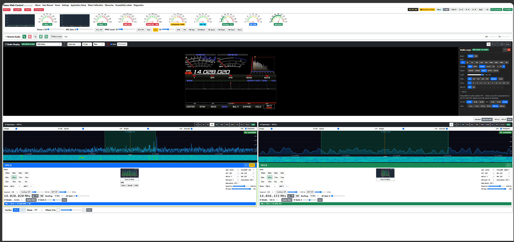
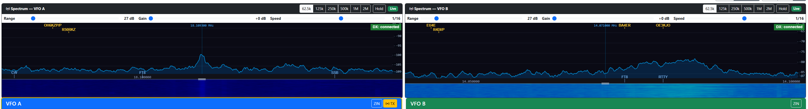

# Yaesu Web Control — User Manual

## Table of Contents

1. [Introduction](#1-introduction)
2. [Installation](#2-installation)
3. [First-Time Setup](#3-first-time-setup)
4. [Starting the Application](#4-starting-the-application)
5. [Main Control Panel](#5-main-control-panel)
   - 5.1 [Top Bar](#51-top-bar)
   - 5.2 [Meters](#52-meters)
   - 5.3 [Power, Mic Gain and Speech Processor](#53-power-mic-gain-and-speech-processor)
   - 5.4 [Spectrum Display](#54-spectrum-display)
   - 5.5 [VFO Panels](#55-vfo-panels)
   - 5.6 [Frequency Display and Tuning](#56-frequency-display-and-tuning)
   - 5.7 [Receiver Controls](#57-receiver-controls)
   - 5.8 [IF Width, IF Low Cut, IF Shift, and AF Gain](#58-if-width-if-low-cut-if-shift-and-af-gain)
   - 5.9 [Band and Segment Selection](#59-band-and-segment-selection)
   - 5.10 [Transmit Controls](#510-transmit-controls)
   - 5.11 [VOX Panel](#511-vox-panel)
   - 5.12 [CW Keyer Panel](#512-cw-keyer-panel)
   - 5.13 [FM Repeater Panel](#513-fm-repeater-panel)
   - 5.14 [DX Watch Panel](#514-dx-watch-panel)
   - 5.15 [Memory Panel](#515-memory-panel)
   - 5.16 [Voice Announcements](#516-voice-announcements)
   - 5.17 [DX Spots List](#517-dx-spots-list)
6. [Settings Page](#6-settings-page)
   - 6.1 [Radio Connection](#61-radio-connection)
   - 6.2 [Web Server Settings](#62-web-server-settings)
   - 6.3 [SDR Spectrum Display](#63-sdr-spectrum-display)
   - 6.4 [Roofing Filters](#64-roofing-filters)
   - 6.5 [CW Memory Messages](#65-cw-memory-messages-m1m5)
   - 6.6 [DX Cluster](#66-dx-cluster)
   - 6.7 [Backup &amp; Restore](#67-backup--restore)
7. [Application Setup](#7-application-setup)
   - 7.1 [External App Buttons](#71-external-app-buttons)
   - 7.2 [WSJT-X UDP Settings](#72-wsjt-x-udp-settings)
8. [Radio Memories](#8-radio-memories)
   - 8.1 [Memories Editor](#81-memories-editor)
   - 8.2 [Importing from the Radio](#82-importing-from-the-radio)
   - 8.3 [Importing from ADIF](#83-importing-from-adif)
   - 8.4 [Exporting to the Radio](#84-exporting-to-the-radio)
   - 8.5 [Memory Banks](#85-memory-banks)
   - 8.6 [YWC Starter Bank](#86-ywc-starter-bank)
   - 8.7 [What about the radio's PRESET function?](#87-what-about-the-radios-preset-function)
9. [External Applications](#9-external-applications)
   - 9.1 [WSJT-X](#91-wsjt-x)
   - 9.2 [JTAlert](#92-jtalert)
   - 9.3 [Log4OM](#93-log4om)
   - 9.4 [GridTracker](#94-gridtracker)
10. [Meter Calibration](#10-meter-calibration)
11. [Diagnostics](#11-diagnostics)
12. [Using the App on a Tablet or Phone](#12-using-the-app-on-a-tablet-or-phone)
13. [Keyboard Shortcuts](#13-keyboard-shortcuts)
14. [Troubleshooting](#14-troubleshooting)
    - 14.1 [Reporting a bug](#141-reporting-a-bug)
    - 14.2 [Common problems](#142-common-problems)
15. [Frequently Asked Questions](#15-frequently-asked-questions)
    - 15.1 [WSJT-X has no TX audio in DATA modes](#151-wsjt-x-transmits-but-the-radio-shows-no-tx-audio-or-zero-power-output-in-data-u--data-l-mode)
    - 15.2 [My RSP1 shows serial 0000000001 — is it broken?](#152-my-rsp1-shows-serial-number-0000000001--is-it-broken)
    - 15.3 [Why two SDRplay RSPs instead of one RSPduo?](#153-why-two-sdrplay-rsps-instead-of-one-rspduo)
    - 15.4 [Why not use an RTL-SDR dongle?](#154-why-not-use-a-25-rtl-sdr-dongle-instead-of-an-rspplay)
    - 15.5 [Why the 3-second delay when changing spectrum bandwidth?](#155-why-is-there-a-3-second-delay-when-i-change-the-spectrum-bandwidth)
    - 15.6 [Can I use VSPE / OmniRig / com0com?](#156-can-i-use-vspe-omnirig-com0com-or-a-similar-virtual-com-port-sharer)
16. [Accessibility and Screen Readers](#16-accessibility-and-screen-readers)
    - 16.1 [Making Everything Bigger](#161-making-everything-bigger)
    - 16.2 [Windows High Contrast Mode](#162-windows-high-contrast-mode)
    - 16.3 [Screen Reader Support](#163-screen-reader-support)
    - 16.4 [NVDA](#164-nvda)
    - 16.5 [Windows Narrator](#165-windows-narrator)
    - 16.6 [Customising Accessible Labels](#166-customising-screen-reader-labels)

---



---

## 1. Introduction

Yaesu Web Control — **YWC** for short — is a web-based control panel for Yaesu HF transceivers.

> **Windows only.** YWC runs on Windows 10 or 11 (64-bit). There is no Linux or macOS build, and none is planned. The app is hosted by a small WinForms process and uses Windows-specific serial-port and SDR drivers. You can still access the browser interface itself from any device on your home network (tablet, phone, Linux laptop) — but the YWC server must be running on a Windows PC.

Supported radios:

| Model | Power | Receivers |
|-------|-------|-----------|
| FTdx101MP | 200 W | Dual |
| FTdx101D | 100 W | Dual |
| FTDX3000 | 100 W | Dual |
| FTdx10 | 100 W | Single |
| FT-710 | 100 W | Single |

The app runs as a small application on your shack PC and is accessed through any web browser — on the same PC, a tablet, or any device on your home network.

The application was written for operators who want a large, clean, touchscreen-friendly display alongside their existing logging software, and for those who find the physical controls on the radio difficult to read or reach.

**Key features:**

- Large, readable frequency displays with digit-by-digit mouse-wheel tuning and an on-screen frequency keyboard
- Full dual-receiver control (VFO A and VFO B)
- Live S-meter, power, SWR, ALC, and compression meters (plus PA temperature, IDD, and VDD on FTdx101MP, FTdx101D, and FTDX3000)
- Real-time two-way sync — changes on the radio front panel appear immediately in the app, and vice versa
- Band and segment selectors for fast QSY to CW, FT8, SSB, or RTTY
- **Per-band memory** for IF Width, IF Shift, and Mode — switching to a band automatically restores your preferred filter and mode for that band
- Full receive controls: AGC, IPO/AMP, Attenuator, NR, NB, Auto Notch, Manual Notch, **RF Gain**, **Squelch** (FM mode)
- CW keyer with speed, break-in, delay, **sidetone pitch**, and five programmable memory messages
- TX monitor on/off toggle and level control
- Radio memory channels — recall saved frequencies and modes at a click; save and load named memory banks for different operating scenarios (e.g. Daily, Contest)
- Optional real-time spectrum display and waterfall (requires an SDR connected to the 9 MHz IF output)
- **DX cluster spots** overlaid on the spectrum — click a callsign to QSY straight to that frequency; user-selectable cluster server with live connection-status badge
- **DX watch list** — get a popup alert and a beep when watched callsigns or prefixes appear in the cluster feed (e.g. `P29*` for a DXpedition); persisted across app restarts
- **TX timeout warning** — visible red banner + audible tone if TX has been on too long (configurable threshold), as a safety net against open mics, stuck PTTs and VOX false-triggers
- **Per-VFO status line** inside each VFO panel — at-a-glance summary of band, mode, frequency, power and split state, banner-coloured to match the receiver
- **Voice announcements** — optional spoken cues for band/mode/TX changes, DX alerts and TX timeout, using your browser's built-in text-to-speech (handy for partially sighted operators)
- Integration with WSJT-X, JTAlert, and Log4OM
- Built-in rigctld server so WSJT-X can control the radio through the app
- Four IARU band plans: Region 1 (Europe, Africa, Middle East), Region 2 (Americas), Region 3 (Asia-Pacific), and Japan (JARL)
- Full screen reader support — compatible with NVDA and Windows Narrator
- Windows High Contrast mode support for all gauge displays
- Customisable accessible labels (band names, meter names, control names) for any language

---

## 2. Installation

1. Download the installer from the [GitHub Releases page](https://github.com/mm5agm/Yaesu_Web_Control/releases).
2. Run the installer. .NET 10 is bundled — you do not need to install it separately.
3. A desktop shortcut and a Start Menu entry are created automatically.
4. The first time you run the app, Windows may show a **Smart App Control** or **Unknown Publisher** warning. Click **More info → Run anyway** to proceed. This warning appears because the installer is not signed with a commercial certificate.

---

## 3. First-Time Setup

Before the app can communicate with your radio you need to tell it which serial port the radio is connected to and what baud rate to use.

**Required — radio connection:**

1. Open a browser and go to **http://localhost:8080**. If port 8080 was already in use on your PC (e.g. Plex, Jenkins, MiniTool ShadowMaker), YWC will have automatically picked the next free port from 8081–8089. **Hover over the YWC tray icon** down by the Windows clock to see the actual URL — or simply double-click the tray icon to have YWC open the right URL in your default browser.
2. Click the **Settings** link in the navigation bar.
3. Set **Radio Model** to your transceiver: **FTdx101MP** (200 W, dual receiver), **FTdx101D** (100 W, dual receiver), **FTDX3000** (100 W, dual receiver), **FTdx10** (100 W, single receiver), or **FT-710** (100 W, single receiver).
4. Set **Serial Port** to the COM port your radio is connected to. If you are unsure, go to **Diagnostics → Ports** to see a list of available ports, or check Windows Device Manager.
5. Set **Baud Rate** to match the radio's CAT baud rate. The factory default is **38400** on all supported radios. You can verify or change this on the radio under **Menu → CAT Rate**.
6. Select your **Band Plan**: Region 1 (Europe/Africa/Middle East), Region 2 (Americas), Region 3 (Asia-Pacific), or Japan.
7. If you run digital modes (FT8, FT4, RTTY, PSK) via USB audio, see the FAQ (§15) for a one-time radio menu change needed on the radio itself — it's not configurable from YWC.
8. Click **Save Settings**, then **Test Connection**. A green tick means the app is talking to the radio.

If you see a red cross, double-check the COM port number and baud rate, then try again.

**Optional — extras you can set up later in Settings:**

- **SDR spectrum display** (Section 6.3) — connect an SDR to your radio's 9 MHz IF output to get a live spectrum and waterfall.
- **DX cluster** (Section 6.6) — connect to a DX cluster server to overlay live DX spots on the spectrum.
- **CW memory messages** (Section 6.5) — pre-fill the M1–M5 CW keyer memories.
- **Roofing filters** (Section 6.4) — tell the app which optional roofing filters are fitted on your radio so the dropdown shows only the ones you actually have.

None of these are required for basic operation. Get the radio connection working first; come back for the extras when you want them.

---

## 4. Starting the Application

Double-click the **Yaesu Web Control** shortcut on your desktop. The app starts in the background and your default browser opens automatically to whichever port YWC managed to bind (usually `http://localhost:8080`, but YWC will fall back to 8081–8089 if 8080 was already in use on your PC).

A small **YWC tray icon** appears in the Windows system tray (down by the clock, possibly under the **Show hidden icons ︿** arrow). The tray icon is your "the app is running" indicator and gives you a clean way to manage it without juggling Task Manager:

- **Hover** over the icon — a tooltip confirms the version and the actual URL (e.g. `http://localhost:8080` or `http://localhost:8081`). If you ever wonder which port YWC ended up on, this is the fastest way to check.
- **Double-click** the icon — opens YWC in your default browser (handy if you've closed all browser tabs and need to get back to the app).
- **Right-click** the icon — opens a menu:

| Menu item | What it does |
|---|---|
| Open Yaesu Web Control | Opens YWC in your default browser. |
| About — version vX.Y.Z | Shows version, release date, and licence. The browser About page (top nav bar) has full details and a Copy diagnostics button. |
| Open user data folder | Opens `%APPDATA%\MM5AGM\Yaesu Web Control\` in File Explorer — handy for grabbing the backup zip after export, or inspecting/editing JSON files. |
| Exit Yaesu Web Control | Confirms then shuts the app down cleanly. WSJT-X / Log4OM / JTAlert / GridTracker lose their CAT connection until you restart YWC. |


If the radio is powered on and the serial connection is correct, a brief "Initialising…" overlay appears while the app reads the current radio state. After a few seconds the overlay disappears and all controls reflect the current state of the radio. This includes frequencies, mode, antenna, AGC, NB level, ATU state, VOX settings, FM repeater settings, CW keyer speed and break-in mode, IF width, IF shift, and more — no software defaults are applied.

**Closing the app:** Three ways:
1. **Right-click the tray icon → Exit Yaesu Web Control.** Cleanest — confirms first, then shuts the server down properly.
2. **Close the browser tab and walk away.** The app detects no browser is connected and begins a 30-second countdown; if no browser reconnects within 30 seconds it exits automatically.
3. **Force-quit** via Task Manager (Ctrl+Shift+Esc → find `Yaesu_Web_Control.exe` → End Task). Use this only if something has hung.

**Accessing the app from another device:** If you set **Network Interface** to `0.0.0.0 (all interfaces)` in Settings (the default), the app is also accessible from any device on your local network. The Settings page shows the full URL for each network interface — bookmark one of these on your tablet or phone.

---

## 5. Main Control Panel

### 5.1 Top Bar

The top bar contains navigation links, external application buttons, and the radio power button. The app name and current version number (e.g., **Yaesu Web Control v2.0.0**) are shown in the top-left corner.

**Update notification** — on startup the app silently checks the GitHub releases page for a newer version. If one is available, a small banner appears in the bottom-right corner with a **Download** link that opens the releases page in your browser, and a **Dismiss** button. No banner appears if you are already on the latest version or if the internet is not available.

**External app buttons** (WSJT-X, JTAlert, Log4OM) appear if they are enabled in Application Setup. The colour of each button indicates status:

| Colour | Meaning |
|--------|---------|
| Green | Application is running and connected |
| Yellow | Application is running but waiting for UDP data (WSJT-X only) |
| Red | Application is not running |

Click a button to launch the application. If it is already running, it is brought to the front.

The **WSJT-X** button also shows a red **TX** badge when WSJT-X is currently transmitting.

**POWER button** (top right) turns the radio on or off. The button is green when the radio is on and red when it is off.

**UTC clock** — a yellow `HH:MM:SS Z` clock sits just left of the Buy Me a Coffee button. Amateur radio operates on UTC for logging, contests and beacon schedules, so the time is always visible regardless of your PC's local time zone.

> **Where the time comes from.** The clock reads your **PC's system clock**, converted to UTC. There is no separate network time source — YWC trusts whatever Windows says the time is. Hovering the clock gives a one-line reminder; **clicking it** opens a popover with a full explanation and step-by-step instructions for verifying Windows time-sync.
>
> **Why this matters beyond just the clock display.** The same PC time is also used for:
>
> - The **Age** and **Time UTC** columns in the DX Spots list (§5.17)
> - The **15-minute spot age-out** (§5.4)
> - The **TX timeout warning** countdown (§5.10)
> - QSO timestamps in any external logger you're using (Log4OM, JTAlert)
>
> If the PC clock is wrong, all of those misbehave.
>
> **For users with constant internet**, Windows syncs against `time.windows.com` typically once a week or whenever the connection comes back. Your clock stays within a second of UTC without effort.
>
> **For users who operate offline a lot**, a typical PC clock drifts seconds-to-minutes per week. Fine for SSB casual logging, problematic for FT8 and contests. Re-sync whenever you reconnect to the internet (Windows Settings → Time & Language → Date & time → Sync now).

**Status line** — each VFO panel has its own compact one-line summary directly below the IF Width row, banner-coloured to match the panel (blue for VFO A, green for VFO B):

```
VFO A:  40m / USB / 7.100.000 / 100W
VFO B:  17m / USB / 18.110.000
```

The line shows the current band, mode and frequency, with transmit power appended on the VFO A line. When split mode is active the VFO A line ends with **SPLIT  RX** and the VFO B line ends with **TX**, making the transmit-vs-receive role obvious at a glance. The line updates live whenever any of these values change.

---

### 5.2 Meters

A scrollable row of meters is displayed above the VFO panels. The meters shown depend on your radio model:

**FTdx101MP, FTdx101D, FTDX3000** — seven meters:

| Meter | What it shows |
|-------|--------------|
| SWR | Standing wave ratio on the antenna — only active during transmit |
| Power | Output power in watts — only active during transmit |
| Compression | Speech compression in dB — only active during transmit |
| ALC | Automatic Level Control voltage — only active during transmit |
| Temp | PA temperature in °C |
| IDD | PA drain current in amps |
| VDD | PA supply voltage in volts |

**FTdx10, FT-710** — four meters (SWR, Power, Compression, ALC). The Temp, IDD, and VDD meters are not shown because those radios have a different power amplifier design that runs on 13.8 V; the high-voltage PA meters do not apply.

All meters update in real time at approximately 10 times per second. Meters that only apply to transmit automatically read zero when the radio is receiving.

The meter scales are calibrated to show meaningful units rather than raw ADC values. See Section 10 (Meter Calibration) if you want to adjust the calibration for your specific radio.

**S-meter history strip.** A small 30-second strip-chart can be shown below each VFO's S-meter. Click the **S-hist** button in the top toolbar to toggle it on (off by default; the choice is remembered between sessions). The strip shows three things at once:

- **Green line** — the actual S-meter trace over the last 30 seconds. Lets you see QSB fading patterns and brief interference spikes that the analog needle barely registered.
- **Yellow dashed line** — the peak hold for the window, useful for noting a station's actual peak signal during an over without staring at the needle.
- **Red dashed line** — the noise-floor reference (the 10th-percentile reading in the window). When the line jumps up suddenly, a noise source has switched on — often a useful diagnostic when QRM appears.

The vertical axis is calibrated in S-units (S1, S5, S9, S9+30, S9+60) using the same calibration table as the analog gauge. The horizontal axis runs from **-30s** on the left to **now** on the right. The strip is purely a visual aid — none of the information is sent to the radio.

---

### 5.3 Power, Mic Gain and Speech Processor

**Power slider** — Sets the transmit power from 5 W to 200 W (FTdx101MP) or 5 W to 100 W (FTdx101D, FTDX3000, FTdx10, and FT-710). Drag the slider to set the desired power level. The current value is shown to the right of the slider.

The radio is the source of truth for RF Power. On connect, YWC reads the radio's current Power setting via the `PC;` CAT command and reflects whatever the radio reports — so if you change Power on the radio's front panel while YWC is closed, the new value appears in YWC when you reopen it. (Earlier versions overwrote the radio's setting with YWC's last-saved value on connect; that was incorrect and is fixed in v2.3.7.)

The slider snaps to 5 W steps for ease of dragging, but the numerical label shows the radio's **exact** value. If the radio is set to an odd value like 73 W or 91 W via the front-panel knob, the label reads `73 W` or `91 W` even though the slider visually sits at the nearest 5 W mark. Moving the slider yourself sends the chosen 5 W step to the radio, overwriting the odd value.

**MIC Gain / Data Out Gain slider** — Sets the microphone gain (0–100). When the radio is in a data mode (DATA-U, DATA-L, PSK, RTTY, or DATA-FM), the label changes to **Data Out Gain** automatically.

**PROC button** — Toggles the speech processor on and off. The button is amber when the processor is active and grey when off. The speech processor increases the average power of your transmitted audio, which can improve readability at the other end — particularly useful for SSB DX and pile-ups.

**PROC Level slider** — Sets the speech processor compression level (0–100). A typical starting point is around 50. Higher values increase average power further but can make the audio sound over-processed and harder to copy. Monitor the compression meter while speaking and aim for 6–10 dB of compression. Both the PROC on/off state and the level are saved and restored when the app restarts.

---

### 5.4 Spectrum Display

The spectrum display is only visible if an SDR device has been configured in Settings. It shows a real-time spectrum and scrolling waterfall of the band around the current VFO A frequency.

**Span buttons** — Click **250k**, **500k**, **1M**, or **2M** to change the visible bandwidth. The display recentres on VFO A.

**Click to tune** — Click anywhere on the spectrum **or the waterfall** to tune VFO A to that frequency. A click on a signal trail in the waterfall QSYs to the frequency of that column, which is the natural way to chase an interesting signal you can see slowly drifting down the screen. **The mode also changes automatically** to match the segment of the band you clicked into — CW below the digital sub-band, DATA-U around the FT8/FT4/RTTY watering holes, USB/LSB in the phone segment, FM at the top of 10m and on 2m/4m. If you click somewhere outside the recognised amateur bands the mode is left as-is.

**Mouse wheel to tune** — Scroll the mouse wheel over the spectrum to tune VFO A up or down in 1 kHz steps.

**Frequency crosshair** — Move the mouse over the spectrum to see the exact RF frequency at the cursor position displayed above the waterfall.

**DX cluster spots** — If you have configured a DX cluster server in Settings (see §6.6), incoming spots are overlaid as small yellow callsign labels along the top of the spectrum at each spot's frequency. Clicking on a spot (within a few pixels of its marker) tunes VFO A exactly to that frequency. Spots outside the current span are not drawn; spots older than the configured age (default 15 minutes) are removed automatically.

**How spots are filtered for display** — the spectrum panel shows any spot whose frequency falls inside the currently visible window (VFO A ± half the span). When you change band, VFO A moves and the spectrum recentres, so the visible spots change automatically to match the new band. There is no explicit band filter — just a "is this spot inside the visible window?" check. In practice this means you see only the current band, because amateur bands have large gaps between them. If you zoom out to a 2 MHz span you'd technically see a wider chunk, but adjacent bands rarely overlap that window.

The cluster feed itself is not band-filtered by YWC — spots arrive for every band the cluster carries. They are all kept client-side; only the ones inside the visible window get drawn. To reduce traffic at the source (for example, to receive only 20 m and 40 m spots), add a line like `set/filter band 20 or band 40` to **Settings → DX Cluster → Post-login commands**. That filter runs on the cluster server and cuts down on spots before they reach YWC.

On crowded bands (the lower end of 20m on a contest weekend, for example) labels are stacked across up to five rows to avoid overlap. If even five rows can't fit everything in a tight cluster of nearby frequencies, **the app drops the spots that don't fit rather than letting labels overlap and become illegible**. The dropped spots are still in the underlying spot list — they just aren't drawn. Zooming the spectrum to a narrower span (e.g. 250k or 500k) spreads spots out and reveals the ones that were hidden.

**Decluttering with the watch list** — if cluster traffic is making the spectrum unreadable, open the DX Watch popup (§5.14) and tick **Show only watched callsigns**. Every yellow (non-watched) spot disappears from the spectrum and the DX Spots list, leaving only the red watched-list matches. Toast / beep / voice alerts still fire as normal on watched spots; the toggle only changes what's drawn. Untick to bring all spots back. Setting is remembered per browser.

**Band-plan markers** — small cyan tick marks at the bottom of the spectrum show the standard activity frequencies for the currently visible band: CW, FT8, RTTY, SSB DX window etc. The exact frequencies come from your selected IARU region (§6.1 Band Plan). The markers update automatically as you change band or zoom the spectrum; only segments whose frequency falls inside the visible window are drawn. Where two markers would overlap (e.g. FT8 at 14.074 and RTTY at 14.080 — only 6 kHz apart), the labels stack vertically so both remain readable. They're a quick orientation aid — especially helpful when visiting an unfamiliar band — and they don't interact with anything; nothing happens if you click them.

**Band-edge guard rails** — dashed red vertical lines drawn at the lower and upper edges of every amateur band that falls inside the visible window. They make it immediately obvious when you've tuned outside the amateur allocation (e.g. clicking 14.396 MHz on the spectrum lands you above the 20m upper edge at 14.350 — the red line is right there, telling you why no DX cluster spots are appearing and why the mode hasn't auto-changed). The edges use the worldwide amateur envelopes (the broadest limits across all regions), so a Region 1 operator may see a guard rail slightly beyond their own legal limit on a few bands — never the other way round.

A status badge in the spectrum panel shows the current SDR state: **No SDR**, **Connecting…**, **Live**, or **Disconnected**.

A second small badge in the **top-right corner of the spectrum canvas** shows the DX cluster connection state — green for *connected*, amber for *connecting*, red for *disconnected*, grey for *off*. See Section 6.6 for cluster setup and troubleshooting.

---

### 5.5 VFO Panels

There are two VFO panels side by side:

- **VFO A** (blue border) — the main receiver, present on all supported radios.
- **VFO B** (green border) — on the FTdx101MP and FTdx101D this is a fully independent sub-receiver. On single-receiver radios (**FTdx10, FT-710, FTDX3000, FT-991A**) there is only one physical receiver chain inside the radio, so VFO B is a frequency / mode memory slot through which the single receiver is steered.

**Greying behaviour on single-receiver radios** (FTdx10, FT-710, FTDX3000, FT-991A):

- **Normal mode** (split off): the **active** VFO is white, the **inactive** VFO is grey. The grey VFO's controls (Mode, IF Width, Notch, etc.) still display their stored values for reference, but cannot be edited — those values only apply when you swap that VFO to be active via the **A↔B** button.
- **Split mode**: the **receive** VFO is white, the **transmit** VFO is grey — opposite of normal mode. This makes sense because in split you spend most of your time receiving on the white panel and only occasionally transmit on the grey one. The grey (TX) panel's **frequency field is still editable** so you can set the TX frequency from YWC without un-splitting first — click a digit and scroll the mouse wheel, or use the keyboard icon next to MHz to type one in. The TX button and the SPLIT badge appear on the grey panel.

On **dual-receiver radios** (FTdx101MP / FTdx101D) neither panel is greyed at any time — both VFOs are real physical receiver chains and are always independently usable.

**Antenna selector visibility:** the per-VFO antenna dropdown is hidden on radios with a single antenna jack (**FTdx10, FT-991A**) since there is nothing to select between. Radios with multiple antenna jacks (FTdx101MP, FTdx101D, FT-710, FTDX3000) keep the selector.

Both panels have identical controls — changing a control on the white panel writes to the radio immediately; changing a control on the grey panel does nothing (apart from the TX frequency in split, as noted).

**VFO-B toggle** — the **VFO-B** button in the toolbar shows or hides the VFO B panel. The last state is remembered across sessions.

**A↔B Swap** — the **A↔B** button in the toolbar swaps the frequencies and modes between VFO A and VFO B in one click. Available on all supported radios.

**B→A Copy** — the **B→A** button copies VFO B's frequency and mode into VFO A. **VFO B is left unchanged.** This is the right control to use when you want to transmit on VFO B's settings without enabling split — after the copy, VFO A holds the same frequency and mode as VFO B and the radio transmits normally on VFO A. Different from swap (which exchanges both VFOs), and different from split (which leaves the VFOs alone but uses VFO B as the TX frequency only while in RX/TX mode).

**A→B Copy** — the **A→B** button is the mirror operation: copies VFO A's frequency and mode into VFO B with VFO A left unchanged. Useful for seeding VFO B from your current operating frequency before nudging one of the two (e.g. to set up split manually).

**Split** — enables split operation: VFO A is the receive frequency, VFO B is the transmit frequency. The button turns red and shows **Split ON** when active. Pressing it again turns split off. **No frequencies are changed** — whatever VFO B is currently set to becomes the TX frequency. Use this button whenever you want to transmit on a different frequency from your receive frequency, including cross-band split (e.g. listening on 20m, transmitting on 6m) or any arbitrary TX offset.

**+5k (Quick Split)** — a DX pile-up convenience button. It always sets VFO B to **VFO A + 5 kHz** and enables split in one click. Use this when a DX station says "listening 5 up". It is not a general-purpose split button — it will overwrite whatever VFO B was set to. For any split scenario other than +5 kHz, set VFO B to the desired TX frequency first and then press **Split**.

> **Example — cross-band split (6m TX, 20m RX):**
> 1. Tune VFO A to your 20m listening frequency
> 2. Tune VFO B to your 6m transmit frequency
> 3. Press **Split** — you are now receiving on 20m and transmitting on 6m
> 4. Do **not** press +5k, as that would move VFO B back to 20m + 5 kHz

---

### 5.6 Frequency Display and Tuning

The frequency display shows the current VFO frequency in MHz to 1 Hz resolution (e.g., **14.074.000**).

**Digit tuning with the mouse wheel:**

1. Click on any digit in the frequency display. The selected digit is highlighted.
2. Roll the mouse wheel up to increase that digit, or down to decrease it.
3. Carry-over is automatic — for example, scrolling 9 → 0 on the kHz digit also increments the 10 kHz digit.
4. The new frequency is sent to the radio approximately 200 ms after you stop scrolling.
5. Click anywhere outside the frequency display to deselect.

**On a tablet or phone**, tap a digit to select it, then use the **▲** and **▼** buttons that appear below the display to adjust it.

---

**On-screen frequency keyboard:**

A numeric entry button (**⑁**) appears to the right of the **MHz** label on each VFO panel. Click or tap it to open a floating on-screen number pad for typing in a frequency directly.

The keyboard pre-fills with the current VFO frequency when it opens. The display shows the frequency as **XX.YYYYYY MHz** with the current digit position highlighted in blue.

You can enter digits by clicking the on-screen buttons **or by typing on your physical keyboard** — whichever is more convenient.

| Key | Action |
|-----|--------|
| **0–9** | Enter a digit at the cursor position and advance the cursor one place to the right |
| **◀ / ▶** | Move the cursor left or right without changing any digit |
| **⌫** | Zero the digit at the cursor and move the cursor left |
| **CLR** | Reset all digits to zero |
| **↵ Enter** | Validate and send the frequency to the radio, then close the keyboard |
| **✕** (title bar) | Close the keyboard without changing the frequency |
| **Esc** | Close the keyboard without changing the frequency |

The same actions are available from the physical keyboard: digit keys type digits; **← →** move the cursor; **Backspace** zeros the current digit; **Delete** clears all digits; **Enter** sends the frequency; **Esc** closes the keyboard.

If you enter a frequency outside the radio's range (0.030–75.000 MHz) an error message appears and the frequency is not sent.

**Moving and resizing the keyboard:** Drag the title bar to move the keyboard anywhere on screen (touch drag is also supported on tablets). Drag the bottom-right corner to resize it. The position and size are saved automatically and restored the next time you open the keyboard.

All keys have accessible labels for screen readers.

---

### 5.7 Receiver Controls

Each VFO panel has a row of dropdowns for the main receiver settings. All are two-way — if you change a setting on the radio's front panel, the dropdown updates automatically.

**Mode** — Select the operating mode:
LSB, USB, CW-U, CW-L, FM, FM-N, AM, AM-N, RTTY-L, RTTY-U, DATA-L, DATA-U, DATA-FM, DATA-FM-N, PSK

**Antenna** — Select the antenna connector: ANT 1, ANT 2, ANT 3.

Your antenna choice is **remembered per band per VFO**. Set Ant 1 on 20 m and Ant 2 on 6 m once, and switching between those bands later automatically restores the right antenna without you having to click again. VFO A and VFO B have independent memories — useful on FTdx101MP/D where Main and Sub can listen on different antennas at the same time, and on single-receiver radios where you might want different defaults depending on whether you're using VFO B as a scratch slot.

Existing installs auto-populate empty slots on the next startup with whatever the radio currently has, so you don't need to manually click through every band to seed it.

**Roofing Filter** — Select the roofing filter bandwidth: 12 kHz, 3 kHz, 1.2 kHz, 600 Hz, 300 Hz

**Control column** (the two-column grid of dropdowns to the right):

| Control | Options |
|---------|---------|
| AGC | OFF, FAST, MID, SLOW, AUTO |
| IPO/AMP | IPO, AMP1, AMP2 |
| ATT | OFF, 6 dB, 12 dB, 18 dB |
| NR | OFF, NR1, NR2 |
| NB | OFF, ON |
| NB Level | 1–20 (noise blanker depth; only relevant when NB is ON) |
| Auto Notch | OFF, ON |
| Man Notch | OFF, ON |
| Notch Hz | Slider 10–3200 Hz (only relevant when Man Notch is ON) |
| RF Gain | Slider 0–255. Controls the RF preamplifier gain. At 255 (maximum) sensitivity is highest; reducing RF Gain is useful when a strong nearby signal is causing overload that AGC and IPO cannot handle. |
| Squelch | Slider 0–255. Only shown when the VFO is in FM or FM-N mode. 0 = squelch fully open (hear everything); higher values cut off weaker signals. |

All of these settings are read from the radio when the app connects.

**Filter Function Display** — A compact real-time display positioned alongside the band buttons, between the band button column and the receiver controls column. It shows the shape of the active DSP filter passband, matching the style of the filter scope on the FTdx101MP front panel.

- The **red-bordered trapezoid** represents the active **DSP filter passband** (the IF Width setting). The sloped sides reflect the filter roll-off characteristic at the passband edges.
- **Green animated bars** inside the trapezoid represent signals passing through the filter. No signals are shown outside the passband, making it immediately clear which audio frequencies are being received.
- A **"Roof Nk" label** in the top-right corner shows the currently selected roofing filter (e.g. "Roof 3k", "Roof 12k", "Roof 600"). This is useful because the DSP filter is the *active* limit when the roofing filter is wider than the DSP setting — in that case the trapezium looks identical for several roofing choices (12k and 3k both produce the same shape if the DSP filter is set to 3 kHz, since both roofing filters are at least as wide as 3 kHz). The label is the only way to see which roofing is actually in circuit when this happens.
- **Passband width** reflects the current IF Width setting, automatically constrained by the selected Roofing Filter if it is narrower than the DSP setting. If the roofing filter is wider, the DSP filter is what you see.
- **Passband position** shifts left or right as the IF Shift slider is adjusted — the display updates live while dragging the slider.
- A **white downward arrow** appears on the top edge of the passband when the Contour filter is active, indicating the contour centre frequency. It moves as the contour frequency slider is adjusted.
- The display updates automatically whenever any filter parameter changes, whether adjusted from the browser or from the radio's front panel.

---

### 5.8 IF Width, IF Low Cut, IF Shift, and AF Gain

**IF Width** — Sets the DSP filter bandwidth.

The IF Width dropdown is **mode-aware**: the SH command code sent to the radio is the same in every mode, but the resulting bandwidth differs per mode. In SSB code 8 gives 1650 Hz; in CW the same code gives 400 Hz. The dropdown labels are rebuilt automatically when you change mode so they show the actual bandwidth the radio will use.

- **SSB modes** (LSB, USB, DATA-L, DATA-U) show the wide SSB widths — from 300 Hz up to around 3.2 kHz (4 kHz on FTdx10/FT-710).
- **CW, RTTY, and PSK modes** show the narrow widths — from 50 Hz up to 3 kHz or so.
- **AM and FM modes** hide the IF Width dropdown — the SH command does not apply in those modes (the radio uses fixed filters, or a separate narrow/wide mode toggle).

The first entry in the dropdown ("Default") is the radio's mode-dependent default, which varies by the selected roofing filter. The current width is read from the radio on connect; selecting a new value sends it immediately.

> **About the FTdx101 "4 kHz" firmware update** — Yaesu's 2023 firmware release notes mention *"Increased RX IF Band WIDTH up to 4000 Hz"* for SSB, CW, RTTY, PSK and DATA. This is **not** an extension of the IF Width dropdown's range. The FTdx101's IF DSP filter (SH command) still tops out at 3.2 kHz in SSB and 3.0 kHz in CW — the dropdown values in this app are correct and match the Yaesu CAT manual.
>
> What the firmware *did* extend is **HCUT** — the audio high-cut filter that shapes audio inside the IF passband. HCUT now goes up to 4000 Hz (was 3000 Hz). HCUT is an EX menu setting on the radio's own touch screen — set it once on the radio and it stays. The app does not control HCUT directly. If you want fuller audio (e.g. 4 kHz HCUT for SSB ESSB-style audio), set it via your radio's **Function → Radio Setting → Mode SSB → HCUT FREQ** menu.

**IF Low Cut** — Sets the lower edge of the DSP passband (SL command). Options: OFF, 100 Hz, 200 Hz, 300 Hz, 400 Hz, 500 Hz, 600 Hz, 700 Hz, 800 Hz, 900 Hz, 1.0 kHz, 1.1 kHz. Use this to cut low-frequency audio or interference — for example, 300 Hz in SSB to reduce hum and LF splatter. This setting is independent per VFO.

**IF Shift** — Shifts the passband centre ±1000 Hz in 20 Hz steps. Drag the slider or use the keyboard arrow keys. The current offset is shown next to the slider.

**Zero button** — Resets IF Shift to 0 Hz instantly.

IF Shift is persisted and restored on startup.

**AF Gain** — Sets the audio output level (0–255). Drag the slider and release to send the new value to the radio.

---

### 5.9 Band and Segment Selection

**Band buttons** — Click a band button (160m, 80m, 40m, etc.) to switch the VFO to that band. The radio tunes to the last-used frequency on that band. You can also navigate between band buttons with the keyboard: **Tab** moves focus into the band group, then the **left/right arrow keys** move between bands and activate the selected one immediately.

Available bands depend on your band plan setting:

| Band Plan | Bands |
|-----------|-------|
| IARU Region 1 (Europe, Africa, Middle East) | 160m, 80m, 60m, 40m, 30m, 20m, 17m, 15m, 12m, 10m, 6m, **4m** |
| IARU Region 2 (Americas) | 160m, 80m, 60m, 40m, 30m, 20m, 17m, 15m, 12m, 10m, 6m |
| IARU Region 3 (Asia-Pacific) | 160m, 80m, 60m, 40m, 30m, 20m, 17m, 15m, 12m, 10m, 6m |
| Japan (JARL) | 160m, 80m, 40m, 30m, 20m, 17m, 15m, 12m, 10m, 6m |

Region 1 is the only plan that includes the 4m (70 MHz) band. Japan has no 60m secondary allocation.

**Segment dropdown** — After selecting a band, a dropdown appears above the frequency display showing common operating segments for that band. Select a segment to jump directly to its standard frequency and set the appropriate mode:

| Segment | Example (20m) | Mode set |
|---------|--------------|---------|
| CW | 14.025 MHz | CW-U |
| FT8 | 14.074 MHz | DATA-U |
| SSB | 14.150 MHz | USB |
| RTTY | 14.080 MHz | RTTY-U |

The last segment you used on each band is remembered, so when you return to a band the dropdown re-selects your previous segment.

**Auto-sync to current frequency** — the Segment dropdown also follows your actual tuning. When you change frequency by any means (clicking the spectrum, turning the radio's front-panel knob, typing on the on-screen frequency keyboard), the dropdown updates to show the segment that contains your new frequency. If you tune into a gap between segments (e.g. 14.150 — between FT8 at 14.074 and SSB at 14.225 on 20m), the dropdown shows the closest segment at or below your frequency. This keeps the dropdown's display honest — it always tells you where you actually are, not where you last clicked.

**Per-band IF and mode memory** — When you switch away from a band the app saves the current IF Width, IF Shift, and Mode for that band. When you return to the band those settings are automatically restored on the radio. This means, for example, you can have a 500 Hz CW filter on 40m and a 2.4 kHz SSB filter on 20m and the app will switch between them as you change bands. Settings are saved per-VFO (VFO A and VFO B are independent) and persist between sessions.

**60m — Region 1 and Region 3:** Shows FT8 (5.357 MHz) and USB (5.362 MHz) segments, covering the WRC-15 secondary allocation (5351.5–5366.5 kHz). Access to 60m varies by country within these regions.

**60m — Region 2 (Americas):** Shows the five FCC-designated channels (5.331, 5.347, 5.357, 5.372, 5.404 MHz).

**60m — Japan:** No 60m secondary allocation; the 60m band does not appear for the Japan plan.

---

### 5.10 Transmit Controls

**TX button** — Appears on whichever VFO is currently the transmit VFO. Click to start transmitting; click again to return to receive. The button turns red and the label changes to **TX** while transmitting.

**Radio POWER button** — Turns the radio on or off. The button shows green (on) or red (off).

**Connect button** — Manually connects or disconnects the CAT serial link to the radio. The button reflects the actual serial port state when the page loads:

- **Connected** (green) — the serial port is open and the radio is communicating
- **Disconnected** (red) — the serial port is closed or the radio is not responding

The button updates automatically — if the radio is powered off or stops responding, it switches to red/Disconnected within a few seconds without any action needed.

Click the button to toggle the connection. While connecting, it briefly shows "Connecting…". On reconnect the app re-reads all radio settings so the controls reflect the current radio state. Useful if the radio was powered on after the app started, or after a USB cable was unplugged and re-plugged.

**ATU button** — Controls the radio's automatic antenna tuner. The button matches the Yaesu front-panel TUNE button's behaviour: short tap and long press do different things.

- **Short tap** toggles the ATU between **ATU On** (green) and **ATU Off** (grey). On = the tuner network is engaged in the signal path; Off = bypassed.
- **Long press (≥500 ms)** starts the radio's auto-tune cycle. The button turns red and shows **Tuning…** while the radio searches for a low-SWR match — typically 2-7 seconds. When tuning completes the button returns to **ATU On** automatically. Tap the red button during a running tune to stop it early. **Because the tune cycle didn't complete, the ATU is left bypassed (Off)** — the radio doesn't retain partial tuning data, so to find a match you'd need to long-press again for a fresh cycle.

On single-receiver radios (FTdx10, FT-710, FTDX3000) the radio firmware stores the ATU on/off state per VFO. Swapping the active VFO via the **A↔B** button updates YWC's ATU display to match whichever VFO is now active — even if the on/off settings differ between the two. The radio has only one physical tuner, but it remembers per-VFO which setting to apply.

Only applies to radios fitted with an internal or external ATU.

**Mon button** — Toggles the TX monitor (sidetone) on and off. The button is amber when the monitor is active and grey when off. Click to toggle.

**Mon level slider** — Sets the TX monitor volume (0–100). Controls how much of the transmitted audio you hear in the headphones during TX. Drag and release to apply. Both the on/off state and the level are read from the radio when the app connects.

**TX timeout warning** — If the radio has been transmitting continuously for longer than a configurable threshold (default **120 seconds**), a red banner appears across the top of the page reading *"TX has been ON for more than N seconds — check your microphone, keyer or VOX!"* and a tone beeps every three seconds until the warning is cleared. The warning triggers regardless of how TX was started (app button, hardware PTT, VOX, CAT) and automatically clears the moment the radio returns to receive.

Click **Dismiss** on the banner to silence it without stopping TX (useful for a long deliberate transmission). Click **Change timeout…** to set a different threshold (5–3600 seconds); the new value is remembered between sessions for that browser. The warning exists as a safety net against open mics, stuck PTTs and VOX false-triggers — it doesn't stop the transmission itself.

**VOX button** — Opens the **VOX Settings** panel. The button shows **VOX: On** (green) or **VOX: Off** (grey) based on the current VOX state.

**CW button** — Opens the **CW Keyer** panel. See Section 5.12.

**FM Rep button** — Opens the **FM Repeater** panel. See Section 5.13.

All three panels can be open at the same time and can be dragged anywhere on screen by their title bar.


**MIC Gain** — Drag the slider to set the microphone gain (0–100). The value is sent to the radio as you release.

**PROC** — Speech processor toggle. Shows **Proc On** (green) or **Proc Off** (grey).

**PROC Level** — Speech processor level slider (0–100).

---

### 5.11 VOX Panel

Click the **VOX** button to open the VOX pop-up panel.

| Control | Description |
|---------|-------------|
| VOX toggle | Enables or disables VOX. Shows **VOX: On** (green) or **VOX: Off** (grey) |
| Gain | VOX sensitivity (0–100). Higher values trigger TX more easily |
| Delay | VOX hang time (0–2500 ms). Time TX stays active after audio stops |
| Anti-VOX | Anti-VOX level (0–100). Suppresses the receiver audio from triggering VOX |


Close the panel by clicking the **×** button in its title bar. Drag the title bar to reposition the panel anywhere on screen. Its position is remembered between sessions.

---

### 5.12 CW Keyer Panel

Click the **CW** button to open the CW Keyer pop-up panel.

| Control | Description |
|---------|-------------|
| Speed | Keyer speed in WPM (4–60) |
| Break-in | **Off** (keyer only), **Semi** (semi break-in), or **Full** (QSK full break-in) |
| Delay | Semi break-in delay (0–2500 ms) — only relevant in Semi mode |
| Pitch | CW sidetone pitch frequency (300–1050 Hz in 10 Hz steps). Also sets the CW receive offset so the radio zero-beats at this tone. Read from the radio on connect. |
| M1–M5 buttons | Sends the corresponding memory message via the radio's KY CAT command |

**CW memory messages** are configured on the **Settings** page (see Section 6.5). Each message can be up to 24 characters. Use `{CALL}` as a placeholder — it is sent literally (the radio does not expand it; configure your callsign in the message text directly for CW use).


Close the panel by clicking the **×** button in its title bar. Drag the title bar to reposition the panel anywhere on screen. Its position is remembered between sessions.

---

### 5.13 FM Repeater Panel

Click the **FM Rep** button to open the FM Repeater pop-up panel. These settings apply when using FM mode.

| Control | Description |
|---------|-------------|
| Shift | **None**, **Positive** (+), **Negative** (−), or **Split** |
| Offset | Repeater offset in kHz. Common values: 600 kHz (2m), 1600 kHz (70cm) |
| CTCSS Mode | **Off**, **Encoder**, **Decoder**, or **Encoder + Decoder** |
| CTCSS Tone | Select the required CTCSS sub-tone from the standard set (67.0 Hz – 254.1 Hz) |
| Apply button | Sends all FM repeater settings to the radio in one operation |


Close the panel by clicking the **×** button in its title bar. Drag the title bar to reposition the panel anywhere on screen. Its position is remembered between sessions.

---

### 5.14 DX Watch Panel

Click the **DX Watch** button on the toolbar to open the watched-callsign panel. This is where you tell the app which callsigns or callsign prefixes you want to be alerted on when they show up in the DX cluster feed.

Use it for chasing a particular DXpedition (`P29VR`), staying on top of a contest call (`G4ABC/P`), or watching a whole prefix run (`VK*` for any Australian station).


**Adding a watched call:**

1. Type the callsign or prefix in the input field (e.g. `G4ABC` or `VK*`).
2. Click **Add** or press Enter.
3. The entry appears in the list below.

**Removing a watched call:**

Click the red **×** to the right of any entry. The entry is removed immediately and the change is persisted.

**Wildcard matching:**

- Plain callsign — exact match, case-insensitive (`G4ABC` matches only `G4ABC`)
- Trailing `*` — prefix match (`G4*` matches `G4ABC`, `G4XYZ`, `G4ABC/P`, etc.)

**Show only watched callsigns.** Below the input field is a toggle labelled **Show only watched callsigns**. When ticked, the spectrum overlay and the DX Spots list (§5.17) hide every spot that doesn't match an entry in your watch list — useful on a busy band where dozens of yellow labels make the spectrum hard to read. The watched spots remain visible (still drawn in red on the spectrum), and toast/beep alerts still fire as normal. Untick to bring all spots back. The setting is remembered per browser.

**What happens when a watched call is spotted:**

- A small red **alert toast** appears with the callsign, frequency, spotter and any comment from the spot. The toast fades after about 8 seconds. **Click the toast to QSY VFO A directly to that frequency.**
- A short two-tone **beep** plays (only after you've interacted with the page — browsers block audio until the user has clicked something on the page first).
- On the spectrum panel, the watched callsign is drawn in **bright red** instead of the usual yellow, so you can see it at a glance.


**Moving the alert toast.** The toast appears in the bottom-right of the page by default, but you can **drag it anywhere on screen** by pressing and holding on it and moving the mouse. The new position is remembered between sessions, so the next alert appears in the same place. (Click without dragging still QSYs as normal — the app distinguishes the two by checking whether the pointer actually moved by more than a few pixels.)

The list of watched calls is saved across app restarts in your user settings file. You don't need to re-enter it after a reboot. Close the watch panel with the **×** button in its title bar; drag the title bar to reposition the panel anywhere on screen — the position is remembered between sessions.

---

### 5.15 Memory Panel

The **Mem** button in the toolbar (bold black text) opens a floating memory panel showing all your saved memory channels as clickable tiles. Each tile shows the label, frequency, and mode. **Click a tile to QSY VFO A to that frequency** — and any of the memory's saved advanced settings (mode, AGC, NB, NR, power, IF Width, IF Shift, antenna, roofing filter) are sent to the radio at the same time. Fields that aren't set in the memory are left as-is on the radio.


The panel is non-modal — it stays open while you use the rest of the app. Drag the title bar to reposition it anywhere on screen. Its position is remembered between sessions.

**The toolbar at the top of the floating panel** carries the four rig-transfer actions and the Banks dropdown:


**Right-click any tile** to get a context menu with **Recall**, **Rename**, **Change Mode** and **Delete** — quick edits without having to open the full editor:


**Save to Mem button** — A **Save to Mem** button appears below the S-meter on both the VFO A and VFO B panels. Click it to save the current VFO frequency, mode and all advanced settings as a new memory. A label input box appears — type a name (up to 12 characters) and press Enter or click Save. The new memory appears immediately in the floating panel.


**Banks dropdown** — a **Banks** dropdown sits in the floating panel's toolbar alongside the Save to Rig buttons. The first entry is always **📥 YWC Starter Bank (built-in)** — the bundled set of common watering-hole memories shipped with the app (§8.5). Below that, any banks you've saved yourself appear (§8.4). Select any entry to switch — the memory list is replaced with that bank's contents and the tiles refresh automatically. The dropdown resets to its placeholder after loading.

For full memory management — editing labels and frequencies, reordering, importing from and exporting to the radio, and memory banks — see Section 8.

---

### 5.16 Voice Announcements

Click the **Voice** button in the toolbar to open the voice-announcements panel. This makes the app speak when key things change — useful for partially sighted operators, or for anyone who wants to be told what the radio is doing without having to look at the screen.

The feature uses your browser's built-in text-to-speech engine (Web Speech API), so any SAPI 5 voices already installed on Windows are available in the Voice picker.

> **If you use a screen reader (NVDA, JAWS, etc.) leave this OFF.** The app already announces important events via standard `aria-live` regions which your screen reader picks up — turning on the Voice panel as well would give you double announcements.

**Controls in the panel:**

| Control | Description |
|---------|-------------|
| Enable voice announcements | Master on/off. When off, nothing is spoken |
| Voice | Pick which TTS voice to use — populated from your OS |
| Rate | Speech rate, 0.5×–2.0× normal speed |
| Volume | Speech volume, 0–100% |
| Test voice | Speak a sample phrase — use this to confirm your voice and rate are right |
| Stop talking | Cancel any in-progress speech immediately |

**What's announced (each can be toggled separately):**

- **Band changes** — "forty metres" when you change band on VFO A
- **Mode changes** — "upper sideband", "C W upper", "data lower", etc.
- **TX / RX state** — "transmit" when you key up, "receive" when you stop
- **Manual frequency entry** — confirmation after typing a frequency on the on-screen keyboard
- **DX watched-callsign alerts** — spelled-out callsign and frequency when a watched call appears in the DX cluster feed (in addition to the existing toast + beep)
- **TX timeout warning** — "Warning. Transmit timeout. Check microphone."

**Initial load is silent.** When you open the app the current band, mode and frequency are loaded from the radio's state but **not** spoken — the first announcement for each category fires on the next *change*. So opening the app doesn't read out the whole state.

**Multiple announcements are queued in order.** A single band-button press often triggers several changes back-to-back — the band changes, then the per-band saved mode and IF settings are restored. The app speaks each enabled announcement in full before moving on to the next, so you'll hear (for example) "forty metres" followed shortly by "upper sideband" rather than one cutting the other off. Use **Stop talking** to clear the queue immediately if you've heard enough.

**Persistence.** All settings (master enable, voice name, rate, volume, category checkboxes) are saved to localStorage per browser. Different devices remember their own preferences.

**Position.** The panel is draggable like the other popups (VOX, CW, FM Repeater, DX Watch) and its on-screen position is remembered between sessions.

---

### 5.17 DX Spots List

Click the **DX Spots** button on the toolbar to open a list of DX cluster spots filtered to the current band. This complements the spectrum overlay — and unlike the overlay, it works **whether or not you have an SDR connected**.

| Column | What it shows |
|---|---|
| Callsign | The spotted station. Watched callsigns (from §5.14) appear in **bright red**. |
| Freq kHz | Spot frequency in kHz |
| Mode | Mode parsed from the comment (FT8, CW, SSB, RTTY, etc.) or inferred from the frequency segment if not in the comment |
| Time UTC | Absolute time the spot was received, in `HH:MM` UTC |
| Age | Relative age — "<1m", "3m", "12m" |
| Spotter | The station that reported the spot |
| Comment | Free-text comment from the spotter |

**Click any row** to QSY VFO A to that spot's frequency.

**Click any column header** to sort by that column; click again to reverse the sort direction. The current sort is shown by a ▲ or ▼ next to the column name.


**All bands toggle** — by default the list filters to spots on your current band (so changing band changes what you see). Tick **All bands** in the title bar to see every spot in the buffer regardless of frequency — useful when chasing a rare DXpedition wherever it pops up.


**Watch-list filter** — the DX Spots list also honours the **Show only watched callsigns** toggle in the DX Watch popup (§5.14). When that toggle is ticked, the list hides every spot whose callsign doesn't match the watch list. The count at the top of the panel reflects the filtered view ("3 shown / 78 total"), so it's obvious how aggressively the list is being filtered. The two toggles — All bands and Show only watched — combine orthogonally: e.g. with both on, you'd see only your watched callsigns across every band in the cluster.

**Why this is useful alongside the spectrum overlay:**

- The spectrum overlay drops callsign labels on crowded bands (§5.4). The list shows them all.
- The list shows comments, spotter info and exact time — the overlay only has room for the callsign.
- The list is fully accessible to screen readers; canvas-rendered text in the overlay is not.
- On phones and tablets, tapping a list row is easier than tapping a tiny spectrum label.

**Age-out** — spots older than the configured age (default 15 min, set in Settings → DX Cluster) are dropped automatically. The list re-renders every 30 seconds to remove stale rows even when no new spots arrive.

**Position and persistence** — drag the title bar to move the panel anywhere on screen. Panel position, size, sort column, sort direction, and the All bands setting are all saved per browser so the panel returns to where you left it next session.

**Empty state** — if you see "No spots on this band", either no spots are in the buffer yet (cluster just connected, give it a few seconds), or the DX cluster feature isn't configured at all (see §6.6).

---

## 6. Settings Page

Access Settings from the navigation bar or by clicking the settings icon. Changes take effect only after clicking **Save Settings**.

At the top of the page, the **Network Access URLs** card lists the addresses you can use to reach YWC from this PC and from other devices on the LAN; the **Current Configuration** card on the right shows a one-line summary of what YWC is using right now (radio model, serial port, baud rate, network interface, web port, SDR device). The web port shown here is whichever port YWC actually managed to bind — usually 8080 but possibly 8081–8089 if 8080 was already in use on your PC.


#### Changes that need a full app restart

Most settings take effect the moment you click **Save Settings**. A few — radio model, network interface, and HTTP port — need a full YWC restart to apply cleanly because they affect how the app is bound to the operating system, or because they change what the server renders into the HTML of every open browser tab. When you change one of these, the Settings page shows a yellow **"Restart Yaesu Web Control to apply your changes"** banner above the rest of the page with a one-click **Restart Now** button:


Clicking **Restart Now** stops YWC and (when running as the installed exe) automatically relaunches it. The browser briefly shows a "Yaesu Web Control has stopped" overlay during the restart; just reload the tab once YWC is back. When running from source via `dotnet run`, the auto-relaunch is skipped — you'll need to start `dotnet run` again manually.

### 6.1 Radio Connection

| Setting | Description |
|---------|-------------|
| Radio Model | **FTdx101MP** (200 W, dual RX), **FTdx101D** (100 W, dual RX), **FTDX3000** (100 W, dual RX), **FTdx10** (100 W, single RX), or **FT-710** (100 W, single RX) |
| Serial Port | COM port the radio's USB/serial cable is connected to (e.g., COM3) |
| Baud Rate | Must match the radio's CAT Rate setting. Default: 38400 |
| Band Plan | **IARU Region 1** (Europe, Africa, Middle East — includes 4m), **IARU Region 2** (Americas), **IARU Region 3** (Asia-Pacific), or **Japan** (JARL). Affects which bands and segment frequencies are shown. UK is Region 1; USA, Canada, and South America are Region 2; Australia, New Zealand, and most of Asia (except Japan) are Region 3. |

After changing the serial port or baud rate, click **Test Connection** to verify the radio responds. A green tick confirms success.

> **Running WSJT-X / FT8 via USB audio?** Your radio needs **REAR SELECT = USB** in its menu before it'll transmit digital audio from a PC. This is a one-time radio setup — see FAQ §15 for the menu numbers per radio.

---

### 6.2 Web Server Settings

| Setting | Description |
|---------|-------------|
| Network Interface | `localhost` (this PC only) or `0.0.0.0` (all interfaces, including LAN). Choose `0.0.0.0` to access the app from a tablet or phone |

> **Note:** After changing the network interface, save settings and restart the application.

The Settings page also shows the full URL for each detected network interface so you can bookmark the correct address on your tablet.

---

### 6.3 SDR Spectrum Display

The spectrum display requires an SDR receiver. On the FTdx101MP, FTdx101D, and FTDX3000 the SDR is connected to the radio's 9 MHz IF output (rear panel RCA socket labelled **IF OUT**), giving a VFO-centred panoramic view of the band. The FTdx10 and FT-710 do not have an IF output — see the warning below.

> ## ⚠️ Safety — read before connecting an SDR
>
> SDR receivers have a very sensitive front end. **Even a small amount of TX RF can permanently damage or destroy them.** Treat the SDR like a precision RX-only instrument, not a piece of TX hardware.
>
> **If your radio has an IF output (FTdx101MP / FTdx101D / FTDX3000):**
> Connect the SDR only to the rear-panel **IF OUT** RCA socket. This is an internal low-level signal, safe to leave connected during TX. **Never** connect the SDR to an antenna port on a radio with IF out — you don't need to, and you'll regret it.
>
> **If your radio has no IF output (FTdx10 / FT-710):**
> The SDR must connect to an antenna port. Transmitting with the SDR's coax wired into your TX antenna **will damage the SDR**. You must do one of:
> - **Disconnect the SDR coax before every TX.** Crude but reliable. Easy to forget.
> - **Use a dedicated receive-only antenna**, physically separated from your TX antenna by as much distance as you can manage. Even a few metres of vertical separation helps; opposite ends of the garden is better.
> - **Fit a T/R relay or PIN-diode T/R switch** between your antenna and the SDR. The relay is keyed by the radio's PTT line so the SDR is automatically disconnected the moment you transmit. This is the standard professional solution; several ham-radio suppliers sell ready-built T/R switch units rated for the SDR's power-handling requirements.
>
> **Always remember:** an antenna physically close to your TX antenna can still couple enough RF into the SDR to damage it, even if it's not directly connected. The further apart, the safer.
>
> YWC also displays this warning on the Settings page whenever you have an SDR configured, and a more prominent danger banner if your selected radio is an FTdx10 or FT-710 (since those users are obliged to connect to an antenna):


**Spectrum view depends on connection point:**
- **IF output** (FTdx101 / FTDX3000) — VFO-centred panoramic view of the band you're tuned to, regardless of where on the band you tune. The IF Frequency setting tells YWC which IF the radio is using (9 MHz on FTdx101 series).
- **Antenna port** (FTdx10 / FT-710) — absolute RF frequencies from the connected antenna. The IF Frequency setting has no effect. The Settings page shows a reminder of this when FTdx10 or FT-710 is selected.

**Supported hardware:**
- **SDRplay RSP1 and RSP series** — requires the [SDRplay API v3](https://www.sdrplay.com/downloads/) to be installed separately
- **RTL-SDR, Airspy, HackRF** — drivers are included in the app installer; no separate installation needed

**Setting up the SDR (FTdx101MP / FTdx101D / FTDX3000):**

1. Connect the SDR to the 9 MHz IF output using an RCA-to-SMA adapter and a short coax cable.
2. Go to Settings and click **Scan** in the SDR section.
3. Detected devices appear in the dropdown. Select your device.
4. Set **IF Frequency** to `9000000` (9 MHz) for the FTdx101 IF output.
5. **Sample Rate**: 2M (2,048,000 Hz) is recommended and gives a 2 MHz span.
6. **FFT Size**: 1024 is recommended.
7. Click **Save Settings**.

The spectrum panel appears on the main page when a device is saved. If you want to remove the spectrum display, click **Disable/Clear** in the SDR settings section.

| SDR Setting | Recommended Value |
|-------------|------------------|
| IF Frequency | 9,000,000 Hz (FTdx101MP, FTdx101D, FTDX3000) — no effect on FTdx10 or FT-710 |
| Sample Rate | 2,048,000 (2M) |
| FFT Size | 1024 |

#### Dual SDR — one per VFO *(v2.3.0 and later)*

If you have two SDRs (typically two SDRplay RSPs) and a dual-receiver radio (FTdx101MP / FTdx101D), you can wire one SDR to the **IF OUT MAIN** RCA socket (VFO A) and the other to **IF OUT SUB** (VFO B). The Settings page then offers two device dropdowns — **VFO A SDR** and **VFO B SDR** — so YWC knows which physical device serves which VFO. Click **Scan** once; both dropdowns are populated from the same scan. Pick the SDR for each slot, save, and the main page will show two spectrum panels stacked vertically (one for each VFO).

If you only have one SDR, set it in the **VFO A SDR** slot and leave **VFO B SDR** as *(none)*. The main page will show only the VFO A panel exactly as in single-SDR setups before v2.3.0.

> **Note on SDRplay devices specifically:** the SDRplay API service only allows one device per host process. YWC works around this by launching a separate background process (`Yaesu_Sdr_Worker.exe`) for each SDR you configure — you'll see them in Task Manager when YWC is streaming. They start and stop automatically; no user action needed. See [docs/decisions/0001-dual-sdr-architecture.md](docs/decisions/0001-dual-sdr-architecture.md) on GitHub if you're curious about the why.

When both VFOs have an SDR, the main control panel gains two small toggle groups above the spectrum panels:

- **VFO A / VFO B / Both** — quickly hide one panel without changing settings.
- **Stacked / Side by side** — choose whether the two panels stack vertically (taller, more vertical detail per panel) or sit side by side (each at half-width, both visible at once with less scrolling).

Both choices are remembered across page reloads via your browser's local storage. Click the spectrum on panel A to tune **VFO A**; click panel B to tune **VFO B** — each panel addresses its own receiver.

**Stacked layout** — each panel uses the full width of the page, with a deeper waterfall trail per VFO. Best for spotting weak signals or studying the noise floor on one band while keeping an eye on the other:


**Side-by-side layout** — both spectra share the page width 50/50, giving you both bands on screen at once without scrolling. Better for working two bands simultaneously (e.g. SSB on VFO A, FT8 on VFO B):



> **Both screenshots above show the Hold feature in action.** VFO A is streaming live with the green "Live" status badge; VFO B is frozen — its Hold button is filled yellow, its status badge says "Hold" in yellow, and a small `HOLD` banner sits in the top-left corner of the frozen canvas. Click the Hold button again to resume.

#### Updating the band plan without a YWC release

From v2.3.0 the band plan data (activity-centre markers like CW / FT8 / SSB, plus the red band-edge guard rails) lives in a JSON file alongside YWC's install folder:

```
<YWC install folder>\wwwroot\bandplan.default.json
```

If a regulator (RSGB, FCC, JARL, etc.) tweaks a band plan and the change is important to you, download an updated copy of `bandplan.default.json` from the YWC GitHub release page and drop it in over the existing file. Restart YWC and the new values take effect — no need to wait for a full app release. The hardcoded JS defaults shipped inside the app are used as a fallback in case the JSON file is missing or corrupt, so a botched edit can't permanently break anything; just delete the file and YWC reverts to the built-in defaults.

#### Hold — freeze the spectrum at the current frame

Each panel header has a **Hold** button. Click it to freeze that VFO's spectrum + waterfall at the last received frame. While held the panel ignores incoming SDR data, the header badge changes to a yellow **Hold** indicator, and a small `HOLD` banner appears in the top-left of the canvas. Click **Hold** again to resume live streaming.

Useful for studying a fleeting signal without it scrolling off the waterfall, or grabbing a screenshot of a particular moment. Each panel holds independently — you can hold VFO A while VFO B keeps streaming.

#### Persistent cursor — bookmark a frequency

**Shift-click** anywhere on a spectrum panel to drop a persistent cyan cursor at that frequency. The cursor stays visible as you tune around with normal clicks, so you can mark a station you want to come back to. The frequency is shown in a small boxed label near the cursor.

To remove the cursor, **Shift-click on or near it** (within ~10 pixels). Each panel has its own cursor — VFO A and VFO B can each be marking different frequencies.

#### Independent span per VFO

Each spectrum panel header has its own **62.5k / 125k / 250k / 500k / 1M / 2M** span buttons. Set VFO A to **2 MHz** for a wide overview of the calling band, and VFO B to **62.5 kHz** zoomed in on the QSO you're working — both at the same time, independently. Each click restarts only that VFO's worker (the other panel keeps its frame frozen for the brief reconnect window — see the bandwidth-change pause note below).

The Settings page Sample Rate dropdown still exists but now acts as a "reset both VFOs to this default" control. Use it to set a starting point; use the per-panel buttons to diverge from there.

#### Why two SDRs — and why two RSP1Bs rather than one RSPduo

YWC's dual-SDR support is designed for two completely separate receivers — typically two SDRplay RSPs. If you have an FTdx101MP or FTdx101D, both the **MAIN** and **SUB** receivers have their own rear-panel IF OUT sockets — connect one SDR to each and YWC can show both VFOs at once.

You might assume an SDRplay **RSPduo** (two tuners in one box) would be the natural pick. In practice the author runs two separate **RSP1Bs**, and recommends that for new YWC dual-SDR setups, for three reasons:

1. **Bandwidth.** The RSPduo in dual-tuner mode is limited to roughly **2 MHz total** shared between its two tuners. Two separate RSP1Bs each give you the full chip bandwidth — currently we use 2 MHz spans per side, but the headroom is there if YWC adds wider spans later.
2. **Cost.** Two RSP1Bs at typical retail prices are only marginally more expensive than one RSPduo.
3. **Independence.** If one RSP misbehaves, YWC's worker for that side restarts independently. With an RSPduo a glitch can take both tuners out at once.

If you already own an RSPduo, you can still use it — just set it as the VFO A SDR and leave the VFO B slot empty (the second tuner remains available for other software). The dual-tuner mode that lets one RSPduo serve both VFOs is not yet implemented.

#### Why an SDRplay RSP, not a cheap RTL-SDR dongle?

RTL-SDR dongles are supported via the SoapySDR driver path and will function — but for a serious HF-watching setup an RSPplay RSP is a significant step up:

- **Bit depth.** RTL-SDR is 8-bit; RSPplay RSPs are 14-bit. That's about 36 dB more dynamic range — weak signals next to a strong neighbour are far easier to see.
- **HF coverage.** Most RTL-SDR dongles need a separate upconverter to receive HF. RSPs cover 1 kHz to 2 GHz natively.
- **Front-end filtering.** RSPs have selectable bandpass filters; dongles have essentially none. With a kilowatt-class transmitter on the next band, a dongle overloads long before an RSP does.
- **Clock stability.** RSPs use a TCXO; cheap dongles drift visibly during warm-up — the spectrum centred on a 9 MHz IF will appear to slide sideways for the first ten minutes after power-on.

The author's full bench testing has been against the SDRplay path. RTL-SDR users are welcome to experiment and report back.

#### Why is there a brief pause when I change the span?

When you click a different span button (e.g. 250k → 2M) the spectrum visibly freezes for about **three seconds** before resuming at the new bandwidth. The header badge says "Connecting…" during that window.

The delay is **hardware**, not software. Changing the sample rate means YWC asks the SDR worker process to close the device, reopen it at the new rate, and restart streaming. The SDRplay API takes roughly a second to release a device cleanly and another second or so to reinitialise it. With two SDRs running, both restart at once.

YWC keeps the previous spectrum frame visible during the pause rather than blanking out the canvas — the brief frozen image is intentional, not a glitch. It returns to live data as soon as the new sample rate is running.

---

### 6.4 Roofing Filters

Select which optional roofing filters are fitted to your radio. The app uses this list to show only the installed filters in the Roofing Filter dropdown on the main page. FTdx101MP comes fully loaded; FTdx101D, FTdx10, and FTDX3000 allow optional filter selection.

---

### 6.5 CW Memory Messages (M1–M5)

Enter up to five CW message memories. These are available from the CW Keyer panel (see Section 5.12) via the M1–M5 buttons.

- Maximum 24 characters per message
- Messages are saved in application settings and persist between sessions
- Use the M1–M5 buttons in the CW panel to send a message

**Example messages:**

| Slot | Default message |
|------|----------------|
| M1 | CQ CQ DE {CALL} |
| M2 | TU 73 |
| M3 | QRZ? |
| M4 | UR 5NN |
| M5 | DE {CALL} |

Note: `{CALL}` is a reminder placeholder — the radio's KY command does not perform variable substitution. Replace `{CALL}` with your actual callsign.

---

### 6.6 DX Cluster

Connect to a DX cluster server to overlay live DX spots on the SDR spectrum display. Spots appear as small yellow callsign labels at each spot's frequency on the spectrum panel; clicking a spot tunes VFO A exactly to that frequency. See Section 5.4 for how the overlay behaves on crowded bands.

There is **no default cluster server** — pick one you have access to. The connection is only made when you tick the **Enable** switch below.

| Setting | Description |
|---------|-------------|
| Enable DX cluster connection | Master on/off. When off, no connection is made and no spots are received |
| Cluster host | Hostname or IP of the DX cluster, e.g. `dxspider.co.uk` |
| Port | TCP port. Most clusters use 7300, 23, or 8000 |
| Login callsign | Your amateur callsign — sent to the cluster when it prompts for login. Most clusters require a valid licensed call |
| Spot age-off (minutes) | Spots older than this are removed automatically. Typical 15–30 minutes |
| Post-login commands | DXSpider commands to send after the callsign is accepted (one per line). See subsection below. |

**Common cluster servers** (the app does not endorse any particular one — these are starting points; cluster servers come and go, so if one stops responding try another):

- `dxspider.co.uk` port 7300 (DXSpider, UK — G6NHU-2 in Essex, RBN-fed, low latency from the UK)
- `ei7mre.ath.cx` port 7300 (DXSpider, Ireland)
- `cluster.f1led.fr` port 7300 (DXSpider, France)
- `dxfun.com` port 8000 (DXSpider, Spain)
- `ve7cc.net` port 23 (AR-Cluster, Canada — globally connected, higher latency but very stable)

**Post-login commands** — many DXSpider clusters ask you to set your location and other details once you've logged in. Rather than typing those commands into the cluster on every connect, list them in this textarea (one per line) and the app sends them automatically each time. Lines beginning with `#` are ignored, and a leading `/` is stripped (so you can paste DXSpider help syntax verbatim).

Common things to put in this textarea:

```
set/qra IO85CX            # your Maidenhead grid square — improves your spot list
set/name Colin            # your name as it appears to other users
set/skimmer               # enable RBN/Skimmer spots on clusters that have an RBN feed (e.g. G6NHU-2)
set/filter ...            # whatever spot filters you prefer
```

The app uses a generous parser that accepts spot lines from AR-Cluster, CC-Cluster, and DXSpider format servers. The cluster connection sends the configured callsign 1.5 seconds after the TCP socket opens — this handles servers whose login prompt has no newline (which would otherwise cause our reader to hang silently).

**Test cluster connection** *(v2.2.2 and later)* — a yellow **Test cluster connection** button appears below the Post-login commands textarea. Click it and the app opens a TCP connection to the host/port/callsign you've typed into the form (**without** saving them first), sends your callsign, reads about ten seconds of output, then shows the full transcript in a popup so you can see exactly what the cluster said back. Use it to verify a new cluster before committing to it, to confirm a working cluster is still up after a network change, or to diagnose a connection problem.


Outcomes:

- 🟢 **Green button + "Cluster connection successful"** — the cluster accepted the connection and sent data. Safe to Save Settings.
- 🟡 **Yellow button stays, red error in the popup** — connection failed. The popup's status line explains why: *host unreachable* (DNS or firewall), *connection refused* (host alive but nothing on that port), or *connected but no data within 10 seconds* (port answered but isn't speaking the cluster protocol — probably wrong port).

The button resets to yellow on every click, so retesting after editing the host gives a fresh visual cue rather than carrying over a stale result.

**Status badge on the spectrum panel** — top-right corner of the spectrum canvas shows the live cluster connection state:

- 🟢 green **DX: connected** — connected and receiving
- 🟡 amber **DX: connecting** — opening the TCP socket
- 🔴 red **DX: disconnected** — connection dropped or initial connect failed
- ⚫ grey **DX: off** — feature disabled or settings incomplete

If the badge stays red, hit `http://localhost:8080/api/dxcluster/status` in a browser — the `detail` field shows the underlying error message (e.g. "No such host is known").

**Diagnostic log** — every line received from the cluster is written to:

```
%APPDATA%\MM5AGM\Yaesu Web Control\dx-cluster.log
```

The file is rewritten on each new connection so it never grows large. Open it in any text editor to see the raw protocol exchange — useful for troubleshooting or just to watch what the cluster is sending. There is also an HTTP endpoint `http://localhost:8080/api/dxcluster/recent` that returns the last 100 lines as plain text in a browser.

If the connection drops, the app reconnects automatically after 15 seconds. Disabling the toggle in Settings stops reconnection attempts.

> **Note on registering to send spots:** Most clusters accept connections from any callsign for *receiving* spots, but require a one-off email registration before they accept spots you upload (the cluster will tell you the address). YWC only receives spots — it does not send any — so you can ignore that prompt.

---

### 6.7 Backup &amp; Restore

At the bottom of the Settings page (below the Save Settings button) are two buttons for exporting and importing your complete YWC user data as a **single zip file**. This rolls up everything you've customised across the app into one file:

| File in the zip | What it contains |
|---|---|
| `appsettings.user.json` | Radio model, COM port, baud rate, band plan, SDR settings, DX cluster login and watch list, CW memory messages, external app paths, per-band Width/Shift/Mode/Antenna memory, RF Gain, Squelch, antenna selections |
| `memories.json` | Your radio memory channels (with all advanced fields) |
| `memory-banks.json` | Saved memory banks (named sets) |
| `calibration.user.json` | Meter calibration overrides (if you've adjusted any meter scales) |
| `labels.user.json` | Accessible-label customisations (if you've translated or renamed any controls) |

Plus a small `README.txt` recording when the backup was taken and which YWC version produced it.

**Live radio state** (current frequency, mode, etc.) is deliberately **not** backed up — that's transient state that resets to whatever the radio reports the next time you connect.

**Export full backup**

Click **Export full backup** to download a single file named `ywc-backup-YYYYMMDD-HHMMSS.zip`. Keep it somewhere safe — OneDrive, a USB stick, or your shack laptop. Re-export occasionally as your setup evolves.

**Import full backup…**

Click **Import full backup…**, pick a previously exported zip, and confirm the replacement. Each replaced file is preserved as a `.bak` in `%APPDATA%\MM5AGM\Yaesu Web Control\` so you can recover if the import causes problems. If anything goes wrong mid-import, every file written so far is rolled back automatically.

**You must restart YWC after importing.** Most services (radio connection, DX cluster, SDR streaming, rigctld server) only read their files at startup, so changes only take full effect after a restart. The app displays a reminder when the import completes.

**Typical use cases:**

- **New PC** — install YWC, copy your exported zip across, import. You're up and running in under a minute with all bands, memories and DX watch list intact.
- **Before a Windows rebuild or major update** — export, then re-import after the rebuild.
- **Sharing setup with a friend** — export and email them the file. They get a working starting point (though they'll want to change the callsign and possibly the COM port).
- **Experimenting safely** — export before trying something risky; import the file to revert if it goes wrong.

The files inside the zip are plain JSON; you can extract and inspect or hand-edit them if needed. They live at `%APPDATA%\MM5AGM\Yaesu Web Control\` and are also accessible directly without going through the export.

---

## 7. Application Setup

Access Application Setup from the navigation bar. This page configures the external application buttons and the WSJT-X UDP connection.

### 7.1 External App Buttons

Up to four buttons can appear in the top bar to launch external applications. For each button you can set:

- **Show / Hide** — whether the button appears on the main page
- **Button Name** — the label shown on the button (e.g., "WSJT-X")
- **Command Line** — the full path to the executable, including any arguments

Default command lines:

| App | Default |
|-----|---------|
| WSJT-X | `C:\WSJT\wsjtx\bin\wsjtx.exe --rig-name=WebApp` |
| JTAlert | `C:\HamApps\JTAlert\JTAlert.exe` |
| Log4OM | `"C:\Program Files (x86)\Log4OM 2\Log4OM.exe"` |
| GridTracker | `"C:\Program Files\GridTracker2\GridTracker2.exe"` |

Adjust these to match where you have installed each program. GridTracker is **off by default** — tick its **Show** box once you've installed it and confirmed the command line is correct.

#### Path quoting — important

YWC parses each command-line entry into two parts: the **path to the executable** and any **arguments** to pass to it.

- If your **path contains spaces** (anything under `C:\Program Files`, `C:\Program Files (x86)`, etc.), the path **must be wrapped in double quotes** so YWC knows where the path ends and arguments begin.
- If your path has no spaces, quotes are optional.
- Anything after the closing quote (or, for unquoted paths, after the first space) is passed to the program as command-line arguments.

Examples:

| Entry | What gets launched |
|-------|--------------------|
| `C:\HamApps\JTAlert\JTAlert.exe` | `JTAlert.exe` with no arguments — no spaces in path, no quotes needed |
| `"C:\Program Files (x86)\HamApps\JTAlertV2\JTAlertV2.exe" /wsjtx` | `JTAlertV2.exe` with the argument `/wsjtx` — path has spaces so the quotes are required; everything after the closing quote is passed as arguments |
| `C:\Program Files (x86)\HamApps\JTAlertV2\JTAlertV2.exe /wsjtx` | Will **fail to launch** — without quotes, YWC takes everything up to the first space (`C:\Program`) as the path |
| `"C:\Program Files (x86)\Log4OM 2\Log4OM.exe"` | `Log4OM.exe` with no arguments — quotes required because the path contains spaces |

The four defaults above already follow this rule. If you've upgraded from an earlier release that allowed unquoted paths with spaces, YWC will automatically add the quotes the first time it reads your settings, so existing setups continue to work. If you add command-line arguments later, double-check that the quotes still surround **only the path**, not the whole string.

---

### 7.2 WSJT-X UDP Settings

| Setting | Default | Description |
|---------|---------|-------------|
| UDP Address | 239.255.0.1 | Multicast address WSJT-X sends status packets to |
| UDP Port | 2237 | UDP port number |

These must match WSJT-X's **Settings → Reporting → UDP Server** settings. See Section 9.1 for full WSJT-X setup instructions.

---

## 8. Radio Memories

The app maintains its own list of memory channels, independent of the radio's built-in memories. You can store as many channels as you like, organised with labels, and recall any of them at a click from the floating Mem panel (see Section 5.15).

### 8.1 Memories Editor

Access the full memories editor from **Memories** in the navigation bar.


The editor shows all your saved memories in a table. For each memory you can edit:

| Field | Description |
|-------|-------------|
| Label | Name shown on the memory tile (up to 12 characters) |
| Frequency (MHz) | Frequency in MHz, e.g. 14.074 |
| Mode | Operating mode (LSB, USB, CW-U, DATA-U, FM, etc.) |
| Clarifier (Hz) | Clarifier offset in Hz |
| RX Clar | Whether the RX clarifier is enabled |
| TX Clar | Whether the TX clarifier is enabled |

**Advanced fields** — tick the **Show advanced fields** toggle at the top of the editor to reveal extra columns:

| Field | Description |
|-------|-------------|
| Ant | Antenna selector (1, 2, 3) |
| IF Width | The SH command code for the desired filter width |
| IF Shift | IF shift in Hz, range −1000 to +1000 |
| Roofing | Roofing filter code (e.g. 7 = 3 kHz on FTdx101). Ignored on FTdx10/FT-710 |
| NB | Noise blanker on/off |
| NB Lvl | Noise blanker level, 1–20 |
| NR | Noise reduction (Off / NR1 / NR2) |
| AGC | AGC mode (Off / Fast / Mid / Slow / Auto) |
| Power | Transmit power in watts |
| Notes | Free-text notes, up to 100 characters |

**Each advanced field is applied on recall only if you have set a value.** Leave any field blank and the radio's current value for that setting is left alone. This means you can save a memory that only changes frequency and mode (the simple use case), or one that fully configures the radio (e.g. "20m FT8" with antenna 2, IF Width 8, NR2, 50 W, AGC Auto).

> **Important:** Advanced fields are **app-side only**. They are stored in `memories.json` on your PC but the radio's own memory channels (used by the Import/Export buttons) cannot hold these fields. Exporting to the radio writes only label, frequency, mode, and clarifier values.

Click **Save** to save all changes. Click **Add Memory** to append a blank row. Click the **trash** icon on any row to delete that memory.

The **Pop Out** button opens the Memories page in a new browser tab — useful if you want to edit memories on a second monitor while the main control panel is open in the first.

**Save to Mem button** — When you click "Save to Mem" on a VFO panel, the app captures the **full live state** of that VFO at the moment you clicked it: frequency, mode, antenna, IF width and shift, roofing, NB/NR/AGC, and power. The memory is added with all advanced fields populated. Edit the label later from the Memories page.

---

### 8.2 Importing from the Radio

The radio's built-in memory channels can be read into the app using the **Import** buttons at the top of the Memories page.

| Button | What it does |
|--------|-------------|
| **Import (Replace)** | Reads channels 001–099 from the radio and replaces ALL app memories with what is found. Your existing app memories are lost. |
| **Import (Add)** | Reads channels 001–099 from the radio and adds them to your existing app memories without deleting anything. |

Import reads up to 99 channels and takes up to 30 seconds. A progress indicator is shown while it runs. Channels that are empty on the radio are skipped automatically.

> **Note:** Importing does not affect the radio — it only reads from it.

---

### 8.3 Importing from ADIF

If you already keep a list of favourite frequencies in Log4OM (or any other logger that exports ADIF), you can bring them into YWC as memories without retyping. On the Memories page there is an **ADIF import** card with a single **Import from ADIF…** button.


**What gets imported.** YWC reads every QSO record in the file and creates one memory per **unique combination** of frequency and mode. So if you've logged a thousand QSOs on 14.074 MHz FT8, you get just one memory called "14.074 DATA-U" — not a thousand duplicates.

**How modes are translated.** ADIF stores modes as a flat list (FT8, FT4, CW, SSB, RTTY, USB, LSB, AM, FM, etc.) but doesn't always specify upper/lower sideband for CW, RTTY or digital modes. YWC picks the convention most operators use:

| ADIF mode | YWC mode |
|---|---|
| USB / LSB / AM / FM | same |
| CW | CW-U |
| RTTY | RTTY-L |
| FT8 / FT4 / PSK / PSK31 / JT65 / JT9 / JS8 / MFSK / DATA / DIGITALVOICE | DATA-U |
| anything else | USB |

If a record has no frequency it's skipped silently — most loggers always include FREQ, but some legacy ADIF dumps don't.

**Duplicates are skipped.** Each new memory gets a label like `14.074 DATA-U` (frequency in MHz to three decimal places, then the mode). Before saving, YWC checks the existing memory list — if a memory with the same label already exists, the import skips it. This means **re-importing the same ADIF file is safe**: nothing is duplicated.

**Advanced fields are not imported.** ADIF doesn't carry IF Width, AGC, NB level, power, antenna selection, etc. Imported memories leave those fields empty, so recalling one of them tunes the radio and sets the mode but otherwise leaves the radio's current settings untouched. You can edit imported memories afterwards to add advanced fields if you want.

**Typical use case:** export your last six months of QSOs from Log4OM as ADIF, import here, get a memory bank of every frequency you've actually used recently — great as a starting point for a new contest list or as a personal "watering holes I care about" set.

---

### 8.4 Exporting to the Radio

| Button | What it does |
|--------|-------------|
| **Export to Radio** | Writes your app memories to the radio starting at channel 001, overwriting ALL existing radio channels. |
| **Export to Radio (Add)** | Scans the radio for empty channels and writes your app memories into those slots only. Existing radio channels are not touched. |

> **Warning:** Export to Radio (Replace) overwrites all 99 radio memory channels. Make sure you have imported or backed up anything you want to keep first.

---

### 8.5 Memory Banks

Memory banks let you save the current memory list under a name and reload it later. This is useful if you use different sets of memories for different operating scenarios — for example a "Daily" bank for regular operating and a "Contest" bank with contest-specific frequencies.

The **Memory Banks** bar appears at the top of the Memories page.

**Saving a bank:**

1. Set up your memories as you want them (add, edit, import from radio, etc.) and click **Save** on the editor form.
2. Click **Save As…** in the Memory Banks bar.
3. Type a name for the bank (e.g. "Contest") and click OK.
4. If a bank with that name already exists, you are asked to confirm overwrite.

The bank is saved immediately. Your current working memories are unchanged.

**Loading a bank:**

1. Select a bank from the dropdown.
2. Click **Load**.
3. Confirm the prompt — the current memory list is replaced with the bank contents and the page reloads.

**Deleting a bank:**

1. Select the bank from the dropdown.
2. Click **Delete** and confirm.

Deleting a bank does not affect your current working memories.

Banks are stored in `%APPDATA%\MM5AGM\Yaesu Web Control\memory-banks.json` and are not affected by importing from or exporting to the radio.

---

### 8.6 YWC Starter Bank

YWC ships with a built-in **starter bank** of common watering-hole memories — pre-populated, region-aware, and ready to load with one click. New users get a useful set of memories without having to type in every FT8 frequency by hand; experienced users can pick and choose which entries to keep.


**What's in it (typical entry counts vary slightly per region):**

- FT8 calling frequencies on every band from 160m to 6m (plus 4m in Region 1)
- FT4 calling frequencies for all bands where FT4 is active
- 60m channels — five fixed USA channels for Region 2, or the WRC-15 secondary allocation for Region 1
- SSB DX windows and general SSB calling — region-specific (Region 1 uses 14.195 for DX, Region 2 uses 14.230, etc.)
- CW DX windows on every band
- RTTY centres
- The NCDXF/IBP beacon sub-band on 10m
- 10m FM (29.600) and 6m SSB

Each entry has sensible defaults for AGC, NB, NR, and power — for example, FT8 entries set AGC to **Slow**, NB **off**, NR **off**, Power **25 W**. SSB entries use AGC **Mid** and 100 W; CW uses AGC **Fast**. Radio-specific fields (IF Width, IF Shift, Roofing filter, Antenna selection) are deliberately left blank so your existing per-band memory and your own preferences take effect.

**Loading the starter bank.** The starter bank appears as a permanent entry at the top of the **Banks** dropdown — labelled **📥 YWC Starter Bank (built-in)** — both on the main page (in the floating Mem panel) and on the full Memories editor page. Loading it works exactly like any other Memory Bank (§8.4): selecting it loads the bank's contents into your working memory list, replacing whatever is there. The new entries then appear in the Mem panel as clickable tiles — click any tile to QSY VFO A to that frequency with all its saved settings, or use the Memories editor to change labels, edit fields, delete entries you don't want, etc.

On the **Memories editor page** a confirmation dialog appears before the load (same as for other banks). On the **floating Mem panel** the load happens immediately on dropdown change (also the same as for other banks).

**The built-in starter bank cannot be deleted** — its **Delete** button on the Memories editor is greyed out when the starter bank is selected. If you accidentally delete some of its entries from your working memories, just select the starter bank again from the dropdown and reload — your missing entries come back. (Any other customisations you've made since the previous load are replaced too, so save your work as a named bank with **Save As…** first if you want to preserve it.)

**Region awareness** — the starter bank entry shows the same name regardless of region, but the data loaded depends on the Band Plan in **Settings → §6.1**. Setting it to Region 1 loads `starter-bank-region1.json` (40 entries including 4 m), Region 2 loads the Americas bank with the five USA 60m channels, and so on. To switch regions, change the Band Plan in Settings, click **Save Settings**, then return to the Memories page or Mem panel and reload the starter bank — you'll get the new region's data.

**Editing freely** — once a starter entry is in your memory list, it's just an ordinary memory. Edit the label, change the power, add notes, delete it — anything you can do with a Save-to-Mem memory you can do with a starter entry. The starter bank file itself is read-only and shipped with the app, so your edits never affect what other users see; you can always click **Add Missing** to restore the original entry if you change your mind.

**Where the files live** — the starter banks are in `wwwroot/data/starter-bank-*.json` inside the install folder. They're plain JSON; if you want to look at the source data or contribute corrections, the format is one object per entry with frequency in Hz, mode, and the same advanced-field set the in-app memories use.

**Splitting the starter bank into themed banks.** The full starter bank is a mixed bag — FT8, SSB, CW, RTTY, FM and beacons all in one list. If you'd rather have **separate banks per mode** so you can load just FT8 frequencies on a contest weekend, or just CW for a quiet evening, click **Create themed banks…** on the Memory Banks bar. YWC reads the current region's starter bank and writes the contents out as up to six named banks:


| Bank | Contains |
|---|---|
| **FT8** | Every entry whose label includes "FT8" — typically 1.840 / 3.573 / 5.357 / 7.074 / 10.136 / 14.074 / 18.100 / 21.074 / 24.915 / 28.074 / 50.313 MHz, plus 70.154 MHz in Region 1 |
| **FT4** | Every "FT4" entry on the bands where FT4 is active |
| **CW** | Every entry whose mode is CW-U or CW-L (the band-edge CW DX windows, plus the 10m beacons sub-band) |
| **SSB** | Every USB/LSB entry that isn't already in FT8/FT4 (i.e. the voice SSB calling and DX windows) |
| **RTTY** | Every RTTY-L / RTTY-U entry |
| **FM** | Every FM entry (typically 10m FM at 29.600 MHz) |

Themes that come out empty for your region are quietly skipped. If any of the themed names clash with banks you've already created (e.g. you've hand-built your own "FT8" bank), YWC asks before overwriting them — say "no" and your custom bank is left alone.

Once created, these banks appear in the **Banks** dropdown just like any user-saved bank. Loading "FT8" replaces your working memories with the FT8 entries; loading "SSB" replaces them with the SSB entries; etc. You can edit, rename, or delete them like any other bank, and re-running **Create themed banks…** is safe — it won't touch anything that already exists unless you tell it to.

---

### 8.7 What about the radio's PRESET function?

PRESET is a Yaesu feature that loads a **factory-defined operating profile** for a given mode (FT8, SSB, CW, RTTY, DATA-USB, AM, FM). It varies enormously across the supported radios — both in scope and in how invasive it is.

**FTdx101MP / FTdx101D — full locked PRESET**

When PRESET is active, the radio applies a Yaesu-designed configuration *and locks you out of changing parts of it*. The screen shows e.g. "PRESET FT8" at the top.

| Mode | What it forces |
|---|---|
| **FT8** | MIC GAIN = 0, PROC OFF, fixed WIDTH/SHIFT, AGC SLOW, NB/DNR OFF, ALC locked out, fixed RF GAIN |
| **SSB** | MIC GAIN set to Yaesu's recommended value, PROC level fixed, EQ locked, WIDTH/SHIFT defaults |
| **CW** | Narrow WIDTH, SHIFT centred, AGC FAST, NB/DNR OFF |

While PRESET is on:
- Some controls become inactive on the touch panel
- Some items disappear from the MULTI menu entirely
- Your normal saved settings are overridden, not lost — turning PRESET off restores them
- The behaviour catches a lot of operators out, who think the radio is broken when actually PRESET is on

To turn PRESET off on these radios: press **MODE**, scroll past the normal mode list, select **PRESET OFF** (or **DEFAULT**). MIC GAIN, WIDTH, SHIFT, PROC, EQ and the full MULTI menu return.

**FTdx10 — simplified PRESET (mini-preset)**

A much lighter version. PRESET on the FTdx10 does **not** lock the MULTI menu, does **not** hide controls, and overrides far fewer parameters. Mostly it sets MIC GAIN = 0, PROC OFF, and a fixed WIDTH. Think of it as a one-click "safe FT8 setup" rather than the FTdx101's full locked profile.

**FT-710 and FTDX3000 — no PRESET function at all.**

---

**Yaesu Web Control does not duplicate the PRESET function in the app, and here's why:**

- The per-VFO memories with **Advanced fields** (§8.1) do everything PRESET does and more — *without* locking the radio. You can save a memory channel labelled "20m FT8" with the exact antenna, IF width, IF shift, NR, NB, AGC and power settings you want, and recall it with one click from the floating Mem panel. PRESET only stores per-mode templates; memories store per-frequency-and-mode-and-everything-else.
- **Per-band memory** (§5.9) automatically remembers your IF Width, IF Shift and Mode for each band, so switching from 40m CW back to 20m SSB restores your filter and mode without any explicit recall.
- PRESET is a hardware function on the radio — one menu away on the radios that have it. The app doesn't need to reinvent it.
- The behaviour varies so much across radios (full lock-out vs mini-preset vs absent) that anything app-level would be inconsistent and unpredictable.

If you want a "one click for FT8" workflow in the app, the recommended approach is: tune to your favourite FT8 frequency on the radio, set all your preferred settings, click **Save to Mem** on the VFO panel, then optionally edit the label and notes from the Memories page. Next time, click that memory tile in the floating Mem panel and you're back exactly where you left off — and without PRESET's lock-outs.

**Tip if your radio "suddenly behaves wrong" (FTdx101MP/D):** check the top of the radio's display for the word PRESET. If you see it, that's almost certainly the cause — turn it off using the MODE menu as described above. This is one of the most common "broken radio" mysteries reported by FTdx101 owners.

---

## 9. External Applications

### 9.1 WSJT-X

The app integrates with WSJT-X in two ways:

1. **CAT control via rigctld** — the app runs a rigctld-compatible server on TCP port 4532. WSJT-X connects to this to control the radio (frequency, mode, PTT).
2. **UDP status sync** — WSJT-X sends status packets (frequency, mode, TX state) to the app via UDP. The app uses these to keep VFO A in sync.

**Configuring WSJT-X for use with this app:**

The default command line (`--rig-name=WebApp`) causes WSJT-X to use a separate configuration profile called "WebApp". You must configure this profile once:

1. Launch WSJT-X from the app's button (so it starts in the WebApp profile).
2. In WSJT-X, go to **File → Settings**.

**Radio tab:**
- Rig: **Hamlib NET rigctl**
- Network Server: `localhost:4532`
- PTT Method: **CAT**
- Split Operation: **Fake It**
- Click **Test CAT** — it should show green.
- Click OK.


**Reporting tab:**
- UDP Server: `239.255.0.1`
- UDP Server port: `2237`
- Outgoing Interfaces: `loopback_0` (or leave blank for all interfaces)
- Multicast TTL: `1`
- Tick: **Accept UDP requests**, **Notify on accepted UDP request**
- Click OK.


These settings are saved in the WebApp profile and used every time WSJT-X is launched from the app button.

> **Important:** If you already use WSJT-X with a direct serial connection to the radio, the `--rig-name=WebApp` keeps those settings separate. Your normal WSJT-X profile is not affected.

**If you do not want a separate profile**, remove `--rig-name=WebApp` from the WSJT-X command line in Application Setup. WSJT-X will then use its default configuration — make sure that configuration points to rigctld on port 4532.

---

### 9.2 JTAlert

JTAlert monitors WSJT-X activity and displays alerts for callsigns of interest. It can also send QSO data to Log4OM via UDP multicast.

The JTAlert button in the top bar launches JTAlert and shows green when it is running.

**Configuring JTAlert to log to Log4OM:**

In JTAlert, go to **Settings → Logging → Log4OM V2** and set:

- **Enable Log4OM V2 Logging:** ticked
- **Send WSJT-X DX Call to Log4OM:** ticked
- **IP Address:** `127.0.0.1`
- **ADif_MESSAGE Port:** `2236`
- **Control Port:** `2241`
- **Log Type:** *Use SQLite File Log* (or whichever matches your Log4OM database)


---

### 9.3 Log4OM

Log4OM can receive QSO data from WSJT-X and JTAlert via UDP multicast, log QSOs with the correct frequency automatically, and (with one current limitation) display the radio's live frequency in its own status bar.

**Do not use Omni-rig.** Yaesu Web Control owns the serial port. If Omni-rig is also configured for the same radio it will conflict with the app and one will fail.

**Known limitation — live frequency display in Log4OM:** Log4OM NextGen's live frequency readout in its main window does not currently update from YWC's rigctld bridge — Log4OM's **CAT Status: OFFLINE** indicator stays red even after the Hamlib settings below are configured. **This is cosmetic only**: when WSJT-X logs a QSO, the correct frequency is captured from the ADIF record and stored in Log4OM's log book without any user action. So the workflow "run WSJT-X, work stations, see them appear correctly in Log4OM's log" works end-to-end; you just don't see a live tuning readout inside Log4OM itself. Tracking on [Issue #18](https://github.com/mm5agm/Yaesu_Web_Control/issues/18); see that issue if you want to follow progress on enabling the live readout.


To make this concrete, here is the full logging chain end-to-end. At the end of a QSO, WSJT-X pops up its **Log QSO** confirmation dialog with all the QSO details (callsign, mode, band, grid, reports, start/end times) — clicking OK is the only manual step the operator takes:


Once confirmed, the QSO immediately appears **in progress** in Log4OM — note the red OFFLINE CAT indicator top-left, yet the QSO panel is fully populated from the ADIF stream:


And here's the **same QSO after it's logged**, appearing at the top of the Recent QSOs list with the correct frequency, band and mode populated — no manual entry, despite CAT OFFLINE:


Open the logged QSO for editing and **every field is captured** — callsign, name, band, mode, exact frequency (18101.222 kHz here), grid square, country, ITU/CQ zones, DXCC entity, QSO start/end times and signal reports. Nothing has to be typed by hand:


#### Step 1 — UDP inbound connections

Go to **Software Integration → Connections** and select the **UDP** tab. Add two UDP INBOUND connections. When both are configured the list should look like this:


**For WSJT-X** (receives QSO data directly from WSJT-X):
- Connection name: `WSJT-X`
- Port: `2237`
- Service type: **JT_MESSAGE**
- Multicast: **ticked**
- Multicast source IP: `239.255.0.1`
- Parameters: SAVE_NEW_QSO, USE_EXTERNAL_DATA, UPLOAD_QSO, UPDATE_CQ_ITUZONE


**For JTAlert** (receives QSO data from JTAlert):
- Connection name: `JTALERT`
- Port: `2236`
- Service type: **JT_MESSAGE**
- Multicast: **ticked**
- Multicast source IP: `239.255.0.1`
- Parameters: SAVE_NEW_QSO, USE_EXTERNAL_DATA, UPLOAD_QSO, UPDATE_CQ_ITUZONE


#### Step 2 — Remote control

Still in the Connections screen, select the **Remote Control** tab and set:

- **Remote control port:** `2241`
- **Enable remote control:** ticked
- **Send to specific IP address/port:** `127.0.0.1`

This allows JTAlert to exchange control messages with Log4OM bidirectionally.


#### Step 3 — CAT interface (Hamlib)

Configure Log4OM's CAT interface to point at YWC's rigctld bridge. This is the configuration that *should* show the live radio frequency in Log4OM's status bar — see the "Known limitation" callout above for the current state.

Go to **Hardware Configuration → CAT interface → Settings**:

- CAT Engine: **Hamlib**


Then switch to the **Hamlib** tab inside CAT Management and set:

- **RIG Model:** *Hamlib NET rigctl Stable*
- **Network connected radio:** ticked
- **VFO MODE (supports dual VFO):** ticked
- **Connect to active HAMLIB instance:** ticked
- **ADDRESS:** `127.0.0.1`
- **Port:** `4532`

(See `Log4OM_Hamlib.png` above for what this panel looks like.)

#### Step 4 — ADIF Output (so QSOs reach Log4OM)

The WSJT-X → Log4OM logging path uses the ADIF auto-export file. Go to **User Configuration → ADIF Functions → ADIF Output** and set:

- **Enable ADIF output:** ticked
- **ADIF file:** the path WSJT-X / GridTracker write to (default `Documents\LOG4OM2\auto_export.adi`)

Log4OM watches this file and imports new QSOs as they're appended.


> **Tip — the 1–2 minute write delay is normal.** Log4OM intentionally delays writing the ADIF output so you can edit or remove a misclicked QSO before it leaves Log4OM. This is documented in the yellow notice in the screenshot. Don't panic if a QSO you just logged isn't in the ADIF file *immediately* — give it up to two minutes.

#### Startup order

Always start applications in this order:

1. **Yaesu Web Control** (must be running before anything connects to rigctld)
2. **WSJT-X**
3. **JTAlert**
4. **Log4OM**
5. **GridTracker** (if used)

---

### 9.4 GridTracker

GridTracker is a separate desktop app that draws a live world map of WSJT-X grid contacts and worked-stations data. It is **not** a web app — it runs as its own window — but YWC will launch it for you and show whether it's currently running.

**Setup:**

1. Install GridTracker 2 from [gridtracker.org](https://gridtracker.org/) (the v2 Electron rewrite has a single Windows installer — the older v1 with MariaDB is no longer required).
2. In YWC, open **Application Setup**.
3. In the **Application 4** card, set the **Command Line** to your installed path (default: `C:\Program Files\GridTracker2\GridTracker2.exe`).
4. Tick **Show** and click **Save**.
5. A **GridTracker** button appears in the top bar. Green = running, red = not running. Click it to launch.

**How it works with WSJT-X:** GridTracker reads WSJT-X's UDP feed independently — YWC doesn't forward anything to it. Make sure WSJT-X is set to **multicast** UDP (default `239.255.0.1:2237`) so YWC, JTAlert, and GridTracker can all subscribe to the same feed at once. If WSJT-X is set to unicast (`127.0.0.1:2237`), only one of the three apps will receive packets — this is a WSJT-X limitation, not a YWC one.

**No CAT integration is needed.** GridTracker is a passive listener; it doesn't talk to the radio at all. YWC still controls the radio, WSJT-X still drives QSOs, and GridTracker just paints the picture.

**GridTracker General settings** — the **Receive UDP Messages** block on the top-left of the General tab should be set to multicast `239.255.0.1` on port `2237`, matching WSJT-X.


**GridTracker Logging settings** — the **Logging** tab shows where GridTracker forwards finished QSOs. The default *App Log(s)* feed (`wsjtx_log.adi`) is enough for the WSJT-X → Log4OM ADIF path documented in §9.3 — no additional logger needs to be configured here unless you also want GridTracker to push QSOs to QRZ, ClubLog, HRDLOG, etc.


---

## 10. Meter Calibration

The calibration page lets you adjust the scale of each meter gauge to match your radio's actual output. This is useful if the meter readings seem inaccurate.

Access calibration from **Calibrate Meters** in the navigation bar.

**How calibration works:**

Each meter has a table of calibration points. Each point maps a **raw value** (the number the radio sends) to a **display value** (what is shown on the gauge).

For example, the S-meter might have points like:
- Raw 0 → S0
- Raw 120 → S9
- Raw 200 → S9+20dB

The gauge interpolates between points to produce smooth readings.

**Editing calibration:**

1. To add a point: click **Add Point**, then enter the raw and display values.
2. To delete a point: click the **×** button next to it.
3. To test: click the **TX** button on the calibration page to transmit a test signal and watch the meters respond in real time.
4. Click **Save Calibration** when finished.
5. Click **Reload From File** to discard unsaved changes.

Calibration is saved to `%APPDATA%\MM5AGM\Yaesu Web Control\calibration.user.json`.

**Per-model defaults (v2.3.0 and later):** YWC now ships separate default calibration tables for each supported radio (`calibration.default.FTdx101MP.json`, `…FTdx10.json`, etc.) in the installation folder. On first launch your `calibration.user.json` is created by copying the default for whichever radio you have configured. As of v2.3.0 the only model with measured calibration data is the FTdx101MP; the other models ship with placeholder copies of that table. If you calibrate your own radio (especially S-Meter) and would like to help, please share your `calibration.user.json` on [Discussion #30](https://github.com/mm5agm/Yaesu_Web_Control/discussions/30) — submissions are averaged and shipped as proper per-model defaults in future releases.

> **Changing radio model later:** if you switch to a different radio in Settings, your existing calibration is **not** automatically reset to the new model's defaults — your custom values stay in place. If you want a fresh start tuned for the new radio, open the **Meter Calibration** page and click the **Reset to Defaults** button. It rebuilds your calibration from the shipped defaults for whichever radio you currently have configured.

### 10.1 Calibrating the S-Meter (receive)

The shipped default is measured on a specific FTdx101MP. Your individual radio may differ by 1–3 S-units. Here is how to calibrate it against your own rig without needing test equipment.

**Before you start — three things to check:**

1. **RF/SQL knob mode must be set to "RF" — not "SQL".** On the FTdx101MP/D, the dual-purpose RF/SQL knob can be switched to act as either RF Gain or Squelch. The S-meter responds to **RF Gain** (which actually attenuates the received signal); it does NOT respond to SQL (which only changes the audio-gating threshold). Many Yaesus briefly show the squelch level on the meter while you turn it in SQL mode — that looks like an S-meter change but isn't. **If you try to calibrate with the knob in SQL mode, YWC's reading will not match the rig's display and the calibration will be wrong.**

    Check or change the mode: **FUNC → OPERATION SETTING → GENERAL → RF/SQL VR → "RF"** (this is the default). The setting is shared between MAIN and SUB bands.

2. **Use the correct knob.** The FTdx101MP/D has **two** concentric RF/SQL knobs — one for MAIN, one for SUB. On the FTdx101MP, the **MAIN AF/RF-SQL knob is the LOWER of the two** stacked knobs on the front panel; the SUB AF/RF-SQL knob is above it. The OUTER ring is RF/SQL; the inner knob is AF (audio level). YWC's VFO A reads the MAIN band's S-meter (`SM0;` CAT query) — so for calibrating the VFO A gauge, you must turn the **lower outer ring** on the FTdx101MP.

3. **Provide a steady signal.** Easiest: connect a **dummy load** to the antenna socket — the receiver picks up internal background noise which is stable and predictable. Alternatively, tune to a strong stable broadcast station or beacon.

**The procedure:**

1. Open the **Meter Calibration** page on YWC. Watch the **Raw** indicator above the S-Meter row — it updates live.
2. Turn the MAIN RF/SQL knob (outer ring of the lower knob on the FTdx101MP) **fully clockwise** — maximum RF gain. The rig's S-meter will read its highest value with this signal source. Note the YWC Raw value and the S-unit the rig is showing. Click **Edit** on the matching row in the calibration table (or **Add Point** if no row matches) and enter the raw value alongside the S-unit the rig displays.
3. **Slowly turn the knob anti-clockwise.** Both the rig's S-meter AND YWC's Raw value will drop together — that's RF Gain actually attenuating the signal in the RF/IF stages, not just changing what's shown.
4. When the rig's S-meter reaches each labelled S-unit boundary (S9 → S7 → S5 → S3 → S1 → S0), pause and update the corresponding row in the calibration table with the YWC Raw value at that point.
5. Repeat down to S0 (or as far as the knob will go).
6. Click **Save Calibration**.
7. **Look at the gauge.** The needle should now move to the correct S-unit position as you adjust the signal. Walk the knob through one more time to verify YWC tracks the rig at each S-unit.
8. After you're finished, return the knob to fully clockwise (max RF gain) for normal listening.

**Sharing your data.** If your calibration result is meaningfully different from the shipped default — especially for any radio model other than FTdx101MP — please copy your `calibration.user.json` to [Discussion #30](https://github.com/mm5agm/Yaesu_Web_Control/discussions/30). Multiple submissions per model are averaged into improved shipped defaults in future releases.

### 10.2 Calibrating the Power meter (transmit)

The power meter on YWC reads the radio's transmitted RF power. To calibrate it, you transmit at known power levels and record the raw values YWC sees.

**Before you start:**

- Have a **dummy load** connected — not an antenna, since you'll be transmitting briefly at various power levels.
- Decide the band and mode you want to calibrate on — CW gives the cleanest carrier for short test transmits; SSB into a dummy load with mic gain low also works.

**The procedure:**

1. Open the **Meter Calibration** page on YWC. The Power row's Raw indicator updates only during transmit.
2. Set the radio's RF Power to a low value (e.g. 5 W) via the radio's RF POWER control or YWC's slider.
3. Press the PTT or use YWC's TX button briefly — long enough for the meter to stabilise (about a second).
4. Note the YWC Raw value at that power. Release PTT. Add or edit a row in the calibration table with `raw = <observed>, Radio = <known watts>`.
5. Increase RF Power to the next test point (e.g. 25 W → 50 W → 100 W → max for your radio).
6. Repeat brief transmits at each level and record the raw values.
7. Click **Save Calibration**.

For a quick sanity check after saving: transmit at a known power and watch YWC's power gauge — the needle should sit on the correct watts label.

### 10.3 Other meters

The same general approach applies to other meters (ALC, SWR, Compression, IDD, VPA, TPA), but the techniques differ:

- **SWR**: vary the antenna mismatch in known steps (a known-load or a controllable mismatch box).
- **ALC**: speak into the mic and adjust MIC GAIN to walk the ALC reading through known points.
- **Compression**: enable Speech Processor and walk PROC LEVEL.
- **IDD / VPA**: drain current and PA voltage vary with RF power output and band — calibrate alongside Power.
- **TPA**: temperature rises during sustained transmit; calibrate at known temperatures from the radio's display.

These are lower-priority for most users than the S-Meter and Power calibrations.

---

## 11. Diagnostics

Access the Diagnostics page from the navigation bar. It is primarily used when something is not working as expected.

**COM Ports button** — Opens a list of all serial ports currently detected on your PC. Use this if you are unsure which port the radio is connected to.

**CAT Status JSON button** — Opens a live JSON view of every radio parameter the app knows about. Useful when reporting a bug.

**Live Meter Readings table** — Shows the most recent raw value (0–255) received from the radio for each meter, alongside the CAT command used to request it and the time it was last updated. Rows flash yellow when a new value arrives. High SWR raw values are highlighted in orange.

**SignalR Event Log** — A scrolling log of every radio state update received over the websocket connection, with millisecond timestamps. Use the filter dropdown to narrow the log to a single property (e.g., SWR, Power, S-Meter). The **Pause** button freezes the log so you can read it; **Clear** empties it; **Save…** downloads the current log as a text file.

**About-page Diagnostics block** — the **About** page in the navigation bar has a separate Diagnostics block with a one-click **Copy diagnostics** button. The block lists YWC version, radio model, COM port, browser, .NET runtime, operating system, and (from v2.3.7) the **CPU model + logical core count** and **total physical memory** of the host PC. Paste the block when reporting a bug so it's clear whether you're running on hardware that can comfortably drive two SDRs + radio polling + spectrum render or whether resource pressure might be a factor.

---

## 12. Using the App on a Tablet or Phone

The app is designed to work well on tablets and phones.

1. Make sure the **Network Interface** in Settings is set to `0.0.0.0 (all interfaces)`.
2. Note the network URL shown on the Settings page (e.g., `http://192.168.1.42:8080`).
3. Open that URL in the browser on your tablet or phone.
4. For the best experience on a tablet, use the browser's **Add to Home Screen** option to create a shortcut.

**Touch-friendly frequency tuning:**

On touch devices, tap a digit in the frequency display to select it (it highlights). Two buttons appear — **▲** (increase) and **▼** (decrease) — which you can tap to adjust that digit.

---

## 13. Keyboard Shortcuts

| Key / Action | Result |
|---|---|
| **F** | Enter full-screen mode |
| **Esc** | Exit full-screen mode |
| Click a frequency digit | Select that digit for editing |
| Mouse wheel (on selected digit) | Increment or decrement the digit |
| Mouse wheel (on spectrum) | Tune VFO A up or down in 1 kHz steps |
| Click on spectrum | Tune VFO A to the clicked frequency |
| **Tab** (in band buttons) | Move focus into the band button group |
| **← / →** (in band buttons) | Move to the previous/next band and switch immediately |
| Numeric entry button (**⑁**) next to MHz | Open the on-screen frequency keyboard for that VFO |
| **0–9** (frequency keyboard open) | Type the digit at the cursor position |
| **← →** (frequency keyboard open) | Move the cursor left or right |
| **Backspace** (frequency keyboard open) | Clear the current digit and move cursor back |
| **Delete** (frequency keyboard open) | Clear all digits |
| **↵ Enter** (frequency keyboard open) | Send the entered frequency to the radio |
| **Esc** (frequency keyboard open) | Close the keyboard without changing frequency |

**Browser zoom — make everything bigger or smaller.** YWC is a web page, so it honours your browser's standard zoom keyboard shortcuts. This is the easiest way to make controls more readable on a high-resolution monitor or to fit more on a small tablet screen:

| Key | Result |
|---|---|
| **Ctrl + +** (Ctrl and plus / equals) | Zoom in — make the whole page larger |
| **Ctrl + −** (Ctrl and minus) | Zoom out — make the whole page smaller |
| **Ctrl + 0** (Ctrl and zero) | Reset to 100% — back to the default size |
| **Ctrl + mouse wheel** | Smooth zoom in or out (over the page anywhere except the spectrum, which uses the wheel for tuning) |

The browser remembers your zoom level per site, so once you've set it, every YWC session opens at that size until you change it. Worth setting once if the default text is too small (or too large) for you — and especially worth knowing about for partially-sighted operators who don't otherwise know browsers can do this.

---

## 14. Troubleshooting

### 14.1 Reporting a bug

The fastest way to get a bug fixed is a good report. YWC has three features that work together to make this easy.

**1. The Diagnostics block on the About page.** Click **About** in the top navigation bar. The page shows app information, useful resource links, and a **Diagnostics** block — a single small text block listing:

- YWC version and release date
- Radio model and selected band plan
- Serial port and baud rate
- Current radio connection state
- SDR device (if configured)
- DX cluster host and your cluster login callsign (if configured)
- Browser and version
- .NET runtime version and Windows version

That gives the developer everything needed to reproduce your setup — including a callsign so I know who I'm talking to.


**2. Report a bug on GitHub button** *(recommended)*. Right below the Diagnostics block. Clicking it opens a pre-filled bug-report form on GitHub in a new browser tab. The new tab takes a second or two to load while it negotiates with GitHub — be patient, don't keep clicking. Once it lands you'll see the form with the Diagnostics section already populated; you only need to type a description of what went wrong and, ideally, the steps to reproduce. Submit when ready.


If you're not already signed in to GitHub, you'll be asked to sign in first — GitHub then brings you back to the form with the diagnostics still intact. You'll need a (free) GitHub account; new operators can sign up at https://github.com/signup in about a minute.

**3. Copy diagnostics button**. The alternative path for anyone who'd rather paste the diagnostics somewhere else — an email to the developer (mm5agm@outlook.com), a GitHub Discussion, a Groups.io reply, etc. Clicking it puts the same diagnostics block onto your clipboard; you can then paste with Ctrl+V into wherever you're writing.

**Going to GitHub manually?** When you click **New issue** on the GitHub Issues page, you'll be offered a template picker — pick **Bug report** and the new-issue editor pre-fills with a structured skeleton: *Describe the bug · Steps to reproduce · Expected behaviour · Actual behaviour · Diagnostics · Screenshots / logs · Anything else*. Fill in each section as best you can. Paste the diagnostics block into the **Diagnostics** section. (The **Report a bug on GitHub** button does all of this automatically — recommended.)

If you've got an F12 → Console error message, paste that into the **Screenshots / logs** section too — JavaScript errors are often the smoking gun for UI bugs that don't reproduce in the backend logs.

A **Feature request** template is also available for ideas / improvements rather than bugs.

> Please report on **GitHub** — not Groups.io. Groups.io threads scroll off and become impossible to find again. GitHub Issues stay open until fixed and closed when resolved, with the conversation preserved. See the [Issues page](https://github.com/mm5agm/Yaesu_Web_Control/issues).

### 14.2 Common problems

**App shows "Initialising…" and never clears**

- Check that the radio is powered on.
- Check the COM port in Settings. Go to **Diagnostics → Ports** to see which ports are available.
- Check the baud rate in Settings matches the radio's **Menu → CAT Rate** setting (default 38400).
- Click **Test Connection** in Settings.

**Frequency display shows 0 or does not update**

- The radio may not be responding to CAT commands. Test the connection from the Settings page.
- Check that no other software (e.g., another instance of the app, Ham Radio Deluxe, WSJT-X in direct CAT mode, Omni-rig) is using the same COM port. If you use Log4OM with Omni-rig, see Section 9.3 — Omni-rig is not needed and will conflict with this app.

**WSJT-X does not show as connected**

- Make sure you have configured WSJT-X's **WebApp** profile (see Section 8.1). This must be done once after a fresh install.
- Check that the UDP address in Application Setup (default 239.255.0.1) matches WSJT-X's **Settings → Reporting → UDP Server** address.
- Check that the UDP port (default 2237) also matches.
- If WSJT-X was already running when you started the app, restart WSJT-X from the app button.

**WSJT-X cannot control the radio (CAT fails)**

- Make sure WSJT-X's Radio settings are:
  - Rig: Hamlib NET rigctl
  - Network Server: localhost, port 4532
- The rigctld server starts automatically when this app starts. Check the app is running.

**Spectrum display shows "No SDR" or "Disconnected"**

- For SDRplay devices: confirm the **SDRplay API** is installed and the **SDRplay API Service** is running (check services.msc).
- For RTL-SDR: check the device is plugged in and not in use by another application (e.g., SDR#).
- Try clicking **Scan** again in Settings and re-selecting the device.
- Verify the IF Frequency is set to `9000000`.

**Meters appear to show incorrect values**

- The meters use a default calibration that may not exactly match every individual radio. See Section 10 to adjust the calibration.

**App will not start — "Another instance is already running"**

- Only one instance of the app can run at a time. Check the Windows taskbar or system tray for an existing instance. If the previous instance crashed and left a stale lock, restart Windows.

**App shuts down unexpectedly after closing the browser**

- This is normal behaviour. When the last browser tab is closed, the app waits 30 seconds for a reconnection before exiting. If you want to keep the app running (for example while WSJT-X is using it via rigctld), leave a browser tab open on the main page. If you need to force-quit immediately without waiting, open Windows Task Manager (**Ctrl+Shift+Esc**), find **Yaesu_Web_Control.exe**, and click **End Task**.

**Cannot access the app from a tablet**

- Check that **Network Interface** in Settings is set to `0.0.0.0 (all interfaces)`, not `localhost`.
- Check that Windows Firewall allows inbound connections on port 8080. You may see a firewall prompt the first time you use the app.
- Make sure the tablet is on the same Wi-Fi network as the shack PC.

---

## 15. Frequently Asked Questions

### 15.1 WSJT-X transmits but the radio shows no TX audio (or zero power output) in DATA-U / DATA-L mode

This is the most common digital-mode setup pitfall and it's not a YWC problem — it's a one-time radio menu setting that has to be done on the radio itself. Yaesu radios ship with the rear DATA/ACC jack as the default audio input for DATA modes, **not** the USB codec that WSJT-X is sending audio to. Until you switch the radio over, DATA-mode TX produces silence.

**Fix on the radio menu:**

| Radio | Menu item | Set to |
|---|---|---|
| FTdx101MP / FTdx101D | 070 **DATA MOD SOURCE** | **REAR** |
| FTdx101MP / FTdx101D | 071 **REAR SELECT** | **USB** |
| FTdx10 | 070 **MOD SOURCE / DATA** | **USB** |
| FT-710 | 070 **DATA MOD SOURCE** | **REAR** |
| FT-710 | 071 **REAR SELECT** | **USB** |
| FTDX3000 | 075 **DATA IN SELECT** | **USB** |

(Menu numbers may shift slightly across firmware revisions — if a number doesn't match, look for an item with a similar name nearby.)

The radio remembers this across power cycles, so it's a once-only change. **Why not configure it from YWC?** An earlier version of YWC tried to send the CAT commands for these menu items automatically, but testing revealed the commands were writing to the wrong menu addresses and never actually worked — the radio appeared to be correctly configured only because operators had set it manually at first install. The auto-config feature was removed rather than ship something misleading.

If you can't find these menu items, your operating manual's index under "DATA MOD SOURCE" or "REAR SELECT" is the authoritative reference for your firmware version.

---

### 15.2 My RSP1 shows serial number `0000000001` — is it broken?

No. The original SDRplay RSP1 (the first-generation receiver, no longer in production) shipped with a placeholder serial number of `0000000001` until later in its production run. SDRplay subsequently released a small utility that lets owners program a real unique serial into the device's flash memory. The RSP1A, RSP1B and all later models ship with a real serial pre-programmed at the factory.

For ordinary single-SDR use, this doesn't matter — YWC opens the only SDR plugged in regardless of what serial it reports.

**It does matter for dual-SDR setups** (one RSP per VFO) because YWC needs a stable identifier to remember "this physical device serves VFO A" across reconnects. YWC handles this from v2.3.0 onwards by composing the device key as `sdrplay:hw<hwVer>-<serial>` — including the hardware version means an RSP1 with the placeholder serial doesn't collide with an RSP1B that happens to use the same number. So:

- **One RSP1 + one RSP1B (Colin's setup)** — works fine, no action needed.
- **Two of the same model**, both with the placeholder serial — this would still collide. The fix is to program a real serial into at least one device. If SDRplay's Serial Number Update Utility isn't on their downloads page, ask their support: it's a small Windows tool that writes a serial of your choice into the device's flash.

YWC migrates settings from the v2.2.x key format (`sdrplay:<serial>` only) to the new format (`sdrplay:hw<N>-<serial>`) automatically the first time you save Settings on v2.3.0 or later. No user action required.

---

### 15.3 Why two SDRplay RSPs instead of one RSPduo?

The dual-SDR support in YWC (v2.3.0+) is designed for two completely separate receivers — typically two SDRplay RSPs, one wired to each of the FTdx101MP/D's IF OUT sockets. You might assume an **RSPduo** (two tuners in one box) would be the natural pick. Three reasons it isn't:

1. **Bandwidth.** A single **RSP1B** can sample up to **10 MHz** of spectrum at once — wide enough to display the full 9 MHz IF in one shot if you wanted to. An RSPduo in dual-tuner mode is limited to roughly **2 MHz total shared** between its two tuners, so each side gets ~1 MHz at best.
2. **Cost.** At UK retail prices (mid-2026): RSPduo around **£240**, RSP1B around **£125**. Two RSP1Bs come in at roughly the same total cost as one RSPduo, with double the bandwidth and full independence.
3. **The author's own setup is "I had an old RSP1 sitting unused".** Adding a second SDR meant buying just one new RSP1B (£125) rather than a £240 RSPduo. That happens to be a common situation for hams who've upgraded their SDRplay receivers over the years — chances are there's an RSP1 or RSP2 in a drawer that can serve VFO B perfectly well.

If you already own an RSPduo it will still work — set it as the VFO A SDR and leave VFO B as *(none)*. The dual-tuner mode that lets one RSPduo serve both VFOs is not yet implemented.

---

### 15.4 Why not use a £25 RTL-SDR dongle instead of an RSPplay?

RTL-SDR dongles are supported via SoapySDR and will function — but for a serious HF setup, an SDRplay RSP1B is a significant step up:

- **Bit depth:** RTL-SDR is 8-bit; SDRplay RSPs are 14-bit. That's roughly 36 dB more dynamic range — weak signals next to a strong neighbour are far easier to see.
- **HF coverage:** Most RTL-SDR dongles need a separate upconverter to receive HF. RSPs cover 1 kHz to 2 GHz natively.
- **Front-end filtering:** RSPs have selectable bandpass filters; dongles have essentially none. With a kilowatt-class transmitter on the next band, a dongle will overload long before an RSP does.
- **Clock stability:** RSPs use a TCXO. Cheap dongles drift visibly during warm-up — a spectrum centred on the 9 MHz IF will appear to slide sideways for the first ten minutes after power-on.

For casual VHF/UHF listening an RTL-SDR is fine. For a permanent HF-band-monitoring setup the RSP is the better tool.

---

### 15.5 Why is there a 3-second delay when I change the spectrum bandwidth?

When you click a different span button (e.g. 250k → 2M) the spectrum visibly freezes for about **three seconds** before resuming at the new bandwidth. YWC keeps the previous frame visible during the pause rather than blanking out — the frozen image is intentional, not a glitch.

The delay is **hardware**, not software:

1. YWC sends the new sample-rate request to the SDR's dedicated worker process.
2. The worker calls **sdrplay_api_Uninit** to release the current device configuration — typically ~500 ms to 1 s.
3. The worker then calls **sdrplay_api_Init** with the new sample rate — another ~500 ms to 1 s while the SDRplay API service reconfigures the hardware.
4. Streaming resumes; the frontend's next frame replaces the frozen one.

With two SDRs running in dual-SDR mode, both go through the cycle simultaneously when you change the shared sample rate. Per-VFO bandwidth changes only restart the one worker that changed.

This is normal SDRplay API behaviour, not specific to YWC. The first time you see it you'll blink; from the second time on it's just how RSPs reconfigure.

---

### 15.6 Can I use VSPE, OmniRig, com0com or a similar virtual COM port sharer?

Short answer: **not reliably, and we'd suggest avoiding it**. YWC's CAT layer talks directly to the radio over a regular Windows COM port. Virtual-port sharers sit between YWC and the real port, and even when they're configured correctly they introduce timing and forwarding behaviours that YWC isn't currently tested against.

Symptoms when there's a port sharer in the chain:

- **"Test Connection" fails** with a "COM port opened but the radio did not respond to a CAT probe" error (YWC v2.3.0+ catches this case explicitly).
- Or worse — the port opens, YWC reports connected, but the frequency/mode displays never follow the radio's actual state. CAT chatter is being swallowed somewhere between YWC and the radio.

Why this happens in practice:

- **VSPE** (Virtual Serial Port Emulator) doesn't always forward client-side port settings (baud rate, parity) through to the underlying physical port. If another app set up the chain at a different baud rate previously, YWC's 38400 setting is applied at the virtual layer only and the physical port stays at whatever rate it was last given. The radio hears garbled bytes and silently drops them.
- **OmniRig** is designed as a CAT *abstraction* layer for multiple apps to share a radio. Apps that want OmniRig support are expected to use OmniRig's COM-server interface, not pretend to talk to a generic virtual COM port underneath. YWC speaks raw CAT, not OmniRig.
- **com0com** creates virtual port pairs but doesn't talk to physical ports on its own — you need a separate bridge program (like hub4com) to connect the virtual pair to a real COM port. The chain is easy to misconfigure.

**Recommended setup:** plug your radio's USB-CAT cable in, see what COM port Windows assigns (Device Manager → Ports), set that COM port directly in YWC Settings. If you also want WSJT-X, JTAlert, Log4OM, etc. to control the same radio, point them at YWC's rigctld interface on **localhost:4532** rather than letting them open the COM port themselves. YWC then acts as the single owner of the radio's COM port and serves CAT to every other app over the network.

If you must use a virtual port sharer (e.g. you've already built a working setup around one), the easiest test is to point YWC at the real physical COM port directly while everything else stays on the sharer's virtual ports — and only re-add the sharer to YWC's path if a specific need forces it.

---

## 16. Accessibility and Screen Readers

### 16.1 Making Everything Bigger

The single quickest way to make YWC more readable: **press Ctrl and the plus key** to zoom the whole page in. Each press makes everything bigger. **Ctrl and minus** zooms back out; **Ctrl and 0** resets to 100%. Your browser remembers the zoom level per site, so once you've set it, every future YWC session opens at the same size. See §13 Keyboard Shortcuts for the full list.

---

### 16.2 Windows High Contrast Mode

When a Windows High Contrast theme is active, the gauge displays automatically adjust:

- Gauge needles are shown in bright **yellow** so they remain clearly visible against dark backgrounds.
- Gauge plate backgrounds become transparent, preserving the half-circle appearance.

To enable a High Contrast theme: **Windows Settings → Accessibility → Contrast themes**, choose a theme, and click **Apply**. No changes to the app are needed — it detects the theme automatically.

---

### 16.3 Screen Reader Support

All interactive controls in the app have accessible labels that screen readers announce when you hover over or focus on them:

| Element | What is announced |
|---------|------------------|
| Band buttons | Full band name — e.g., "20 metres, radio button" |
| Band button group | Announced as a radio group; arrow keys move between bands |
| Meter gauges | Meter name and current reading — e.g., "S meter, VFO A: S5", "Amplifier supply voltage meter: 50.2 V" |
| Frequency display | "VFO A frequency" with current value in MHz |
| Sliders, dropdowns, buttons | Their purpose — e.g., "Transmit power", "VFO A mode" |

**Announcements interrupt rather than queue.** From v2.3.7, the ARIA live region used for hover and value-change announcements is set to `assertive`, meaning each new announcement cancels whatever was previously being read out. Combined with longer debounces on rapid-fire events (mouse-wheel frequency changes wait 500 ms after the last tick before announcing; sweeping the mouse across a row of controls only announces controls you pause on for ≥400 ms), this stops the screen reader from reading every passed-over button on the way to the one you actually wanted. Thanks to Thomas (OZ1JTE) for the detailed report on issue #20 that drove these changes.

---

### 16.4 NVDA

NVDA (NonVisual Desktop Access) is a free, open-source screen reader for Windows.

**Download:** [https://www.nvaccess.org/download/](https://www.nvaccess.org/download/)

NVDA works with Edge, Chrome, and Firefox. Install it, then open the app in Edge as normal.

**Essential NVDA keys:**

| Key | Action |
|-----|--------|
| `Insert + N` | Open the NVDA menu |
| `Insert + Q` | Quit NVDA |
| `Insert + M` | Toggle mouse tracking on/off |

**How meter announcements work:**

The app does **not** rely on NVDA's built-in mouse tracking for meter gauges. Instead, the meter canvases are intentionally hidden from NVDA's accessibility tree (`aria-hidden`). An ARIA live region — a standard web accessibility technique — handles all meter announcements directly.

When you move the mouse over a meter gauge, the app reads:

1. The meter's accessible label from your saved labels (see Section 15.5)
2. The current reading at that moment (e.g., "S5", "50.2 V", "1.5:1")

It then writes *both* into the live region, and NVDA announces them as a single phrase — for example: **"Amplifier supply voltage meter: 50.2 V"**.

Because the live region is always active, meter values are announced whether or not NVDA's mouse tracking is enabled. The label used is always your custom label, not a title generated by the gauge library.

**Behaviour on startup:**

When the app loads, NVDA does not automatically read through the page. Two design decisions achieve this:

- The main control panel uses `role="application"`, which tells NVDA to stay in forms/interaction mode rather than reading the page from top to bottom in browse mode.
- The navigation bar at the top of the page is hidden from the accessibility tree so it is not announced when the page loads or when you return to the tab.

**Band navigation:** When Tab moves focus into a band button group, NVDA announces *"Band — use arrow keys to change band, group"*. Press the **left/right arrow keys** to move between bands. Each band change is announced immediately (e.g., "20 metres, radio button, checked").

> **Note:** NVDA reads abbreviations aloud. "SWR" is read as three separate letters ("S W R"). "PA" may be expanded to "Power Amplifier". The default labels in this app are written to avoid ambiguous abbreviations.

---

### 16.5 Windows Narrator

Narrator is the screen reader built into Windows 11 — no download required.

**Toggle Narrator on/off:** `Win + Ctrl + Enter`

Once running, Narrator reads aloud the element that has keyboard focus. To navigate the app with Narrator:

- Use `Tab` to move between interactive controls (buttons, sliders, dropdowns).
- Narrator announces the control's label and current value as focus moves to it.
- In **Scan mode** (`Caps Lock + Space`): use the arrow keys to move through all elements on the page, including non-interactive text and meter labels.

---

### 16.6 Customising Screen Reader Labels

Every control in the app — band buttons, meters, VFO controls, the on-screen frequency keyboard, spectrum span buttons, and the navigation bar home link — has a text label that screen readers announce. You can change any of these labels through the built-in **Accessibility Labels** editor.

**Editing labels:**

1. Click **Accessibility Labels** in the navigation bar.
2. The page shows all labels grouped by section. Edit the text in any **Label** field.
3. Click **Save Labels**.
4. Switch back to the main page — the new labels take effect automatically without needing to reload.

To restore all labels to their factory defaults, click **Reset to Defaults** at the bottom of the page.

---

**What can be customised:**

| Section | Controls covered |
|---------|-----------------|
| Band Buttons | Band buttons — 160m through 4m |
| Meters | All meter gauges (S-meter, SWR, Power, etc.) |
| VFO Controls | Frequency displays, up/down buttons, mode selector |
| Radio Controls | AGC, IPO/AMP, ATT, NR, NB, Notch, Roofing filter, AF gain, IF width, IF shift, TX power, Mic gain |
| Frequency Keyboard | On-screen frequency keyboard — all buttons including digits 0–9 |
| Spectrum Display | Spectrum canvas and span buttons (250k, 500k, 1M, 2M) |
| Navigation | Application name / home link |

---

**Complete French translation:**

On the Accessibility Labels page, replace each label value with the French equivalent below. The section names (Band Buttons, Meters, etc.) and internal keys are not editable — only the label values shown in the input boxes.

| Section | Key | French label |
|---------|-----|-------------|
| Band Buttons | 160m | 160 mètres |
| Band Buttons | 80m | 80 mètres |
| Band Buttons | 60m | 60 mètres |
| Band Buttons | 40m | 40 mètres |
| Band Buttons | 30m | 30 mètres |
| Band Buttons | 20m | 20 mètres |
| Band Buttons | 17m | 17 mètres |
| Band Buttons | 15m | 15 mètres |
| Band Buttons | 12m | 12 mètres |
| Band Buttons | 10m | 10 mètres |
| Band Buttons | 6m | 6 mètres |
| Band Buttons | 4m | 4 mètres |
| Meters | S meter — VFO A | Indicateur S, VFO A |
| Meters | S meter — VFO B | Indicateur S, VFO B |
| Meters | Power output meter | Indicateur de puissance |
| Meters | SWR meter | Indicateur ROS |
| Meters | ALC meter | Indicateur ALC |
| Meters | Compression meter | Indicateur de compression |
| Meters | Amplifier temperature meter | Indicateur de température ampli |
| Meters | Drain current meter | Indicateur de courant de drain |
| Meters | Amplifier supply voltage meter | Indicateur de tension d'alimentation |
| VFO Controls | VFO A — frequency display | Fréquence VFO A en mégahertz |
| VFO Controls | VFO B — frequency display | Fréquence VFO B en mégahertz |
| VFO Controls | VFO A — frequency up button | VFO A fréquence plus haute |
| VFO Controls | VFO A — frequency down button | VFO A fréquence plus basse |
| VFO Controls | VFO B — frequency up button | VFO B fréquence plus haute |
| VFO Controls | VFO B — frequency down button | VFO B fréquence plus basse |
| VFO Controls | VFO A — mode selector | Mode VFO A |
| VFO Controls | VFO B — mode selector | Mode VFO B |
| Frequency Keyboard | Open keyboard — VFO A | Ouvrir le clavier de fréquence pour VFO A |
| Frequency Keyboard | Open keyboard — VFO B | Ouvrir le clavier de fréquence pour VFO B |
| Frequency Keyboard | Close keyboard | Fermer le clavier de fréquence |
| Frequency Keyboard | Digit key: 0 | Zéro |
| Frequency Keyboard | Digit key: 1 | Un |
| Frequency Keyboard | Digit key: 2 | Deux |
| Frequency Keyboard | Digit key: 3 | Trois |
| Frequency Keyboard | Digit key: 4 | Quatre |
| Frequency Keyboard | Digit key: 5 | Cinq |
| Frequency Keyboard | Digit key: 6 | Six |
| Frequency Keyboard | Digit key: 7 | Sept |
| Frequency Keyboard | Digit key: 8 | Huit |
| Frequency Keyboard | Digit key: 9 | Neuf |
| Frequency Keyboard | Move cursor left | Déplacer le curseur à gauche |
| Frequency Keyboard | Move cursor right | Déplacer le curseur à droite |
| Frequency Keyboard | Backspace — clear digit and move left | Retour arrière — effacer le chiffre et reculer |
| Frequency Keyboard | Clear all digits | Effacer tous les chiffres |
| Frequency Keyboard | Confirm frequency entry | Saisir la fréquence |
| Spectrum Display | Spectrum canvas | Affichage du spectre RF |
| Spectrum Display | Span 250 kHz button | Largeur de bande 250 kHz |
| Spectrum Display | Span 500 kHz button | Largeur de bande 500 kHz |
| Spectrum Display | Span 1 MHz button | Largeur de bande 1 MHz |
| Spectrum Display | Span 2 MHz button | Largeur de bande 2 MHz |
| Navigation | Application name / home link | Accueil Yaesu Web Control |

---

**Complete Danish translation:**

| Section | Key | Danish label |
|---------|-----|-------------|
| Band Buttons | 160m | 160 meter |
| Band Buttons | 80m | 80 meter |
| Band Buttons | 60m | 60 meter |
| Band Buttons | 40m | 40 meter |
| Band Buttons | 30m | 30 meter |
| Band Buttons | 20m | 20 meter |
| Band Buttons | 17m | 17 meter |
| Band Buttons | 15m | 15 meter |
| Band Buttons | 12m | 12 meter |
| Band Buttons | 10m | 10 meter |
| Band Buttons | 6m | 6 meter |
| Band Buttons | 4m | 4 meter |
| Meters | S meter — VFO A | S-måler, VFO A |
| Meters | S meter — VFO B | S-måler, VFO B |
| Meters | Power output meter | Udgangseffektmåler |
| Meters | SWR meter | SWR-måler |
| Meters | ALC meter | ALC-måler |
| Meters | Compression meter | Kompressionsmåler |
| Meters | Amplifier temperature meter | Forstærkertemperaturmåler |
| Meters | Drain current meter | Drænstrømmåler |
| Meters | Amplifier supply voltage meter | Forsyningsspændingsmåler |
| VFO Controls | VFO A — frequency display | VFO A frekvens i megahertz |
| VFO Controls | VFO B — frequency display | VFO B frekvens i megahertz |
| VFO Controls | VFO A — frequency up button | VFO A frekvens op |
| VFO Controls | VFO A — frequency down button | VFO A frekvens ned |
| VFO Controls | VFO B — frequency up button | VFO B frekvens op |
| VFO Controls | VFO B — frequency down button | VFO B frekvens ned |
| VFO Controls | VFO A — mode selector | VFO A tilstand |
| VFO Controls | VFO B — mode selector | VFO B tilstand |
| Frequency Keyboard | Open keyboard — VFO A | Åbn frekvenstastaturt for VFO A |
| Frequency Keyboard | Open keyboard — VFO B | Åbn frekvenstastaturt for VFO B |
| Frequency Keyboard | Close keyboard | Luk frekvenstastaturt |
| Frequency Keyboard | Digit key: 0 | Nul |
| Frequency Keyboard | Digit key: 1 | En |
| Frequency Keyboard | Digit key: 2 | To |
| Frequency Keyboard | Digit key: 3 | Tre |
| Frequency Keyboard | Digit key: 4 | Fire |
| Frequency Keyboard | Digit key: 5 | Fem |
| Frequency Keyboard | Digit key: 6 | Seks |
| Frequency Keyboard | Digit key: 7 | Syv |
| Frequency Keyboard | Digit key: 8 | Otte |
| Frequency Keyboard | Digit key: 9 | Ni |
| Frequency Keyboard | Move cursor left | Flyt markør til venstre |
| Frequency Keyboard | Move cursor right | Flyt markør til højre |
| Frequency Keyboard | Backspace — clear digit and move left | Tilbage — slet ciffer og flyt til venstre |
| Frequency Keyboard | Clear all digits | Ryd alle cifre |
| Frequency Keyboard | Confirm frequency entry | Indtast frekvens |
| Spectrum Display | Spectrum canvas | RF-spektrum visning |
| Spectrum Display | Span 250 kHz button | Spændvidde 250 kHz |
| Spectrum Display | Span 500 kHz button | Spændvidde 500 kHz |
| Spectrum Display | Span 1 MHz button | Spændvidde 1 MHz |
| Spectrum Display | Span 2 MHz button | Spændvidde 2 MHz |
| Navigation | Application name / home link | Yaesu Web Control startside |

---

*Yaesu Web Control is written and maintained by mm5agm@outlook.com. For bug reports and feedback, please use the [Groups.io discussion group](https://groups.io/g/Yaesu-Web-Control/topics) or the [GitHub issues page](https://github.com/mm5agm/Yaesu_Web_Control/issues).*
