## 9. External Applications

### 9.1 WSJT-X

The app integrates with WSJT-X in two ways:

1. **CAT control via rigctld** — the app runs a rigctld-compatible server on TCP port 4532. WSJT-X connects to this to control the radio (frequency, mode, PTT).
2. **UDP status sync** — WSJT-X sends status packets (frequency, mode, TX state) to the app via UDP. The app uses these to keep VFO A in sync.

**Configuring WSJT-X for use with this app:**

The default command line (`--rig-name=WebApp`) causes WSJT-X to use a separate configuration profile called "WebApp". You must configure this profile once:

1. Launch WSJT-X from the app's button (so it starts in the WebApp profile).
2. In WSJT-X, go to **File → Settings**.

**Radio tab:**
- Rig: **Hamlib NET rigctl**
- Network Server: `localhost:4532`
- PTT Method: **CAT**
- Split Operation: **Fake It**
- Click **Test CAT** — it should show green.
- Click OK.

**Reporting tab:**
- UDP Server: `239.255.0.1`
- UDP Server port: `2237`
- Outgoing Interfaces: `loopback_0` (or leave blank for all interfaces)
- Multicast TTL: `1`
- Tick: **Accept UDP requests**, **Notify on accepted UDP request**
- Click OK.

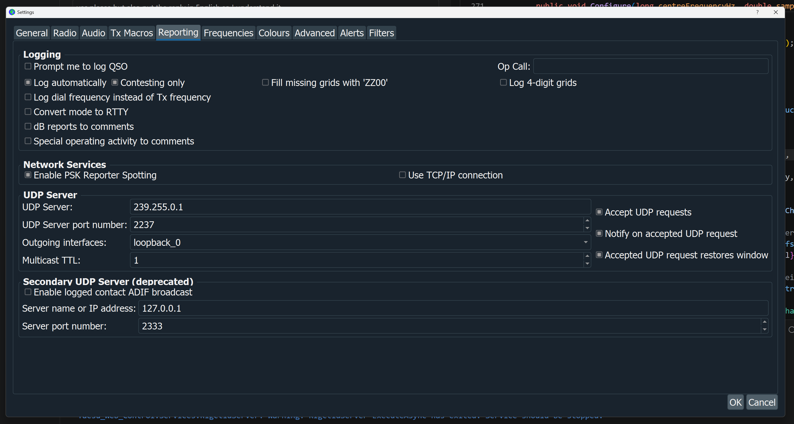

These settings are saved in the WebApp profile and used every time WSJT-X is launched from the app button.

> **Important:** If you already use WSJT-X with a direct serial connection to the radio, the `--rig-name=WebApp` keeps those settings separate. Your normal WSJT-X profile is not affected.

**If you do not want a separate profile**, remove `--rig-name=WebApp` from the WSJT-X command line in Application Setup. WSJT-X will then use its default configuration — make sure that configuration points to rigctld on port 4532.

---

### 9.2 JTAlert

JTAlert monitors WSJT-X activity and displays alerts for callsigns of interest. It can also send QSO data to Log4OM via UDP multicast.

The JTAlert button in the top bar launches JTAlert and shows green when it is running.

**Configuring JTAlert to log to Log4OM:**

In JTAlert, go to **Settings → Logging → Log4OM V2** and set:

- **Enable Log4OM V2 Logging:** ticked
- **Send WSJT-X DX Call to Log4OM:** ticked
- **IP Address:** `127.0.0.1`
- **ADif_MESSAGE Port:** `2236`
- **Control Port:** `2241`
- **Log Type:** *Use SQLite File Log* (or whichever matches your Log4OM database)

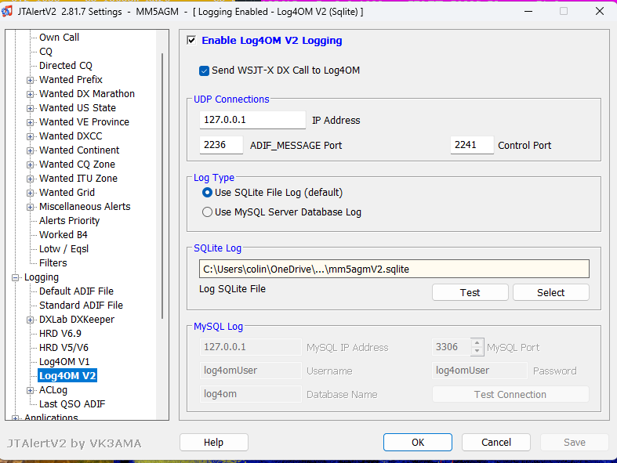

---

### 9.3 Log4OM

Log4OM can receive QSO data from WSJT-X and JTAlert via UDP multicast, log QSOs with the correct frequency automatically, and (with one current limitation) display the radio's live frequency in its own status bar.

**Do not use Omni-rig.** Yaesu Web Control owns the serial port. If Omni-rig is also configured for the same radio it will conflict with the app and one will fail.

**Known limitation — live frequency display in Log4OM:** Log4OM NextGen's live frequency readout in its main window does not currently update from YWC's rigctld bridge — Log4OM's **CAT Status: OFFLINE** indicator stays red even after the Hamlib settings below are configured. **This is cosmetic only**: when WSJT-X logs a QSO, the correct frequency is captured from the ADIF record and stored in Log4OM's log book without any user action. So the workflow "run WSJT-X, work stations, see them appear correctly in Log4OM's log" works end-to-end; you just don't see a live tuning readout inside Log4OM itself. Tracking on [Issue #18](https://github.com/mm5agm/Yaesu_Web_Control/issues/18); see that issue if you want to follow progress on enabling the live readout.

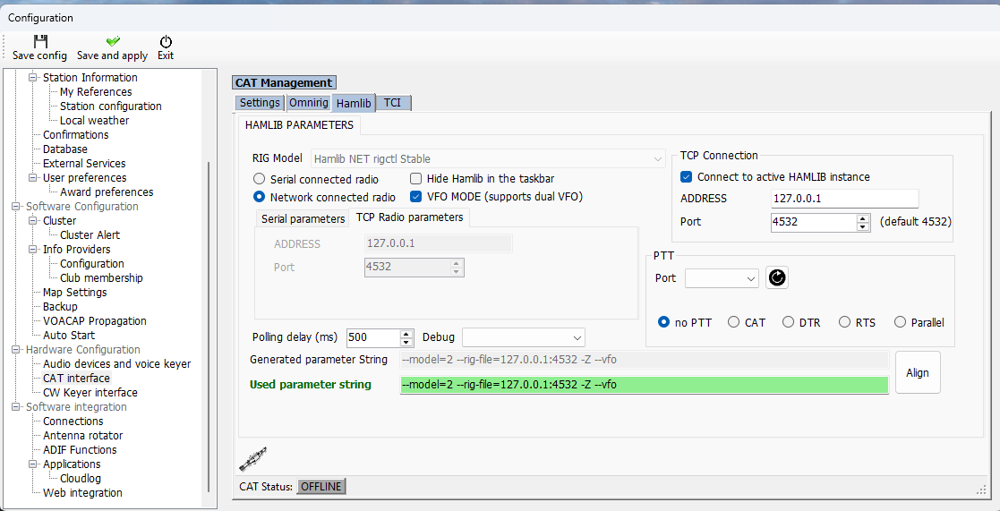

**Workaround — getting a live frequency in Log4OM (raised by Bill, W1WRH; confirmed and documented by Jacek, SP3L):**

If you specifically want Log4OM's own live frequency readout — for example when you're logging SSB by hand rather than through WSJT-X — there is a setup that gives *every* program, Log4OM included, a live, synchronised frequency. It sidesteps the rigctld path above entirely and instead uses **VSPE** (Virtual Serial Port Emulator) to split the radio's real COM port into two virtual ports: one for YWC and one for OmniRig. Neither application touches the physical port directly — the splitter feeds both.

The step-by-step below was contributed by Jacek (SP3L) and confirmed working on an FTdx10.

**1. Find your radio's Enhanced COM port.** Open Windows **Device Manager** and note the port numbers your radio is using. You want the **Enhanced** COM port — COM7 in this example.

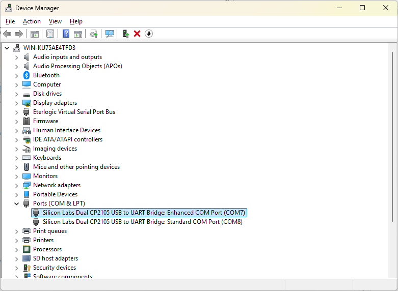

**2. Open VSPE.** If you haven't purchased the full licence, you'll see this window — click **[Continue (with limitations)]**.

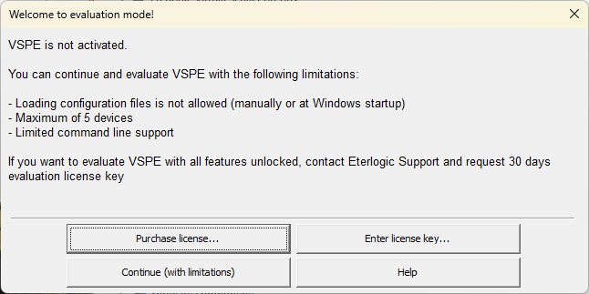

You'll then see the main VSPE window.

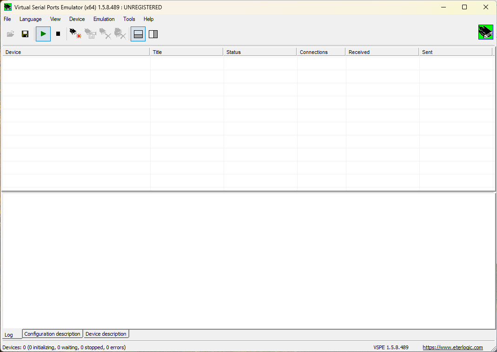

**3. Create a new device.** Click the fifth icon, **[Create new device…]** (a plug with a red asterisk). In the New Device window, select **Virtual Splitter** from the drop-down and give it any title you like.

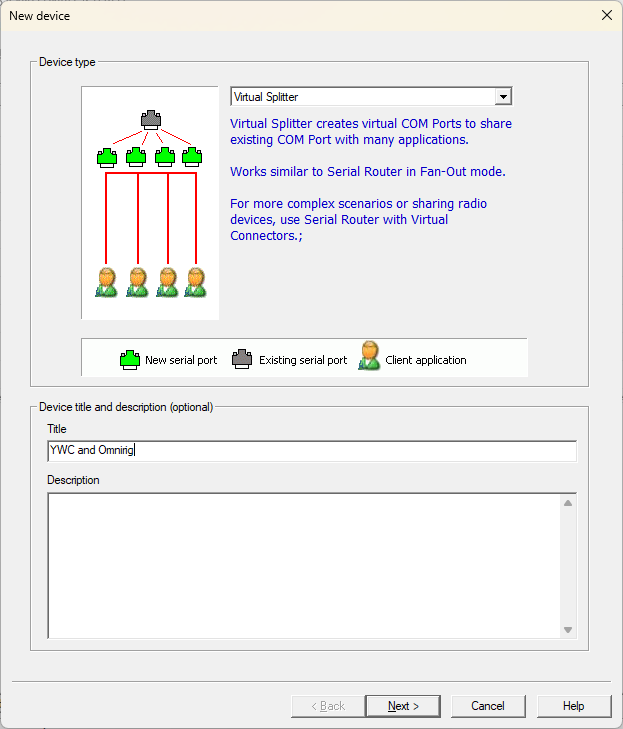

**4. Open the splitter settings.** Click **[Next]** to reach the Virtual Splitter — Device Settings window.

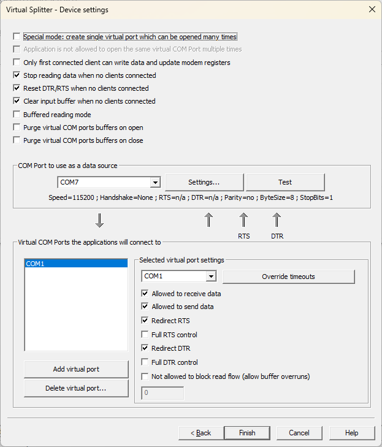

**5. Point the splitter at your radio's Enhanced COM port.** Select the COM port equal to your radio's Enhanced COM port (COM7 here) and check that the speed shown below it is correct. Adjust it with the **[Settings…]** button if needed.

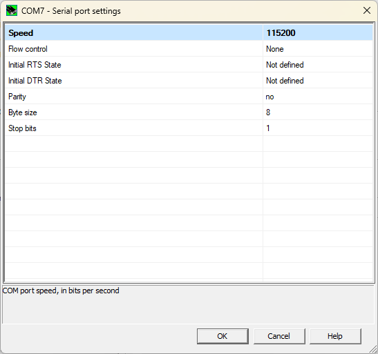

**6. Set the correct speed.** The default for the FTdx10 is **38400** — click the speed value (which may show 115200) and pick **[38400]** from the drop-down. Match this to your own radio's CAT baud rate. Press **[OK]**.

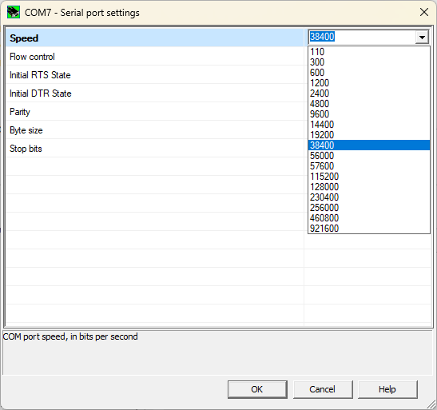

Optionally press **[Test]** — you should see a success pop-up. Press **[OK]** to return.

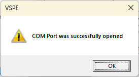

**7. Add at least two virtual ports.** Back in the Device Settings window, pick a port number from the drop-down for VSPE to create and click **[Add virtual port]**. Add **at least two** — in this example virtual ports 1 and 2.

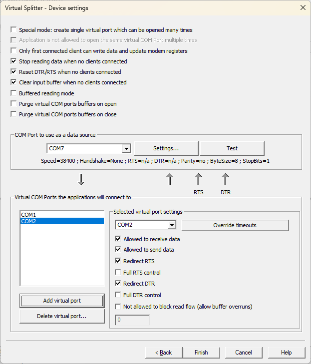

**8. Finish.** Click **[Finish]** to return to the main window. Both virtual ports are now active.

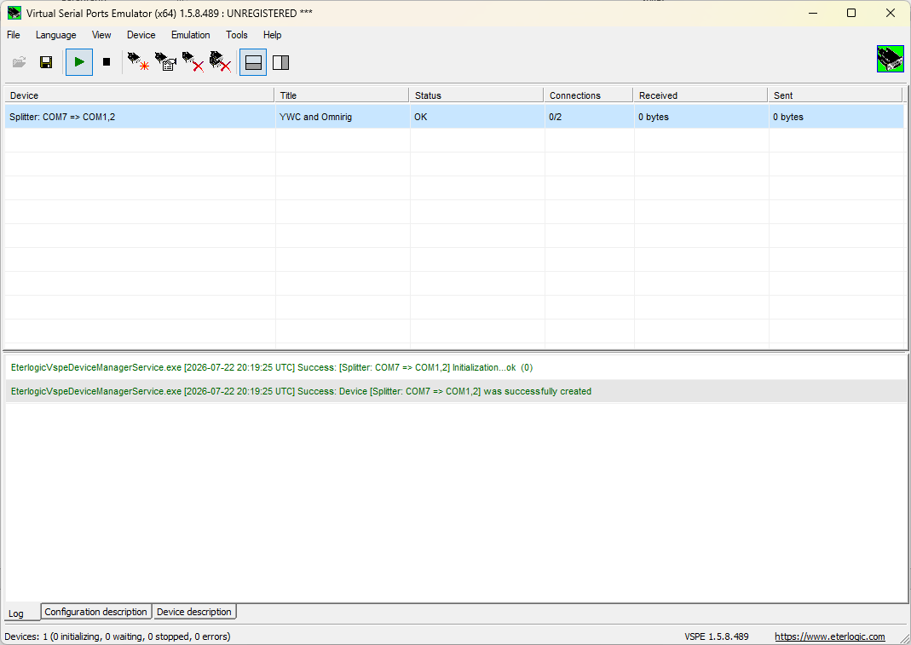

You can confirm they exist in Device Manager.

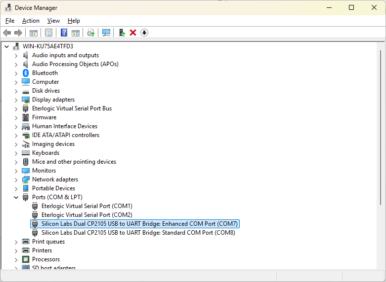

**9. Point your applications at the virtual ports.** Set **YWC to use one** of the virtual ports and configure **OmniRig (for Log4OM) to use the other**. **Do not use the original Enhanced COM port in any application.** With that in place, a frequency change in any program is reflected in all of them, and Log4OM shows a live frequency.

> **VSPE must be running before you start YWC and OmniRig.**

A few honest caveats:

- This is a **user-contributed setup, not one I formally test against** — see §15.6 for why virtual-port sharers (VSPE, OmniRig) aren't officially supported. It's confirmed working on an FTdx10; results on other hardware may vary.
- It runs contrary to the "do not use OmniRig" note above. That note holds when OmniRig and YWC each try to open the *physical* port and fight over it; here the VSPE **splitter** is what makes sharing possible, because each application gets its own dedicated virtual port and neither touches the physical one.
- Watch the **baud rate** — VSPE doesn't always forward port settings through to the physical port, so make sure every app in the chain (and the radio) agree on the same rate (see §15.6).

To make this concrete, here is the full logging chain end-to-end. At the end of a QSO, WSJT-X pops up its **Log QSO** confirmation dialog with all the QSO details (callsign, mode, band, grid, reports, start/end times) — clicking OK is the only manual step the operator takes:

Once confirmed, the QSO immediately appears **in progress** in Log4OM — note the red OFFLINE CAT indicator top-left, yet the QSO panel is fully populated from the ADIF stream:

And here's the **same QSO after it's logged**, appearing at the top of the Recent QSOs list with the correct frequency, band and mode populated — no manual entry, despite CAT OFFLINE:

Open the logged QSO for editing and **every field is captured** — callsign, name, band, mode, exact frequency (18101.222 kHz here), grid square, country, ITU/CQ zones, DXCC entity, QSO start/end times and signal reports. Nothing has to be typed by hand:

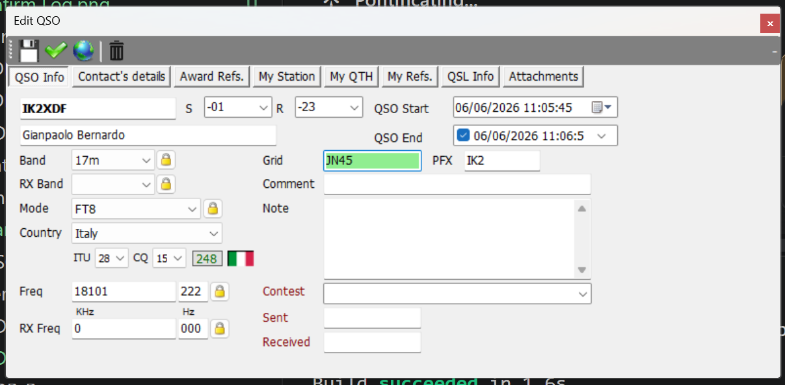

#### Step 1 — UDP inbound connections

Go to **Software Integration → Connections** and select the **UDP** tab. Add two UDP INBOUND connections. When both are configured the list should look like this:

**For WSJT-X** (receives QSO data directly from WSJT-X):
- Connection name: `WSJT-X`
- Port: `2237`
- Service type: **JT_MESSAGE**
- Multicast: **ticked**
- Multicast source IP: `239.255.0.1`
- Parameters: SAVE_NEW_QSO, USE_EXTERNAL_DATA, UPLOAD_QSO, UPDATE_CQ_ITUZONE

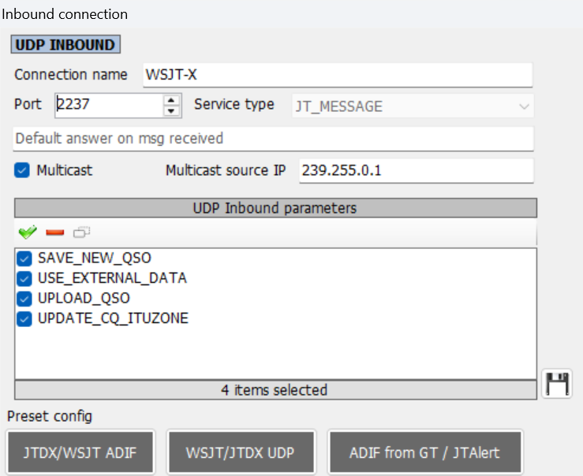

**For JTAlert** (receives QSO data from JTAlert):
- Connection name: `JTALERT`
- Port: `2236`
- Service type: **JT_MESSAGE**
- Multicast: **ticked**
- Multicast source IP: `239.255.0.1`
- Parameters: SAVE_NEW_QSO, USE_EXTERNAL_DATA, UPLOAD_QSO, UPDATE_CQ_ITUZONE

#### Step 2 — Remote control

Still in the Connections screen, select the **Remote Control** tab and set:

- **Remote control port:** `2241`
- **Enable remote control:** ticked
- **Send to specific IP address/port:** `127.0.0.1`

This allows JTAlert to exchange control messages with Log4OM bidirectionally.

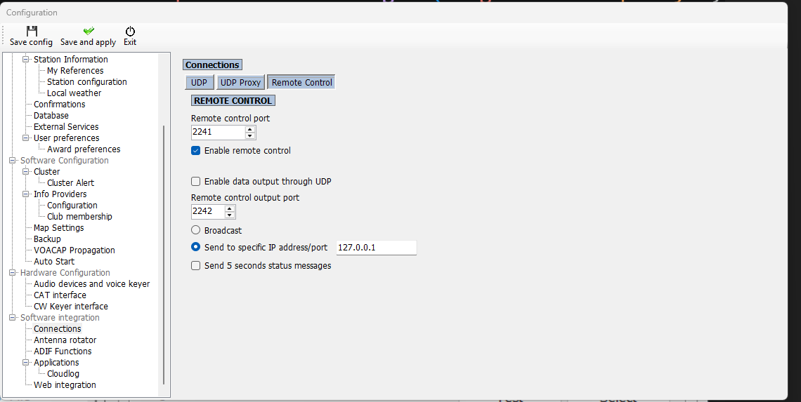

#### Step 3 — CAT interface (Hamlib)

Configure Log4OM's CAT interface to point at YWC's rigctld bridge. This is the configuration that *should* show the live radio frequency in Log4OM's status bar — see the "Known limitation" callout above for the current state.

Go to **Hardware Configuration → CAT interface → Settings**:

- CAT Engine: **Hamlib**

Then switch to the **Hamlib** tab inside CAT Management and set:

- **RIG Model:** *Hamlib NET rigctl Stable*
- **Network connected radio:** ticked
- **VFO MODE (supports dual VFO):** ticked
- **Connect to active HAMLIB instance:** ticked
- **ADDRESS:** `127.0.0.1`
- **Port:** `4532`

(See `Log4OM_Hamlib.png` above for what this panel looks like.)

#### Step 4 — ADIF Output (so QSOs reach Log4OM)

The WSJT-X → Log4OM logging path uses the ADIF auto-export file. Go to **User Configuration → ADIF Functions → ADIF Output** and set:

- **Enable ADIF output:** ticked
- **ADIF file:** the path WSJT-X / GridTracker write to (default `Documents\LOG4OM2\auto_export.adi`)

Log4OM watches this file and imports new QSOs as they're appended.

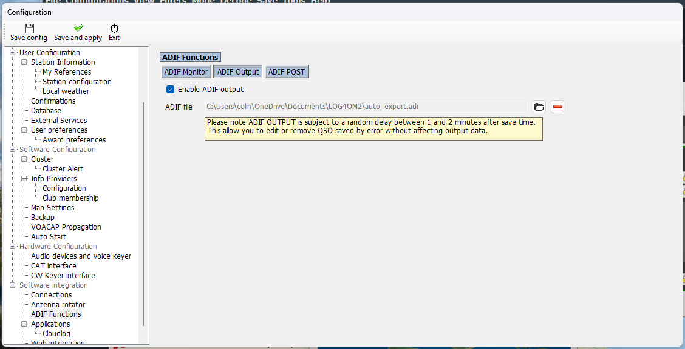

> **Tip — the 1–2 minute write delay is normal.** Log4OM intentionally delays writing the ADIF output so you can edit or remove a misclicked QSO before it leaves Log4OM. This is documented in the yellow notice in the screenshot. Don't panic if a QSO you just logged isn't in the ADIF file *immediately* — give it up to two minutes.

#### Startup order

Always start applications in this order:

1. **Yaesu Web Control** (must be running before anything connects to rigctld)
2. **WSJT-X**
3. **JTAlert**
4. **Log4OM**
5. **GridTracker** (if used)

---

### 9.4 GridTracker

GridTracker is a separate desktop app that draws a live world map of WSJT-X grid contacts and worked-stations data. It is **not** a web app — it runs as its own window — but YWC will launch it for you and show whether it's currently running.

**Setup:**

1. Install GridTracker 2 from [gridtracker.org](https://gridtracker.org/) (the v2 Electron rewrite has a single Windows installer — the older v1 with MariaDB is no longer required).
2. In YWC, open **Application Setup**.
3. In the **Application 4** card, set the **Command Line** to your installed path (default: `C:\Program Files\GridTracker2\GridTracker2.exe`).
4. Tick **Show** and click **Save**.
5. A **GridTracker** button appears in the top bar. Green = running, red = not running. Click it to launch.

**How it works with WSJT-X:** GridTracker reads WSJT-X's UDP feed independently — YWC doesn't forward anything to it. Make sure WSJT-X is set to **multicast** UDP (default `239.255.0.1:2237`) so YWC, JTAlert, and GridTracker can all subscribe to the same feed at once. If WSJT-X is set to unicast (`127.0.0.1:2237`), only one of the three apps will receive packets — this is a WSJT-X limitation, not a YWC one.

**No CAT integration is needed.** GridTracker is a passive listener; it doesn't talk to the radio at all. YWC still controls the radio, WSJT-X still drives QSOs, and GridTracker just paints the picture.

**GridTracker General settings** — the **Receive UDP Messages** block on the top-left of the General tab should be set to multicast `239.255.0.1` on port `2237`, matching WSJT-X.

**GridTracker Logging settings** — the **Logging** tab shows where GridTracker forwards finished QSOs. The default *App Log(s)* feed (`wsjtx_log.adi`) is enough for the WSJT-X → Log4OM ADIF path documented in §9.3 — no additional logger needs to be configured here unless you also want GridTracker to push QSOs to QRZ, ClubLog, HRDLOG, etc.

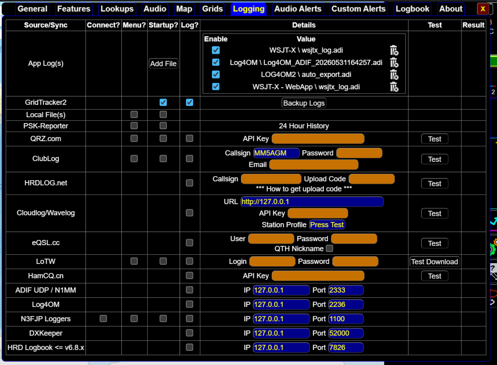

---
