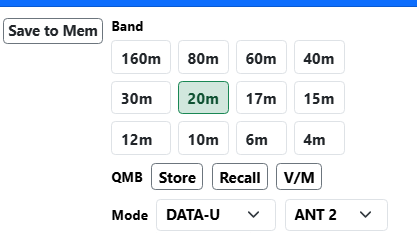
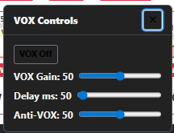
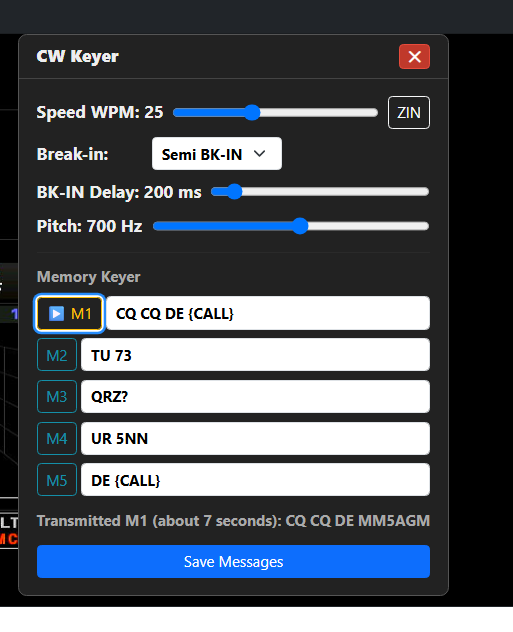
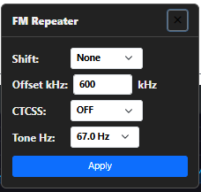
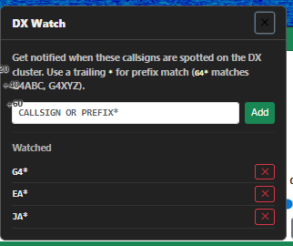
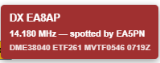
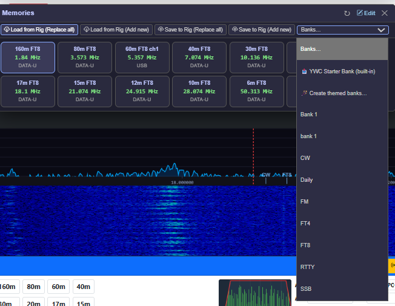
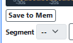
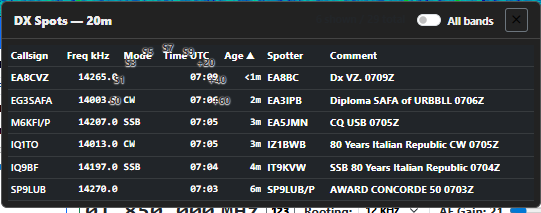

## 5. Main Control Panel

### 5.1 Top Bar

The top bar contains navigation links, external application buttons, and the radio power button. The app name and current version number (e.g., **Yaesu Web Control v2.4.3**) are shown in the top-left corner.

**Update notification** — on startup the app silently checks the GitHub releases page for a newer version. If one is available, a small banner appears in the bottom-right corner with a **Download** link that opens the releases page in your browser, and a **Dismiss** button. No banner appears if you are already on the latest version or if the internet is not available.

**External app buttons** (WSJT-X, JTAlert, Log4OM, GridTracker, Fldigi) appear if they are enabled in Application Setup. The colour of each button indicates status:

| Colour | Meaning |
|--------|---------|
| Green | Application is running and connected |
| Yellow | Application is running but waiting for UDP data (WSJT-X only) |
| Red | Application is not running |

Click a button to launch the application. If it is already running, it is brought to the front.

The **WSJT-X** button also shows a red **TX** badge when WSJT-X is currently transmitting.

**POWER button** (top right) turns the radio on or off. The button is green when the radio is on and red when it is off.

**UTC clock** — a yellow `HH:MM:SS Z` clock sits just left of the Buy Me a Coffee button. Amateur radio operates on UTC for logging, contests and beacon schedules, so the time is always visible regardless of your PC's local time zone.

> **Where the time comes from.** The clock reads your **PC's system clock**, converted to UTC. There is no separate network time source — YWC trusts whatever Windows says the time is. Hovering the clock gives a one-line reminder; **clicking it** opens a popover with a full explanation and step-by-step instructions for verifying Windows time-sync.
>
> **Why this matters beyond just the clock display.** The same PC time is also used for:
>
> - The **Age** and **Time UTC** columns in the DX Spots list (§5.17)
> - The **15-minute spot age-out** (§5.4)
> - The **TX timeout warning** countdown (§5.10)
> - QSO timestamps in any external logger you're using (Log4OM, JTAlert)
>
> If the PC clock is wrong, all of those misbehave.
>
> **For users with constant internet**, Windows syncs against `time.windows.com` typically once a week or whenever the connection comes back. Your clock stays within a second of UTC without effort.
>
> **For users who operate offline a lot**, a typical PC clock drifts seconds-to-minutes per week. Fine for SSB casual logging, problematic for FT8 and contests. Re-sync whenever you reconnect to the internet (Windows Settings → Time & Language → Date & time → Sync now).

**Status line** — each VFO panel has its own compact one-line summary directly below the IF Width row, banner-coloured to match the panel (blue for VFO A, green for VFO B):

```
VFO A:  40m / USB / 7.100.000 / 100W
VFO B:  17m / USB / 18.110.000
```

The line shows the current band, mode and frequency, with transmit power appended on the VFO A line. When split mode is active the VFO A line ends with **SPLIT  RX** and the VFO B line ends with **TX**, making the transmit-vs-receive role obvious at a glance. The line updates live whenever any of these values change.

---

### 5.2 Meters

A scrollable row of meters is displayed above the VFO panels. The leftmost slots are the S-meter(s) (and their optional history strips — see below). To the right of the S-meter(s) come the transmit-related meters, which depend on your radio model:

**FTdx101MP, FTdx101D** — two S-meters (VFO A / MAIN and VFO B / SUB, each an independent physical receiver chain) plus seven TX meters:

| Meter | What it shows |
|-------|--------------|
| S-meter A | Receive signal strength on VFO A / MAIN — always live |
| S-meter B | Receive signal strength on VFO B / SUB — always live |
| SWR | Standing wave ratio on the antenna — only active during transmit |
| Power | Output power in watts — only active during transmit |
| Compression | Speech compression in dB — only active during transmit |
| ALC | Automatic Level Control voltage — only active during transmit |
| Temp | PA temperature in °C |
| IDD | PA drain current in amps |
| VDD | PA supply voltage in volts |

> **Why the radio's own front-panel meter is stuck on COMP/SWR while YWC is running.** On the FTdx101MP and FTdx101D, the radio's documented CAT command for reading SWR directly returns stale or wrong values, so YWC works around it by repeatedly telling the radio to display Compression and SWR on its own meter and reading both at once — about twice a second, for as long as YWC is connected. This is what YWC needs to show you an accurate SWR reading, but it also means you can't pick a different meter pair from the radio's own front panel while YWC is running; whatever you select gets overridden within half a second. This is expected behaviour, not a fault — there's no radio-side setting that avoids it.

**FTDX3000** — single S-meter (VFO A) plus the same seven TX meters — FTDX3000 is a single-receiver radio, so there is no VFO B S-meter.

**FTdx10, FT-710** — single S-meter (VFO A) plus four TX meters (SWR, Power, Compression, ALC). The Temp, IDD, and VDD meters are not shown because those radios have a different power amplifier design that runs on 13.8 V; the high-voltage PA meters do not apply.

All meters update in real time — about five times a second at the default 200 ms **Meter Poll Interval** (Settings → Radio Connection). Not everything is read on every cycle: the S-meter(s) and transmit state are, while PA temperature, IDD, VDD and the antenna selection are read every two seconds, because they change slowly and reading them costs bus time the meters need. Meters that only apply to transmit automatically read zero when the radio is receiving. The S-meter(s) are always live.

> **Reading the SWR meter above 3:1.** The SWR dial is marked 1.0 to 3.0, so the
> needle stops climbing once the SWR passes 3:1 — a 3:1 match and a 10:1 match
> park it in exactly the same place. When that happens the readout under the dial
> turns amber, shows the true ratio, and adds a **▲** marker: for example
> **SWR 5.4:1 ▲** means the needle is against the stop and the real figure is
> 5.4:1. Trust the number, not the needle position, whenever the marker is showing.
> A screen reader announces the same reading as "5.4:1 - off scale".

The meter scales are calibrated to show meaningful units rather than raw ADC values. See Section 10 (Meter Calibration) if you want to adjust the calibration for your specific radio. Both S-meter gauges share the same calibration table — there's no separate MAIN/SUB calibration.

**S-meter history strip.** A small 30-second strip-chart can be shown to the left of each S-meter gauge in the top meter row (one per VFO on dual-receiver radios). Click the **S-hist** button in the top toolbar to toggle both on or off together (off by default; the choice is remembered between sessions). Each strip shows three things at once:

- **Green line** — the actual S-meter trace over the last 30 seconds. Lets you see QSB fading patterns and brief interference spikes that the analog needle barely registered.
- **Yellow dashed line** — the peak hold for the window, useful for noting a station's actual peak signal during an over without staring at the needle.
- **Red dashed line** — the noise-floor reference (the 10th-percentile reading in the window). When the line jumps up suddenly, a noise source has switched on — often a useful diagnostic when QRM appears.

The vertical axis is calibrated in S-units (S1, S5, S9, S9+30, S9+60) using the same calibration table as the analog gauge. The horizontal axis runs from **-30s** on the left to **now** on the right. The strip is purely a visual aid — none of the information is sent to the radio.

---

### 5.3 Power, Mic Gain and Speech Processor

**Power slider** — Sets the transmit power from 5 W to 200 W (FTdx101MP, FTDX5000MP and FTDX5000D) or 5 W to 100 W (FTdx101D, FTDX3000, FTdx10, FT-710 and FT-991A). Drag the slider to set the desired power level. The current value is shown to the right of the slider. The Power meter beside it is scaled to the same figure, so full output always reads at the top of the dial whatever the radio.

The radio is the source of truth for RF Power. On connect, YWC reads the radio's current Power setting via the `PC;` CAT command and reflects whatever the radio reports — so if you change Power on the radio's front panel while YWC is closed, the new value appears in YWC when you reopen it. (Earlier versions overwrote the radio's setting with YWC's last-saved value on connect; that was incorrect and is fixed in v2.3.7.)

The slider snaps to 5 W steps for ease of dragging, but the numerical label shows the radio's **exact** value. If the radio is set to an odd value like 73 W or 91 W via the front-panel knob, the label reads `73 W` or `91 W` even though the slider visually sits at the nearest 5 W mark. Moving the slider yourself sends the chosen 5 W step to the radio, overwriting the odd value.

**MIC Gain / Data Out Gain slider** — Sets the microphone gain (0–100). When the radio is in a data mode (DATA-U, DATA-L, PSK, RTTY, or DATA-FM), the label changes to **Data Out Gain** automatically.

**PROC button** — Toggles the speech processor on and off. The button is amber when the processor is active and grey when off. The speech processor increases the average power of your transmitted audio, which can improve readability at the other end — particularly useful for SSB DX and pile-ups.

**PROC Level slider** — Sets the speech processor compression level (0–100). A typical starting point is around 50. Higher values increase average power further but can make the audio sound over-processed and harder to copy. Monitor the compression meter while speaking and aim for 6–10 dB of compression. Both the PROC on/off state and the level are saved and restored when the app restarts.

---

### 5.4 Spectrum Display

The spectrum display is only visible if an SDR device has been configured in Settings (**Windows host only** — see §6.3). It shows a real-time spectrum and scrolling waterfall of the band around the current VFO A frequency.

This panel is drawn by YWC from your SDR. It is not the radio's own scope, and nothing here changes what the radio is displaying. To drive the radio's screen instead — its span, waterfall or 3DSS, reference level — see §5.20, which needs no SDR at all.

**Span buttons** — Click **250k**, **500k**, **1M**, or **2M** to change the visible bandwidth. The display recentres on VFO A.

**Click to tune** — Click anywhere on the spectrum **or the waterfall** to tune VFO A to that frequency. A click on a signal trail in the waterfall QSYs to the frequency of that column, which is the natural way to chase an interesting signal you can see slowly drifting down the screen. **The mode also changes automatically** to match the segment of the band you clicked into — CW below the digital sub-band, DATA-U around the FT8/FT4/RTTY watering holes, USB/LSB in the phone segment, FM at the top of 10m and on 2m/4m. If you click somewhere outside the recognised amateur bands the mode is left as-is.

**Mouse wheel to tune** — Scroll the mouse wheel over the spectrum to tune VFO A up or down in 1 kHz steps.

**Frequency crosshair** — Move the mouse over the spectrum to see the exact RF frequency at the cursor position displayed above the waterfall.

**Resize spectrum vs waterfall** — Hover the horizontal boundary between the spectrum trace (top) and the waterfall (bottom); the cursor becomes a vertical-resize arrow. Drag up to give the spectrum more vertical room — useful when you're hunting weak signals close to the noise floor. Drag down to give the waterfall more history. The ratio is remembered per VFO across browser reloads, so the next time you open YWC the panel is back the way you left it. Two short grey grip-bars at the centre of the boundary mark the handle; they turn cyan while you're dragging.

**Automatic noise floor** — you no longer set a floor level by hand. YWC tracks your band noise continuously and pins it near the bottom of the panel automatically, so the trace stays framed the same way whether the band is quiet or busy and whichever SDR you use. As conditions change the floor re-tracks on its own; there is no floor slider to chase.

**Range slider** — Sets the vertical scale of the spectrum trace as **dB of headroom above the auto-tracked noise floor**, from 5 dB up to 160 dB (default 60). Drag it **left** for a smaller range to make peaks taller — a zoom into weak signals sitting just above the noise. Drag it **right** for a larger range to flatten the trace and keep strong signals from clipping off the top. Because the floor is pinned automatically, the Range slider only decides how much of the scale sits above it. Set independently per VFO and remembered across browser reloads.

**Bright slider** — Brightens the **waterfall**, lifting weak signals up its colour scale so faint trails stand out. It does not touch the spectrum trace above — the trace auto-ranges (see Range slider), so Bright works purely on waterfall brightness. At its **Off** end the waterfall sits at a genuinely dark baseline, with the colours keyed to the auto-tracked noise floor so only real signals show colour; slide it up to bring the weakest trails out as far as you want. (This replaced the old **Gain** slider — once the trace scaled itself automatically, Gain only ever changed waterfall brightness, so it became a proper brightness control.) Set independently per VFO and remembered across browser reloads.

**Speed slider** — Controls how fast the waterfall scrolls, from **Full** speed down to **1/128**. Drag it left to slow the waterfall down if signal trails are scrolling past faster than you can read them; the spectrum trace above it keeps updating live regardless of this setting. Set independently per VFO and remembered across browser reloads.

**Smooth slider** — Averages neighbouring FFT bins together to flatten the noise floor's bin-to-bin grass, from **Off** up to 8 bins either side (default 2). Drag it right for a calmer, smoother-looking floor; drag it left for peaks that keep their full height. **If you are working CW, set this to Off.** A CW signal is a single carrier occupying roughly one FFT bin, so averaging it against its neighbours costs it real amplitude — at the old default of 6 (a 13-bin window, about 3.2 kHz at a 250 kHz span) a CW station could be plainly visible in the waterfall and have no peak at all in the trace above it. SSB is wide enough not to suffer this. Set independently per VFO and remembered across browser reloads.

**DX cluster spots** — If you have configured a DX cluster server in Settings (see §6.6), incoming spots are overlaid as small yellow callsign labels along the top of the spectrum at each spot's frequency. Clicking on a spot (within a few pixels of its marker) tunes VFO A exactly to that frequency. Spots outside the current span are not drawn; spots older than the configured age (default 15 minutes) are removed automatically.

**How spots are filtered for display** — the spectrum panel shows any spot whose frequency falls inside the currently visible window (VFO A ± half the span). When you change band, VFO A moves and the spectrum recentres, so the visible spots change automatically to match the new band. There is no explicit band filter — just a "is this spot inside the visible window?" check. In practice this means you see only the current band, because amateur bands have large gaps between them. If you zoom out to a 2 MHz span you'd technically see a wider chunk, but adjacent bands rarely overlap that window.

The cluster feed itself is not band-filtered by YWC — spots arrive for every band the cluster carries. They are all kept client-side; only the ones inside the visible window get drawn. To reduce traffic at the source (for example, to receive only 20 m and 40 m spots), add a line like `set/filter band 20 or band 40` to **Settings → DX Cluster → Post-login commands**. That filter runs on the cluster server and cuts down on spots before they reach YWC.

On crowded bands (the lower end of 20m on a contest weekend, for example) labels are stacked across up to five rows to avoid overlap. If even five rows can't fit everything in a tight cluster of nearby frequencies, **the app drops the spots that don't fit rather than letting labels overlap and become illegible**. The dropped spots are still in the underlying spot list — they just aren't drawn. Zooming the spectrum to a narrower span (e.g. 250k or 500k) spreads spots out and reveals the ones that were hidden.

**Decluttering with the watch list** — if cluster traffic is making the spectrum unreadable, open the DX Watch popup (§5.14) and tick **Show only watched callsigns**. Every yellow (non-watched) spot disappears from the spectrum and the DX Spots list, leaving only the red watched-list matches. Toast / beep / voice alerts still fire as normal on watched spots; the toggle only changes what's drawn. Untick to bring all spots back. Setting is remembered per browser.

**Band-plan markers** — small cyan tick marks at the bottom of the spectrum show the standard activity frequencies for the currently visible band: CW, FT8, RTTY, SSB DX window etc. The exact frequencies come from your selected IARU region (§6.1 Band Plan). The markers update automatically as you change band or zoom the spectrum; only segments whose frequency falls inside the visible window are drawn. Where two markers would overlap (e.g. FT8 at 14.074 and RTTY at 14.080 — only 6 kHz apart), the labels stack vertically so both remain readable. They're a quick orientation aid — especially helpful when visiting an unfamiliar band — and they don't interact with anything; nothing happens if you click them.

**Band-edge guard rails** — dashed red vertical lines drawn at the lower and upper edges of every amateur band that falls inside the visible window. They make it immediately obvious when you've tuned outside the amateur allocation (e.g. clicking 14.396 MHz on the spectrum lands you above the 20m upper edge at 14.350 — the red line is right there, telling you why no DX cluster spots are appearing and why the mode hasn't auto-changed). The edges use the worldwide amateur envelopes (the broadest limits across all regions), so a Region 1 operator may see a guard rail slightly beyond their own legal limit on a few bands — never the other way round.

A status badge in the spectrum panel shows the current SDR state: **No SDR**, **Connecting…**, **Live**, or **Disconnected**.

A second small badge in the **top-right corner of the spectrum canvas** shows the DX cluster connection state — green for *connected*, amber for *connecting*, red for *disconnected*, grey for *off*. See Section 6.6 for cluster setup and troubleshooting.

---

### 5.5 VFO Panels

There are two VFO panels side by side:

- **VFO A** (blue border) — the main receiver, present on all supported radios.
- **VFO B** (green border) — on the FTdx101MP and FTdx101D this is a fully independent sub-receiver. On single-receiver radios (**FTdx10, FT-710, FTDX3000, FT-991A**) there is only one physical receiver chain inside the radio, so VFO B is a frequency / mode memory slot through which the single receiver is steered.

Both VFO panels stay full colour and fully editable on every supported radio — including single-receiver models (FTdx10, FT-710, FTDX3000, FT-991A). On those radios the toolbar **RX** / **TX** selectors show which VFO is receiving and transmitting; you can still set the other VFO's frequency, mode, and controls without swapping first. On **dual-receiver radios** (FTdx101MP / FTdx101D) an amber ring marks which band (MAIN / SUB) the main tuning knob currently controls.

**S-meter location — not in the VFO panels.** From v2.3.9 the S-meter(s) and their 30-second history strips live in the **top meter row** (just below the toolbar), not inside the VFO A / VFO B panels.

On **dual-receiver radios** (FTdx101MP / FTdx101D) there are **two** S-meter gauges side by side — VFO A / MAIN first, then VFO B / SUB — each with its own history strip, since MAIN and SUB are independent physical receiver chains with their own calibrated S-meter (`SM0;` and `SM1;` respectively). On **single-receiver radios** (FTdx10 / FT-710 / FTDX3000 / FT-991A) there is only **one** S-meter gauge, since there's only one physical receiver.

**Antenna selector visibility:** the per-VFO antenna dropdown is hidden on radios with a single antenna jack (**FTdx10, FT-991A**) since there is nothing to select between. Radios with multiple antenna jacks (FTdx101MP, FTdx101D, FT-710, FTDX3000) keep the selector.

Both panels have identical controls — changing a control on either panel writes to the radio.

**VFO-B toggle** — the **VFO-B** button in the toolbar shows or hides the VFO B panel. The last state is remembered across sessions.

**A↔B Swap** — the **A↔B** button in the toolbar swaps the frequencies and modes between VFO A and VFO B in one click. Available on all supported radios.

**B→A Copy** — the **B→A** button copies VFO B's frequency and mode into VFO A. **VFO B is left unchanged.** This is the right control to use when you want to transmit on VFO B's settings without enabling split — after the copy, VFO A holds the same frequency and mode as VFO B and the radio transmits normally on VFO A. Different from swap (which exchanges both VFOs), and different from split (which leaves the VFOs alone but uses VFO B as the TX frequency only while in RX/TX mode).

**A→B Copy** — the **A→B** button is the mirror operation: copies VFO A's frequency and mode into VFO B with VFO A left unchanged. Useful for seeding VFO B from your current operating frequency before nudging one of the two (e.g. to set up split manually).

**Split** — enables split operation: VFO A is the receive frequency, VFO B is the transmit frequency. The button turns red and shows **Split ON** when active. Pressing it again turns split off. **No frequencies are changed** — whatever VFO B is currently set to becomes the TX frequency. Use this button whenever you want to transmit on a different frequency from your receive frequency, including cross-band split (e.g. listening on 20m, transmitting on 6m) or any arbitrary TX offset.

**+5k (Quick Split)** — a DX pile-up convenience button. It always sets VFO B to **VFO A + 5 kHz** and enables split in one click. Use this when a DX station says "listening 5 up". It is not a general-purpose split button — it will overwrite whatever VFO B was set to. For any split scenario other than +5 kHz, set VFO B to the desired TX frequency first and then press **Split**.

> **Example — cross-band split (6m TX, 20m RX):**
> 1. Tune VFO A to your 20m listening frequency
> 2. Tune VFO B to your 6m transmit frequency
> 3. Press **Split** — you are now receiving on 20m and transmitting on 6m
> 4. Do **not** press +5k, as that would move VFO B back to 20m + 5 kHz

**RX / TX VFO selectors (single-receiver radios only).** On the single-receiver radios (**FTdx10, FT-710, FTDX3000**) a pair of small selectors — **RX [A│B]** and **TX [A│B]** — sits next to the Split and +5k buttons. They let you choose the receive VFO and the transmit VFO **independently**, instead of being limited to the fixed "VFO A receives, VFO B transmits" that the Split button gives. There is no separate split toggle here — **split is derived automatically: you are in split whenever the RX and TX VFOs are different.** That makes all four combinations available directly:

| RX | TX | Result |
|----|----|--------|
| A | A | Normal — receive and transmit on VFO A |
| A | B | Standard split (the same as the Split button) |
| B | A | Reverse split — receive on B, transmit on A |
| B | B | Normal — receive and transmit on VFO B |

The currently selected **RX** button is filled **green** (receiving); the selected **TX** button is filled **red** (transmitting) — the same colour convention as the radio's front panel. Unselected buttons stay outlined. The selectors follow the radio live, so if you change the receive or transmit VFO at the rig the buttons update to match.

These selectors are **not shown on the dual-receiver FtdX101MP / FtdX101D**, where VFO A and VFO B are two independent physical receivers. On those radios you choose the operating (receive) band by clicking a VFO panel's header, and the transmit VFO follows the **Split** button — see §5.5 above and §5.10 Transmit Controls.

---

### 5.6 Frequency Display and Tuning

The frequency display shows the current VFO frequency in MHz to 1 Hz resolution (e.g., **14.074.000**).

**Digit tuning with the mouse wheel:**

1. Click on any digit in the frequency display. The selected digit is highlighted.
2. Roll the mouse wheel up to increase that digit, or down to decrease it.
3. Carry-over is automatic — for example, scrolling 9 → 0 on the kHz digit also increments the 10 kHz digit.
4. The radio tunes **live as you scroll** — the frequency is sent several times a second so the rig tracks the display in real time, and the final position is always sent when you stop.
5. Click anywhere outside the frequency display to deselect.

**▲ / ▼ step buttons** — small up/down buttons appear below the frequency display (always on a tablet or phone, and on any device when *Show frequency arrow buttons* is enabled in Settings for accessibility). Tap a digit to select it, then press **▲** / **▼** to step it. **Press and hold to repeat**, and the radio tunes live as it steps — it now tracks each step in real time rather than only jumping to the final value when you release.

---

**On-screen frequency keyboard:**

A numeric entry button (**⑁**) appears to the right of the **MHz** label on each VFO panel. Click or tap it to open a floating on-screen number pad for typing in a frequency directly.

The keyboard pre-fills with the current VFO frequency when it opens. The display shows the frequency as **XX.YYYYYY MHz** with the current digit position highlighted in blue.

You can enter digits by clicking the on-screen buttons **or by typing on your physical keyboard** — whichever is more convenient.

| Key | Action |
|-----|--------|
| **0–9** | Enter a digit at the cursor position and advance the cursor one place to the right |
| **◀ / ▶** | Move the cursor left or right without changing any digit |
| **⌫** | Zero the digit at the cursor and move the cursor left |
| **CLR** | Reset all digits to zero |
| **↵ Enter** | Validate and send the frequency to the radio, then close the keyboard |
| **✕** (title bar) | Close the keyboard without changing the frequency |
| **Esc** | Close the keyboard without changing the frequency |

The same actions are available from the physical keyboard: digit keys type digits; **← →** move the cursor; **Backspace** zeros the current digit; **Delete** clears all digits; **Enter** sends the frequency; **Esc** closes the keyboard.

If you enter a frequency outside the radio's range (0.030–75.000 MHz) an error message appears and the frequency is not sent.

**Moving and resizing the keyboard:** Drag the title bar to move the keyboard anywhere on screen (touch drag is also supported on tablets). Drag the bottom-right corner to resize it. The position and size are saved automatically and restored the next time you open the keyboard.

All keys have accessible labels for screen readers.

---

### 5.7 Receiver Controls

Each VFO panel has a row of dropdowns for the main receiver settings. All are two-way — if you change a setting on the radio's front panel, the dropdown updates automatically.

**Mode** — Select the operating mode:
LSB, USB, CW-U, CW-L, FM, FM-N, AM, AM-N, RTTY-L, RTTY-U, DATA-L, DATA-U, DATA-FM, DATA-FM-N, PSK

**Antenna** — Select the antenna connector: ANT 1, ANT 2, ANT 3.

Your antenna choice is **remembered per band per VFO**. Set Ant 1 on 20 m and Ant 2 on 6 m once, and switching between those bands later automatically restores the right antenna without you having to click again. VFO A and VFO B have independent memories — useful on FTdx101MP/D where Main and Sub can listen on different antennas at the same time, and on single-receiver radios where you might want different defaults depending on whether you're using VFO B as a scratch slot.

Existing installs auto-populate empty slots on the next startup with whatever the radio currently has, so you don't need to manually click through every band to seed it.

**Roofing Filter** — Select the roofing filter bandwidth: 12 kHz, 3 kHz, 1.2 kHz, 600 Hz, 300 Hz

**Control column** (the two-column grid of dropdowns to the right):

| Control | Options |
|---------|---------|
| AGC | OFF, FAST, MID, SLOW, AUTO |
| IPO/AMP | IPO, AMP1, AMP2 |
| ATT | OFF, 6 dB, 12 dB, 18 dB |
| NR | OFF, NR1, NR2 |
| NB | OFF, ON |
| NB Level | 1–20 (noise blanker depth; only relevant when NB is ON) |
| Auto Notch | OFF, ON |
| Man Notch | OFF, ON |
| Notch Hz | Slider 10–3200 Hz (only relevant when Man Notch is ON) |
| RF Gain | Slider 0–255. Controls the RF preamplifier gain. At 255 (maximum) sensitivity is highest; reducing RF Gain is useful when a strong nearby signal is causing overload that AGC and IPO cannot handle. |
| Squelch | Slider 0–255. Only shown when the VFO is in FM or FM-N mode. 0 = squelch fully open (hear everything); higher values cut off weaker signals. |

All of these settings are read from the radio when the app connects.

**Filter Function Display** — A compact real-time display positioned alongside the band buttons, between the band button column and the receiver controls column. It shows the shape of the active DSP filter passband, matching the style of the filter scope on the FTdx101MP front panel.

- The **red-bordered trapezoid** represents the active **DSP filter passband** (the IF Width setting). The sloped sides reflect the filter roll-off characteristic at the passband edges.
- **Green animated bars** inside the trapezoid represent signals passing through the filter. No signals are shown outside the passband, making it immediately clear which audio frequencies are being received.
- A **"Roof Nk" label** in the top-right corner shows the currently selected roofing filter (e.g. "Roof 3k", "Roof 12k", "Roof 600"). This is useful because the DSP filter is the *active* limit when the roofing filter is wider than the DSP setting — in that case the trapezium looks identical for several roofing choices (12k and 3k both produce the same shape if the DSP filter is set to 3 kHz, since both roofing filters are at least as wide as 3 kHz). The label is the only way to see which roofing is actually in circuit when this happens.
- **Passband width** reflects the current IF Width setting, automatically constrained by the selected Roofing Filter if it is narrower than the DSP setting. If the roofing filter is wider, the DSP filter is what you see.
- **Passband position** shifts left or right as the IF Shift slider is adjusted — the display updates live while dragging the slider.
- A **white downward arrow** appears on the top edge of the passband when the Contour filter is active, indicating the contour centre frequency. It moves as the contour frequency slider is adjusted.
- The display updates automatically whenever any filter parameter changes, whether adjusted from the browser or from the radio's front panel.

---

### 5.8 IF Width, Audio Filter, IF Shift, and AF Gain

**IF Width** — Sets the DSP filter bandwidth.

The IF Width dropdown is **mode-aware**: the SH command code sent to the radio is the same in every mode, but the resulting bandwidth differs per mode. In SSB code 8 gives 1650 Hz; in CW the same code gives 400 Hz. The dropdown labels are rebuilt automatically when you change mode so they show the actual bandwidth the radio will use.

- **SSB modes** (LSB, USB, DATA-L, DATA-U) show the wide SSB widths — from 300 Hz up to around 3.2 kHz (4 kHz on FTdx10/FT-710).
- **CW, RTTY, and PSK modes** show the narrow widths — from 50 Hz up to 3 kHz or so.
- **AM and FM modes** hide the IF Width dropdown — the SH command does not apply in those modes (the radio uses fixed filters, or a separate narrow/wide mode toggle).

The first entry in the dropdown ("Default") is the radio's mode-dependent default, which varies by the selected roofing filter. The current width is read from the radio on connect; selecting a new value sends it immediately.

**Audio Filter button** — Opens the **Audio Filter** popout dialog for this VFO, where you can adjust the per-mode LCUT FREQ, LCUT SLOPE, HCUT FREQ and HCUT SLOPE. See [§5.18](#518-audio-filter-popout) for the full description. Replaces the IF Low Cut dropdown that was in this row in v2.3.9 and earlier — that control was sending a CAT command no current Yaesu HF radio actually supports, so it was a no-op. The new Audio Filter popout uses EX menu commands that the radio honours.

> **About the FTdx101 "4 kHz" firmware update** — Yaesu's 2023 firmware release notes mention *"Increased RX IF Band WIDTH up to 4000 Hz"* for SSB, CW, RTTY, PSK and DATA. This is **not** an extension of the IF Width dropdown's range. The FTdx101's IF DSP filter (SH command) still tops out at 3.2 kHz in SSB and 3.0 kHz in CW — the dropdown values in this app are correct and match the Yaesu CAT manual.
>
> What the firmware *did* extend is **HCUT** — the audio high-cut filter that shapes audio inside the IF passband. HCUT now goes up to 4000 Hz (was 3000 Hz). You can now adjust HCUT directly from YWC's **Audio Filter** popout (§5.18) — no need to dig through the radio's own touch-screen menu.

**IF Shift** — Shifts the passband centre ±1000 Hz in 20 Hz steps. Drag the slider or use the keyboard arrow keys. The current offset is shown next to the slider.

**Zero button** — Resets IF Shift to 0 Hz instantly.

IF Shift is persisted and restored on startup.

**AF Gain** — Sets the audio output level (0–255). Drag the slider and release to send the new value to the radio.

---

### 5.9 Band and Segment Selection

**Band buttons** — Click a band button (160m, 80m, 40m, etc.) to switch the VFO to that band. The radio tunes to the last-used frequency on that band. You can also navigate between band buttons with the keyboard: **Tab** moves focus into the band group, then the **left/right arrow keys** move between bands and activate the selected one immediately.

Available bands depend on your band plan setting:

| Band Plan | Bands |
|-----------|-------|
| IARU Region 1 (Europe, Africa, Middle East) | 160m, 80m, 60m, 40m, 30m, 20m, 17m, 15m, 12m, 10m, 6m, **4m** |
| IARU Region 2 (Americas) | 160m, 80m, 60m, 40m, 30m, 20m, 17m, 15m, 12m, 10m, 6m |
| IARU Region 3 (Asia-Pacific) | 160m, 80m, 60m, 40m, 30m, 20m, 17m, 15m, 12m, 10m, 6m |
| Japan (JARL) | 160m, 80m, 40m, 30m, 20m, 17m, 15m, 12m, 10m, 6m |

Region 1 is the only plan that includes the 4m (70 MHz) band. Japan has no 60m secondary allocation.

**Segment dropdown** — After selecting a band, a dropdown appears above the frequency display showing common operating segments for that band. Select a segment to jump directly to its standard frequency and set the appropriate mode:

| Segment | Example (20m) | Mode set |
|---------|--------------|---------|
| CW | 14.025 MHz | CW-U |
| FT8 | 14.074 MHz | DATA-U |
| SSB | 14.150 MHz | USB |
| RTTY | 14.080 MHz | RTTY-U |

The last segment you used on each band is remembered, so when you return to a band the dropdown re-selects your previous segment.

**Auto-sync to current frequency** — the Segment dropdown also follows your actual tuning. When you change frequency by any means (clicking the spectrum, turning the radio's front-panel knob, typing on the on-screen frequency keyboard), the dropdown updates to show the segment that contains your new frequency. If you tune into a gap between segments (e.g. 14.150 — between FT8 at 14.074 and SSB at 14.225 on 20m), the dropdown shows the closest segment at or below your frequency. This keeps the dropdown's display honest — it always tells you where you actually are, not where you last clicked.

**Per-band IF and mode memory** — When you switch away from a band the app saves the current IF Width, IF Shift, and Mode for that band. When you return to the band those settings are automatically restored on the radio. This means, for example, you can have a 500 Hz CW filter on 40m and a 2.4 kHz SSB filter on 20m and the app will switch between them as you change bands. Settings are saved per-VFO (VFO A and VFO B are independent) and persist between sessions.

**60m — Region 1 and Region 3:** Shows FT8 (5.357 MHz) and USB (5.362 MHz) segments, covering the WRC-15 secondary allocation (5351.5–5366.5 kHz). Access to 60m varies by country within these regions.

**60m — Region 2 (Americas):** Shows the five FCC-designated channels (5.331, 5.347, 5.357, 5.372, 5.404 MHz).

**60m — Japan:** No 60m secondary allocation; the 60m band does not appear for the Japan plan.

**Quick Memory Bank (Store / Recall / V/M)** — on their own row below the band buttons, labelled **QMB**, are three Quick Memory Bank buttons. The QMB is the radio's own scratch memory stack, separate from the labelled memory channels in the Memory Panel (§5.15) — think of it as a quick "put this frequency somewhere I can jump back to" without naming or saving anything.

- **Store** writes the current VFO frequency and mode to the next QMB slot (the same as pressing and holding the front-panel **[QMB]** key).
- **Recall** steps into the QMB and moves to a stored slot; the radio's display shows **QMB**. Pressing Recall again steps to the next stored slot, exactly like short-pressing the front-panel **[QMB]** key.
- **V/M** leaves QMB mode and returns to normal VFO tuning (the front-panel **[V/M]** key).



Recall is *modal* — once the radio is in QMB mode it stays there until you press **V/M**, so the V/M button is how you get back out without touching the rig. This matters most if you operate entirely from the browser. The radio sends no confirmation back over CAT for these three actions, so the radio's own display (showing **QMB** or not) is the thing to watch. The QMB buttons only appear for radio models that support it.

---

### 5.10 Transmit Controls

**TX button** — Appears on whichever VFO is currently the transmit VFO. Click to start transmitting; click again to return to receive. The button turns red and the label changes to **TX** while transmitting.

**Radio POWER button** — Turns the radio on or off. The button shows green (on) or red (off).

**Connect button** — Manually connects or disconnects the CAT serial link to the radio. The button reflects the actual serial port state when the page loads:

- **Connected** (green) — the serial port is open and the radio is communicating
- **Disconnected** (red) — the serial port is closed or the radio is not responding

The button updates automatically — if the radio is powered off or stops responding, it switches to red/Disconnected within a few seconds without any action needed.

Click the button to toggle the connection. While connecting, it briefly shows "Connecting…". On reconnect the app re-reads all radio settings so the controls reflect the current radio state. Useful if the radio was powered on after the app started, or after a USB cable was unplugged and re-plugged.

**ATU button** — Controls the radio's automatic antenna tuner. The button matches the Yaesu front-panel TUNE button's behaviour: short tap and long press do different things.

- **Short tap** toggles the ATU between **ATU On** (green) and **ATU Off** (grey). On = the tuner network is engaged in the signal path; Off = bypassed.
- **Long press (≥500 ms)** starts the radio's auto-tune cycle. The button turns red and shows **Tuning…** while the radio searches for a low-SWR match — typically 2-7 seconds. When tuning completes the button returns to **ATU On** automatically. Tap the red button during a running tune to stop it early. **Because the tune cycle didn't complete, the ATU is left bypassed (Off)** — the radio doesn't retain partial tuning data, so to find a match you'd need to long-press again for a fresh cycle.

**Tune button** — Next to the ATU button is a separate **Tune** button that starts the same auto-tune cycle with a single plain click. I added it because the long-press gesture on the ATU button isn't reachable by keyboard, screen reader, or voice — this button is. It has its own label and `aria-label` so a screen reader announces it, it takes keyboard focus in the normal tab order, and it's driven by the "tune antenna" voice command (see [§17.1](voice-control.md#171-what-you-can-say)). Click it and it turns red and reads **Stop** while a cycle runs; click the red **Stop** to cancel the cycle early, exactly as tapping the red ATU button does. Because the Yaesu `AC` command reports its tuning field as a fixed value, the radio never tells the app when a cycle has finished on its own — so the Stop state is timed on the app's side and clears itself shortly after a normal cycle would have completed.

On single-receiver radios (FTdx10, FT-710, FTDX3000) the radio firmware stores the ATU on/off state per VFO. Swapping the active VFO via the **A↔B** button updates YWC's ATU display to match whichever VFO is now active — even if the on/off settings differ between the two. The radio has only one physical tuner, but it remembers per-VFO which setting to apply.

Only applies to radios fitted with an internal or external ATU.

**Mon button** — Toggles the TX monitor (sidetone) on and off. The button is amber when the monitor is active and grey when off. Click to toggle.

**Mon level slider** — Sets the TX monitor volume (0–100). Controls how much of the transmitted audio you hear in the headphones during TX. Drag and release to apply. Both the on/off state and the level are read from the radio when the app connects.

**TX timeout warning** — If the radio has been transmitting continuously for longer than a configurable threshold (default **120 seconds**), a red banner appears across the top of the page reading *"TX has been ON for more than N seconds — check your microphone, keyer or VOX!"* and a tone beeps every three seconds until the warning is cleared. The warning triggers regardless of how TX was started (app button, hardware PTT, VOX, CAT) and automatically clears the moment the radio returns to receive.

Click **Dismiss** on the banner to silence it without stopping TX (useful for a long deliberate transmission). Click **Change timeout…** to set a different threshold (5–3600 seconds); the new value is remembered between sessions for that browser. The warning exists as a safety net against open mics, stuck PTTs and VOX false-triggers — it doesn't stop the transmission itself.

**VOX button** — Opens the **VOX Settings** panel. The button shows **VOX: On** (green) or **VOX: Off** (grey) based on the current VOX state.

**CW button** — Opens the **CW Keyer** panel. See Section 5.12.

**FM Rep button** — Opens the **FM Repeater** panel. See Section 5.13.

All three panels can be open at the same time and can be dragged anywhere on screen by their title bar.


**MIC Gain** — Drag the slider to set the microphone gain (0–100). The value is sent to the radio as you release.

**PROC** — Speech processor toggle. Shows **Proc On** (green) or **Proc Off** (grey).

**PROC Level** — Speech processor level slider (0–100).

---

### 5.11 VOX Panel

Click the **VOX** button to open the VOX pop-up panel.

| Control | Description |
|---------|-------------|
| VOX toggle | Enables or disables VOX. Shows **VOX: On** (green) or **VOX: Off** (grey) |
| Gain | VOX sensitivity (0–100). Higher values trigger TX more easily |
| Delay | VOX hang time (0–2500 ms). Time TX stays active after audio stops |
| Anti-VOX | Anti-VOX level (0–100). Suppresses the receiver audio from triggering VOX |



Close the panel by clicking the **×** button in its title bar. Drag the title bar to reposition the panel anywhere on screen. Its position is remembered between sessions.

---

### 5.12 CW Keyer Panel

Click the **CW** button to open the CW Keyer pop-up panel.

| Control | Description |
|---------|-------------|
| Speed | Keyer speed in WPM (4–60) |
| ZIN | CW Auto Zero In. One click sends the Yaesu `ZI` command; the radio nudges the VFO so the received CW signal sits exactly at your configured CW pitch (set via the Pitch control). Much faster than chasing the signal with the VFO knob. Targets whichever VFO is currently active on dual-receiver radios. **Also available as a per-VFO ZIN button in each VFO panel's header** — handy for Search-and-Pounce operating when you don't want to open the popout for every signal. The per-VFO buttons target their specific VFO regardless of which is currently focused. |
| Break-in | **Off** (keyer only), **Semi** (semi break-in), or **Full** (QSK full break-in) |
| Delay | Semi break-in delay (0–2500 ms) — only relevant in Semi mode |
| Pitch | CW sidetone pitch frequency (300–1050 Hz in 10 Hz steps). Also sets the CW receive offset so the radio zero-beats at this tone. Read from the radio on connect. |
| M1–M5 buttons | Sends the corresponding memory message. See **Sending a memory message** below — there is more to it than it looks. |

**CW memory messages** are configured on the **Settings** page (see Section 6.5). Each message can be up to 50 characters, which is the radio’s own keyer-memory limit. Use `{CALL}` as a placeholder for your callsign and it is filled in when the message is sent.

#### Sending a memory message

Click **M1**–**M5** and that message is sent. Four things about it are worth knowing before you use it on the air.

**Break-in decides whether it goes out.** With Break-in set to **Semi** or **Full**, the message is transmitted. With Break-in **Off**, the radio plays it to the monitor only and no RF leaves the set — which is exactly how Yaesu suggests you check what is in a memory. The status line under the buttons always tells you which of the two happened, in those words, so you are never guessing. If you cannot see the BK-IN indicator on the radio, that line is your confirmation.

**Turn the monitor up if you want to hear it.** Playing to the monitor is silent if the monitor level is down. The radio’s MONI control sets that.

**A message cannot be stopped once it has started.** This is the radio, not the app: the FTdx101 CAT command set has no command that stops a CW message playback, and I measured every candidate on the air before writing this — including the one that looked like it worked and did not. While a message is playing the other M buttons are disabled, and pressing the playing one tells you it has to finish. The practical answer is to keep messages short, and the status line tells you what you have let yourself in for: it works out the length from the message and the radio’s keyer speed and says “about 7 seconds” as it starts. A full 50-character message runs about half a minute at 20 wpm, and that is half a minute you cannot take back.

**YWC writes the message into the radio’s own keyer memory.** The five messages live in YWC’s settings on the PC; the radio holds five of its own. When you press M3, YWC reads the radio’s keyer memory 3, and if it does not already match, overwrites it with YWC’s M3 text before playing it. **So if you have programmed the radio’s keyer memories from the front panel, YWC will replace them with its own.** It only ever touches the slot whose button you pressed, and it does not write when the text already agrees — but if your front-panel memories matter to you, set YWC’s five to the same text.



Close the panel by clicking the **×** button in its title bar. Drag the title bar to reposition the panel anywhere on screen. Its position is remembered between sessions.

To read incoming Morse rather than send it, use the **CW Read** button on the main toolbar — see [§20 CW Reader](cw-reader.md#20-cw-reader).

---

### 5.13 FM Repeater Panel

Click the **FM Rep** button to open the FM Repeater pop-up panel. These settings apply when using FM mode.

| Control | Description |
|---------|-------------|
| Shift | **None**, **Positive** (+), **Negative** (−), or **Split** |
| Offset | Repeater offset in kHz. Common values: 600 kHz (2m), 1600 kHz (70cm) |
| CTCSS Mode | **Off**, **Encoder**, **Decoder**, or **Encoder + Decoder** |
| CTCSS Tone | Select the required CTCSS sub-tone from the standard set (67.0 Hz – 254.1 Hz) |
| Apply button | Sends all FM repeater settings to the radio in one operation |



Close the panel by clicking the **×** button in its title bar. Drag the title bar to reposition the panel anywhere on screen. Its position is remembered between sessions.

---

### 5.14 DX Watch Panel

Click the **DX Watch** button on the toolbar to open the watched-callsign panel. This is where you tell the app which callsigns or callsign prefixes you want to be alerted on when they show up in the DX cluster feed.

Use it for chasing a particular DXpedition (`P29VR`), staying on top of a contest call (`G4ABC/P`), or watching a whole prefix run (`VK*` for any Australian station).



**Adding a watched call:**

1. Type the callsign or prefix in the input field (e.g. `G4ABC` or `VK*`).
2. Click **Add** or press Enter.
3. The entry appears in the list below.

**Removing a watched call:**

Click the red **×** to the right of any entry. The entry is removed immediately and the change is persisted.

**Wildcard matching:**

- Plain callsign — exact match, case-insensitive (`G4ABC` matches only `G4ABC`)
- Trailing `*` — prefix match (`G4*` matches `G4ABC`, `G4XYZ`, `G4ABC/P`, etc.)

**Show only watched callsigns.** Below the input field is a toggle labelled **Show only watched callsigns**. When ticked, the spectrum overlay and the DX Spots list (§5.17) hide every spot that doesn't match an entry in your watch list — useful on a busy band where dozens of yellow labels make the spectrum hard to read. The watched spots remain visible (still drawn in red on the spectrum), and toast/beep alerts still fire as normal. Untick to bring all spots back. The setting is remembered per browser.

**What happens when a watched call is spotted:**

- A small red **alert toast** appears with the callsign, frequency, spotter and any comment from the spot. The toast fades after about 8 seconds. **Click the toast to QSY VFO A directly to that frequency.**
- A short two-tone **beep** plays (only after you've interacted with the page — browsers block audio until the user has clicked something on the page first).
- On the spectrum panel, the watched callsign is drawn in **bright red** instead of the usual yellow, so you can see it at a glance.



**Moving the alert toast.** The toast appears in the bottom-right of the page by default, but you can **drag it anywhere on screen** by pressing and holding on it and moving the mouse. The new position is remembered between sessions, so the next alert appears in the same place. (Click without dragging still QSYs as normal — the app distinguishes the two by checking whether the pointer actually moved by more than a few pixels.)

The list of watched calls is saved across app restarts in your user settings file. You don't need to re-enter it after a reboot. Close the watch panel with the **×** button in its title bar; drag the title bar to reposition the panel anywhere on screen — the position is remembered between sessions.

---

### 5.15 Memory Panel

The **Mem** button in the toolbar (bold black text) opens a floating memory panel showing all your saved memory channels as clickable tiles. Each tile shows the label, frequency, and mode. **Click a tile to QSY VFO A to that frequency** — and any of the memory's saved advanced settings (mode, AGC, NB, NR, power, IF Width, IF Shift, antenna, roofing filter) are sent to the radio at the same time. Fields that aren't set in the memory are left as-is on the radio.



The panel is non-modal — it stays open while you use the rest of the app. Drag the title bar to reposition it anywhere on screen. Its position is remembered between sessions. Press **Esc** to close it.

**The toolbar at the top of the floating panel** carries the four rig-transfer actions and the Banks dropdown:


**Right-click any tile** to get a context menu with **Recall**, **Rename**, **Change Mode** and **Delete** — quick edits without having to open the full editor:


**Save to Mem button** — A **Save to Mem** button appears below the S-meter on both the VFO A and VFO B panels. Click it to save the current VFO frequency, mode and all advanced settings as a new memory. A label input box appears — type a name (up to 12 characters) and press Enter or click Save. The new memory appears immediately in the floating panel.



**Banks dropdown** — a **Banks** dropdown sits in the floating panel's toolbar alongside the Save to Rig buttons. The first entry is always **📥 YWC Starter Bank (built-in)** — the bundled set of common watering-hole memories shipped with the app (§8.5). Below that, any banks you've saved yourself appear (§8.4). Select any entry to switch — the memory list is replaced with that bank's contents and the tiles refresh automatically. The dropdown resets to its placeholder after loading.

For full memory management — editing labels and frequencies, reordering, importing from and exporting to the radio, and memory banks — see Section 8.

---

### 5.16 Voice Announcements

> **Where's the on/off toggle?** It is **not** on the Settings page. The master switch for voice announcements lives in the **Voice** dialog — click the **Voice** button in the main-page toolbar (in the same row as **DX Watch** and **DX Spots**) and untick **Enable voice announcements** to turn them off (or tick to turn them on). The dialog also has the voice picker, rate, volume, per-category toggles and a Test button.
>
> Not the same as **Voice Control** (§17): voice *announcements* are the app **speaking to you** (band changes, mode changes, DX alerts), while voice *control* is **you speaking to the app** (press-and-hold mic button to issue commands). They are independent features with separate on/off switches.

Voice announcements make the app speak when key things change — useful for partially sighted operators, or for anyone who wants to be told what the radio is doing without having to look at the screen.

The feature uses your browser's built-in text-to-speech engine (Web Speech API), so any SAPI 5 voices already installed on Windows are available in the Voice picker.

> **If you use a screen reader (NVDA, JAWS, etc.) leave this OFF.** The app already announces important events via standard `aria-live` regions which your screen reader picks up — turning on the Voice panel as well would give you double announcements.

**Controls in the panel:**

| Control | Description |
|---------|-------------|
| Enable voice announcements | Master on/off. When off, nothing is spoken |
| Voice | Pick which TTS voice to use — populated from your OS |
| Rate | Speech rate, 0.5×–2.0× normal speed |
| Volume | Speech volume, 0–100% |
| Test voice | Speak a sample phrase — use this to confirm your voice and rate are right |
| Stop talking | Cancel any in-progress speech immediately |

**What's announced (each can be toggled separately):**

- **Band changes** — "forty metres" when you change band on VFO A
- **Mode changes** — "upper sideband", "C W upper", "data lower", etc.
- **TX / RX state** — "transmit" when you key up, "receive" when you stop
- **Manual frequency entry** — confirmation after typing a frequency on the on-screen keyboard
- **DX watched-callsign alerts** — spelled-out callsign and frequency when a watched call appears in the DX cluster feed (in addition to the existing toast + beep)
- **TX timeout warning** — "Warning. Transmit timeout. Check microphone."

**Initial load is silent.** When you open the app the current band, mode and frequency are loaded from the radio's state but **not** spoken — the first announcement for each category fires on the next *change*. So opening the app doesn't read out the whole state.

**Multiple announcements are queued in order.** A single band-button press often triggers several changes back-to-back — the band changes, then the per-band saved mode and IF settings are restored. The app speaks each enabled announcement in full before moving on to the next, so you'll hear (for example) "forty metres" followed shortly by "upper sideband" rather than one cutting the other off. Use **Stop talking** to clear the queue immediately if you've heard enough.

**Persistence.** All settings (master enable, voice name, rate, volume, category checkboxes) are saved to localStorage per browser. Different devices remember their own preferences.

**Position.** The panel is draggable like the other popups (VOX, CW, FM Repeater, DX Watch) and its on-screen position is remembered between sessions.

---

### 5.17 DX Spots List

Click the **DX Spots** button on the toolbar to open a list of DX cluster spots filtered to the current band. This complements the spectrum overlay — and unlike the overlay, it works **whether or not you have an SDR connected**.

| Column | What it shows |
|---|---|
| Callsign | The spotted station. Watched callsigns (from §5.14) appear in **bright red**. |
| Freq kHz | Spot frequency in kHz |
| Mode | Mode parsed from the comment (FT8, CW, SSB, RTTY, etc.) or inferred from the frequency segment if not in the comment |
| Time UTC | Absolute time the spot was received, in `HH:MM` UTC |
| Age | Relative age — "<1m", "3m", "12m" |
| Spotter | The station that reported the spot |
| Comment | Free-text comment from the spotter |

**Click any row** to QSY VFO A to that spot's frequency **and switch mode** to match the band-plan segment the frequency falls into (FT8 → DATA-U, CW → CW-U, phone segments → USB or LSB as appropriate, etc.). This matches the click-to-tune behaviour on the spectrum panel — so clicking an FT8 spot from a phone segment flips the radio to DATA-U in one step rather than leaving you on the wrong mode.

**Click any column header** to sort by that column; click again to reverse the sort direction. The current sort is shown by a ▲ or ▼ next to the column name.



**All bands toggle** — by default the list filters to spots on your current band (so changing band changes what you see). Tick **All bands** in the title bar to see every spot in the buffer regardless of frequency — useful when chasing a rare DXpedition wherever it pops up.


**Watch-list filter** — the DX Spots list also honours the **Show only watched callsigns** toggle in the DX Watch popup (§5.14). When that toggle is ticked, the list hides every spot whose callsign doesn't match the watch list. The count at the top of the panel reflects the filtered view ("3 shown / 78 total"), so it's obvious how aggressively the list is being filtered. The two toggles — All bands and Show only watched — combine orthogonally: e.g. with both on, you'd see only your watched callsigns across every band in the cluster.

**Why this is useful alongside the spectrum overlay:**

- The spectrum overlay drops callsign labels on crowded bands (§5.4). The list shows them all.
- The list shows comments, spotter info and exact time — the overlay only has room for the callsign.
- The list is fully accessible to screen readers; canvas-rendered text in the overlay is not.
- On phones and tablets, tapping a list row is easier than tapping a tiny spectrum label.

**Age-out** — spots older than the configured age (default 15 min, set in Settings → DX Cluster) are dropped automatically. The list re-renders every 30 seconds to remove stale rows even when no new spots arrive.

**Position and persistence** — drag the title bar to move the panel anywhere on screen. Panel position, size, sort column, sort direction, and the All bands setting are all saved per browser so the panel returns to where you left it next session.

**Empty state** — if you see "No spots on this band", either no spots are in the buffer yet (cluster just connected, give it a few seconds), or the DX cluster feature isn't configured at all (see §6.6). In that second case the empty panel also offers a **Set up the DX cluster** button: it opens a small box with the host, port and callsign fields on it, saves them, and connects within about fifteen seconds — so you don't have to leave the Home page and go hunting for §6.6 to get your first spots.

---

### 5.18 Audio Filter popout

The **Audio Filter** button on each VFO panel (where the old "IF Low Cut" dropdown used to be) opens a popout dialog for adjusting the receive audio passband shape for the VFO's current mode.

Four controls in each dialog:

| Control | What it does |
|---|---|
| **LCUT FREQ** | Low-cut filter frequency. OFF, or 100 Hz – 1 kHz in 50 Hz steps. Sliders show Hz; tick **Off** to disable the filter entirely. |
| **LCUT SLOPE** | Toggle button: **6 dB/oct** (gentle) or **18 dB/oct** (steep). |
| **HCUT FREQ** | High-cut filter frequency. OFF, or 700 Hz – 4 kHz in 50 Hz steps. |
| **HCUT SLOPE** | Toggle button: **6 dB/oct** or **18 dB/oct**. |

**Per-mode storage.** The radio internally remembers a separate set of four values for each mode class — SSB, AM, FM, PSK/DATA, RTTY, CW. Switching mode automatically restores that mode's stored values; the dialog re-queries when the mode changes and the sliders jump to the new mode's settings. So you can have (for example) LCUT 200 Hz / HCUT 2.7 kHz for SSB and LCUT 500 Hz / HCUT 1 kHz for CW, and the radio swaps them in and out automatically as you change mode.

**FTdx101 dual-receiver — both VFOs at once.** On the FTdx101 family you can open both VFO A's and VFO B's Audio Filter dialogs simultaneously; each opens with one click of its own button and can be dragged anywhere on screen, with positions remembered independently. When both VFOs happen to be in the same mode class, the dialogs show a small note ("VFO B is also in SSB — these settings affect both VFOs") because the radio shares the values between the two receivers for the same mode.

**Replaces the old IF Low Cut dropdown.** The dropdown that was there in v2.3.9 sent a CAT command (`SL`) that turned out not to exist on any of YWC's supported radios — so it was a phantom control that *looked* like it was doing something but never actually reached the radio. The Audio Filter popout uses the radio's `EX` (menu) command path, which all five supported radios honour, so the values you set actually take effect on the audio.

**Per-radio support.** Per-mode CAT availability varies:

- **FTdx101MP / D**, **FTdx10**, **FT-710** — full support for all four controls in every mode.
- **FTDX3000** — full support except RTTY LCUT SLOPE (the radio's CAT menu doesn't expose it; the corresponding control is greyed out).
- **FT-991A** — full support in SSB / AM / DATA / RTTY / CW. In FM mode the radio doesn't expose any of the four via CAT, so all controls are greyed out.

When a control is greyed out for the current mode + radio combination, the explanation is that the radio's CAT command set simply doesn't include that setting for that mode — you'd need to set it on the radio's front-panel menu instead (if it's adjustable there at all).

**How the writes are confirmed.** Each slider change reads the value back from the radio after writing, so the on-screen value reflects what the radio actually stored — not just what YWC sent. This catches the rare cases where the radio clamps or refuses a value.

---

### 5.19 VC Tune Preselector (FTdx101MP)

Some FTdx101MP units have an optional **VC Tune** preselector fitted to the MAIN and/or SUB receiver. The preselector improves strong-signal performance and selectivity on crowded bands. When supported, a **VC Tune** button and a row of controls appear in each VFO panel header.

**When VC Tune appears in YWC.** The controls are shown only when both of the following are true:

- The radio model is **FTdx101MP** (VC Tune is not fitted to any other supported model).
- The hardware revision reports a hardware ID that supports VT CAT commands. YWC checks this automatically on startup by reading the radio's `ID;` response.

**Hardware limitation — some FTdx101MP units do not support VT CAT.** Yaesu produced the FTdx101MP in more than one hardware revision. Not all revisions expose VC Tune over CAT. On units with hardware ID **0682**, all `VT VCT` CAT commands are rejected with a `?;?;` error, even on fully up-to-date firmware (MAIN V01-28 / DISPLAY V01-51 / DSP V01-20). On these units the VC Tune controls are **hidden entirely** — the physical preselector is unaffected and continues to work normally from the radio's front panel.

**VC Tune controls (when present):**

| Control | Description |
|---------|-------------|
| **VC Tune** button | Toggles the preselector on or off. Turns amber when the preselector is active. |
| **Default** | Sends the auto-tune command — the radio tunes the preselector capacitor to the current frequency automatically. |
| **−** / **+** | Steps the preselector capacitor down or up by the selected step size. |
| Step size | Dropdown 1–9. Controls how many capacitor steps each − / + click moves. |
| **Center** | Centers the preselector capacitor at its midpoint. |
| P5 reading | The raw preselector meter value reported by the radio after the last command. |

All changes are confirmed by reading the radio's state back after each command, so the displayed state always reflects what the radio actually has.

**If the VC Tune controls do not appear on your FTdx101MP,** your unit's hardware revision is likely not in the supported list. Check the radio firmware and hardware revision via the front-panel menu and raise a report on the [GitHub Issues page](https://github.com/mm5agm/Yaesu_Web_Control/issues) if you believe your hardware should be able to support VT CAT.

---

### 5.20 Radio Scope — the radio's own display (FTdx101MP and FTdx101D)

**This is not the spectrum panel in §5.4.** The two are easy to confuse, so it is worth being clear about which is which:

| | §5.4 Spectrum Display | §5.20 Radio Scope |
|---|---|---|
| What you see | A spectrum YWC draws in the browser | The radio's own screen, unchanged |
| Where the data comes from | An SDR on the rear-panel IF output | The radio's internal scope |
| What the controls change | What YWC draws | What the **radio** displays |
| Extra hardware | SDR required | None |

The **Radio Scope** card sits above the spectrum panels and is collapsed by default, because these controls reach into the radio rather than into the app. Click the header to expand it. It appears when Radio Display is **off** on radios that support CAT scope control — **FTdx101MP/D** and **FTdx10**. See [§19.4](radio-display.md#194-cat-scope-controls) when Radio Display is on (the same controls dock beside the video by default, or float when the column is hidden).

When you expand the card it reads the current settings from the radio, so it opens showing what the radio is actually doing rather than a set of defaults.

#### The controls

**Band (MAIN / SUB)** — chooses which of the radio's two scopes you are looking at and adjusting. The radio always displays the scope of whichever band it is operating, so "show me the SUB scope" and "make SUB the operating band" are the same request — this button does both, exactly as clicking the VFO A or VFO B panel header does. The rest of the controls then follow the band automatically.

**Span** — 1k, 2k, 5k, 10k, 20k, 50k, 100k, 200k, 500k, 1M.

**Display** — **W/F** (waterfall) or **3DSS**, the radio's three-dimensional spectrum stream display.

**Placement** — **Center** keeps the scope centred on your operating frequency; **Cursor** moves the marker within a fixed window; **Fix** pins the window to the band regardless of where you tune.

**Size** — **L** / **N** / **S**. Waterfall modes only; 3DSS has no size variants, so the buttons grey out when you select it rather than disappearing and reflowing the row.

**Hold** — freezes the trace so you can study it. Click again to resume.

**Peak** — **LV1**–**LV5**. Peak hold on the radio's own scope: LV1 fades fastest, LV5 holds signal peaks longest.

**Marker** — shows or hides the frequency marker.

**Color** — palette **1**–**11** for the waterfall / 3DSS. On **FTdx101MP/D** only, **NB Col** is a second palette drawn across the roofing-filter passband (R.FIL), with Off / On.

**Level** — the scope reference level, −30 to +30 dB in 0.5 dB steps.

**MULTI** — collapsed by default. Expand it if you use the radio's MULTI layout (scope + oscilloscope + AF-FFT). There is no CAT command to turn MULTI on, so press it on the TFT first; then **AF-FFT** ATT (0 / 10 / 20 dB) and **OSC** ATT / timebase apply. YWC remembers whether you left the group open.

#### Two behaviours that look like bugs and are not

**The span button can change on its own when you switch display mode.** The radio stores a *separate span for each display mode*. I confirmed this over ten consecutive mode changes: W/F held 20 kHz and 3DSS held 1 MHz, each returning reliably. So the highlight moving is the radio reporting its own setting, and YWC deliberately does not "correct" it — re-sending the old span would overwrite a choice you made.

**Changes you make at the radio appear in the browser.** Turn the SPAN knob on the front panel and the highlighted button follows within a moment, with no need to collapse and reopen the card. The radio announces front-panel scope changes over CAT (`SS` is in the auto-information list on both FTdx101 and FTdx10) and YWC listens for them. It does not announce changes YWC itself made, which is correct — those are already repainted from the command's own read-back.

#### What cannot be controlled from here

**Mono / Multi.** Yaesu exposes no CAT command for it on any supported model, so it stays a front-panel control. This is a limit of the radio, not of YWC. Expand the **MULTI** group in this card for AF-FFT and oscilloscope ATT / timebase once MULTI is already showing on the TFT.

**FT-710** has the scope command in its manual, but nobody has run the write probe on real hardware yet, so it stays switched off rather than shipped on the strength of a document. If you own one and would like to help confirm it, please say so on the [GitHub Issues page](https://github.com/mm5agm/Yaesu_Web_Control/issues).

#### Per-radio differences

**FTdx101MP/D** — every setting in this card was measured on real hardware before it shipped. Two receivers: **MAIN / SUB** band selector, narrow-band colour (**NB Col**), and **Hold** (freeze the trace).

**FTdx10** — single receiver (no MAIN/SUB row, no **NB Col** — the CAT manual fixes those parameters at zero). **Hold** was confirmed on an FTdx10 — it freezes the TFT over CAT (`SS` P2=8), same as the '101. Front-panel scope changes follow the same CAT auto-information path as the 101.

**FT-710** — the command list genuinely stops one sub-command short (no scope **Hold**), and it names scope sizes **Expand / Normal** rather than L / N / S. The card stays hidden until someone has probed writes on that radio.

#### Screen reader use

Every button and the level slider carry labels that screen readers announce, and all of them can be renamed through the Accessibility Labels editor (§16.6) if the defaults do not suit you.

---
