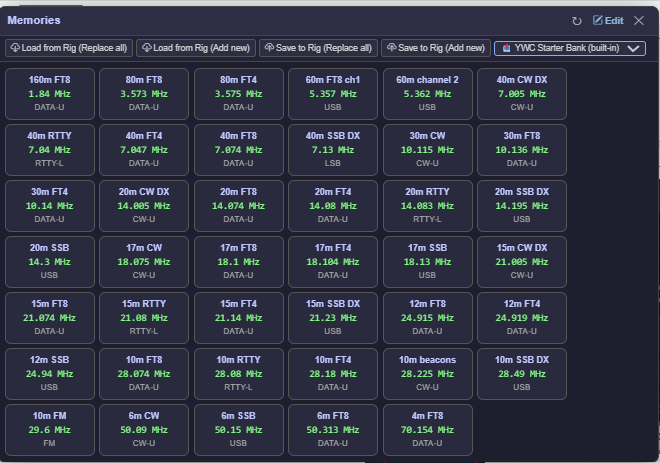

## 8. Radio Memories

The app maintains its own list of memory channels, independent of the radio's built-in memories. You can store as many channels as you like, organised with labels, and recall any of them at a click from the floating Mem panel (see Section 5.15).

### 8.1 Memories Editor

Access the full memories editor from **Memories** in the navigation bar.

The editor shows all your saved memories in a table. For each memory you can edit:

| Field | Description |
|-------|-------------|
| Label | Name shown on the memory tile (up to 12 characters) |
| Frequency (MHz) | Frequency in MHz, e.g. 14.074 |
| Mode | Operating mode (LSB, USB, CW-U, DATA-U, FM, etc.) |
| Clarifier (Hz) | Clarifier offset in Hz |
| RX Clar | Whether the RX clarifier is enabled |
| TX Clar | Whether the TX clarifier is enabled |

**Advanced fields** — tick the **Show advanced fields** toggle at the top of the editor to reveal extra columns:

| Field | Description |
|-------|-------------|
| Ant | Antenna selector (1, 2, 3) |
| IF Width | The SH command code for the desired filter width |
| IF Shift | IF shift in Hz, range −1000 to +1000 |
| Roofing | Roofing filter code (e.g. 7 = 3 kHz on FTdx101). Ignored on FTdx10/FT-710 |
| NB | Noise blanker on/off |
| NB Lvl | Noise blanker level, 1–20 |
| NR | Noise reduction (Off / NR1 / NR2) |
| AGC | AGC mode (Off / Fast / Mid / Slow / Auto) |
| Power | Transmit power in watts |
| Notes | Free-text notes, up to 100 characters |

**Each advanced field is applied on recall only if you have set a value.** Leave any field blank and the radio's current value for that setting is left alone. This means you can save a memory that only changes frequency and mode (the simple use case), or one that fully configures the radio (e.g. "20m FT8" with antenna 2, IF Width 8, NR2, 50 W, AGC Auto).

> **Important:** Advanced fields are **app-side only**. They are stored in `memories.json` on your PC but the radio's own memory channels (used by the Import/Export buttons) cannot hold these fields. Exporting to the radio writes only label, frequency, mode, and clarifier values.

Click **Save** to save all changes. Click **Add Memory** to append a blank row. Click the **trash** icon on any row to delete that memory.

The **Pop Out** button opens the Memories page in a new browser tab — useful if you want to edit memories on a second monitor while the main control panel is open in the first.

**Save to Mem button** — When you click "Save to Mem" on a VFO panel, the app captures the **full live state** of that VFO at the moment you clicked it: frequency, mode, antenna, IF width and shift, roofing, NB/NR/AGC, and power. The memory is added with all advanced fields populated. Edit the label later from the Memories page.

---

### 8.2 Importing from the Radio

The radio's built-in memory channels can be read into the app using the **Import** buttons at the top of the Memories page.

| Button | What it does |
|--------|-------------|
| **Import (Replace)** | Reads channels 001–099 from the radio and replaces ALL app memories with what is found. Your existing app memories are lost. |
| **Import (Add)** | Reads channels 001–099 from the radio and adds them to your existing app memories without deleting anything. |

Import reads up to 99 channels and takes up to 30 seconds. A progress indicator is shown while it runs. Channels that are empty on the radio are skipped automatically.

> **Note:** Importing does not affect the radio — it only reads from it.

---

### 8.3 Importing from ADIF

If you already keep a list of favourite frequencies in Log4OM (or any other logger that exports ADIF), you can bring them into YWC as memories without retyping. On the Memories page there is an **ADIF import** card with a single **Import from ADIF…** button.

**What gets imported.** YWC reads every QSO record in the file and creates one memory per **unique combination** of frequency and mode. So if you've logged a thousand QSOs on 14.074 MHz FT8, you get just one memory called "14.074 DATA-U" — not a thousand duplicates.

**How modes are translated.** ADIF stores modes as a flat list (FT8, FT4, CW, SSB, RTTY, USB, LSB, AM, FM, etc.) but doesn't always specify upper/lower sideband for CW, RTTY or digital modes. YWC picks the convention most operators use:

| ADIF mode | YWC mode |
|---|---|
| USB / LSB / AM / FM | same |
| CW | CW-U |
| RTTY | RTTY-L |
| FT8 / FT4 / PSK / PSK31 / JT65 / JT9 / JS8 / MFSK / DATA / DIGITALVOICE | DATA-U |
| anything else | USB |

If a record has no frequency it's skipped silently — most loggers always include FREQ, but some legacy ADIF dumps don't.

**Duplicates are skipped.** Each new memory gets a label like `14.074 DATA-U` (frequency in MHz to three decimal places, then the mode). Before saving, YWC checks the existing memory list — if a memory with the same label already exists, the import skips it. This means **re-importing the same ADIF file is safe**: nothing is duplicated.

**Advanced fields are not imported.** ADIF doesn't carry IF Width, AGC, NB level, power, antenna selection, etc. Imported memories leave those fields empty, so recalling one of them tunes the radio and sets the mode but otherwise leaves the radio's current settings untouched. You can edit imported memories afterwards to add advanced fields if you want.

**Typical use case:** export your last six months of QSOs from Log4OM as ADIF, import here, get a memory bank of every frequency you've actually used recently — great as a starting point for a new contest list or as a personal "watering holes I care about" set.

---

### 8.4 Exporting to the Radio

| Button | What it does |
|--------|-------------|
| **Export to Radio** | Writes your app memories to the radio starting at channel 001, overwriting ALL existing radio channels. |
| **Export to Radio (Add)** | Scans the radio for empty channels and writes your app memories into those slots only. Existing radio channels are not touched. |

> **Warning:** Export to Radio (Replace) overwrites all 99 radio memory channels. Make sure you have imported or backed up anything you want to keep first.

---

### 8.5 Memory Banks

Memory banks let you save the current memory list under a name and reload it later. This is useful if you use different sets of memories for different operating scenarios — for example a "Daily" bank for regular operating and a "Contest" bank with contest-specific frequencies.

The **Memory Banks** bar appears at the top of the Memories page.

**Saving a bank:**

1. Set up your memories as you want them (add, edit, import from radio, etc.) and click **Save** on the editor form.
2. Click **Save As…** in the Memory Banks bar.
3. Type a name for the bank (e.g. "Contest") and click OK.
4. If a bank with that name already exists, you are asked to confirm overwrite.

The bank is saved immediately. Your current working memories are unchanged.

**Loading a bank:**

1. Select a bank from the dropdown.
2. Click **Load**.
3. Confirm the prompt — the current memory list is replaced with the bank contents and the page reloads.

**Deleting a bank:**

1. Select the bank from the dropdown.
2. Click **Delete** and confirm.

Deleting a bank does not affect your current working memories.

Banks are stored in `%APPDATA%\MM5AGM\Yaesu Web Control\memory-banks.json` and are not affected by importing from or exporting to the radio.

---

### 8.6 YWC Starter Bank

YWC ships with a built-in **starter bank** of common watering-hole memories — pre-populated, region-aware, and ready to load with one click. New users get a useful set of memories without having to type in every FT8 frequency by hand; experienced users can pick and choose which entries to keep.

**What's in it (typical entry counts vary slightly per region):**

- FT8 calling frequencies on every band from 160m to 6m (plus 4m in Region 1)
- FT4 calling frequencies for all bands where FT4 is active
- 60m channels — five fixed USA channels for Region 2, or the WRC-15 secondary allocation for Region 1
- SSB DX windows and general SSB calling — region-specific (Region 1 uses 14.195 for DX, Region 2 uses 14.230, etc.)
- CW DX windows on every band
- RTTY centres
- The NCDXF/IBP beacon sub-band on 10m
- 10m FM (29.600) and 6m SSB

Each entry has sensible defaults for AGC, NB, NR, and power — for example, FT8 entries set AGC to **Slow**, NB **off**, NR **off**, Power **25 W**. SSB entries use AGC **Mid** and 100 W; CW uses AGC **Fast**. Radio-specific fields (IF Width, IF Shift, Roofing filter, Antenna selection) are deliberately left blank so your existing per-band memory and your own preferences take effect.

**Loading the starter bank.** The starter bank appears as a permanent entry at the top of the **Banks** dropdown — labelled **📥 YWC Starter Bank (built-in)** — both on the main page (in the floating Mem panel) and on the full Memories editor page. Loading it works exactly like any other Memory Bank (§8.4): selecting it loads the bank's contents into your working memory list, replacing whatever is there. The new entries then appear in the Mem panel as clickable tiles — click any tile to QSY VFO A to that frequency with all its saved settings, or use the Memories editor to change labels, edit fields, delete entries you don't want, etc.

On the **Memories editor page** a confirmation dialog appears before the load (same as for other banks). On the **floating Mem panel** the load happens immediately on dropdown change (also the same as for other banks).

**The built-in starter bank cannot be deleted** — its **Delete** button on the Memories editor is greyed out when the starter bank is selected. If you accidentally delete some of its entries from your working memories, just select the starter bank again from the dropdown and reload — your missing entries come back. (Any other customisations you've made since the previous load are replaced too, so save your work as a named bank with **Save As…** first if you want to preserve it.)

**Region awareness** — the starter bank entry shows the same name regardless of region, but the data loaded depends on the Band Plan in **Settings → §6.1**. Setting it to Region 1 loads `starter-bank-region1.json` (40 entries including 4 m), Region 2 loads the Americas bank with the five USA 60m channels, and so on. To switch regions, change the Band Plan in Settings, click **Save Settings**, then return to the Memories page or Mem panel and reload the starter bank — you'll get the new region's data.

**Editing freely** — once a starter entry is in your memory list, it's just an ordinary memory. Edit the label, change the power, add notes, delete it — anything you can do with a Save-to-Mem memory you can do with a starter entry. The starter bank file itself is read-only and shipped with the app, so your edits never affect what other users see; you can always click **Add Missing** to restore the original entry if you change your mind.

**Where the files live** — the starter banks are in `wwwroot/data/starter-bank-*.json` inside the install folder. They're plain JSON; if you want to look at the source data or contribute corrections, the format is one object per entry with frequency in Hz, mode, and the same advanced-field set the in-app memories use.

**Splitting the starter bank into themed banks.** The full starter bank is a mixed bag — FT8, SSB, CW, RTTY, FM and beacons all in one list. If you'd rather have **separate banks per mode** so you can load just FT8 frequencies on a contest weekend, or just CW for a quiet evening, click **Create themed banks…** on the Memory Banks bar. YWC reads the current region's starter bank and writes the contents out as up to six named banks:

| Bank | Contains |
|---|---|
| **FT8** | Every entry whose label includes "FT8" — typically 1.840 / 3.573 / 5.357 / 7.074 / 10.136 / 14.074 / 18.100 / 21.074 / 24.915 / 28.074 / 50.313 MHz, plus 70.154 MHz in Region 1 |
| **FT4** | Every "FT4" entry on the bands where FT4 is active |
| **CW** | Every entry whose mode is CW-U or CW-L (the band-edge CW DX windows, plus the 10m beacons sub-band) |
| **SSB** | Every USB/LSB entry that isn't already in FT8/FT4 (i.e. the voice SSB calling and DX windows) |
| **RTTY** | Every RTTY-L / RTTY-U entry |
| **FM** | Every FM entry (typically 10m FM at 29.600 MHz) |

Themes that come out empty for your region are quietly skipped. If any of the themed names clash with banks you've already created (e.g. you've hand-built your own "FT8" bank), YWC asks before overwriting them — say "no" and your custom bank is left alone.

Once created, these banks appear in the **Banks** dropdown just like any user-saved bank. Loading "FT8" replaces your working memories with the FT8 entries; loading "SSB" replaces them with the SSB entries; etc. You can edit, rename, or delete them like any other bank, and re-running **Create themed banks…** is safe — it won't touch anything that already exists unless you tell it to.

---

### 8.7 What about the radio's PRESET function?

PRESET is a Yaesu feature that loads a **factory-defined operating profile** for a given mode (FT8, SSB, CW, RTTY, DATA-USB, AM, FM). It varies enormously across the supported radios — both in scope and in how invasive it is.

**FTdx101MP / FTdx101D — full locked PRESET**

When PRESET is active, the radio applies a Yaesu-designed configuration *and locks you out of changing parts of it*. The screen shows e.g. "PRESET FT8" at the top.

| Mode | What it forces |
|---|---|
| **FT8** | MIC GAIN = 0, PROC OFF, fixed WIDTH/SHIFT, AGC SLOW, NB/DNR OFF, ALC locked out, fixed RF GAIN |
| **SSB** | MIC GAIN set to Yaesu's recommended value, PROC level fixed, EQ locked, WIDTH/SHIFT defaults |
| **CW** | Narrow WIDTH, SHIFT centred, AGC FAST, NB/DNR OFF |

While PRESET is on:
- Some controls become inactive on the touch panel
- Some items disappear from the MULTI menu entirely
- Your normal saved settings are overridden, not lost — turning PRESET off restores them
- The behaviour catches a lot of operators out, who think the radio is broken when actually PRESET is on

To turn PRESET off on these radios: press **MODE**, scroll past the normal mode list, select **PRESET OFF** (or **DEFAULT**). MIC GAIN, WIDTH, SHIFT, PROC, EQ and the full MULTI menu return.

**FTdx10 — simplified PRESET (mini-preset)**

A much lighter version. PRESET on the FTdx10 does **not** lock the MULTI menu, does **not** hide controls, and overrides far fewer parameters. Mostly it sets MIC GAIN = 0, PROC OFF, and a fixed WIDTH. Think of it as a one-click "safe FT8 setup" rather than the FTdx101's full locked profile.

**FT-710 and FTDX3000 — no PRESET function at all.**

---

**Yaesu Web Control does not duplicate the PRESET function in the app, and here's why:**

- The per-VFO memories with **Advanced fields** (§8.1) do everything PRESET does and more — *without* locking the radio. You can save a memory channel labelled "20m FT8" with the exact antenna, IF width, IF shift, NR, NB, AGC and power settings you want, and recall it with one click from the floating Mem panel. PRESET only stores per-mode templates; memories store per-frequency-and-mode-and-everything-else.
- **Per-band memory** (§5.9) automatically remembers your IF Width, IF Shift and Mode for each band, so switching from 40m CW back to 20m SSB restores your filter and mode without any explicit recall.
- PRESET is a hardware function on the radio — one menu away on the radios that have it. The app doesn't need to reinvent it.
- The behaviour varies so much across radios (full lock-out vs mini-preset vs absent) that anything app-level would be inconsistent and unpredictable.

If you want a "one click for FT8" workflow in the app, the recommended approach is: tune to your favourite FT8 frequency on the radio, set all your preferred settings, click **Save to Mem** on the VFO panel, then optionally edit the label and notes from the Memories page. Next time, click that memory tile in the floating Mem panel and you're back exactly where you left off — and without PRESET's lock-outs.

**Tip if your radio "suddenly behaves wrong" (FTdx101MP/D):** check the top of the radio's display for the word PRESET. If you see it, that's almost certainly the cause — turn it off using the MODE menu as described above. This is one of the most common "broken radio" mysteries reported by FTdx101 owners.

---
