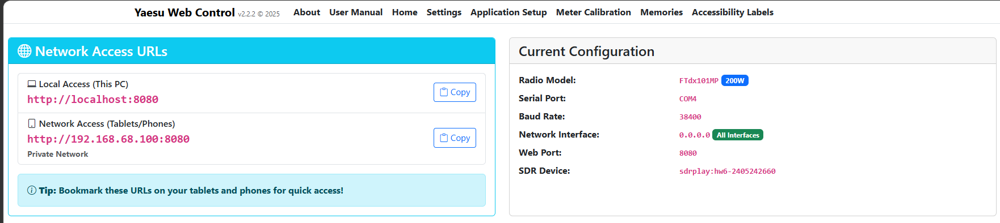
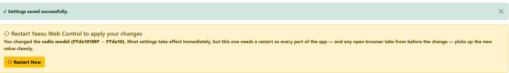
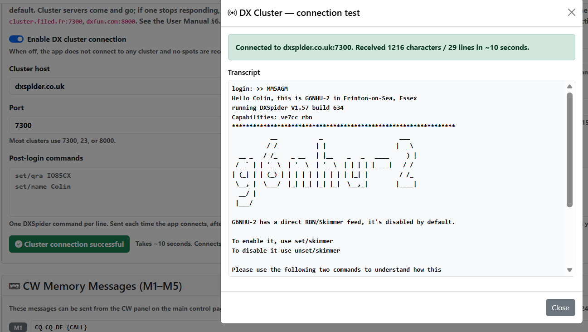

## 6. Settings Page

Access Settings from the navigation bar or by clicking the settings icon. Changes take effect only after clicking **Save Settings**.

At the top of the page, the **Network Access URLs** card lists the addresses you can use to reach YWC from this PC and from other devices on the LAN; the **Current Configuration** card on the right shows a one-line summary of what YWC is using right now (radio model, serial port, baud rate, network interface, web port, SDR device). The web port shown here is whichever port YWC actually managed to bind — usually 8080 but possibly 8081–8089 if 8080 was already in use on your PC.



#### Changes that need a full app restart

Most settings take effect the moment you click **Save Settings**. A few — radio model, network interface, and HTTP port — need a full YWC restart to apply cleanly because they affect how the app is bound to the operating system, or because they change what the server renders into the HTML of every open browser tab. When you change one of these, the Settings page shows a yellow **"Restart Yaesu Web Control to apply your changes"** banner above the rest of the page with a one-click **Restart Now** button:

> **Docker / Pi bind mounts:** if you hand-edit `appsettings.user.json` on the host while YWC is running in Docker (or on a Pi with a bind-mounted data directory), the in-process settings cache may not invalidate until you restart the container/host — `FileSystemWatcher` often does not fire reliably across bind mounts. Prefer saving from the Settings page, or restart after editing the file by hand.



Clicking **Restart Now** stops YWC and (when running as the installed exe) automatically relaunches it. The browser briefly shows a "Yaesu Web Control has stopped" overlay during the restart; just reload the tab once YWC is back. When running from source via `dotnet run`, the auto-relaunch is skipped — you'll need to start `dotnet run` again manually.

### 6.1 Radio Connection

| Setting | Description |
|---------|-------------|
| Radio Model | **FTdx101MP** (200 W, dual RX), **FTdx101D** (100 W, dual RX), **FTDX3000** (100 W, single RX), **FTdx10** (100 W, single RX), or **FT-710** (100 W, single RX) |
| Serial Port | Path to the radio's **Enhanced** (CAT) USB/serial port. **Windows:** `COM3`, `COM4`, … (Device Manager: *Enhanced COM Port*). **macOS:** `/dev/cu.usbserial-…` (prefer `cu.*` over `tty.*`). **Linux / Docker:** `/dev/ttyUSB0`, `/dev/ttyACM0`, or `/dev/serial/by-id/…`. If ports are missing or CAT never answers on Windows/macOS, install the [Silicon Labs CP210x VCP driver](https://www.silabs.com/software-and-tools/usb-to-uart-bridge-vcp-drivers?tab=downloads) and reboot — [§2.4](installation.md#24-usb-serial-driver-windows--macos--linux). Linux can normally skip that. |
| Baud Rate | Must match the radio's CAT Rate setting. Default: 38400 |
| Meter Poll Interval (ms) | Minimum cycle period for CAT meter polls (delay between cycle starts). Default: **200** ms. Valid range: 50–1000. The next cycle starts after this interval minus the time the previous cycle took, so the setting is a target period rather than a raw wait after each poll. Lower values give a faster S-meter update rate but increase CAT bus traffic — if you share the port with WSJT-X or rigctld, reducing this below ~100 ms raises the chance of collisions where both programs try to read the bus at the same time. Raise it (e.g. to 500) if you see erratic readings or CAT timeouts when running digital modes. |
| Band Plan | **IARU Region 1** (Europe, Africa, Middle East — includes 4m), **IARU Region 2** (Americas), **IARU Region 3** (Asia-Pacific), or **Japan** (JARL). Affects which bands and segment frequencies are shown. UK is Region 1; USA, Canada, and South America are Region 2; Australia, New Zealand, and most of Asia (except Japan) are Region 3. |

After changing the serial port or baud rate, click **Test Connection** to verify the radio responds. A green tick confirms success.

> **Running WSJT-X / FT8 via USB audio?** Your radio needs **REAR SELECT = USB** in its menu before it'll transmit digital audio from a PC. This is a one-time radio setup — see FAQ §15 for the menu numbers per radio.

---

### 6.2 Web Server Settings

| Setting | Description |
|---------|-------------|
| Network Interface | `localhost` (this PC only) or `0.0.0.0` (all interfaces, including LAN). Choose `0.0.0.0` to access the app from a tablet or phone |
| HTTP port | Port Kestrel listens on (default **8080**; if busy, YWC tries 8081–8089 at startup). Changing this needs a restart. |
| Open browser automatically on startup | When **on** (default), YWC opens your default browser to the control panel after the web server starts. Turn **off** to start quietly — open the UI from the system tray / menu bar, or browse to the URL yourself. Tray/menu **Open** still works when this is off. **Docker never auto-opens** a browser. |
| Automatically exit when no browser is connected | When **on** (default on desktop hosts), YWC exits ~30 seconds after the last heartbeating browser tab closes. Turn **off** for a headless shack / always-on Pi so closing the browser does not stop CAT. **Docker always keeps the host running** regardless of this checkbox. |
| Enable HTTPS | Optional TLS listener (default port **8443**) using a YWC-generated self-signed certificate. Required for **remote microphone** access (browsers block `getUserMedia` on plain `http://` except localhost). See [§18 Remote Audio](remote-audio.md#18-remote-audio). |
| HTTPS port | Port for the HTTPS listener when enabled (default **8443**). HTTP continues on the HTTP port (dual-listen). Restart required. |
| Certificate SAN hostnames / IPs | Extra names/IPs embedded in the self-signed cert (e.g. WireGuard IP). Always includes `localhost`. |
| Generate self-signed certificate | Writes `https.pfx` under the YWC user-data folder. Overwrites any existing cert. **Restart YWC** after generating if HTTPS is enabled. |

> **Note:** After changing the network interface, HTTP/HTTPS port, or HTTPS enable flag, save settings and restart the application.

The Settings page also shows the full URL for each detected network interface so you can bookmark the correct address on your tablet.

---

### 6.3 SDR Spectrum Display

> **Windows host only.** The SDR spectrum settings and live display are part of the Windows product build. On macOS / Linux / Docker the Settings section is hidden and spectrum panels do not start — CAT control and the rest of the UI still work.

The spectrum display requires an SDR receiver. On the FTdx101MP, FTdx101D, and FTDX3000 the SDR is connected to the radio's 9 MHz IF output (rear panel RCA socket labelled **IF OUT**), giving a VFO-centred panoramic view of the band. The FTdx10 and FT-710 do not have an IF output — see the warning below.

> ## ⚠️ Safety — read before connecting an SDR
>
> SDR receivers have a very sensitive front end. **Even a small amount of TX RF can permanently damage or destroy them.** Treat the SDR like a precision RX-only instrument, not a piece of TX hardware.
>
> **If your radio has an IF output (FTdx101MP / FTdx101D / FTDX3000):**
> Connect the SDR only to the rear-panel **IF OUT** RCA socket. This is an internal low-level signal, safe to leave connected during TX. **Never** connect the SDR to an antenna port on a radio with IF out — you don't need to, and you'll regret it.
>
> **If your radio has no IF output (FTdx10 / FT-710):**
> The SDR must connect to an antenna port. Transmitting with the SDR's coax wired into your TX antenna **will damage the SDR**. You must do one of:
> - **Disconnect the SDR coax before every TX.** Crude but reliable. Easy to forget.
> - **Use a dedicated receive-only antenna**, physically separated from your TX antenna by as much distance as you can manage. Even a few metres of vertical separation helps; opposite ends of the garden is better.
> - **Fit a T/R relay or PIN-diode T/R switch** between your antenna and the SDR. The relay is keyed by the radio's PTT line so the SDR is automatically disconnected the moment you transmit. This is the standard professional solution; several ham-radio suppliers sell ready-built T/R switch units rated for the SDR's power-handling requirements.
>
> **Always remember:** an antenna physically close to your TX antenna can still couple enough RF into the SDR to damage it, even if it's not directly connected. The further apart, the safer.
>
> YWC also displays this warning on the Settings page whenever you have an SDR configured, and a more prominent danger banner if your selected radio is an FTdx10 or FT-710 (since those users are obliged to connect to an antenna):


**Spectrum view depends on connection point:**
- **IF output** (FTdx101 / FTDX3000) — VFO-centred panoramic view of the band you're tuned to, regardless of where on the band you tune. The IF Frequency setting tells YWC which IF the radio is using (9 MHz on FTdx101 series).
- **Antenna port** (FTdx10 / FT-710) — absolute RF frequencies from the connected antenna. The IF Frequency setting has no effect. The Settings page shows a reminder of this when FTdx10 or FT-710 is selected.

**Supported hardware:**
- **SDRplay RSP1 and RSP series** — requires the [SDRplay API v3](https://www.sdrplay.com/downloads/) to be installed separately
- **RTL-SDR, Airspy, HackRF** — drivers are included in the app installer; no separate installation needed

**Setting up the SDR (FTdx101MP / FTdx101D / FTDX3000):**

1. Connect the SDR to the 9 MHz IF output using an RCA-to-SMA adapter and a short coax cable.
2. Go to Settings and click **Scan** in the SDR section.
3. Detected devices appear in the dropdown. Select your device.
4. Set **IF Frequency** to `9000000` (9 MHz) for the FTdx101 IF output.
5. **Sample Rate**: 2M (2,048,000 Hz) is recommended and gives a 2 MHz span.
6. **FFT Size**: 1024 is recommended.
7. Click **Save Settings**.

The spectrum panel appears on the main page when a device is saved. If you want to remove the spectrum display, click **Disable/Clear** in the SDR settings section.

| SDR Setting | Recommended Value |
|-------------|------------------|
| IF Frequency | 9,000,000 Hz (FTdx101MP, FTdx101D, FTDX3000) — no effect on FTdx10 or FT-710 |
| Sample Rate | 2,048,000 (2M) |
| FFT Size | 1024 |

#### Dual SDR — one per VFO *(v2.3.0 and later)*

If you have two SDRs (typically two SDRplay RSPs) and a dual-receiver radio (FTdx101MP / FTdx101D), you can wire one SDR to the **IF OUT MAIN** RCA socket (VFO A) and the other to **IF OUT SUB** (VFO B). The Settings page then offers two device dropdowns — **VFO A SDR** and **VFO B SDR** — so YWC knows which physical device serves which VFO. Click **Scan** once; both dropdowns are populated from the same scan. Pick the SDR for each slot, save, and the main page will show two spectrum panels stacked vertically (one for each VFO).

If you only have one SDR, set it in the **VFO A SDR** slot and leave **VFO B SDR** as *(none)*. The main page will show only the VFO A panel exactly as in single-SDR setups before v2.3.0.

> **Note on SDRplay devices specifically:** the SDRplay API service only allows one device per host process. YWC works around this by launching a separate background process (`Yaesu_Sdr_Worker.exe`) for each SDR you configure — you'll see them in Task Manager when YWC is streaming. They start and stop automatically; no user action needed. See [the dual-SDR architecture note](https://github.com/mm5agm/Yaesu_Web_Control/blob/develop/docs/decisions/0001-dual-sdr-architecture.md) on GitHub if you're curious about the why.

> **If YWC can't find your SDRplay device:** YWC needs to be able to load `sdrplay_api.dll` from the SDRplay install folder. For a standard install at `C:\Program Files\SDRplay\API\x64\sdrplay_api.dll` this just works — YWC auto-detects the path on startup. If you installed SDRplay to a non-standard location and your Windows `PATH` doesn't include its `x64` folder, YWC may fail to find the DLL.
>
> A new **SDRplay install path** field on the Settings page (in the same SDR Spectrum Display section as the IF Frequency) lets you point YWC explicitly at your SDRplay API folder. Leave it blank for auto-detect — the field shows the auto-detected path in green below it (or an amber warning if nothing was found), with a one-click **Use this path** link to fill the field, and a **Browse…** button that opens a native Windows folder picker.
>
> The Browse… picker opens on the same PC running YWC; if you're operating from a tablet over the LAN, the picker can't appear on your screen and you'll be told to come to the YWC host PC (or type the path into the field manually).

When both VFOs have an SDR, the main control panel gains two small toggle groups above the spectrum panels:

- **VFO A / VFO B / Both** — quickly hide one panel without changing settings.
- **Stacked / Side by side** — choose whether the two panels stack vertically (taller, more vertical detail per panel) or sit side by side (each at half-width, both visible at once with less scrolling).

Both choices are remembered across page reloads via your browser's local storage. Click the spectrum on panel A to tune **VFO A**; click panel B to tune **VFO B** — each panel addresses its own receiver.

**Stacked layout** — each panel uses the full width of the page, with a deeper waterfall trail per VFO. Best for spotting weak signals or studying the noise floor on one band while keeping an eye on the other:


**Side-by-side layout** — both spectra share the page width 50/50, giving you both bands on screen at once without scrolling. Better for working two bands simultaneously (e.g. SSB on VFO A, FT8 on VFO B):


> **Both screenshots above show the Hold feature in action.** VFO A is streaming live with the green "Live" status badge; VFO B is frozen — its Hold button is filled yellow, its status badge says "Hold" in yellow, and a small `HOLD` banner sits in the top-left corner of the frozen canvas. Click the Hold button again to resume.

#### Updating the band plan without a YWC release

From v2.3.0 the band plan data (activity-centre markers like CW / FT8 / SSB, plus the red band-edge guard rails) lives in a JSON file alongside YWC's install folder:

```
<YWC install folder>\wwwroot\bandplan.default.json
```

If a regulator (RSGB, FCC, JARL, etc.) tweaks a band plan and the change is important to you, download an updated copy of `bandplan.default.json` from the YWC GitHub release page and drop it in over the existing file. Restart YWC and the new values take effect — no need to wait for a full app release. The hardcoded JS defaults shipped inside the app are used as a fallback in case the JSON file is missing or corrupt, so a botched edit can't permanently break anything; just delete the file and YWC reverts to the built-in defaults.

#### Hold — freeze the spectrum at the current frame

Each panel header has a **Hold** button. Click it to freeze that VFO's spectrum + waterfall at the last received frame. While held the panel ignores incoming SDR data, the header badge changes to a yellow **Hold** indicator, and a small `HOLD` banner appears in the top-left of the canvas. Click **Hold** again to resume live streaming.

Useful for studying a fleeting signal without it scrolling off the waterfall, or grabbing a screenshot of a particular moment. Each panel holds independently — you can hold VFO A while VFO B keeps streaming.

#### Persistent cursor — bookmark a frequency

**Shift-click** anywhere on a spectrum panel to drop a persistent cyan cursor at that frequency. The cursor stays visible as you tune around with normal clicks, so you can mark a station you want to come back to. The frequency is shown in a small boxed label near the cursor.

To remove the cursor, **Shift-click on or near it** (within ~10 pixels). Each panel has its own cursor — VFO A and VFO B can each be marking different frequencies.

#### Independent span per VFO

Each spectrum panel header has its own **62.5k / 125k / 250k / 500k / 1M / 2M** span buttons. Set VFO A to **2 MHz** for a wide overview of the calling band, and VFO B to **62.5 kHz** zoomed in on the QSO you're working — both at the same time, independently. Each click restarts only that VFO's worker (the other panel keeps its frame frozen for the brief reconnect window — see the bandwidth-change pause note below).

The Settings page Sample Rate dropdown still exists but now acts as a "reset both VFOs to this default" control. Use it to set a starting point; use the per-panel buttons to diverge from there.

#### Why two SDRs — and why two RSP1Bs rather than one RSPduo

YWC's dual-SDR support is designed for two completely separate receivers — typically two SDRplay RSPs. If you have an FTdx101MP or FTdx101D, both the **MAIN** and **SUB** receivers have their own rear-panel IF OUT sockets — connect one SDR to each and YWC can show both VFOs at once.

You might assume an SDRplay **RSPduo** (two tuners in one box) would be the natural pick. In practice I run two separate **RSP1Bs**, and recommend that for new YWC dual-SDR setups, for three reasons:

1. **Bandwidth.** The RSPduo in dual-tuner mode is limited to roughly **2 MHz total** shared between its two tuners. Two separate RSP1Bs each give you the full chip bandwidth — currently we use 2 MHz spans per side, but the headroom is there if YWC adds wider spans later.
2. **Cost.** Two RSP1Bs at typical retail prices are only marginally more expensive than one RSPduo.
3. **Independence.** If one RSP misbehaves, YWC's worker for that side restarts independently. With an RSPduo a glitch can take both tuners out at once.

If you already own an RSPduo, you can still use it — just set it as the VFO A SDR and leave the VFO B slot empty (the second tuner remains available for other software). The dual-tuner mode that lets one RSPduo serve both VFOs is not yet implemented.

#### Why an SDRplay RSP, not a cheap RTL-SDR dongle?

RTL-SDR dongles are supported via the SoapySDR driver path and will function — but for a serious HF-watching setup an RSPplay RSP is a significant step up:

- **Bit depth.** RTL-SDR is 8-bit; RSPplay RSPs are 14-bit. That's about 36 dB more dynamic range — weak signals next to a strong neighbour are far easier to see.
- **HF coverage.** Most RTL-SDR dongles need a separate upconverter to receive HF. RSPs cover 1 kHz to 2 GHz natively.
- **Front-end filtering.** RSPs have selectable bandpass filters; dongles have essentially none. With a kilowatt-class transmitter on the next band, a dongle overloads long before an RSP does.
- **Clock stability.** RSPs use a TCXO; cheap dongles drift visibly during warm-up — the spectrum centred on a 9 MHz IF will appear to slide sideways for the first ten minutes after power-on.

My full bench testing has been against the SDRplay path. RTL-SDR users are welcome to experiment and report back.

#### Why is there a brief pause when I change the span?

When you click a different span button (e.g. 250k → 2M) the spectrum visibly freezes for about **three seconds** before resuming at the new bandwidth. The header badge says "Connecting…" during that window.

The delay is **hardware**, not software. Changing the sample rate means YWC asks the SDR worker process to close the device, reopen it at the new rate, and restart streaming. The SDRplay API takes roughly a second to release a device cleanly and another second or so to reinitialise it. With two SDRs running, both restart at once.

YWC keeps the previous spectrum frame visible during the pause rather than blanking out the canvas — the brief frozen image is intentional, not a glitch. It returns to live data as soon as the new sample rate is running.

---

### 6.4 Roofing Filters

Select which optional roofing filters are fitted to your radio. The app uses this list to show only the installed filters in the Roofing Filter dropdown on the main page. FTdx101MP comes fully loaded; FTdx101D, FTdx10, and FTDX3000 allow optional filter selection.

---

### 6.5 CW Memory Messages (M1–M5)

Enter up to five CW message memories. These are available from the CW Keyer panel (see Section 5.12) via the M1–M5 buttons.

- Maximum 50 characters per message (the radio’s keyer-memory limit)
- Messages are saved in application settings and persist between sessions
- Use the M1–M5 buttons in the CW panel to send a message
- `{CALL}` is replaced with your callsign — the same one the DX cluster login uses
- Sending a message **overwrites the matching keyer memory in the radio**, so the radio’s own M1–M5 end up holding whatever you type here (see Section 5.12)
- Keep them short. A message cannot be stopped once it is sending — the radio has no command for it

**Example messages:**

| Slot | Default message |
|------|----------------|
| M1 | CQ CQ DE {CALL} |
| M2 | TU 73 |
| M3 | QRZ? |
| M4 | UR 5NN |
| M5 | DE {CALL} |

Note: `{CALL}` is a reminder placeholder — the radio's KY command does not perform variable substitution. Replace `{CALL}` with your actual callsign.

---

### 6.6 DX Cluster

Connect to a DX cluster server to overlay live DX spots on the SDR spectrum display. Spots appear as small yellow callsign labels at each spot's frequency on the spectrum panel; clicking a spot tunes VFO A exactly to that frequency. See Section 5.4 for how the overlay behaves on crowded bands.

There is **no default cluster server** — pick one you have access to. The connection is only made when you tick the **Enable** switch below.

This is one of only two parts of YWC that need an **internet connection** (the other is the update check). On a shack PC with no internet, leave the **Enable** switch off — if you switch it on anyway, nothing breaks: the status badge sits at *Disconnected* and YWC keeps retrying quietly in the background. Nothing else in the app is affected.

| Setting | Description |
|---------|-------------|
| Enable DX cluster connection | Master on/off. When off, no connection is made and no spots are received |
| Cluster host | Hostname or IP of the DX cluster, e.g. `dxspider.co.uk` |
| Port | TCP port. Most clusters use 7300, 23, or 8000 |
| Login callsign | Your amateur callsign — sent to the cluster when it prompts for login. Most clusters require a valid licensed call |
| Spot age-off (minutes) | Spots older than this are removed automatically. Typical 15–30 minutes |
| Post-login commands | DXSpider commands to send after the callsign is accepted (one per line). See subsection below. |

**Common cluster servers** (the app does not endorse any particular one — these are starting points; cluster servers come and go, so if one stops responding try another):

- `dxspider.co.uk` port 7300 (DXSpider, UK — G6NHU-2 in Essex, RBN-fed, low latency from the UK)
- `ei7mre.ath.cx` port 7300 (DXSpider, Ireland)
- `cluster.f1led.fr` port 7300 (DXSpider, France)
- `dxfun.com` port 8000 (DXSpider, Spain)
- `ve7cc.net` port 23 (AR-Cluster, Canada — globally connected, higher latency but very stable)

**Post-login commands** — many DXSpider clusters ask you to set your location and other details once you've logged in. Rather than typing those commands into the cluster on every connect, list them in this textarea (one per line) and the app sends them automatically each time. Lines beginning with `#` are ignored, and a leading `/` is stripped (so you can paste DXSpider help syntax verbatim).

Common things to put in this textarea:

```
set/qra IO85CX            # your Maidenhead grid square — improves your spot list
set/name Colin            # your name as it appears to other users
set/skimmer               # enable RBN/Skimmer spots on clusters that have an RBN feed (e.g. G6NHU-2)
set/filter ...            # whatever spot filters you prefer
```

The app uses a generous parser that accepts spot lines from AR-Cluster, CC-Cluster, and DXSpider format servers. The cluster connection sends the configured callsign 1.5 seconds after the TCP socket opens — this handles servers whose login prompt has no newline (which would otherwise cause our reader to hang silently).

**Test cluster connection** *(v2.2.2 and later)* — a yellow **Test cluster connection** button appears below the Post-login commands textarea. Click it and the app opens a TCP connection to the host/port/callsign you've typed into the form (**without** saving them first), sends your callsign, reads about ten seconds of output, then shows the full transcript in a popup so you can see exactly what the cluster said back. Use it to verify a new cluster before committing to it, to confirm a working cluster is still up after a network change, or to diagnose a connection problem.



Outcomes:

- 🟢 **Green button + "Cluster connection successful"** — the cluster accepted the connection and sent data. Safe to Save Settings.
- 🟡 **Yellow button stays, red error in the popup** — connection failed. The popup's status line explains why: *host unreachable* (DNS or firewall), *connection refused* (host alive but nothing on that port), or *connected but no data within 10 seconds* (port answered but isn't speaking the cluster protocol — probably wrong port).

The button resets to yellow on every click, so retesting after editing the host gives a fresh visual cue rather than carrying over a stale result.

**Status badge on the spectrum panel** — top-right corner of the spectrum canvas shows the live cluster connection state:

- 🟢 green **DX: connected** — connected and receiving
- 🟡 amber **DX: connecting** — opening the TCP socket
- 🔴 red **DX: disconnected** — connection dropped or initial connect failed
- ⚫ grey **DX: off** — feature disabled or settings incomplete

If the badge stays red, hit `http://localhost:8080/api/dxcluster/status` in a browser — the `detail` field shows the underlying error message (e.g. "No such host is known").

**Diagnostic log** — every line received from the cluster is written to:

```
%APPDATA%\MM5AGM\Yaesu Web Control\dx-cluster.log
```

The file is rewritten on each new connection so it never grows large. Open it in any text editor to see the raw protocol exchange — useful for troubleshooting or just to watch what the cluster is sending. There is also an HTTP endpoint `http://localhost:8080/api/dxcluster/recent` that returns the last 100 lines as plain text in a browser.

If the connection drops, the app reconnects automatically after 15 seconds. Disabling the toggle in Settings stops reconnection attempts.

> **Note on registering to send spots:** Most clusters accept connections from any callsign for *receiving* spots, but require a one-off email registration before they accept spots you upload (the cluster will tell you the address). YWC only receives spots — it does not send any — so you can ignore that prompt.

---

### 6.7 Backup & Restore

At the bottom of the Settings page (below the Save Settings button) are two buttons for exporting and importing your complete YWC user data as a **single zip file**. This rolls up everything you've customised across the app into one file:

| File in the zip | What it contains |
|---|---|
| `appsettings.user.json` | Radio model, COM port, baud rate, band plan, SDR settings, DX cluster login and watch list, CW memory messages, external app paths, per-band Width/Shift/Mode/Antenna memory, RF Gain, Squelch, antenna selections |
| `memories.json` | Your radio memory channels (with all advanced fields) |
| `memory-banks.json` | Saved memory banks (named sets) |
| `calibration.user.json` | Meter calibration overrides (if you've adjusted any meter scales) |
| `labels.user.json` | Accessible-label customisations (if you've translated or renamed any controls) |

Plus a small `README.txt` recording when the backup was taken and which YWC version produced it.

**Live radio state** (current frequency, mode, etc.) is deliberately **not** backed up — that's transient state that resets to whatever the radio reports the next time you connect.

**Export full backup**

Click **Export full backup** to download a single file named `ywc-backup-YYYYMMDD-HHMMSS.zip`. Keep it somewhere safe — OneDrive, a USB stick, or your shack laptop. Re-export occasionally as your setup evolves.

**Import full backup…**

Click **Import full backup…**, pick a previously exported zip, and confirm the replacement. Each replaced file is preserved as a `.bak` in `%APPDATA%\MM5AGM\Yaesu Web Control\` so you can recover if the import causes problems. If anything goes wrong mid-import, every file written so far is rolled back automatically.

**You must restart YWC after importing.** Most services (radio connection, DX cluster, SDR streaming, rigctld server) only read their files at startup, so changes only take full effect after a restart. The app displays a reminder when the import completes.

**Typical use cases:**

- **New PC** — install YWC, copy your exported zip across, import. You're up and running in under a minute with all bands, memories and DX watch list intact.
- **Before a Windows rebuild or major update** — export, then re-import after the rebuild.
- **Sharing setup with a friend** — export and email them the file. They get a working starting point (though they'll want to change the callsign and possibly the COM port).
- **Experimenting safely** — export before trying something risky; import the file to revert if it goes wrong.

The files inside the zip are plain JSON; you can extract and inspect or hand-edit them if needed. They live at `%APPDATA%\MM5AGM\Yaesu Web Control\` and are also accessible directly without going through the export.

---

### 6.8 Remote Audio

**Settings → Remote Audio** enables in-browser send/receive audio between a remote operator and the radio’s USB sound devices on the YWC host (an alternative to Mumble/SonoBus for remote SSB over LAN or VPN).

| Setting | Description |
|---------|-------------|
| Enable remote audio | Opt-in. When off, no audio devices are opened and the Index bar is hidden. |
| Radio RX device (capture) | PortAudio input used for what you **hear** in the browser — usually the Yaesu USB **recording** endpoint (`Microphone (USB Audio CODEC)` / `Line (USB Audio CODEC)`, or a name you gave it in the OS). **Required** when remote audio is enabled (no system-default fallback). On Windows the list is limited to **WASAPI** endpoints so the same USB CODEC is not repeated under MME / DirectSound / WDM-KS. Names that look like a USB codec are sorted to the top and marked with a radio icon (📻). |
| Radio TX device (playback) | PortAudio output for browser **mic → radio** — usually Yaesu USB **Speakers** / playback (`Speakers (USB Audio CODEC)`). **Required** when enabled. Do **not** leave blank or pick PC speakers / headphones: that loops the browser mic into the room and never reaches the radio. Same WASAPI-only listing and radio-icon hint as RX. |
| RX / TX gain | Software gain in the bridge (0.05–4). Adjusted live via **Mic & Gain** on the Index Remote Audio bar (or inline on the pop-out) — not on the Settings page. |
| Audio codec | Chosen on the Index **Mic & Gain** dialog or the pop-out (not a host setting). **Opus** (default) compresses speech to ~32 kb/s per direction; **PCM16** is uncompressed ~768 kb/s. See [§18.6](remote-audio.md#186-audio-codecs-opus-vs-pcm16). |

Also configure **HTTPS** under [§6.2](#62-web-server-settings) if you will use a remote browser (not localhost). Full setup steps are in [§18 Remote Audio](remote-audio.md#18-remote-audio).

On the Index **Remote Audio** bar, **Pop out** opens a small dedicated window that owns the audio session. Use this before opening Settings (or any other page) so RX/TX keep running — navigating away from Home otherwise closes the in-page session. While audio is in the pop-out, Home still shows status/levels/mutes, and the filter-scope FFT on Home stays live. Only one audio session is allowed at a time; handing off briefly reconnects.

---

### 6.9 Radio Display

**Settings → Radio Display** enables the feature. Capture device, capture size, frame rate, image quality, and **Start / Stop** are on the Index **Radio Display** panel (or pop-out). The stream does not open until you click **Start** (or tick **Auto**). Full setup and electrical-safety notes are in [§19 Radio Display](radio-display.md#19-radio-display).

| Setting | Description |
|---------|-------------|
| Enable radio display | Opt-in. When off, capture stays closed and the Index panel is hidden. |

On the panel: pick a USB capture device, set **15 / 30 / 60 fps** (rates above what the stick can do are hidden), Fit/Fill, Fullscreen, Pop out / **Reattach**, or Close. If the dongle is unplugged, the badge stays **Disconnected** until you refresh the device list and click **Start** — YWC does not reopen whatever camera now sits at the old index. **Auto** and reloading the page do not bypass that halt; only **Start** (after refresh) or choosing a different device clears it.

On **FTdx10** and **FTdx101MP/D**, **Controls** on the video bar opens a dialog to drive the radio’s own scope (span, 3DSS, Center/Cursor/Fix, FFT speed, Level, Peak, Marker, Color, AF-FFT/OSC). That is not click-through on the video — HDMI capture is one-way. See [§19.4](radio-display.md#194-cat-scope-controls).

---

### 6.10 CW Reader Mode

These two settings decide what the **Reader Mode** button on the CW reader does to your radio. Nothing here changes the radio on its own — the settings only take effect when you press that button, and pressing **Stop** puts your own settings back. The reader itself is described in [§20 CW Reader](cw-reader.md#20-cw-reader).

| Setting | Description |
|---------|-------------|
| Reader Mode filter width | The IF width Reader Mode asks for: 50, 100, 150, 200, 250, 300, 400 or 500 Hz. Default **250 Hz**. Your radio does not necessarily have that exact filter — YWC picks the nearest width your model actually offers, and on a tie it picks the **wider** one, because a filter narrower than you asked for can push the CW note outside the passband and lose a signal you could hear perfectly well. If YWC has no filter table for your model it leaves the filter alone rather than guessing. |
| Use APF in Reader Mode | Default **on**. Turns the Audio Peak Filter on at your current APF frequency while Reader Mode is active. APF narrows the audio still further around the CW note, which is exactly what the decoder wants; some operators find it rings, so it can be turned off here. |

I have set the default to 250 Hz because that is what fixed it on my own bench. My FTdx101MP's built-in decoder could not read a signal I could copy by ear with the filters wide open, and was still poor at 600 Hz. What a decoder is fed matters more than how it decodes, and a 2.4 kHz filter full of adjacent signals will defeat any decoder there is.

---
