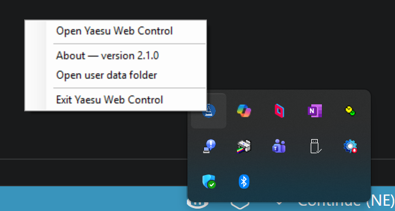

## 4. Starting the Application

### Windows

Double-click the **Yaesu Web Control** shortcut on your desktop. The app starts in the background and — with **Open browser automatically on startup** enabled (the default) — your default browser opens to whichever port YWC managed to bind (usually `http://localhost:8080`, but YWC will fall back to 8081–8089 if 8080 was already in use). If you turned that setting off, use the tray icon’s **Open** action (or browse to the URL yourself).

A small **YWC tray icon** appears in the Windows system tray (down by the clock, possibly under the **Show hidden icons ︿** arrow). The tray icon is your "the app is running" indicator and gives you a clean way to manage it without juggling Task Manager:

- **Hover** over the icon — a tooltip confirms the version and the actual URL (e.g. `http://localhost:8080` or `http://localhost:8081`). If you ever wonder which port YWC ended up on, this is the fastest way to check.
- **Double-click** the icon — opens YWC in your default browser (handy if you've closed all browser tabs and need to get back to the app).
- **Right-click** the icon — opens a menu:

| Menu item | What it does |
|---|---|
| Open Yaesu Web Control | Opens YWC in your default browser. |
| About — version vX.Y.Z | Shows version, release date, and licence. The browser About page (top nav bar) has full details and a Copy diagnostics button. |
| Open user data folder | Opens `%APPDATA%\MM5AGM\Yaesu Web Control\` in File Explorer — handy for grabbing the backup zip after export, or inspecting/editing JSON files. |
| Exit Yaesu Web Control | Confirms then shuts the app down cleanly. WSJT-X / Log4OM / JTAlert / GridTracker / Fldigi lose their CAT connection until you restart YWC. |

### macOS (CAT-only host)

Launch **Yaesu Web Control** from Applications (DMG install — [§2.2](installation.md#22-macos-dmg)), or run `dotnet run --framework net10.0` from a source checkout. Either way Kestrel starts and a **menu-bar status item** offers the same Open / About / Open user data folder / Exit actions as the Windows tray. User data lives under `~/.config/MM5AGM/Yaesu Web Control/`. With **Open browser automatically on startup** enabled (default), the browser opens on a desktop Mac; if you turned it off (or it didn’t open), use the menu-bar **Open** item or browse to the URL yourself.

### Linux (from source)

Same CAT-only host as macOS, but **no tray**. Watch the console for the listening URL, open a browser yourself, and stop with **Ctrl+C**. For a shack Pi that should stay up with no tabs open, disable **Automatically exit when no browser is connected** in Settings.

### Linux Docker

`docker compose up -d` keeps the container running. There is no tray and no auto-opened browser. Point any browser on the LAN at `http://<host>:8080`. Stop with `docker compose down`. Logs and `appsettings.user.json` are on the data volume.

If the radio is powered on and the serial connection is correct, a brief "Initialising…" overlay appears while the app reads the current radio state. After a few seconds the overlay disappears and all controls reflect the current state of the radio. This includes frequencies, mode, antenna, AGC, NB level, ATU state, VOX settings, FM repeater settings, CW keyer speed and break-in mode, IF width, IF shift, and more — no software defaults are applied.

**Closing the app:**

1. **Tray / menu-bar Exit** (Windows / macOS) — cleanest shutdown.
2. **Close the browser and walk away** — when **Automatically exit when no browser is connected** is enabled (default on desktop hosts), YWC waits ~30 seconds then exits. Turn that setting **off** (or use Docker, which forces it off) to keep the CAT host running with no browser open.
3. **Force-quit** — Task Manager on Windows; Activity Monitor or Ctrl+C on macOS/Linux; `docker compose down` for containers. Use this only if something has hung.

**Accessing the app from another device:** If you set **Network Interface** to `0.0.0.0 (all interfaces)` in Settings (the default), the app is also accessible from any device on your local network. The Settings page shows the full URL for each network interface — bookmark one of these on your tablet or phone.

---
