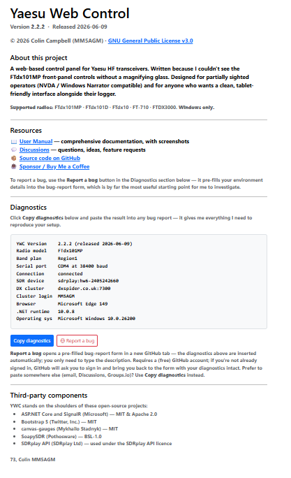
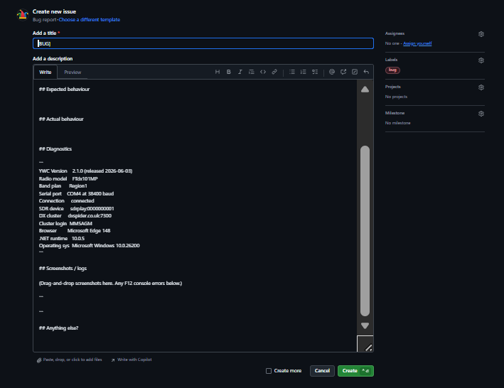

## 14. Troubleshooting

### 14.1 Reporting a bug

The fastest way to get a bug fixed is a good report. YWC has three features that work together to make this easy.

**1. The Diagnostics block on the About page.** Click **About** in the top navigation bar. The page shows app information, useful resource links, and a **Diagnostics** block — a single small text block listing:

- YWC version and release date
- Radio model and selected band plan
- Serial port and baud rate
- Current radio connection state
- SDR device (if configured)
- DX cluster host and your cluster login callsign (if configured)
- Browser and version
- .NET runtime version and Windows version
- The firmware versions of my bench radio (so you can compare against yours — see below)

That gives me everything needed to reproduce your setup — including a callsign so I know who I'm talking to.

**Radio firmware versions worth knowing.** Above the Diagnostics block on the About page there's a section titled **Developer's tested radio firmware** that lists my bench radio firmware values. Some YWC behaviours depend on the radio's firmware version — for example, the FTdx101's IF Width dropdown gained 3.5 kHz and 4.0 kHz options only in firmware released after the 2023 CAT manual was published. If you're hitting a CAT-related bug, comparing your firmware against the listed values quickly tells you whether a Yaesu firmware difference might be involved. To read your own firmware on an FTdx101MP / FTdx101D: **Func → Extension Settings → Soft Version** on the radio's front panel. Include any firmware mismatch in your bug report.

**2. Report a bug on GitHub button** *(recommended)*. Right below the Diagnostics block. Clicking it opens a pre-filled bug-report form on GitHub in a new browser tab. The new tab takes a second or two to load while it negotiates with GitHub — be patient, don't keep clicking. Once it lands you'll see the form with the Diagnostics section already populated; you only need to type a description of what went wrong and, ideally, the steps to reproduce. Submit when ready.

If you're not already signed in to GitHub, you'll be asked to sign in first — GitHub then brings you back to the form with the diagnostics still intact. You'll need a (free) GitHub account; new operators can sign up at https://github.com/signup in about a minute.

**3. Copy diagnostics button**. The alternative path for anyone who'd rather paste the diagnostics somewhere else — an email to me (mm5agm@outlook.com), a GitHub Discussion, a Groups.io reply, etc. Clicking it puts the same diagnostics block onto your clipboard; you can then paste with Ctrl+V into wherever you're writing.

**Going to GitHub manually?** When you click **New issue** on the GitHub Issues page, you'll be offered a template picker — pick **Bug report** and the new-issue editor pre-fills with a structured skeleton: *Describe the bug · Steps to reproduce · Expected behaviour · Actual behaviour · Diagnostics · Screenshots / logs · Anything else*. Fill in each section as best you can. Paste the diagnostics block into the **Diagnostics** section. (The **Report a bug on GitHub** button does all of this automatically — recommended.)

If you've got an F12 → Console error message, paste that into the **Screenshots / logs** section too — JavaScript errors are often the smoking gun for UI bugs that don't reproduce in the backend logs.

**Attaching a log file.** For anything involving the radio connection, CAT commands, or rigctld (WSJT-X, Log4OM, etc.), the backend log is usually more useful than a screenshot. YWC writes one log file per day under the user-data folder:

- **Windows:** `%APPDATA%\MM5AGM\Yaesu Web Control\logs\ywc-YYYYMMDD.log`
- **macOS / Linux:** `~/.config/MM5AGM/Yaesu Web Control/logs/ywc-YYYYMMDD.log`
- **Docker:** `./data/ywc/MM5AGM/Yaesu Web Control/logs/` on the host (default compose volume)

Paste that path into Explorer / Finder / your file manager, find the file covering when the problem happened, and attach it to your GitHub report in the **Screenshots / logs** section. GitHub's attachment picker doesn't always accept a `.log` extension — if the upload fails, rename it to `.txt` or zip it first.

**There is an easier way**, and it gives me a better log: the Diagnostics page can mark a fresh capture and download just that slice, so you send me a page or two instead of a whole day. If I've asked for a *detailed* log, that page is also where the instructions live. See §11.1.

A **Feature request** template is also available for ideas / improvements rather than bugs.

> Please report on **GitHub** — not Groups.io. Groups.io threads scroll off and become impossible to find again. GitHub Issues stay open until fixed and closed when resolved, with the conversation preserved. See the [Issues page](https://github.com/mm5agm/Yaesu_Web_Control/issues).

### 14.2 Common problems

**First thing to try: hard-refresh the browser (Ctrl+F5)**

If something on screen isn't behaving the way you expect — a VFO panel looks greyed out or locked when it shouldn't be, a reading has stopped updating, a control seems stuck, or the layout looks wrong — the quickest fix is almost always a hard refresh of the browser. Click into the YWC page, then hold **Ctrl** and press **F5** (do it a couple of times if needed). If that doesn't help, close the browser tab completely and open a fresh one to the YWC address.

This matters most **after you change the Radio Model or other settings**: the page carries some information decided at the moment it first loaded, so a browser showing a cached copy from a previous session can look out of step with your current setup. A hard refresh forces a completely fresh copy. If the problem clears after a hard refresh, there was nothing wrong with your setup; if it survives a hard refresh, it's worth reporting (see Section 14.1).

**App shows "Initialising…" and never clears**

- Check that the radio is powered on.
- On **Windows or macOS**, if ports are missing or CAT never answers, install the [Silicon Labs CP210x VCP driver](https://www.silabs.com/software-and-tools/usb-to-uart-bridge-vcp-drivers?tab=downloads) and **reboot** ([§2.4](installation.md#24-usb-serial-driver-windows--macos--linux)). On **Linux**, skip that package — check cable, permissions (`dialout`), and the `/dev/…` path instead.
- Check the COM / `/dev/…` port in Settings — use the **Enhanced** (CAT) port, not Standard. Go to **Diagnostics → Ports** to see which ports are available.
- Check the baud rate in Settings matches the radio's **Menu → CAT Rate** setting (default 38400).
- Click **Test Connection** in Settings.
- If meters and frequency are otherwise updating live and only the overlay itself is stuck, this was a known bug (a one-off network hiccup during startup could strand the overlay permanently) fixed in v2.4.2-pre2 — just reload the page, or update to the latest version.

**The page opens, but there are no meters and no value ever changes** (v2.4.2 and earlier, and v2.4.3-pre1 to pre3)

The layout, the buttons and the band selectors are all there, but the gauges are missing, the frequency never moves, and the icons show as empty boxes. The browser's status bar may sit on "Transferring data from cdn.jsdelivr.net…" while the page loads.

Up to and including v2.4.2 — and in the v2.4.3 pre-releases up to pre3 — the page fetched three files from public servers on the internet. A PC that had been online at some point kept its own copy of them and worked fine; a PC that had never been online got nothing, and without the library that carries live updates the rest of the page's script stopped before it started. See the note in Section 1.

- **Upgrade to v2.4.3-pre4 or later.** All three files now ship inside YWC and nothing is fetched from the internet. There is no setting to change and no workaround on older versions.

**Frequency display shows 0 or does not update**

- The radio may not be responding to CAT commands. Test the connection from the Settings page.
- Check that no other software (e.g., another instance of the app, Ham Radio Deluxe, WSJT-X in direct CAT mode, Omni-rig) is using the same COM port. If you use Log4OM with Omni-rig, see Section 9.3 — Omni-rig is not needed and will conflict with this app.
- On a fresh Mac or Windows PC, if CAT still fails after checking port and baud, install the Silicon Labs VCP driver and reboot before blaming the cable ([§15.11](faq.md#1511-test-connection-fails--cat-does-not-respond-over-usb)).

**WSJT-X does not show as connected**

- Make sure you have configured WSJT-X's **WebApp** profile (see Section 8.1). This must be done once after a fresh install.
- Check that the UDP address in Application Setup (default 239.255.0.1) matches WSJT-X's **Settings → Reporting → UDP Server** address.
- Check that the UDP port (default 2237) also matches.
- If WSJT-X was already running when you started the app, restart WSJT-X from the app button.

**WSJT-X cannot control the radio (CAT fails)**

- Make sure WSJT-X's Radio settings are:
  - Rig: Hamlib NET rigctl
  - Network Server: localhost, port 4532
- The rigctld server starts automatically when this app starts. Check the app is running.

**Spectrum display shows "No SDR" or "Disconnected"**

- For SDRplay devices: confirm the **SDRplay API** is installed and the **SDRplay API Service** is running (check services.msc).
- For RTL-SDR: check the device is plugged in and not in use by another application (e.g., SDR#).
- Try clicking **Scan** again in Settings and re-selecting the device.
- Verify the IF Frequency is set to `9000000`.

**Meters appear to show incorrect values**

- The meters use a default calibration that may not exactly match every individual radio. See Section 10 to adjust the calibration.

**App will not start — "Already Running"**

- Only one instance of the app can run at a time. If you launch it again while a copy is already running, a box appears offering three choices:
  - **Yes** — open the running copy in your browser (at its address, e.g. `http://localhost:8080`).
  - **No** — close the running copy and start a fresh one. YWC asks the old copy to close cleanly first, and force-ends it if it will not go.
  - **Cancel** — do nothing and leave the running copy alone.
- The box also shows the running copy's process ID, or notes that its window may be minimised to the system tray. If **No** reports it "could not be closed", end **Yaesu_Web_Control.exe** in Windows Task Manager (**Ctrl+Shift+Esc**) and start it again.

**App shuts down unexpectedly after closing the browser**

- This is normal behaviour. When the last browser tab is closed, the app waits 30 seconds for a reconnection before exiting. If you want to keep the app running (for example while WSJT-X is using it via rigctld), leave a browser tab open on the main page. If you need to force-quit immediately without waiting, open Windows Task Manager (**Ctrl+Shift+Esc**), find **Yaesu_Web_Control.exe**, and click **End Task**.

**Cannot access the app from a tablet**

- Check that **Network Interface** in Settings is set to `0.0.0.0 (all interfaces)`, not `localhost`.
- Check that Windows Firewall allows inbound connections on port 8080. You may see a firewall prompt the first time you use the app.
- Make sure the tablet is on the same Wi-Fi network as the shack PC.

---
